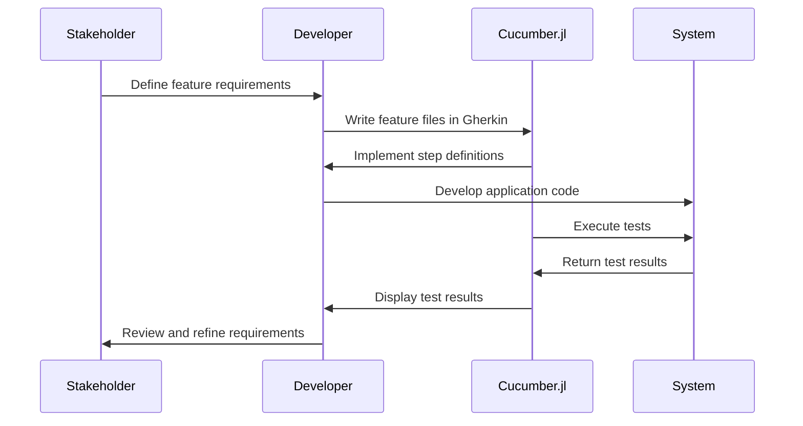

## 17.4 Behavior-Driven Development (BDD) with Cucumber.jl

Behavior-Driven Development (BDD) is a software development approach that enhances collaboration between developers, testers, and non-technical stakeholders. By focusing on the intended behavior of software, BDD ensures that all parties have a shared understanding of the system's functionality. In this section, we will explore how to implement BDD in Julia using Cucumber.jl, a tool that facilitates writing and executing BDD tests.

### Understanding BDD

Behavior-Driven Development (BDD) is an extension of Test-Driven Development (TDD) that emphasizes collaboration and communication. BDD encourages writing tests in a natural language style that is accessible to all stakeholders, including developers, testers, and business analysts. This approach ensures that everyone involved in the project has a clear understanding of the system's behavior.

#### Key Concepts of BDD

- **Focus on Behavior**: BDD emphasizes specifying the behavior of a system rather than its implementation details. This focus helps ensure that the software meets the user's needs.
- **Collaboration**: BDD promotes collaboration among team members by using a common language to describe system behavior.
- **Executable Specifications**: BDD tests serve as living documentation that can be executed to verify the system's behavior.

### Using Cucumber.jl

Cucumber.jl is a Julia package that supports BDD by allowing you to write tests in Gherkin syntax. Gherkin is a domain-specific language that describes software behavior in a human-readable format. Cucumber.jl interprets these descriptions and executes the corresponding test code.

#### Writing Feature Files in Gherkin Syntax

Feature files are the cornerstone of BDD in Cucumber.jl. They describe the desired behavior of the system in a structured format. A feature file consists of one or more scenarios, each representing a specific aspect of the system's behavior.

Here is an example of a simple feature file for a user authentication system:

```gherkin
Feature: User Authentication

  Scenario: Successful login
    Given a registered user with username "julia_dev" and password "securepass"
    When the user attempts to log in with username "julia_dev" and password "securepass"
    Then the user should be logged in successfully

  Scenario: Failed login due to incorrect password
    Given a registered user with username "julia_dev" and password "securepass"
    When the user attempts to log in with username "julia_dev" and password "wrongpass"
    Then the user should see an error message "Invalid credentials"
```

#### Implementing Steps

Steps in Cucumber.jl link the natural language scenarios in feature files to the actual test code. Each step corresponds to a specific action or assertion in the test.

Let's implement the steps for the user authentication feature:

```julia
using Cucumber

@Given("a registered user with username {string} and password {string}") do username, password
    # Simulate user registration
    register_user(username, password)
end

@When("the user attempts to log in with username {string} and password {string}") do username, password
    # Simulate user login
    attempt_login(username, password)
end

@Then("the user should be logged in successfully") do
    # Check if the user is logged in
    @test is_user_logged_in()
end

@Then("the user should see an error message {string}") do expected_message
    # Check if the error message is displayed
    @test get_error_message() == expected_message
end
```

### Collaboration

One of the main advantages of BDD is its ability to engage stakeholders through readable specifications. By writing tests in a language that is accessible to non-technical team members, BDD fosters collaboration and ensures that everyone has a shared understanding of the system's behavior.

#### Engaging Stakeholders

- **Readable Specifications**: Feature files written in Gherkin syntax are easy to read and understand, making them accessible to all stakeholders.
- **Shared Understanding**: By involving stakeholders in the test-writing process, BDD ensures that everyone has a clear understanding of the system's behavior.
- **Living Documentation**: BDD tests serve as living documentation that can be updated and executed as the system evolves.

### Example Scenario

Let's walk through a complete example of using BDD with Cucumber.jl to implement a user authentication feature. This example will demonstrate how to write feature files, implement steps, and execute tests.

#### Step 1: Write the Feature File

Create a file named `user_authentication.feature` with the following content:

```gherkin
Feature: User Authentication

  Scenario: Successful login
    Given a registered user with username "julia_dev" and password "securepass"
    When the user attempts to log in with username "julia_dev" and password "securepass"
    Then the user should be logged in successfully

  Scenario: Failed login due to incorrect password
    Given a registered user with username "julia_dev" and password "securepass"
    When the user attempts to log in with username "julia_dev" and password "wrongpass"
    Then the user should see an error message "Invalid credentials"
```

#### Step 2: Implement the Steps

Create a file named `steps.jl` and implement the steps as follows:

```julia
using Cucumber
using Test

const USERS = Dict{String, String}()

function register_user(username::String, password::String)
    USERS[username] = password
end

function attempt_login(username::String, password::String)
    if haskey(USERS, username) && USERS[username] == password
        return true
    else
        return false
    end
end

function is_user_logged_in()
    # Simulate a successful login check
    return true
end

function get_error_message()
    # Simulate retrieving an error message
    return "Invalid credentials"
end

@Given("a registered user with username {string} and password {string}") do username, password
    register_user(username, password)
end

@When("the user attempts to log in with username {string} and password {string}") do username, password
    attempt_login(username, password)
end

@Then("the user should be logged in successfully") do
    @test is_user_logged_in()
end

@Then("the user should see an error message {string}") do expected_message
    @test get_error_message() == expected_message
end
```

#### Step 3: Execute the Tests

To execute the tests, run the following command in the terminal:

```bash
julia -e 'using Cucumber; Cucumber.run("user_authentication.feature")'
```

### Visualizing BDD Workflow

To better understand the BDD workflow with Cucumber.jl, let's visualize the process using a sequence diagram.



### Try It Yourself

Now that you have a basic understanding of BDD with Cucumber.jl, try modifying the example to add a new scenario. For instance, you could add a scenario for a user attempting to log in with a non-existent username. Experiment with different scenarios and step implementations to deepen your understanding of BDD in Julia.

### Knowledge Check

- **What is the primary focus of BDD?**
- **How does Cucumber.jl facilitate BDD in Julia?**
- **What is the role of feature files in BDD?**
- **How do steps link feature files to test code?**
- **Why is collaboration important in BDD?**

### Summary

In this section, we've explored Behavior-Driven Development (BDD) with Cucumber.jl, a powerful approach to testing in Julia. By focusing on the intended behavior of software and using readable specifications, BDD fosters collaboration and ensures that all stakeholders have a shared understanding of the system's functionality. With Cucumber.jl, you can write feature files in Gherkin syntax, implement steps to link scenarios to test code, and engage stakeholders through readable specifications.

### Embrace the Journey

Remember, this is just the beginning. As you progress, you'll build more complex and interactive applications using BDD. Keep experimenting, stay curious, and enjoy the journey!

## Quiz Time!



### What is the primary focus of Behavior-Driven Development (BDD)?

- [x] Specifying the behavior of a system
- [ ] Writing detailed implementation code
- [ ] Creating complex algorithms
- [ ] Focusing on performance optimization

> **Explanation:** BDD emphasizes specifying the behavior of a system rather than its implementation details.

### Which syntax does Cucumber.jl use for writing feature files?

- [x] Gherkin
- [ ] JSON
- [ ] YAML
- [ ] XML

> **Explanation:** Cucumber.jl uses Gherkin syntax to write feature files in a human-readable format.

### What is the role of feature files in BDD?

- [x] Describing the desired behavior of the system
- [ ] Storing user data
- [ ] Managing application state
- [ ] Optimizing performance

> **Explanation:** Feature files describe the desired behavior of the system in a structured format.

### How do steps in Cucumber.jl link feature files to test code?

- [x] By defining actions or assertions for each scenario
- [ ] By storing data in a database
- [ ] By optimizing code execution
- [ ] By managing user sessions

> **Explanation:** Steps in Cucumber.jl link feature files to test code by defining actions or assertions for each scenario.

### Why is collaboration important in BDD?

- [x] It ensures a shared understanding of the system's behavior
- [ ] It reduces the need for testing
- [ ] It focuses on performance optimization
- [ ] It simplifies code implementation

> **Explanation:** Collaboration in BDD ensures that all stakeholders have a shared understanding of the system's behavior.

### What language is used to describe software behavior in BDD?

- [x] Natural language
- [ ] Assembly language
- [ ] Machine code
- [ ] SQL

> **Explanation:** BDD uses natural language to describe software behavior, making it accessible to all stakeholders.

### What is the main advantage of using Cucumber.jl for BDD in Julia?

- [x] It allows writing tests in a human-readable format
- [ ] It optimizes code performance
- [ ] It simplifies database management
- [ ] It enhances security features

> **Explanation:** Cucumber.jl allows writing tests in a human-readable format, facilitating collaboration among stakeholders.

### What is the purpose of the `@Given` step in Cucumber.jl?

- [x] To set up the initial context for a scenario
- [ ] To execute the main action of a scenario
- [ ] To verify the outcome of a scenario
- [ ] To clean up after a scenario

> **Explanation:** The `@Given` step sets up the initial context for a scenario in Cucumber.jl.

### How does BDD serve as living documentation?

- [x] By providing executable specifications that can be updated and executed
- [ ] By storing data in a database
- [ ] By optimizing code execution
- [ ] By managing user sessions

> **Explanation:** BDD serves as living documentation by providing executable specifications that can be updated and executed.

### True or False: BDD tests can be used as a form of documentation.

- [x] True
- [ ] False

> **Explanation:** BDD tests serve as living documentation that can be executed to verify the system's behavior.


