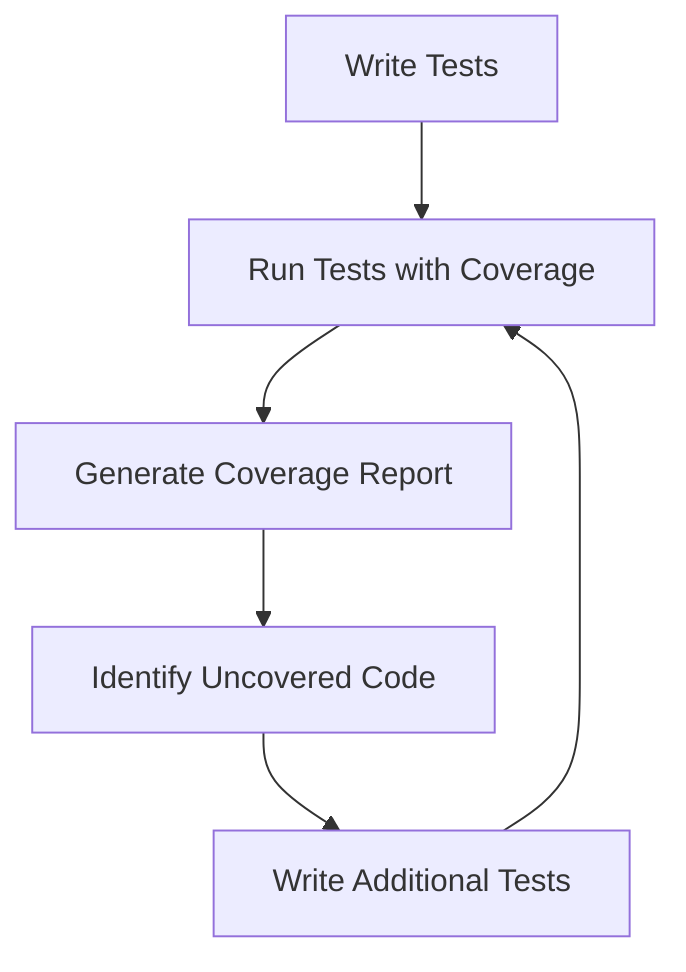

## 17.5 Code Coverage and Quality Metrics

In the realm of software development, ensuring that your code is both robust and maintainable is paramount. Code coverage and quality metrics are essential tools in achieving this goal. They provide insights into how much of your code is being tested and help identify areas that may need improvement. In this section, we will delve into the intricacies of measuring code coverage using Julia, interpreting the results, and employing strategies to enhance coverage. Additionally, we will explore various tools that help maintain code quality, ensuring consistency and adherence to best practices.

### Measuring Coverage

Code coverage is a measure of how much of your source code is executed when your automated tests run. It is a critical metric that helps you understand the effectiveness of your tests and identify untested parts of your codebase.

#### Using Coverage.jl

Julia provides a powerful package called `Coverage.jl` that allows you to measure code coverage easily. Let's walk through the steps to set up and use `Coverage.jl` in your Julia projects.

1. **Installation**: First, ensure that you have `Coverage.jl` installed. You can add it to your project using Julia's package manager.

   ```julia
   using Pkg
   Pkg.add("Coverage")
   ```

2. **Running Tests with Coverage**: To measure coverage, you need to run your tests with coverage enabled. This can be done using the `Pkg.test` function with the `coverage` keyword set to `true`.

   ```julia
   using Pkg
   Pkg.test("YourPackageName", coverage=true)
   ```

3. **Generating Coverage Reports**: After running your tests, you can generate a coverage report. This report will show you which lines of code were executed during testing and which were not.

   ```julia
   using Coverage
   Coverage.process_folder("src")
   ```

4. **Visualizing Coverage**: You can visualize the coverage report using tools like `Codecov` or `Coveralls`, which integrate seamlessly with `Coverage.jl`. These tools provide a graphical representation of your coverage data, making it easier to interpret.

#### Code Example: Basic Coverage Setup

Here's a simple example of setting up code coverage for a Julia package:

```julia
using Pkg
Pkg.add("Coverage")

Pkg.test("MyAwesomePackage", coverage=true)

using Coverage
Coverage.process_folder("src")
```

### Interpreting Results

Once you have your coverage report, the next step is to interpret the results. Understanding what the coverage data tells you is crucial for improving your test suite and ensuring comprehensive testing.

#### Identifying Uncovered Code

The coverage report will highlight lines of code that were not executed during testing. These uncovered lines are potential risk areas that could harbor bugs or untested functionality.

- **Critical Paths**: Focus on critical paths in your application that are uncovered. These are areas where failures could have significant impacts.
- **Complex Logic**: Pay attention to complex logic or algorithms that are not covered. These are often sources of subtle bugs.

#### Potential Risk Areas

Uncovered code represents potential risk areas in your application. By identifying these areas, you can prioritize writing additional tests to mitigate risks.

- **Edge Cases**: Ensure that edge cases are covered, as they often lead to unexpected behavior.
- **Error Handling**: Verify that error handling paths are tested to ensure robustness.

### Improving Coverage

Improving code coverage involves writing additional tests to cover untested parts of your codebase. Here are some strategies to enhance your test coverage.

#### Strategies for Writing Additional Tests

1. **Unit Tests**: Write unit tests for individual functions and methods. Ensure that all branches and conditions are tested.
2. **Integration Tests**: Develop integration tests to verify that different parts of your application work together as expected.
3. **Regression Tests**: Implement regression tests to catch bugs that may be introduced by future changes.
4. **Boundary Testing**: Test boundary conditions and edge cases to ensure your code handles them correctly.

#### Code Example: Enhancing Test Coverage

Consider a simple function that calculates the factorial of a number. We can enhance its test coverage by adding tests for edge cases and invalid inputs.

```julia
function factorial(n::Int)
    if n < 0
        error("Negative input not allowed")
    elseif n == 0
        return 1
    else
        return n * factorial(n - 1)
    end
end

using Test

@testset "Factorial Tests" begin
    @test factorial(0) == 1
    @test factorial(5) == 120
    @test_throws ErrorException factorial(-1)  # Test for negative input
    @test factorial(1) == 1  # Test for edge case
end
```

### Code Quality Tools

Beyond code coverage, maintaining high code quality is essential for long-term maintainability and readability. Julia offers several tools to help you achieve this.

#### Utilizing Linters and Style Checkers

Linters and style checkers analyze your code for potential errors, stylistic issues, and adherence to coding standards. They help ensure consistency and readability across your codebase.

1. **Lint.jl**: A popular linter for Julia that checks for common errors and style issues.

   ```julia
   using Pkg
   Pkg.add("Lint")
   using Lint
   Lint.lintpkg("YourPackageName")
   ```

2. **JuliaFormatter.jl**: A tool for automatically formatting your Julia code according to a specified style guide.

   ```julia
   using Pkg
   Pkg.add("JuliaFormatter")
   using JuliaFormatter
   format("src")
   ```

#### Code Example: Using Linters and Formatters

Here's how you can use `Lint.jl` and `JuliaFormatter.jl` to maintain code quality:

```julia
using Pkg
Pkg.add("Lint")
Pkg.add("JuliaFormatter")

using Lint
Lint.lintpkg("MyAwesomePackage")

using JuliaFormatter
format("src")
```

### Visualizing Code Coverage and Quality

To better understand the flow and coverage of your code, visualizations can be incredibly helpful. Let's explore how you can use diagrams to represent code coverage and quality metrics.

#### Diagram: Code Coverage Workflow



**Caption**: This diagram illustrates the workflow for measuring and improving code coverage in Julia. It starts with writing tests, running them with coverage enabled, generating a coverage report, identifying uncovered code, and writing additional tests to improve coverage.

### References and Links

- [Coverage.jl Documentation](https://github.com/JuliaCI/Coverage.jl)
- [Codecov](https://codecov.io/)
- [Coveralls](https://coveralls.io/)
- [Lint.jl Documentation](https://github.com/tonyhffong/Lint.jl)
- [JuliaFormatter.jl Documentation](https://github.com/domluna/JuliaFormatter.jl)

### Knowledge Check

To reinforce your understanding, consider the following questions and exercises:

- **Question**: What is the primary purpose of code coverage?
- **Exercise**: Set up `Coverage.jl` in a sample Julia project and generate a coverage report.
- **Challenge**: Identify an uncovered area in your codebase and write tests to cover it.

### Embrace the Journey

Remember, improving code coverage and quality is an ongoing process. As you continue to develop and maintain your Julia applications, regularly assess your coverage and quality metrics. Keep experimenting with different testing strategies, stay curious about new tools and techniques, and enjoy the journey of building robust and maintainable software!

## Quiz Time!



### What is the primary purpose of code coverage?

- [x] To measure how much of the code is executed during testing
- [ ] To determine the performance of the code
- [ ] To identify syntax errors in the code
- [ ] To optimize the code for speed

> **Explanation:** Code coverage measures how much of the code is executed during testing, helping identify untested parts of the codebase.

### Which Julia package is used for measuring code coverage?

- [x] Coverage.jl
- [ ] Test.jl
- [ ] Lint.jl
- [ ] JuliaFormatter.jl

> **Explanation:** Coverage.jl is the package used in Julia for measuring code coverage.

### What is a potential risk area in code coverage?

- [x] Uncovered code
- [ ] Fully tested code
- [ ] Documented code
- [ ] Optimized code

> **Explanation:** Uncovered code represents potential risk areas as it may contain untested functionality or bugs.

### Which tool can be used to visualize code coverage data?

- [x] Codecov
- [ ] JuliaFormatter.jl
- [ ] Lint.jl
- [ ] Test.jl

> **Explanation:** Codecov is a tool that can be used to visualize code coverage data, providing graphical representations.

### What is the purpose of a linter?

- [x] To check for errors and style issues in code
- [ ] To execute code faster
- [ ] To generate documentation
- [ ] To measure code coverage

> **Explanation:** A linter checks for errors and style issues in code, ensuring consistency and adherence to coding standards.

### Which of the following is a strategy to improve code coverage?

- [x] Writing additional tests
- [ ] Removing comments
- [ ] Refactoring code
- [ ] Using a different programming language

> **Explanation:** Writing additional tests is a strategy to improve code coverage by covering untested parts of the codebase.

### What does the `format` function in JuliaFormatter.jl do?

- [x] Automatically formats code according to a style guide
- [ ] Measures code coverage
- [ ] Executes tests
- [ ] Generates documentation

> **Explanation:** The `format` function in JuliaFormatter.jl automatically formats code according to a specified style guide.

### Which of the following is NOT a benefit of high code coverage?

- [ ] Increased confidence in code quality
- [ ] Reduced risk of bugs
- [x] Improved code execution speed
- [ ] Better understanding of code functionality

> **Explanation:** High code coverage does not directly improve code execution speed; it increases confidence in code quality and reduces the risk of bugs.

### What is the role of integration tests in improving code coverage?

- [x] To verify that different parts of the application work together
- [ ] To test individual functions in isolation
- [ ] To measure code execution speed
- [ ] To generate documentation

> **Explanation:** Integration tests verify that different parts of the application work together, contributing to overall code coverage.

### True or False: Code coverage guarantees that there are no bugs in the code.

- [ ] True
- [x] False

> **Explanation:** Code coverage does not guarantee that there are no bugs in the code; it only indicates how much of the code is tested.


