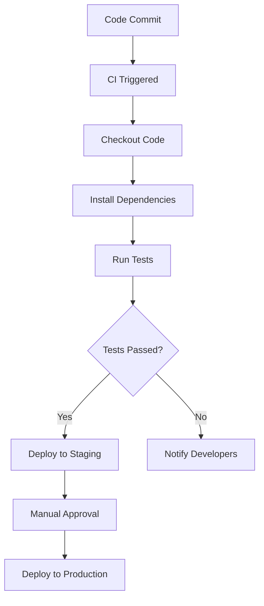

## 17.6 Setting Up Continuous Integration Pipelines

Continuous Integration (CI) is a critical practice in modern software development that involves automatically testing and integrating code changes into a shared repository. This process helps maintain code quality, detect issues early, and streamline the deployment process. In this section, we will explore how to set up CI pipelines for Julia projects, focusing on popular CI tools like GitHub Actions, Travis CI, and Jenkins. We will also discuss best practices to ensure your CI pipelines are efficient and effective.

### Benefits of Continuous Integration

Implementing CI in your Julia projects offers numerous advantages:

- **Early Detection of Issues**: CI allows for immediate testing of code changes, helping to catch bugs and errors early in the development cycle.
- **Consistent Testing Across Environments**: CI ensures that your code is tested in consistent environments, reducing the risk of environment-specific issues.
- **Improved Code Quality**: Regular testing and integration encourage developers to write cleaner, more maintainable code.
- **Streamlined Deployment**: Automated deployment processes reduce the time and effort required to release new features or fixes.
- **Enhanced Collaboration**: CI facilitates better collaboration among team members by integrating changes frequently and providing immediate feedback.

### Configuring CI Systems

Setting up a CI system involves configuring workflows that define how and when your code should be tested and deployed. Let's explore how to configure CI pipelines using popular tools.

#### GitHub Actions

GitHub Actions is a powerful CI/CD tool integrated directly into GitHub. It allows you to automate workflows based on events in your repository.

1. **Create a Workflow File**: In your Julia project, create a `.github/workflows/ci.yml` file to define your CI workflow.

```yaml
name: CI

on:
  push:
    branches:
      - main
  pull_request:
    branches:
      - main

jobs:
  build:
    runs-on: ubuntu-latest

    steps:
    - uses: actions/checkout@v2
    - name: Set up Julia
      uses: julia-actions/setup-julia@v1
      with:
        version: '1.6'
    - name: Install Dependencies
      run: julia -e 'using Pkg; Pkg.instantiate()'
    - name: Run Tests
      run: julia -e 'using Pkg; Pkg.test()'
```

2. **Explain the Workflow**:
   - **Trigger Events**: The workflow is triggered on pushes and pull requests to the `main` branch.
   - **Job Definition**: The `build` job runs on the latest Ubuntu environment.
   - **Steps**:
     - **Checkout Code**: Uses the `actions/checkout` action to clone the repository.
     - **Set up Julia**: Installs the specified version of Julia.
     - **Install Dependencies**: Instantiates the project environment.
     - **Run Tests**: Executes the test suite using `Pkg.test()`.

#### Travis CI

Travis CI is another popular CI service that integrates well with GitHub repositories.

1. **Create a `.travis.yml` File**: Add a `.travis.yml` file to your Julia project.

```yaml
language: julia
os:
  - linux
  - osx
julia:
  - 1.6
  - nightly
matrix:
  allow_failures:
    - julia: nightly
script:
  - julia -e 'using Pkg; Pkg.build()'
  - julia -e 'using Pkg; Pkg.test()'
```

2. **Explain the Configuration**:
   - **Operating Systems**: Tests are run on both Linux and macOS.
   - **Julia Versions**: Tests are conducted on stable and nightly Julia versions.
   - **Allow Failures**: Nightly builds are allowed to fail without affecting the overall build status.
   - **Script**: Builds and tests the project using Julia's package manager.

#### Jenkins

Jenkins is a widely used open-source automation server that can be configured for CI/CD.

1. **Install Jenkins**: Set up Jenkins on a server or use a cloud-based Jenkins service.
2. **Create a New Job**: In Jenkins, create a new Freestyle project.
3. **Configure the Job**:
   - **Source Code Management**: Connect to your GitHub repository.
   - **Build Triggers**: Set up triggers for GitHub webhooks or periodic builds.
   - **Build Steps**: Add a build step to execute shell commands for setting up Julia and running tests.

```bash
#!/bin/bash
julia -e 'using Pkg; Pkg.instantiate()'
julia -e 'using Pkg; Pkg.test()'
```

4. **Explain the Setup**:
   - **Source Code Management**: Jenkins pulls the latest code from the repository.
   - **Build Triggers**: Builds are triggered by code changes or scheduled intervals.
   - **Build Steps**: Installs dependencies and runs tests using Julia.

### Typical CI Tasks

CI pipelines can perform a variety of tasks beyond just running tests. Here are some common tasks you might include:

- **Code Coverage Reporting**: Use tools like `Coverage.jl` to generate code coverage reports and integrate them into your CI pipeline.
- **Static Code Analysis**: Run linters or static analysis tools to ensure code quality and adherence to coding standards.
- **Deployment Triggers**: Automatically deploy applications or updates to staging or production environments upon successful builds.
- **Notification Systems**: Set up notifications to alert team members of build statuses via email, Slack, or other communication tools.

### Best Practices for CI Pipelines

To maximize the effectiveness of your CI pipelines, consider the following best practices:

- **Keep CI Fast**: Optimize your CI workflows to minimize build times. Use caching strategies to avoid redundant installations and downloads.
- **Provide Clear Feedback**: Ensure that CI feedback is clear and actionable. Use descriptive messages and logs to help developers quickly identify and resolve issues.
- **Manage Secrets Securely**: Use environment variables or secret management tools to handle sensitive information like API keys or credentials.
- **Test in Parallel**: Run tests in parallel to speed up the CI process, especially for large test suites.
- **Monitor and Maintain**: Regularly review and update your CI configurations to adapt to changes in your project or dependencies.

### Visualizing CI Pipelines

To better understand the flow of a CI pipeline, let's visualize a typical CI process using a flowchart.



**Diagram Explanation**:
- **Code Commit**: A developer commits code changes to the repository.
- **CI Triggered**: The CI system is triggered by the commit.
- **Checkout Code**: The CI system checks out the latest code.
- **Install Dependencies**: Project dependencies are installed.
- **Run Tests**: The test suite is executed.
- **Tests Passed?**: A decision point to check if tests passed.
- **Deploy to Staging**: If tests pass, deploy to a staging environment.
- **Notify Developers**: If tests fail, notify the development team.
- **Manual Approval**: A manual approval step before production deployment.
- **Deploy to Production**: Deploy the application to production.

### References and Links

- [GitHub Actions Documentation](https://docs.github.com/en/actions)
- [Travis CI Documentation](https://docs.travis-ci.com/)
- [Jenkins Documentation](https://www.jenkins.io/doc/)
- [Coverage.jl](https://github.com/JuliaCI/Coverage.jl)

### Knowledge Check

- **What are the key benefits of using CI in software development?**
- **How can you configure a CI pipeline using GitHub Actions?**
- **What are some typical tasks performed by CI pipelines?**
- **List some best practices for maintaining efficient CI pipelines.**

### Embrace the Journey

Remember, setting up CI pipelines is just the beginning of maintaining high-quality Julia projects. As you progress, you'll refine and optimize your CI processes to better suit your team's needs. Keep experimenting, stay curious, and enjoy the journey!

## Quiz Time!



### What is a primary benefit of Continuous Integration?

- [x] Early detection of issues
- [ ] Increased code complexity
- [ ] Delayed deployment
- [ ] Manual testing

> **Explanation:** Continuous Integration helps in early detection of issues by automatically testing code changes as they are integrated into the shared repository.

### Which CI tool is integrated directly into GitHub?

- [x] GitHub Actions
- [ ] Travis CI
- [ ] Jenkins
- [ ] CircleCI

> **Explanation:** GitHub Actions is a CI/CD tool that is integrated directly into GitHub, allowing for seamless automation of workflows.

### What file is used to configure a GitHub Actions workflow?

- [x] `.github/workflows/ci.yml`
- [ ] `.travis.yml`
- [ ] `Jenkinsfile`
- [ ] `ci-config.json`

> **Explanation:** The `.github/workflows/ci.yml` file is used to define CI workflows in GitHub Actions.

### In a Travis CI configuration, what does the `allow_failures` option do?

- [x] Allows certain builds to fail without affecting the overall build status
- [ ] Prevents any build failures
- [ ] Increases build speed
- [ ] Disables testing

> **Explanation:** The `allow_failures` option in Travis CI allows specified builds to fail without marking the overall build as failed.

### What is a common task performed by CI pipelines?

- [x] Running tests
- [ ] Writing documentation
- [ ] Designing UI
- [ ] Manual code review

> **Explanation:** Running tests is a common task performed by CI pipelines to ensure code quality and functionality.

### What is a best practice for managing secrets in CI pipelines?

- [x] Use environment variables or secret management tools
- [ ] Hardcode them in the source code
- [ ] Share them via email
- [ ] Store them in plain text files

> **Explanation:** Using environment variables or secret management tools is a best practice for securely managing secrets in CI pipelines.

### How can you speed up CI processes?

- [x] Run tests in parallel
- [ ] Increase code complexity
- [ ] Use older hardware
- [ ] Disable caching

> **Explanation:** Running tests in parallel can significantly speed up CI processes, especially for large test suites.

### What is the purpose of code coverage reporting in CI?

- [x] To measure how much of the code is tested
- [ ] To increase code size
- [ ] To reduce test cases
- [ ] To automate deployment

> **Explanation:** Code coverage reporting measures how much of the codebase is covered by tests, helping to identify untested areas.

### Which tool can be used for static code analysis in CI pipelines?

- [x] Linters
- [ ] Compilers
- [ ] Debuggers
- [ ] Text editors

> **Explanation:** Linters are tools used for static code analysis to ensure code quality and adherence to coding standards.

### True or False: CI pipelines should be regularly reviewed and updated.

- [x] True
- [ ] False

> **Explanation:** Regularly reviewing and updating CI pipelines ensures they remain effective and adapt to changes in the project or dependencies.


