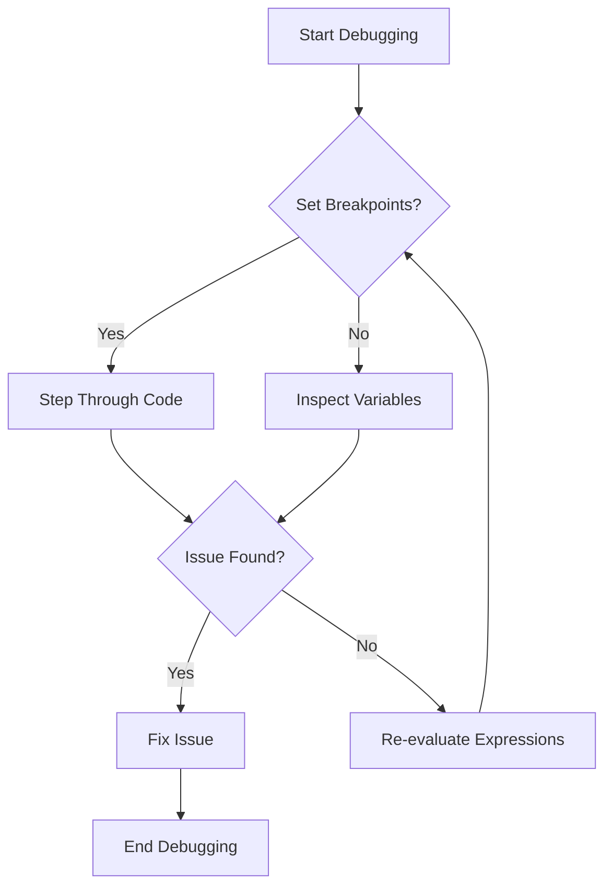

## 17.7 Debugging Techniques and Tools (`Debugger.jl`, `Rebugger.jl`)

Debugging is a crucial aspect of software development, allowing developers to identify and fix errors in their code. In Julia, two powerful tools, `Debugger.jl` and `Rebugger.jl`, provide robust debugging capabilities. This section will guide you through using these tools effectively, along with strategies for debugging in Integrated Development Environments (IDEs) and general debugging strategies.

### Using Debugger.jl

`Debugger.jl` is a powerful tool for interactive debugging in Julia. It allows you to set breakpoints, step through code, and inspect variables. Let's explore how to use `Debugger.jl` to enhance your debugging workflow.

#### Installing Debugger.jl

Before using `Debugger.jl`, you need to install it. Open your Julia REPL and run the following command:

```julia
using Pkg
Pkg.add("Debugger")
```

#### Setting Breakpoints

Breakpoints allow you to pause the execution of your program at specific points. This is useful for inspecting the state of your program and understanding its behavior.

```julia
using Debugger

function example_function(x)
    y = x + 1
    z = y * 2
    return z
end

@enter example_function(5)
```

In the example above, `@enter` is used to start debugging the `example_function`. The execution will pause at the beginning of the function, allowing you to step through the code.

#### Stepping Through Code

Once you've set a breakpoint, you can step through your code line by line. This helps you understand how your code executes and identify any logical errors.

- **Step In**: Enter the function call.
- **Step Over**: Execute the current line and move to the next.
- **Step Out**: Complete the current function and return to the caller.

```julia
julia> @enter example_function(5)
In example_function(x) at REPL[2]:1
 1  function example_function(x)
>2      y = x + 1
 3      z = y * 2
 4      return z
 5  end

About to run: (+)(5, 1)
1|debug> n  # Step to the next line
```

#### Inspecting Variables

While debugging, you can inspect the values of variables at any point in your code. This is crucial for understanding the state of your program.

```julia
1|debug> fr  # Show the current frame
1|debug> v   # List all variables
1|debug> y   # Inspect the value of y
```

### Rebugger.jl for REPL Debugging

`Rebugger.jl` is another tool that enhances the debugging experience in the Julia REPL. It allows you to re-evaluate expressions and inspect the state of your program interactively.

#### Installing Rebugger.jl

To use `Rebugger.jl`, install it via the Julia package manager:

```julia
using Pkg
Pkg.add("Rebugger")
```

#### Re-evaluating Expressions

One of the key features of `Rebugger.jl` is the ability to re-evaluate expressions. This is particularly useful for testing changes without restarting your program.

```julia
using Rebugger

function faulty_function(x)
    y = x + 1
    z = y * 2
    return z
end

Rebugger.@rebug faulty_function(5)
```

#### Inspecting States

`Rebugger.jl` allows you to inspect the state of your program at any point. You can view variable values and modify them to test different scenarios.

```julia
Rebugger.@rebug faulty_function(5)

Rebugger.@rebug begin
    y = 10
    z = y * 2
end
```

### Debugging in IDEs

Integrated Development Environments (IDEs) like Visual Studio Code (VS Code) provide built-in support for debugging Julia code. Let's explore how to leverage these tools for an efficient debugging workflow.

#### Setting Up Julia in VS Code

To debug Julia code in VS Code, you need to install the Julia extension. This extension provides syntax highlighting, code completion, and debugging capabilities.

1. Open VS Code and go to the Extensions view.
2. Search for "Julia" and install the Julia extension.

#### Using the Debugger in VS Code

Once the extension is installed, you can start debugging your Julia code directly from VS Code.

- **Set Breakpoints**: Click on the left margin next to the line numbers to set breakpoints.
- **Start Debugging**: Press `F5` or go to the Run menu and select "Start Debugging".
- **Inspect Variables**: Use the Variables pane to view and modify variable values.

### Debugging Strategies

Effective debugging requires a systematic approach. Here are some strategies to help you isolate issues and narrow down problems.

#### Isolating Issues

- **Reproduce the Bug**: Ensure you can consistently reproduce the bug before attempting to fix it.
- **Simplify the Problem**: Reduce the code to the smallest example that still produces the bug.
- **Check Assumptions**: Verify that your assumptions about the code and its behavior are correct.

#### Methodically Narrowing Down Problems

- **Divide and Conquer**: Break the code into smaller parts and test each part individually.
- **Use Print Statements**: Temporarily add print statements to track the flow of execution and variable values.
- **Review Recent Changes**: If the bug appeared after recent changes, review those changes for potential issues.

### Visualizing Debugging Workflow

To better understand the debugging process, let's visualize the workflow using a flowchart.



**Figure 1**: Debugging Workflow in Julia

### Try It Yourself

Experiment with the debugging tools by modifying the code examples. Try adding breakpoints, stepping through code, and inspecting variables. Use `Rebugger.jl` to re-evaluate expressions and test different scenarios.

### References and Links

- [Julia Debugger.jl Documentation](https://github.com/JuliaDebug/Debugger.jl)
- [Rebugger.jl Documentation](https://github.com/timholy/Rebugger.jl)
- [Visual Studio Code Julia Extension](https://marketplace.visualstudio.com/items?itemName=julialang.language-julia)

### Knowledge Check

- What are the key features of `Debugger.jl`?
- How does `Rebugger.jl` enhance the debugging experience in the REPL?
- What are some strategies for isolating issues in your code?

### Embrace the Journey

Debugging is an essential skill for any developer. As you practice using these tools and strategies, you'll become more proficient at identifying and resolving issues in your code. Remember, debugging is not just about fixing errors; it's about understanding your code better. Keep experimenting, stay curious, and enjoy the journey!

## Quiz Time!



### What is the primary purpose of `Debugger.jl` in Julia?

- [x] To provide interactive debugging with breakpoints and stepping
- [ ] To compile Julia code into executables
- [ ] To optimize Julia code for performance
- [ ] To manage Julia packages

> **Explanation:** `Debugger.jl` is used for interactive debugging, allowing developers to set breakpoints and step through code.

### How do you start debugging a function using `Debugger.jl`?

- [x] Use the `@enter` macro
- [ ] Use the `@debug` macro
- [ ] Use the `@trace` macro
- [ ] Use the `@inspect` macro

> **Explanation:** The `@enter` macro is used to initiate debugging of a function in `Debugger.jl`.

### What is a key feature of `Rebugger.jl`?

- [x] Re-evaluating expressions in the REPL
- [ ] Compiling Julia code
- [ ] Managing package dependencies
- [ ] Visualizing data

> **Explanation:** `Rebugger.jl` allows re-evaluation of expressions, enhancing the debugging experience in the REPL.

### Which IDE provides integrated support for debugging Julia code?

- [x] Visual Studio Code
- [ ] Eclipse
- [ ] NetBeans
- [ ] IntelliJ IDEA

> **Explanation:** Visual Studio Code provides integrated support for debugging Julia code through its Julia extension.

### What is a common strategy for isolating issues in code?

- [x] Reproduce the bug consistently
- [ ] Ignore the problem
- [ ] Rewrite the entire codebase
- [ ] Use random print statements

> **Explanation:** Consistently reproducing the bug is crucial for isolating and understanding the issue.

### What does the "Step Over" command do in debugging?

- [x] Executes the current line and moves to the next
- [ ] Enters the function call
- [ ] Completes the current function and returns to the caller
- [ ] Stops the debugging session

> **Explanation:** "Step Over" executes the current line and moves to the next line in the code.

### How can you inspect the value of a variable in `Debugger.jl`?

- [x] Use the `v` command
- [ ] Use the `inspect` command
- [ ] Use the `print` command
- [ ] Use the `show` command

> **Explanation:** The `v` command in `Debugger.jl` lists all variables and allows inspection of their values.

### What is the benefit of using print statements in debugging?

- [x] Tracking the flow of execution and variable values
- [ ] Compiling the code faster
- [ ] Reducing memory usage
- [ ] Enhancing code readability

> **Explanation:** Print statements help track the flow of execution and inspect variable values during debugging.

### What is the first step in the debugging workflow?

- [x] Start Debugging
- [ ] Set Breakpoints
- [ ] Inspect Variables
- [ ] Fix Issue

> **Explanation:** The first step in the debugging workflow is to start debugging, which involves initiating the debugging session.

### True or False: Debugging is only about fixing errors in code.

- [ ] True
- [x] False

> **Explanation:** Debugging is not only about fixing errors but also about understanding the code better and improving its quality.


