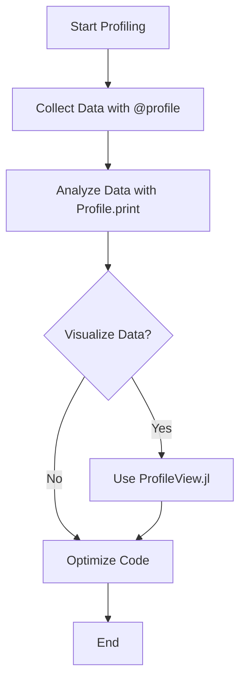

## 17.8 Profiling and Performance Measurement with Profile.jl

Performance is a critical aspect of software development, especially in high-performance computing and data-intensive applications. Profiling is the process of measuring where time and resources are spent in your code, allowing you to identify bottlenecks and optimize performance. In Julia, `Profile.jl` is a powerful tool that helps developers understand the performance characteristics of their code.

### Profiling Concepts

Before diving into `Profile.jl`, let's explore the fundamental concepts of profiling:

- **Profiling**: The act of collecting data about the execution of a program to understand its performance characteristics.
- **Bottlenecks**: Sections of code that significantly slow down the overall execution.
- **Sampling**: A technique where the profiler periodically records the state of the program to infer where time is being spent.
- **Call Graph**: A representation of function calls and their relationships, often used to visualize profiling data.

Profiling helps answer questions like:
- Which functions consume the most time?
- How often are certain functions called?
- Where are the most significant memory allocations happening?

### Using Profile.jl

`Profile.jl` is part of the Julia standard library, making it readily available for use. It provides a simple interface to collect profiling data and analyze it. Let's walk through the process of using `Profile.jl` to profile a Julia program.

#### Collecting Profiling Data

To start profiling, you need to wrap the code you want to analyze with the `@profile` macro. Here's a basic example:

```julia
using Profile

function compute_heavy_task()
    # Simulate a heavy computation
    for i in 1:10^6
        sqrt(i)
    end
end

@profile compute_heavy_task()
```

In this example, `@profile` collects data about the execution of `compute_heavy_task`. The profiler samples the call stack at regular intervals, recording which functions are active.

#### Analyzing Profiling Data

Once you've collected profiling data, you can analyze it using `Profile.print()` to get a textual representation of the profiling results:

```julia
Profile.print()
```

This command outputs a summary of the profiling data, showing the percentage of time spent in each function. The output might look like this:

```
Overhead ╎ [+additional indent] Count File:Line; Function
=========================================================
   ╎1    1 ...:0; compute_heavy_task()
   ╎1    1 ...:0; sqrt()
```

The `Count` column indicates how many times the profiler sampled the function, and the percentage shows the proportion of time spent in each function relative to the total profiling time.

### Visualization Tools

While textual output is useful, visualizing profiling data can provide deeper insights. Julia offers several tools for this purpose, such as `ProfileView.jl` and `FlameGraphs.jl`.

#### Graphing Results with ProfileView.jl

`ProfileView.jl` provides a graphical representation of profiling data, making it easier to spot bottlenecks. To use it, first install the package:

```julia
using Pkg
Pkg.add("ProfileView")
```

Then, visualize the profiling data:

```julia
using ProfileView

@profile compute_heavy_task()
ProfileView.view()
```

This command opens a window displaying a flame graph, where each box represents a function call. The width of the box indicates the time spent in that function. This visualization helps identify which functions dominate the execution time.

#### Using FlameGraphs.jl

`FlameGraphs.jl` is another tool for visualizing profiling data. It generates flame graphs that can be viewed in a web browser. Install the package and generate a flame graph:

```julia
Pkg.add("FlameGraphs")
using FlameGraphs

@profile compute_heavy_task()
flamegraph()
```

This command creates an interactive flame graph, allowing you to explore the call stack and understand the performance characteristics of your code.

### Optimizing Based on Findings

Once you've identified bottlenecks using profiling tools, the next step is optimization. Here are some strategies to consider:

- **Algorithm Optimization**: Analyze the algorithmic complexity of your code. Consider more efficient algorithms or data structures.
- **Type Stability**: Ensure functions are type-stable, as type instability can lead to performance degradation.
- **Memory Allocation**: Minimize unnecessary memory allocations by using pre-allocated arrays or in-place operations.
- **Parallelization**: Leverage Julia's parallel computing capabilities to distribute workloads across multiple cores or nodes.

#### Example: Optimizing a Function

Let's optimize a simple function based on profiling data:

```julia
function inefficient_sum(arr)
    total = 0
    for i in arr
        total += i
    end
    return total
end

@profile inefficient_sum(1:10^6)

function optimized_sum(arr)
    return sum(arr)
end
```

In this example, `inefficient_sum` is replaced with `optimized_sum`, which uses Julia's built-in `sum` function for better performance.

### Try It Yourself

Experiment with profiling and optimization by modifying the code examples. Try profiling different functions, visualizing the results, and making targeted improvements. Consider:

- Adding more complex computations to `compute_heavy_task`.
- Profiling a real-world application or library.
- Exploring the impact of different optimization strategies.

### Visualizing Profiling Data Flow

To better understand the profiling process, let's visualize it using a flowchart:



**Figure 1**: This flowchart illustrates the process of profiling and optimizing code using `Profile.jl`.

### References and Links

For further reading and resources, consider the following:

- [JuliaLang Documentation on Profiling](https://docs.julialang.org/en/v1/manual/profile/)
- [ProfileView.jl GitHub Repository](https://github.com/timholy/ProfileView.jl)
- [FlameGraphs.jl GitHub Repository](https://github.com/timholy/FlameGraphs.jl)

### Knowledge Check

To reinforce your understanding, consider these questions:

- What is the purpose of profiling in software development?
- How does `Profile.jl` collect profiling data?
- What are the benefits of visualizing profiling data?
- How can you optimize code based on profiling findings?

### Embrace the Journey

Remember, profiling and optimization are iterative processes. As you gain experience, you'll develop an intuition for identifying performance bottlenecks and applying effective optimizations. Keep experimenting, stay curious, and enjoy the journey of mastering performance measurement in Julia!

## Quiz Time!



### What is the primary purpose of profiling in software development?

- [x] To identify performance bottlenecks
- [ ] To write more concise code
- [ ] To improve code readability
- [ ] To enhance security

> **Explanation:** Profiling helps identify where time and resources are spent, allowing developers to optimize performance.

### Which Julia package is used for profiling?

- [x] Profile.jl
- [ ] Debugger.jl
- [ ] BenchmarkTools.jl
- [ ] Test.jl

> **Explanation:** Profile.jl is the standard library package in Julia for profiling code execution.

### What does the `@profile` macro do?

- [x] Collects profiling data during code execution
- [ ] Optimizes the code automatically
- [ ] Visualizes profiling data
- [ ] Tests the code for errors

> **Explanation:** The `@profile` macro collects data about the execution of a program to analyze its performance.

### Which tool provides a graphical representation of profiling data?

- [x] ProfileView.jl
- [ ] Debugger.jl
- [ ] Test.jl
- [ ] CSV.jl

> **Explanation:** ProfileView.jl provides a graphical representation of profiling data, making it easier to identify bottlenecks.

### How can you optimize code based on profiling findings?

- [x] By analyzing and improving bottlenecks
- [ ] By adding more comments
- [ ] By increasing code complexity
- [ ] By removing all loops

> **Explanation:** Profiling helps identify bottlenecks, which can then be optimized for better performance.

### What is a flame graph?

- [x] A visualization of function call times
- [ ] A tool for debugging
- [ ] A type of error message
- [ ] A memory management technique

> **Explanation:** A flame graph is a visualization that shows the time spent in each function call, helping identify performance issues.

### What is the benefit of using `ProfileView.jl`?

- [x] It provides a visual representation of profiling data
- [ ] It automatically optimizes code
- [ ] It tests code for errors
- [ ] It enhances code readability

> **Explanation:** ProfileView.jl helps visualize profiling data, making it easier to identify and address performance bottlenecks.

### What is the role of sampling in profiling?

- [x] To periodically record the program's state
- [ ] To execute the code faster
- [ ] To visualize the code structure
- [ ] To test the code for errors

> **Explanation:** Sampling involves periodically recording the program's state to infer where time is being spent during execution.

### What is a call graph?

- [x] A representation of function calls and their relationships
- [ ] A tool for debugging
- [ ] A type of error message
- [ ] A memory management technique

> **Explanation:** A call graph represents function calls and their relationships, often used to visualize profiling data.

### Profiling and optimization are:

- [x] Iterative processes
- [ ] One-time tasks
- [ ] Unrelated activities
- [ ] Only for beginners

> **Explanation:** Profiling and optimization are iterative processes that require continuous refinement and improvement.


