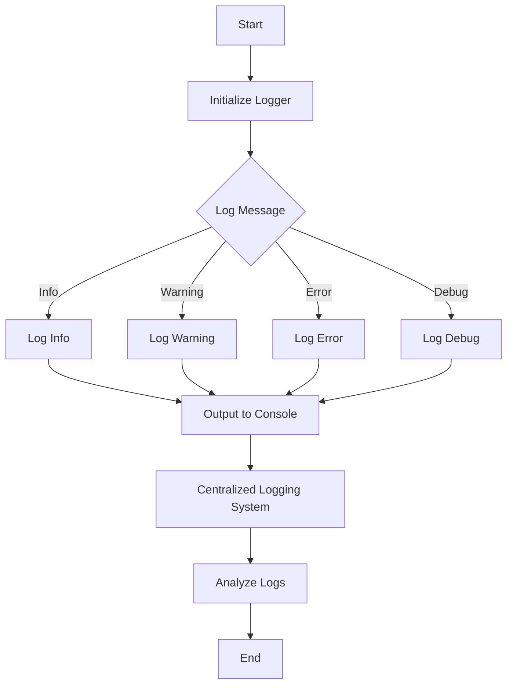

## 17.9 Logging and Error Reporting Best Practices

In the realm of software development, logging and error reporting are crucial for diagnosing issues, monitoring application behavior, and ensuring smooth operation. In Julia, these practices are facilitated by its robust built-in logging capabilities and error handling mechanisms. This section will guide you through implementing effective logging and error reporting strategies in Julia, ensuring your applications are both reliable and maintainable.

### Implementing Logging

Logging is the process of recording information about a program's execution. It helps developers understand what the program is doing and diagnose issues when they arise. Julia provides a built-in `Logging` module that is both flexible and powerful.

#### Using Julia's Built-in Logging Module

The `Logging` module in Julia allows you to create log messages at various levels of importance. Here's a basic example of how to use it:

```julia
using Logging

@info "This is an informational message."

@warn "This is a warning message."

@error "This is an error message."

@debug "This is a debug message."
```

In this example, we use macros such as `@info`, `@warn`, `@error`, and `@debug` to log messages at different levels. These macros automatically include metadata such as the file name and line number, which can be invaluable for debugging.

#### Customizing Log Output

Julia's logging system is highly customizable. You can change the format of log messages, direct them to different outputs, and filter them based on their level. Here's how you can customize the log output:

```julia
using Logging

logger = ConsoleLogger(stderr, Logging.Debug)

global_logger(logger)

@info "This is an informational message with a custom logger."
@debug "This debug message will be shown because the logger level is set to Debug."
```

In this example, we create a `ConsoleLogger` that outputs to `stderr` and set its level to `Debug`. This means that all messages at the `Debug` level and above will be displayed.

### Log Levels and Formats

Understanding log levels and formats is essential for effective logging. Log levels indicate the severity or importance of a message, while formats determine how messages are displayed.

#### Differentiating Between Info, Warning, Error, and Debug Messages

- **Info**: Informational messages that highlight the progress of the application.
- **Warning**: Indications of potential issues that are not necessarily errors.
- **Error**: Messages that indicate a failure in the application.
- **Debug**: Detailed information used for diagnosing problems.

Here's a table summarizing the log levels:

| Log Level | Description                                      |
|-----------|--------------------------------------------------|
| Info      | General information about application execution. |
| Warning   | Potential issues that may need attention.        |
| Error     | Errors that have occurred in the application.    |
| Debug     | Detailed diagnostic information.                 |

#### Formatting Log Messages

Julia allows you to format log messages using the `LoggingExtras` package, which provides additional logging capabilities:

```julia
using Logging, LoggingExtras

formatter = FormatLogger(stderr, Logging.Info, format="[$(level)] $(message)")

global_logger(formatter)

@info "This is a formatted informational message."
```

In this example, we use `FormatLogger` to specify a custom format for log messages. The format string `[$(level)] $(message)` includes the log level and message content.

### Error Handling

Error handling is a critical aspect of robust software development. It involves anticipating potential issues and implementing strategies to manage them gracefully.

#### Using `try-catch` Blocks

The `try-catch` construct in Julia allows you to handle exceptions that may occur during program execution. Here's a basic example:

```julia
function divide(a, b)
    try
        return a / b
    catch e
        @error "An error occurred: $e"
        return nothing
    end
end

result = divide(10, 0)
```

In this example, we attempt to divide two numbers. If an error occurs (such as division by zero), the `catch` block logs the error and returns `nothing`.

#### Defining Custom Exceptions

Julia allows you to define custom exceptions by creating new types that inherit from `Exception`. Here's how you can define and use a custom exception:

```julia
struct MyCustomException <: Exception
    msg::String
end

function risky_operation()
    throw(MyCustomException("Something went wrong!"))
end

try
    risky_operation()
catch e
    if isa(e, MyCustomException)
        @error "Caught a custom exception: $(e.msg)"
    else
        rethrow(e)
    end
end
```

In this example, we define a `MyCustomException` type and use it in a function that throws an exception. The `catch` block checks if the caught exception is of type `MyCustomException` and logs an error message.

### Centralized Logging Solutions

For larger applications, centralized logging solutions can be invaluable. They allow you to collect, store, and analyze log data from multiple sources.

#### Integrating with Log Management Systems

Julia can be integrated with various log management systems, such as Logstash, Graylog, or Splunk, to centralize log data. This integration typically involves configuring Julia to send log messages to these systems using network protocols like HTTP or Syslog.

Here's a conceptual example of how you might send log messages to a remote server:

```julia
using Logging, Sockets

function send_log_to_server(message)
    sock = connect("logserver.example.com", 514)
    write(sock, message)
    close(sock)
end

@info "This is a log message to be sent to the server."
send_log_to_server("INFO: This is a log message to be sent to the server.")
```

In this example, we use the `Sockets` module to send a log message to a remote server. This approach can be adapted to work with various log management systems.

### Visualizing Logging and Error Reporting

To better understand the flow of logging and error reporting in Julia, let's visualize the process using a flowchart.



**Figure 1:** This flowchart illustrates the process of logging messages in Julia, from initialization to output and analysis.

### Try It Yourself

Now that we've covered the basics of logging and error reporting in Julia, it's time to experiment. Try modifying the code examples to:

- Change the log level and observe the output.
- Customize the log format to include additional metadata.
- Define and handle a custom exception in a different context.
- Integrate logging with a centralized system of your choice.

### Knowledge Check

Before we conclude, let's reinforce what we've learned with a few questions:

- What are the different log levels in Julia, and when should each be used?
- How can you customize the format of log messages?
- What is the purpose of a `try-catch` block, and how is it used in error handling?
- How can you define a custom exception in Julia?
- What are the benefits of integrating with a centralized logging system?

### Embrace the Journey

Remember, mastering logging and error reporting is a journey. As you continue to develop your skills in Julia, you'll find these practices invaluable for building robust and maintainable applications. Keep experimenting, stay curious, and enjoy the journey!

## Quiz Time!



### What is the purpose of logging in software development?

- [x] To record information about a program's execution
- [ ] To increase the speed of the program
- [ ] To reduce memory usage
- [ ] To encrypt data

> **Explanation:** Logging is used to record information about a program's execution, which helps in diagnosing issues and understanding application behavior.

### Which Julia macro is used to log informational messages?

- [ ] @warn
- [x] @info
- [ ] @error
- [ ] @debug

> **Explanation:** The `@info` macro is used to log informational messages in Julia.

### What is the purpose of a `try-catch` block in Julia?

- [x] To handle exceptions that may occur during program execution
- [ ] To optimize the performance of the program
- [ ] To format log messages
- [ ] To define custom exceptions

> **Explanation:** A `try-catch` block is used to handle exceptions that may occur during program execution, allowing the program to continue running or to log the error.

### How can you define a custom exception in Julia?

- [x] By creating a new type that inherits from `Exception`
- [ ] By using the `@error` macro
- [ ] By writing a `try-catch` block
- [ ] By using the `Logging` module

> **Explanation:** Custom exceptions in Julia are defined by creating a new type that inherits from `Exception`.

### What is a benefit of integrating with a centralized logging system?

- [x] It allows for the collection and analysis of log data from multiple sources
- [ ] It increases the speed of logging
- [ ] It reduces the size of log files
- [ ] It encrypts log messages

> **Explanation:** Centralized logging systems allow for the collection and analysis of log data from multiple sources, providing a comprehensive view of application behavior.

### Which package provides additional logging capabilities in Julia?

- [ ] Sockets
- [x] LoggingExtras
- [ ] DataFrames
- [ ] HTTP

> **Explanation:** The `LoggingExtras` package provides additional logging capabilities in Julia, such as custom formatting.

### What log level should be used for potential issues that are not errors?

- [ ] Info
- [x] Warning
- [ ] Error
- [ ] Debug

> **Explanation:** The `Warning` log level is used for potential issues that are not necessarily errors.

### How can you send log messages to a remote server in Julia?

- [x] By using the `Sockets` module to connect and write messages
- [ ] By using the `@info` macro
- [ ] By defining a custom exception
- [ ] By using the `LoggingExtras` package

> **Explanation:** The `Sockets` module can be used to connect to a remote server and send log messages.

### What is the default output for log messages in Julia?

- [x] Console
- [ ] File
- [ ] Database
- [ ] Remote server

> **Explanation:** By default, log messages in Julia are output to the console.

### True or False: The `@debug` macro is used for logging error messages.

- [ ] True
- [x] False

> **Explanation:** The `@debug` macro is used for logging detailed diagnostic information, not error messages.


