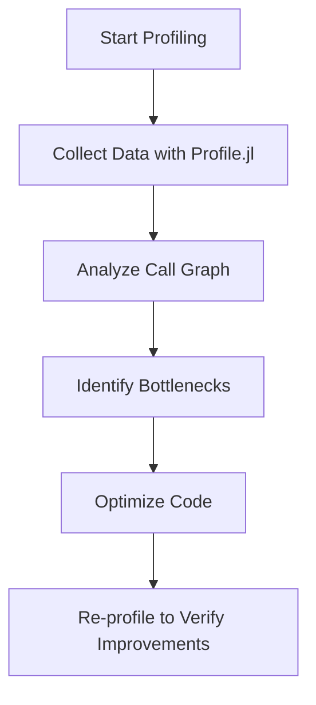

## 18.1 Profiling Julia Applications for Performance Bottlenecks

In the world of software development, performance is a critical aspect that can make or break an application. As Julia developers, we are often tasked with ensuring that our applications run efficiently and effectively. Profiling is an essential technique that helps us understand where our applications spend most of their time and identify potential bottlenecks. In this section, we will explore the importance of profiling, how to use profiling tools in Julia, and how to analyze and optimize your code for better performance.

### Why Profiling Matters

Profiling is the process of measuring the performance of a program, specifically to identify sections of code that are consuming the most resources. Understanding application performance holistically is crucial for several reasons:

- **Resource Efficiency**: Efficient use of CPU, memory, and other resources can lead to cost savings, especially in large-scale applications.
- **User Experience**: Faster applications provide a better user experience, which can lead to higher user satisfaction and retention.
- **Scalability**: Identifying and resolving bottlenecks allows applications to scale more effectively.
- **Debugging**: Profiling can help identify unexpected behavior or inefficiencies in code.

### Using Profiling Tools

Julia provides several tools for profiling applications, with `Profile.jl` being one of the most commonly used. This tool allows developers to collect execution data and analyze it to identify performance bottlenecks.

#### Collecting Execution Data with Profile.jl

`Profile.jl` is a built-in package in Julia that provides a simple way to collect profiling data. Here's how you can use it:

1. **Import the Profile Module**: Start by importing the `Profile` module in your Julia session.

    ```julia
    using Profile
    ```

2. **Run the Profiler**: Use the `@profile` macro to run the profiler on a specific block of code. This macro collects data on where the program spends its time.

    ```julia
    function example_function()
        # Simulate some computation
        for i in 1:1000
            for j in 1:1000
                sqrt(i * j)
            end
        end
    end

    @profile example_function()
    ```

3. **View the Results**: After running the profiler, you can view the results using the `Profile.print()` function, which displays a summary of the collected data.

    ```julia
    Profile.print()
    ```

This will output a call graph showing where time is being spent in your application.

### Analyzing Results

Once you have collected profiling data, the next step is to analyze it to identify slow functions and potential bottlenecks. Here are some key steps in analyzing profiling results:

#### Interpreting Call Graphs

A call graph is a visual representation of function calls in your program. It shows which functions are calling which other functions and how much time is spent in each. Here's how to interpret a call graph:

- **Nodes**: Each node represents a function call.
- **Edges**: Arrows between nodes indicate the call relationship between functions.
- **Time Spent**: The size or color of nodes may indicate the amount of time spent in each function.

#### Identifying Slow Functions

Look for functions that consume a significant amount of time. These are potential candidates for optimization. Consider the following:

- **Hotspots**: Functions that are called frequently or take a long time to execute.
- **Inefficient Algorithms**: Functions that use suboptimal algorithms or data structures.

### Example Workflow

Let's walk through an example workflow of profiling and optimizing a computational function in Julia.

#### Step 1: Profile the Function

Consider a function that performs matrix multiplication:

```julia
function matrix_multiply(A, B)
    C = zeros(size(A, 1), size(B, 2))
    for i in 1:size(A, 1)
        for j in 1:size(B, 2)
            for k in 1:size(A, 2)
                C[i, j] += A[i, k] * B[k, j]
            end
        end
    end
    return C
end

A = rand(100, 100)
B = rand(100, 100)

@profile matrix_multiply(A, B)
Profile.print()
```

#### Step 2: Analyze the Results

After profiling, you might find that the nested loops are consuming most of the time. This is a common pattern in matrix multiplication.

#### Step 3: Optimize the Function

To optimize, consider using Julia's built-in matrix multiplication, which is highly optimized:

```julia
function optimized_matrix_multiply(A, B)
    return A * B
end

@profile optimized_matrix_multiply(A, B)
Profile.print()
```

### Visualizing Profiling Data

Visualizing profiling data can provide additional insights into your application's performance. Tools like `ProfileView.jl` can help create visual representations of profiling data.

```julia
using ProfileView

@profile example_function()
ProfileView.view()
```

This will open a window with a graphical representation of the profiling data, making it easier to spot bottlenecks.



### Try It Yourself

To get hands-on experience, try modifying the example function to include additional computations or use different data structures. Observe how these changes affect the profiling results and optimize accordingly.

### References and Links

- [Julia Documentation on Profiling](https://docs.julialang.org/en/v1/manual/profile/)
- [Profile.jl GitHub Repository](https://github.com/JuliaLang/julia/tree/master/stdlib/Profile)
- [ProfileView.jl GitHub Repository](https://github.com/timholy/ProfileView.jl)

### Knowledge Check

- What is the purpose of profiling in software development?
- How does `Profile.jl` help in identifying performance bottlenecks?
- What are some common signs of inefficient code in a call graph?

### Embrace the Journey

Remember, profiling is an iterative process. As you gain experience, you'll become more adept at identifying and resolving performance issues. Keep experimenting, stay curious, and enjoy the journey of optimizing your Julia applications!

## Quiz Time!



### What is the primary purpose of profiling in software development?

- [x] To identify performance bottlenecks
- [ ] To improve code readability
- [ ] To enhance security
- [ ] To add new features

> **Explanation:** Profiling is primarily used to identify sections of code that are consuming the most resources, allowing developers to optimize performance.

### Which Julia package is commonly used for profiling applications?

- [x] Profile.jl
- [ ] DataFrames.jl
- [ ] Plots.jl
- [ ] Flux.jl

> **Explanation:** Profile.jl is a built-in package in Julia used for collecting and analyzing profiling data.

### What does a call graph represent in profiling?

- [x] Function calls and time spent in each function
- [ ] Memory usage of variables
- [ ] Network requests made by the application
- [ ] User interactions with the application

> **Explanation:** A call graph is a visual representation of function calls in a program, showing which functions are calling which other functions and how much time is spent in each.

### What is a common sign of inefficient code in a call graph?

- [x] Functions that consume a significant amount of time
- [ ] Functions with no return values
- [ ] Functions that are rarely called
- [ ] Functions with many parameters

> **Explanation:** Functions that consume a significant amount of time are potential candidates for optimization, as they may be causing performance bottlenecks.

### How can you visualize profiling data in Julia?

- [x] Using ProfileView.jl
- [ ] Using DataFrames.jl
- [ ] Using Plots.jl
- [ ] Using Flux.jl

> **Explanation:** ProfileView.jl is a tool that helps create visual representations of profiling data, making it easier to spot bottlenecks.

### What is the first step in profiling a Julia application?

- [x] Import the Profile module
- [ ] Optimize the code
- [ ] Analyze the call graph
- [ ] Visualize the data

> **Explanation:** The first step in profiling a Julia application is to import the Profile module and use it to collect execution data.

### Which of the following is a benefit of profiling?

- [x] Improved resource efficiency
- [ ] Increased code complexity
- [ ] Reduced code readability
- [ ] Decreased user satisfaction

> **Explanation:** Profiling helps improve resource efficiency by identifying and resolving performance bottlenecks.

### What should you do after identifying a bottleneck in your code?

- [x] Optimize the code
- [ ] Ignore it
- [ ] Add more features
- [ ] Remove the bottleneck function

> **Explanation:** After identifying a bottleneck, the next step is to optimize the code to improve performance.

### True or False: Profiling is a one-time process.

- [ ] True
- [x] False

> **Explanation:** Profiling is an iterative process. As code changes, profiling should be repeated to ensure continued performance optimization.

### What is the role of the `@profile` macro in Julia?

- [x] To collect profiling data for a specific block of code
- [ ] To optimize code automatically
- [ ] To visualize profiling data
- [ ] To generate documentation

> **Explanation:** The `@profile` macro is used to collect profiling data for a specific block of code, allowing developers to analyze performance.


