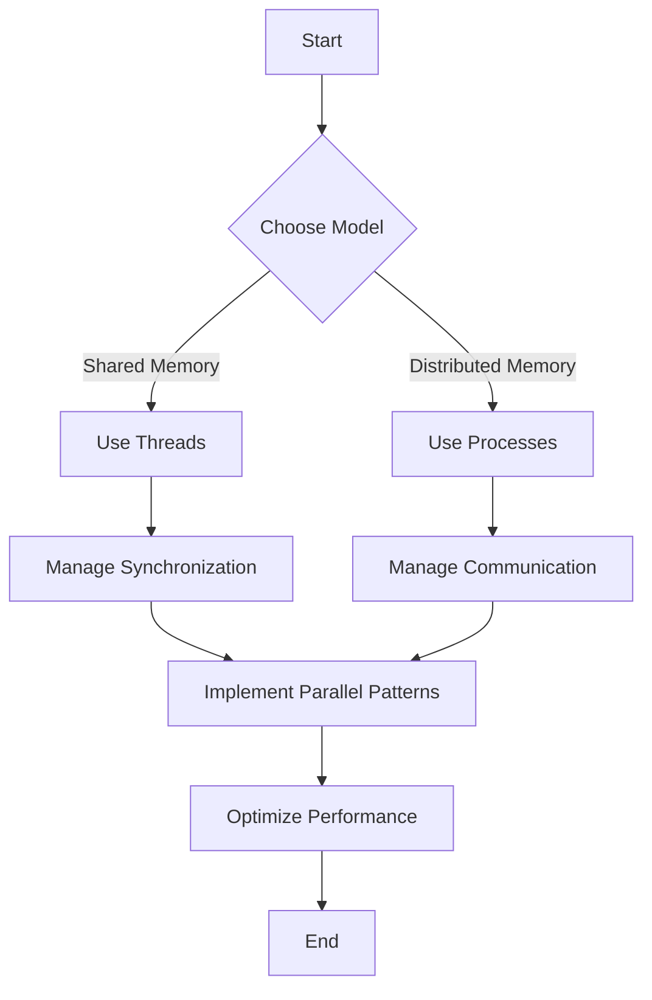

## 18.10 Parallelism and Concurrency for Performance

In the world of high-performance computing, parallelism and concurrency are key strategies to maximize the efficiency of your applications. Julia, with its rich set of features, provides powerful tools to exploit these strategies effectively. In this section, we will explore how to harness the full potential of parallelism and concurrency in Julia to optimize performance.

### Exploiting Multicore Systems

Modern computers come equipped with multicore processors, which allow multiple tasks to be executed simultaneously. Julia provides several mechanisms to leverage these multicore systems, including threads and processes.

#### Utilizing Threads and Processes

**Threads** in Julia are lightweight and share the same memory space, making them suitable for tasks that require frequent communication or shared data. **Processes**, on the other hand, have separate memory spaces and are ideal for tasks that can be executed independently.

```julia
using Base.Threads

function parallel_sum(arr)
    n = length(arr)
    sum = 0.0
    @threads for i in 1:n
        sum += arr[i]
    end
    return sum
end

arr = rand(1_000_000)
println("Sum: ", parallel_sum(arr))
```

In this example, we use the `@threads` macro to distribute the work of summing an array across multiple threads. This can significantly speed up the computation on multicore systems.

#### Shared Memory vs. Distributed Memory

Choosing between shared memory and distributed memory models depends on the nature of your problem. Shared memory is efficient for tasks that require frequent data sharing, while distributed memory is better suited for tasks that can be divided into independent units.

```julia
using Distributed

addprocs(4)  # Add 4 worker processes

@everywhere function distributed_sum(arr)
    return sum(arr)
end

arr = rand(1_000_000)
result = @distributed (+) for i in 1:length(arr)
    arr[i]
end

println("Distributed Sum: ", result)
```

Here, we use the `@distributed` macro to perform a parallel reduction across multiple processes. Each process computes a partial sum, which are then combined to produce the final result.

### Synchronization and Communication

When working with parallel and concurrent systems, managing data consistency and communication between tasks is crucial. Julia provides several constructs to handle synchronization and communication effectively.

#### Managing Data Consistency and Overhead

Ensuring data consistency in a parallel environment often requires synchronization mechanisms such as locks, semaphores, or atomic operations. These mechanisms help prevent race conditions and ensure that shared data is accessed safely.

```julia
using Base.Threads

function atomic_increment!(counter)
    @threads for _ in 1:1000
        atomic_add!(counter, 1)
    end
end

counter = Atomic{Int}(0)
atomic_increment!(counter)
println("Counter: ", counter[])
```

In this example, we use the `atomic_add!` function to safely increment a shared counter across multiple threads.

### Parallel Patterns

Parallel patterns are common strategies used to structure parallel computations. Julia supports several parallel patterns, including map-reduce, data parallelism, and task parallelism.

#### Map-Reduce

The map-reduce pattern is a powerful tool for processing large datasets in parallel. It involves mapping a function over a dataset and then reducing the results to a single value.

```julia
using Distributed

addprocs(4)

@everywhere function map_function(x)
    return x^2
end

@everywhere function reduce_function(x, y)
    return x + y
end

arr = rand(1_000_000)
result = @distributed reduce_function for x in arr
    map_function(x)
end

println("Map-Reduce Result: ", result)
```

In this example, we use the `@distributed` macro to apply a map function to each element of an array and then reduce the results using a custom reduce function.

#### Data Parallelism

Data parallelism involves distributing data across multiple processors and performing the same operation on each subset of data. This is particularly useful for operations that can be performed independently on each piece of data.

```julia
using Distributed

addprocs(4)

@everywhere function process_data_chunk(chunk)
    return sum(chunk)
end

arr = rand(1_000_000)
chunks = [arr[i:i+249_999] for i in 1:250_000:length(arr)]

results = pmap(process_data_chunk, chunks)
total_sum = sum(results)

println("Data Parallelism Result: ", total_sum)
```

Here, we divide an array into chunks and use `pmap` to process each chunk in parallel. The results are then combined to produce the final sum.

#### Task Parallelism

Task parallelism involves executing different tasks concurrently. Julia's `@async` and `@sync` macros make it easy to manage task parallelism.

```julia
function perform_task(id)
    println("Task $id started")
    sleep(rand())
    println("Task $id completed")
end

tasks = []
for i in 1:4
    push!(tasks, @async perform_task(i))
end

@sync begin
    for task in tasks
        wait(task)
    end
end
```

In this example, we create multiple asynchronous tasks using the `@async` macro and wait for their completion using the `@sync` block.

### Visualizing Parallelism and Concurrency

To better understand the concepts of parallelism and concurrency, let's visualize the process using a flowchart.



**Figure 1**: This flowchart illustrates the decision-making process for choosing between shared and distributed memory models, managing synchronization and communication, and implementing parallel patterns to optimize performance.

### References and Further Reading

- [Julia Documentation on Parallel Computing](https://docs.julialang.org/en/v1/manual/parallel-computing/)
- [Multithreading in Julia](https://docs.julialang.org/en/v1/manual/multi-threading/)
- [Distributed Computing in Julia](https://docs.julialang.org/en/v1/stdlib/Distributed/)

### Knowledge Check

- What are the differences between threads and processes in Julia?
- How can you ensure data consistency when using shared memory?
- What are some common parallel patterns supported by Julia?

### Embrace the Journey

Remember, mastering parallelism and concurrency in Julia is a journey. As you progress, you'll be able to tackle more complex problems and optimize your applications for maximum performance. Keep experimenting, stay curious, and enjoy the journey!

## Quiz Time!



### What is the primary advantage of using threads over processes in Julia?

- [x] Threads share the same memory space, allowing for easier communication.
- [ ] Threads have separate memory spaces, reducing the risk of data corruption.
- [ ] Threads are slower than processes.
- [ ] Threads are only suitable for single-core systems.

> **Explanation:** Threads in Julia share the same memory space, which makes communication between them easier compared to processes that have separate memory spaces.

### Which Julia macro is used to distribute work across multiple threads?

- [x] `@threads`
- [ ] `@distributed`
- [ ] `@async`
- [ ] `@sync`

> **Explanation:** The `@threads` macro is used to distribute work across multiple threads in Julia.

### What is the purpose of the `@distributed` macro in Julia?

- [x] To perform parallel reduction across multiple processes.
- [ ] To create asynchronous tasks.
- [ ] To manage synchronization between threads.
- [ ] To handle exceptions in parallel code.

> **Explanation:** The `@distributed` macro is used to perform parallel reduction across multiple processes in Julia.

### How can you ensure data consistency when using shared memory in Julia?

- [x] By using atomic operations.
- [ ] By avoiding shared memory altogether.
- [ ] By using the `@async` macro.
- [ ] By using the `@distributed` macro.

> **Explanation:** Atomic operations help ensure data consistency when using shared memory by preventing race conditions.

### Which parallel pattern involves distributing data across multiple processors?

- [x] Data parallelism
- [ ] Task parallelism
- [ ] Map-reduce
- [ ] Pipeline parallelism

> **Explanation:** Data parallelism involves distributing data across multiple processors and performing the same operation on each subset of data.

### What is the role of the `@async` macro in Julia?

- [x] To create asynchronous tasks.
- [ ] To perform parallel reduction.
- [ ] To manage synchronization between threads.
- [ ] To handle exceptions in parallel code.

> **Explanation:** The `@async` macro is used to create asynchronous tasks in Julia.

### Which of the following is a common synchronization mechanism in parallel computing?

- [x] Locks
- [ ] Threads
- [ ] Processes
- [ ] Arrays

> **Explanation:** Locks are a common synchronization mechanism used to manage access to shared resources in parallel computing.

### What is the main benefit of using the map-reduce pattern?

- [x] It allows for efficient processing of large datasets in parallel.
- [ ] It simplifies the creation of asynchronous tasks.
- [ ] It reduces the need for synchronization.
- [ ] It eliminates the need for distributed memory.

> **Explanation:** The map-reduce pattern allows for efficient processing of large datasets in parallel by mapping a function over the data and reducing the results.

### Which Julia construct is used to wait for the completion of asynchronous tasks?

- [x] `@sync`
- [ ] `@threads`
- [ ] `@distributed`
- [ ] `@parallel`

> **Explanation:** The `@sync` construct is used to wait for the completion of asynchronous tasks in Julia.

### True or False: Distributed memory is more efficient for tasks that require frequent data sharing.

- [ ] True
- [x] False

> **Explanation:** Distributed memory is not efficient for tasks that require frequent data sharing because each process has its own memory space, making communication more complex.


