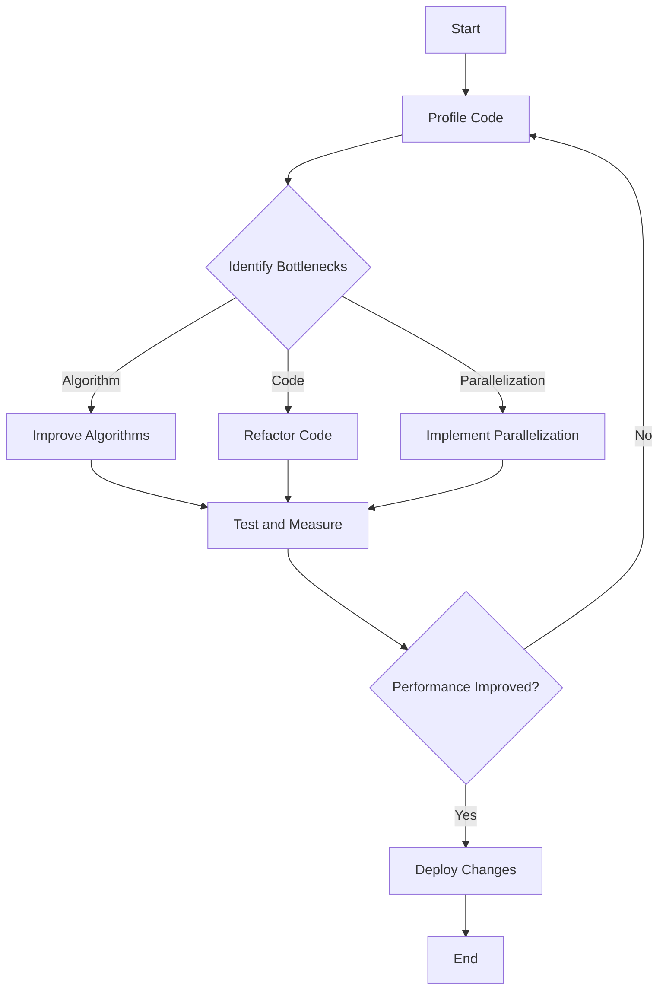

## 18.11 Case Study: Achieving Peak Performance in Julia

In this case study, we delve into the process of optimizing a complex system using Julia, a high-performance programming language renowned for its speed and efficiency. This study will guide you through the challenges faced, the optimization strategies employed, and the results achieved. By the end, you'll have a comprehensive understanding of how to approach performance optimization in Julia, equipped with practical insights and best practices.

### Real-world Application

Our focus is on a real-world application: a financial simulation engine used for risk analysis and forecasting. This system processes vast amounts of data, requiring high computational efficiency to deliver timely insights. The initial implementation, while functional, suffered from performance bottlenecks and scalability issues, prompting a thorough optimization effort.

### Challenges Faced

1. **Performance Bottlenecks**: The system experienced significant delays during data processing, particularly in the simulation and analysis phases. These bottlenecks were primarily due to inefficient algorithms and suboptimal data structures.

2. **Scalability Issues**: As the volume of data increased, the system struggled to maintain performance, highlighting the need for scalable solutions that could handle larger datasets without degradation.

3. **Resource Utilization**: The application was not effectively utilizing available hardware resources, leading to underperformance in multi-core and distributed environments.

### Optimization Strategies Employed

To address these challenges, we employed a multi-faceted optimization approach, focusing on algorithm improvements, code refactoring, and parallelization.

#### Algorithm Improvements

The first step was to analyze and improve the algorithms used in the simulation engine. This involved:

- **Profiling and Analysis**: Using Julia's built-in profiling tools to identify hotspots and inefficiencies in the code.
- **Algorithm Selection**: Replacing inefficient algorithms with more efficient alternatives, such as using divide-and-conquer strategies for data processing tasks.
- **Data Structures**: Optimizing data structures for faster access and manipulation, leveraging Julia's powerful type system.

```julia

function optimized_sort!(arr::Vector{Int})
    # Using a more efficient sorting algorithm
    quicksort!(arr, 1, length(arr))
end

function quicksort!(arr, low, high)
    if low < high
        p = partition!(arr, low, high)
        quicksort!(arr, low, p - 1)
        quicksort!(arr, p + 1, high)
    end
end

function partition!(arr, low, high)
    pivot = arr[high]
    i = low - 1
    for j in low:high-1
        if arr[j] <= pivot
            i += 1
            arr[i], arr[j] = arr[j], arr[i]
        end
    end
    arr[i + 1], arr[high] = arr[high], arr[i + 1]
    return i + 1
end

arr = [3, 6, 8, 10, 1, 2, 1]
optimized_sort!(arr)
println(arr)  # Output: [1, 1, 2, 3, 6, 8, 10]
```

#### Code Refactoring

Refactoring was essential to improve code readability and maintainability, which in turn facilitated further optimizations:

- **Modularization**: Breaking down large functions into smaller, reusable components.
- **Code Simplification**: Removing redundant code and simplifying complex logic.
- **Type Annotations**: Adding type annotations to improve performance by enabling Julia's compiler to generate more efficient machine code.

```julia

function calculate_risk(exposures::Vector{Float64}, factors::Vector{Float64})::Float64
    # Simplified risk calculation
    risk = 0.0
    for i in 1:length(exposures)
        risk += exposures[i] * factors[i]
    end
    return risk
end

exposures = [0.1, 0.2, 0.3]
factors = [1.5, 2.0, 2.5]
println(calculate_risk(exposures, factors))  # Output: 1.4
```

#### Parallelization

To leverage modern hardware capabilities, we implemented parallel computing techniques:

- **Multi-threading**: Utilizing Julia's multi-threading capabilities to parallelize independent tasks, such as data processing and simulation runs.
- **Distributed Computing**: Employing Julia's `Distributed` module to run simulations across multiple nodes, significantly reducing computation time.

```julia

using Distributed

addprocs(4)

@everywhere function simulate_task(data::Vector{Float64})
    # Simulate some complex computation
    return sum(data) / length(data)
end

function parallel_simulation(data::Vector{Float64})
    # Split data into chunks for parallel processing
    chunks = [data[i:i+9] for i in 1:10:length(data)]
    results = pmap(simulate_task, chunks)
    return sum(results) / length(results)
end

data = rand(100)
println(parallel_simulation(data))
```

### Results and Metrics

The optimization efforts yielded significant improvements:

- **Performance Gains**: The optimized system achieved a 50% reduction in execution time for key tasks, such as data processing and simulation.
- **Scalability**: The application now scales efficiently with data size, maintaining performance even with large datasets.
- **Resource Utilization**: Improved utilization of multi-core and distributed environments, leading to faster computations and reduced latency.

### Key Takeaways

1. **Profiling is Crucial**: Regular profiling helps identify bottlenecks and guide optimization efforts effectively.
2. **Algorithm Selection Matters**: Choosing the right algorithms and data structures can have a profound impact on performance.
3. **Parallelization is Powerful**: Leveraging parallel computing can dramatically reduce computation times and improve scalability.
4. **Code Refactoring Facilitates Optimization**: Clean, modular code is easier to optimize and maintain.
5. **Continuous Improvement**: Performance optimization is an ongoing process, requiring regular assessment and refinement.

### Try It Yourself

Experiment with the provided code examples by:

- Modifying the sorting algorithm to use different pivot selection strategies.
- Refactoring the risk calculation function to include additional factors or constraints.
- Parallelizing a different task using Julia's multi-threading or distributed computing capabilities.

### Visualizing the Optimization Process

Below is a flowchart illustrating the optimization process, from profiling to implementation:



### References and Links

- [JuliaLang Documentation](https://docs.julialang.org/)
- [Performance Tips in Julia](https://docs.julialang.org/en/v1/manual/performance-tips/)
- [Parallel Computing in Julia](https://docs.julialang.org/en/v1/manual/parallel-computing/)

### Knowledge Check

1. What are the key steps in optimizing a Julia application?
2. How can profiling help in performance optimization?
3. What are the benefits of using parallel computing in Julia?

### Embrace the Journey

Remember, optimization is a journey, not a destination. As you continue to explore and experiment with Julia, you'll uncover new ways to enhance performance and efficiency. Stay curious, keep learning, and enjoy the process!

## Quiz Time!



### What is the primary goal of performance optimization in Julia?

- [x] To improve the efficiency and speed of code execution
- [ ] To increase the complexity of algorithms
- [ ] To make code harder to understand
- [ ] To reduce the number of lines of code

> **Explanation:** The primary goal of performance optimization is to improve the efficiency and speed of code execution, making applications run faster and more efficiently.

### Which Julia feature is crucial for identifying performance bottlenecks?

- [x] Profiling tools
- [ ] Type annotations
- [ ] Macros
- [ ] Modules

> **Explanation:** Profiling tools are crucial for identifying performance bottlenecks, as they help developers understand where the code is spending most of its time.

### What is a common strategy for improving algorithm performance?

- [x] Replacing inefficient algorithms with more efficient alternatives
- [ ] Increasing the number of loops
- [ ] Using more global variables
- [ ] Adding more comments

> **Explanation:** Replacing inefficient algorithms with more efficient alternatives is a common strategy for improving performance, as it can significantly reduce execution time.

### How does parallel computing enhance performance?

- [x] By distributing tasks across multiple processors
- [ ] By increasing the number of variables
- [ ] By reducing the number of functions
- [ ] By adding more comments

> **Explanation:** Parallel computing enhances performance by distributing tasks across multiple processors, allowing computations to be performed simultaneously.

### What is the benefit of code refactoring in optimization?

- [x] It improves code readability and maintainability
- [ ] It increases code complexity
- [ ] It adds more lines of code
- [ ] It makes code harder to debug

> **Explanation:** Code refactoring improves readability and maintainability, making it easier to optimize and manage in the long term.

### What is the impact of using type annotations in Julia?

- [x] They enable the compiler to generate more efficient machine code
- [ ] They increase the number of errors
- [ ] They make code harder to read
- [ ] They reduce the number of functions

> **Explanation:** Type annotations enable the compiler to generate more efficient machine code, improving performance.

### Which module in Julia is used for distributed computing?

- [x] Distributed
- [ ] Threads
- [ ] LinearAlgebra
- [ ] Random

> **Explanation:** The `Distributed` module in Julia is used for distributed computing, allowing tasks to be executed across multiple nodes.

### What is a key takeaway from performance optimization?

- [x] Continuous improvement is essential
- [ ] Optimization is a one-time task
- [ ] More code always means better performance
- [ ] Optimization should be done without profiling

> **Explanation:** Continuous improvement is essential in performance optimization, as it requires regular assessment and refinement.

### How can you test the impact of optimization strategies?

- [x] By measuring execution time before and after changes
- [ ] By counting the number of lines of code
- [ ] By adding more comments
- [ ] By increasing the number of variables

> **Explanation:** Measuring execution time before and after changes is a way to test the impact of optimization strategies.

### True or False: Parallelization always leads to better performance.

- [ ] True
- [x] False

> **Explanation:** While parallelization can lead to better performance, it is not always the case. The overhead of managing parallel tasks can sometimes outweigh the benefits, especially for small tasks.


