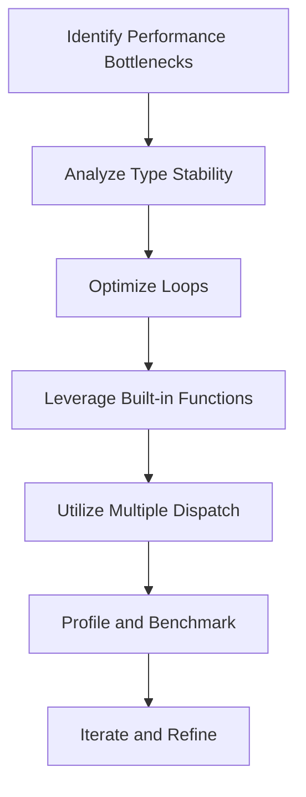

## 18.2 Writing High-Performance Julia Code

Writing high-performance code in Julia involves understanding and leveraging the language's unique features to maximize efficiency. Julia is designed for high-performance numerical and scientific computing, and by following best practices, we can ensure our applications run as efficiently as possible. In this section, we will explore key strategies for writing high-performance Julia code, including utilizing Julia's strengths, leveraging built-in functions, avoiding type instabilities, and optimizing loops.

### Best Practices for High-Performance Julia Code

#### Utilizing Julia's Strengths for Maximum Efficiency

Julia's design is centered around performance, with features like just-in-time (JIT) compilation, multiple dispatch, and a sophisticated type system. To harness these strengths:

- **Use Multiple Dispatch**: Julia's multiple dispatch allows functions to be specialized based on the types of all their arguments. This can lead to more efficient code by allowing the compiler to generate optimized machine code for specific type combinations.

- **Take Advantage of JIT Compilation**: Julia compiles functions the first time they are called, which can lead to significant performance improvements. Ensure that your functions are type-stable and avoid dynamic dispatch to maximize the benefits of JIT compilation.

- **Leverage Julia's Type System**: Use concrete types whenever possible to allow the compiler to generate efficient machine code. Avoid using abstract types in performance-critical sections of your code.

#### Leveraging Built-in Functions

Julia's standard library includes many well-optimized functions that are implemented in C or Fortran. These functions are often more efficient than custom implementations:

- **Favor Built-in Functions**: Whenever possible, use Julia's built-in functions, such as `sum`, `mean`, and `sort`, which are optimized for performance.

- **Use Broadcasting**: Julia's broadcasting mechanism (using the `.` operator) allows you to apply functions element-wise to arrays without writing explicit loops. This can lead to more concise and efficient code.

```julia
a = [1, 2, 3]
b = [4, 5, 6]
c = a .+ b  # Element-wise addition
```

- **Utilize Linear Algebra Libraries**: Julia's linear algebra functions, such as those in the `LinearAlgebra` module, are highly optimized and should be used for matrix and vector operations.

#### Avoiding Type Instabilities

Type instability occurs when the type of a variable cannot be inferred at compile time, leading to dynamic dispatch and reduced performance:

- **Ensure Type Stability**: Write functions where the return type can be inferred from the input types. Use the `@code_warntype` macro to check for type instabilities.

```julia
function stable_function(x::Int)
    return x + 1
end

@code_warntype stable_function(5)
```

- **Avoid Global Variables**: Global variables can introduce type instability. Use local variables or pass variables as function arguments.

- **Use Type Annotations**: Annotate function arguments and variables with specific types to help the compiler infer types.

#### Loop Optimizations

Loops are a common source of performance bottlenecks. Optimize loops to minimize overhead and improve execution speed:

- **Minimize Loop Overhead**: Use `@inbounds` to skip bounds checking within loops when you are certain that indices are valid.

```julia
function sum_array(arr::Vector{Int})
    s = 0
    @inbounds for i in 1:length(arr)
        s += arr[i]
    end
    return s
end
```

- **Unroll Loops**: Loop unrolling can reduce the overhead of loop control and increase performance. However, it should be used judiciously as it can increase code size.

- **Use `@simd` for Vectorization**: The `@simd` macro can be used to indicate that a loop can be vectorized, allowing the compiler to generate SIMD instructions.

```julia
function dot_product(a::Vector{Float64}, b::Vector{Float64})
    s = 0.0
    @simd for i in 1:length(a)
        s += a[i] * b[i]
    end
    return s
end
```

### Visualizing Performance Optimization

To better understand the flow of performance optimization in Julia, let's visualize the process using a flowchart. This diagram illustrates the steps involved in optimizing Julia code, from identifying bottlenecks to implementing optimizations.



**Figure 1**: Flowchart of Performance Optimization in Julia

### References and Further Reading

- [JuliaLang Performance Tips](https://docs.julialang.org/en/v1/manual/performance-tips/)
- [JuliaLang Documentation](https://docs.julialang.org/)
- [BenchmarkTools.jl](https://github.com/JuliaCI/BenchmarkTools.jl)

### Knowledge Check

Let's test your understanding of high-performance Julia code with a few questions:

1. What is the benefit of using multiple dispatch in Julia?
2. How can you check for type instabilities in your code?
3. Why should you favor built-in functions over custom implementations?
4. What is the purpose of the `@inbounds` macro in loops?
5. How does broadcasting improve performance in Julia?

### Try It Yourself

Experiment with the code examples provided in this section. Try modifying the functions to introduce type instabilities and observe the impact on performance. Use the `@code_warntype` macro to identify type instabilities and refactor the code to eliminate them.

### Embrace the Journey

Remember, writing high-performance Julia code is an iterative process. As you gain experience, you'll develop an intuition for identifying performance bottlenecks and applying the appropriate optimizations. Keep experimenting, stay curious, and enjoy the journey of mastering Julia!

## Quiz Time!



### What is a key feature of Julia that enhances performance?

- [x] Multiple Dispatch
- [ ] Dynamic Typing
- [ ] Global Variables
- [ ] Manual Memory Management

> **Explanation:** Multiple dispatch allows Julia to generate optimized machine code for specific type combinations, enhancing performance.

### How can you check for type instabilities in Julia?

- [x] Using the `@code_warntype` macro
- [ ] Using the `@code_native` macro
- [ ] Using the `@code_lowered` macro
- [ ] Using the `@code_llvm` macro

> **Explanation:** The `@code_warntype` macro helps identify type instabilities by showing the inferred types.

### Which macro can be used to skip bounds checking in loops?

- [x] `@inbounds`
- [ ] `@boundscheck`
- [ ] `@fastmath`
- [ ] `@inline`

> **Explanation:** The `@inbounds` macro skips bounds checking, reducing loop overhead.

### What is the benefit of using built-in functions in Julia?

- [x] They are often more efficient than custom implementations
- [ ] They are easier to read
- [ ] They are always faster than any other code
- [ ] They are written in Python

> **Explanation:** Built-in functions are optimized for performance and often outperform custom implementations.

### What does the `@simd` macro do?

- [x] Indicates that a loop can be vectorized
- [ ] Skips bounds checking
- [ ] Forces type stability
- [ ] Enables dynamic dispatch

> **Explanation:** The `@simd` macro allows the compiler to generate SIMD instructions for vectorization.

### Why should you avoid global variables in performance-critical code?

- [x] They can introduce type instability
- [ ] They are always slower
- [ ] They are deprecated
- [ ] They are not allowed in Julia

> **Explanation:** Global variables can lead to type instability, reducing performance.

### What is loop unrolling?

- [x] Reducing loop control overhead by expanding the loop body
- [ ] Skipping bounds checking in loops
- [ ] Using built-in functions in loops
- [ ] Vectorizing loops with SIMD

> **Explanation:** Loop unrolling expands the loop body to reduce control overhead, potentially improving performance.

### How does broadcasting improve performance?

- [x] By applying functions element-wise without explicit loops
- [ ] By skipping bounds checking
- [ ] By forcing type stability
- [ ] By using global variables

> **Explanation:** Broadcasting applies functions element-wise, reducing the need for explicit loops and improving performance.

### What is the purpose of the `@code_warntype` macro?

- [x] To check for type instabilities
- [ ] To generate machine code
- [ ] To optimize loops
- [ ] To enable multiple dispatch

> **Explanation:** The `@code_warntype` macro helps identify type instabilities in functions.

### True or False: Julia's JIT compilation can lead to significant performance improvements.

- [x] True
- [ ] False

> **Explanation:** Julia's JIT compilation compiles functions the first time they are called, leading to performance improvements.


