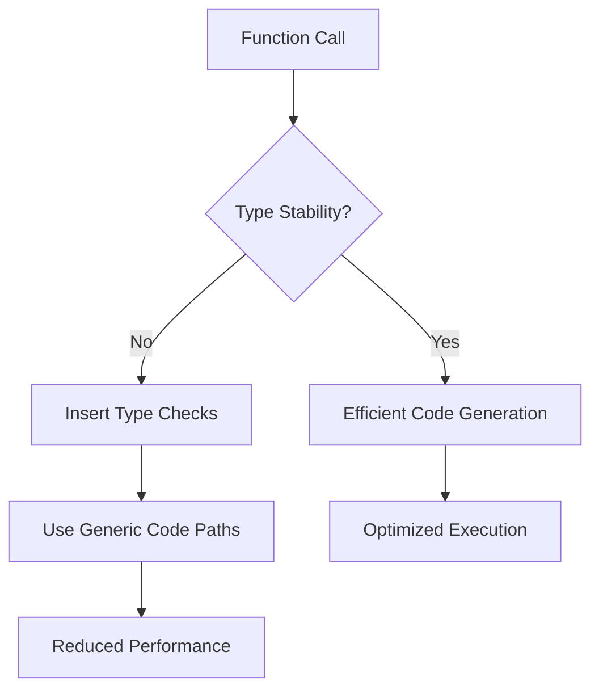

## 18.3 Understanding Type Stability and Its Impact

In the world of programming, especially in high-performance languages like Julia, understanding and leveraging type stability is crucial for writing efficient and optimized code. Type stability is a concept that directly influences the performance of your Julia programs, affecting how the Just-In-Time (JIT) compiler optimizes your code. In this section, we will delve deep into the definition of type stability, how to detect type instabilities, their impact on the compiler, and strategies to improve type stability in your Julia applications.

### Definition of Type Stability

**Type Stability** refers to a function's ability to produce output types that are predictable based on its input types. In simpler terms, a function is type-stable if the type of its output can be determined solely from the types of its inputs. This predictability allows the Julia compiler to generate highly optimized machine code, leading to faster execution.

#### Why Type Stability Matters

Type stability is a cornerstone of performance in Julia. When a function is type-stable, the compiler can make assumptions about the types of variables, enabling it to generate efficient code. Conversely, type instability forces the compiler to insert additional checks and potentially use slower, generic code paths, which can significantly degrade performance.

### Detecting Type Instabilities

To ensure your functions are type-stable, you need to be able to detect type instabilities. Julia provides a powerful tool for this purpose: the `@code_warntype` macro. This macro helps you visualize the types inferred by the compiler and identify any instabilities.

#### Using `@code_warntype`

The `@code_warntype` macro displays the inferred types of variables within a function, highlighting any type instabilities in red. Here's how you can use it:

```julia
function unstable_function(x)
    if x > 0
        return 1.0
    else
        return 1
    end
end

@code_warntype unstable_function(5)
```

In this example, `@code_warntype` will show that the return type of `unstable_function` is not consistent, as it can be either `Float64` or `Int`. This inconsistency is a classic example of type instability.

### Impact on the Compiler

Type instability has a profound impact on the Julia compiler's ability to optimize code. Let's explore how it affects the JIT compilation process and overall performance.

#### How Instability Affects JIT Compilation

The JIT compiler in Julia relies heavily on type information to generate efficient machine code. When a function is type-stable, the compiler can:

- **Eliminate Type Checks**: By knowing the types in advance, the compiler can remove unnecessary type checks, reducing overhead.
- **Optimize Memory Access**: With predictable types, the compiler can optimize memory layout and access patterns, leading to faster execution.
- **Inline Functions**: Type-stable functions are more likely to be inlined, reducing function call overhead.

Conversely, type instability forces the compiler to:

- **Insert Type Checks**: Additional checks are needed to handle different possible types, increasing runtime overhead.
- **Use Generic Code Paths**: The compiler may resort to slower, generic code paths when types are unpredictable.
- **Limit Inlining**: Functions with type instability are less likely to be inlined, increasing function call overhead.

### Strategies for Improvement

Improving type stability in your Julia code involves several strategies, from using explicit type annotations to simplifying return types. Let's explore these strategies in detail.

#### Explicit Type Annotations

One way to enhance type stability is by using explicit type annotations. By specifying the types of function arguments and return values, you provide the compiler with more information to optimize the code.

```julia
function stable_function(x::Int)::Float64
    return x > 0 ? 1.0 : 0.0
end
```

In this example, the function `stable_function` is explicitly annotated to return a `Float64`, ensuring type stability.

#### Simplifying Return Types

Another strategy is to simplify the return types of your functions. Avoid returning different types based on conditions, as this can lead to type instability.

```julia
function simplified_function(x)
    return x > 0 ? 1.0 : 0.0
end
```

Here, the function always returns a `Float64`, regardless of the input, ensuring type stability.

#### Using Union Types

In cases where a function must return different types, consider using union types. Union types allow you to specify a set of possible types, providing the compiler with more information.

```julia
function union_function(x)
    return x > 0 ? 1.0 : 0
end

@code_warntype union_function(5)
```

By using union types, you can still achieve some level of type stability, although it's generally less efficient than having a single return type.

#### Leveraging Multiple Dispatch

Julia's multiple dispatch system can also help improve type stability. By defining multiple methods for a function, each handling different input types, you can ensure type stability across different scenarios.

```julia
function dispatch_function(x::Int)
    return 1.0
end

function dispatch_function(x::Float64)
    return 0.0
end
```

In this example, `dispatch_function` has two methods, each handling a specific input type, ensuring type stability.

### Visualizing Type Stability

To better understand type stability and its impact, let's visualize the process using a flowchart. This diagram illustrates how type stability influences the JIT compilation process.



**Figure 1: Impact of Type Stability on JIT Compilation**

This flowchart shows that type stability leads to efficient code generation and optimized execution, while type instability results in additional type checks, generic code paths, and reduced performance.

### Try It Yourself

To solidify your understanding of type stability, try modifying the code examples provided. Experiment with different input types and observe how `@code_warntype` highlights type instabilities. Consider the following exercises:

1. Modify `unstable_function` to return consistent types and observe the changes in `@code_warntype`.
2. Use explicit type annotations in `union_function` and see how it affects type stability.
3. Implement a new function using multiple dispatch to handle different input types and ensure type stability.

### References and Further Reading

For more information on type stability and performance optimization in Julia, consider exploring the following resources:

- [JuliaLang Documentation on Performance Tips](https://docs.julialang.org/en/v1/manual/performance-tips/)
- [JuliaLang Blog: Type Stability and Performance](https://julialang.org/blog/)
- [Julia Performance Optimization Guide](https://julialang.org/learning/)

### Knowledge Check

Before we conclude, let's reinforce your understanding with a few questions:

- What is type stability, and why is it important in Julia?
- How does type instability affect the JIT compiler's ability to optimize code?
- What are some strategies to improve type stability in Julia functions?

### Embrace the Journey

Remember, mastering type stability is just one step in your journey to becoming a proficient Julia developer. As you continue to explore and experiment, you'll discover new ways to optimize your code and harness the full power of Julia. Stay curious, keep learning, and enjoy the process!

## Quiz Time!



### What is type stability in Julia?

- [x] A function's ability to produce predictable output types based on input types
- [ ] The use of explicit type annotations in functions
- [ ] The process of optimizing memory usage in Julia
- [ ] A method for handling exceptions in Julia

> **Explanation:** Type stability refers to a function's ability to produce output types that are predictable based on its input types, which is crucial for performance optimization in Julia.

### How can you detect type instabilities in Julia?

- [x] Using the `@code_warntype` macro
- [ ] By running the `@code_native` macro
- [ ] Through the `@time` macro
- [ ] By using the `@inferred` macro

> **Explanation:** The `@code_warntype` macro is used to detect type instabilities by displaying the inferred types and highlighting any inconsistencies.

### What impact does type instability have on the JIT compiler?

- [x] It forces the compiler to insert additional type checks
- [ ] It improves the compiler's ability to inline functions
- [ ] It reduces the need for memory allocation
- [ ] It enhances the performance of generic code paths

> **Explanation:** Type instability forces the compiler to insert additional type checks, which can degrade performance by preventing efficient code generation.

### Which strategy can improve type stability in Julia functions?

- [x] Using explicit type annotations
- [ ] Avoiding the use of multiple dispatch
- [ ] Increasing the use of global variables
- [ ] Relying on dynamic typing

> **Explanation:** Using explicit type annotations provides the compiler with more information, helping to improve type stability and optimize performance.

### What is the benefit of using union types in Julia?

- [x] They allow specifying a set of possible types for a function's return value
- [ ] They eliminate the need for type annotations
- [ ] They automatically optimize memory usage
- [ ] They simplify the process of exception handling

> **Explanation:** Union types allow you to specify a set of possible types for a function's return value, providing the compiler with more information to optimize code.

### How does multiple dispatch contribute to type stability?

- [x] By defining multiple methods for a function, each handling different input types
- [ ] By reducing the need for explicit type annotations
- [ ] By automatically inferring types at runtime
- [ ] By simplifying the return types of functions

> **Explanation:** Multiple dispatch allows you to define multiple methods for a function, each handling different input types, ensuring type stability across different scenarios.

### What is the role of `@code_warntype` in performance optimization?

- [x] It helps identify type instabilities that can degrade performance
- [ ] It measures the execution time of functions
- [ ] It visualizes memory allocation patterns
- [ ] It provides detailed error messages for debugging

> **Explanation:** The `@code_warntype` macro helps identify type instabilities by displaying inferred types and highlighting inconsistencies, aiding in performance optimization.

### Why is type stability important for inlining functions?

- [x] Type-stable functions are more likely to be inlined, reducing function call overhead
- [ ] Type stability eliminates the need for function calls
- [ ] It ensures that functions are executed in parallel
- [ ] It simplifies the process of memory allocation

> **Explanation:** Type-stable functions are more likely to be inlined, reducing function call overhead and improving performance.

### What is a potential drawback of type instability?

- [x] It can lead to slower, generic code paths
- [ ] It automatically optimizes memory usage
- [ ] It increases the likelihood of function inlining
- [ ] It enhances the readability of code

> **Explanation:** Type instability can lead to slower, generic code paths, as the compiler cannot make assumptions about types, reducing performance.

### True or False: Type stability is only important for numerical computations in Julia.

- [ ] True
- [x] False

> **Explanation:** Type stability is important for all types of computations in Julia, not just numerical ones, as it affects the compiler's ability to optimize code efficiently.


