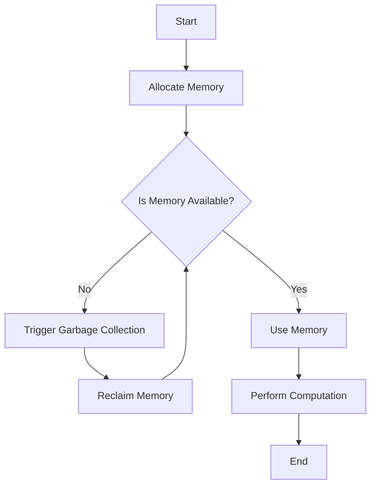

## 18.4 Memory Management and Reducing Allocations

In the world of high-performance computing, efficient memory management is crucial. Julia, known for its speed and efficiency, provides powerful tools and techniques to manage memory effectively. In this section, we will explore the intricacies of memory management in Julia, focusing on understanding memory usage, techniques to reduce allocations, analyzing allocations, and a case study to illustrate these concepts in action.

### Understanding Memory Usage

Memory usage in Julia is a critical factor that affects the performance of applications. Let's delve into the cost of memory allocations and garbage collection.

#### The Cost of Memory Allocations

Memory allocation refers to the process of reserving a block of memory for use by a program. In Julia, memory allocations can be expensive due to the overhead of managing memory and the potential for increased garbage collection activity. Each allocation involves:

- **Time Overhead**: Allocating memory takes time, which can add up in performance-critical applications.
- **Garbage Collection**: Frequent allocations lead to more frequent garbage collection cycles, which can pause program execution and degrade performance.

To illustrate, consider the following example:

```julia
function allocate_example(n)
    result = []
    for i in 1:n
        push!(result, i)
    end
    return result
end

result = allocate_example(1000000)
```

In this code, each `push!` operation may trigger a memory allocation, especially if the array needs to grow. This can lead to significant overhead in large-scale applications.

#### Garbage Collection

Garbage collection (GC) is the process of automatically reclaiming memory that is no longer in use. While GC simplifies memory management for developers, it can introduce performance bottlenecks. Julia uses a generational garbage collector, which categorizes objects by their age and collects younger objects more frequently. Understanding GC behavior is crucial for optimizing memory usage.

### Techniques to Reduce Allocations

Reducing memory allocations is key to improving performance. Here are some techniques to achieve this:

#### Reusing Buffers

Reusing buffers involves using pre-allocated memory spaces for repeated operations, minimizing the need for new allocations. This technique is particularly useful in iterative computations or when processing large datasets.

```julia
function reuse_buffer_example(n)
    buffer = Vector{Int}(undef, n)
    for i in 1:n
        buffer[i] = i
    end
    return buffer
end

buffer = reuse_buffer_example(1000000)
```

In this example, we pre-allocate a buffer of size `n` and reuse it for storing values, avoiding repeated allocations.

#### Performing In-Place Operations

In-place operations modify existing data structures rather than creating new ones, reducing memory allocations. Julia provides functions with a `!` suffix to indicate in-place operations.

```julia
function in_place_example!(arr)
    for i in 1:length(arr)
        arr[i] *= 2
    end
end

data = [1, 2, 3, 4, 5]
in_place_example!(data)
```

Here, the `in_place_example!` function doubles each element of the array `arr` in place, avoiding the creation of a new array.

### Analyzing Allocations

Profiling tools are essential for measuring memory usage and identifying allocation hotspots. Julia provides several tools for this purpose.

#### Using Profiling Tools

The `@time` macro is a simple yet powerful tool for measuring execution time and memory allocations:

```julia
function profile_example(n)
    result = []
    for i in 1:n
        push!(result, i)
    end
    return result
end

@time profile_example(1000000)
```

The output of `@time` includes the time taken and the number of allocations, helping you identify performance bottlenecks.

For more detailed analysis, the `Profile` and `ProfileView` packages provide visualization tools to examine memory usage and allocation patterns.

### Case Study: Reducing Allocations in a Data-Intensive Application

Let's apply these concepts to a real-world scenario: optimizing a data-intensive application.

#### Problem Statement

Consider an application that processes large datasets, performing computations on each data point. The initial implementation suffers from high memory usage and frequent garbage collection pauses.

#### Initial Implementation

```julia
function process_data(data)
    results = []
    for d in data
        result = compute(d)
        push!(results, result)
    end
    return results
end

function compute(d)
    # Simulate a computation
    return d * 2
end

data = rand(1:100, 1000000)
results = process_data(data)
```

In this implementation, each call to `compute` results in a new allocation, leading to high memory usage.

#### Optimization Strategy

1. **Reuse Buffers**: Pre-allocate a results buffer to store computation results.
2. **In-Place Operations**: Modify data in place where possible.

#### Optimized Implementation

```julia
function process_data_optimized!(data, results)
    for i in 1:length(data)
        results[i] = compute(data[i])
    end
end

data = rand(1:100, 1000000)
results = Vector{Int}(undef, length(data))
process_data_optimized!(data, results)
```

By reusing the `results` buffer and performing in-place operations, we significantly reduce memory allocations and improve performance.

### Visualizing Memory Management

To better understand memory management, let's visualize the process of memory allocation and garbage collection using a flowchart.



**Figure 1**: Memory Allocation and Garbage Collection Flowchart

This flowchart illustrates the decision-making process involved in memory allocation and garbage collection, highlighting the importance of efficient memory management.

### References and Links

For further reading on memory management and optimization in Julia, consider the following resources:

- [Julia Documentation on Performance Tips](https://docs.julialang.org/en/v1/manual/performance-tips/)
- [Profiling and Performance Tools in Julia](https://docs.julialang.org/en/v1/manual/profile/)
- [Understanding Garbage Collection in Julia](https://docs.julialang.org/en/v1/manual/garbage-collection/)

### Knowledge Check

To reinforce your understanding, consider the following questions:

- What are the main costs associated with memory allocations in Julia?
- How can reusing buffers help reduce memory allocations?
- What is the purpose of in-place operations, and how do they improve performance?
- How can profiling tools be used to analyze memory usage in Julia applications?

### Embrace the Journey

Remember, mastering memory management in Julia is a journey. As you continue to explore and experiment with these techniques, you'll gain deeper insights into optimizing performance and building efficient applications. Keep experimenting, stay curious, and enjoy the journey!

## Quiz Time!



### What is the primary benefit of reusing buffers in Julia?

- [x] Reducing memory allocations
- [ ] Increasing code complexity
- [ ] Improving code readability
- [ ] Enhancing garbage collection

> **Explanation:** Reusing buffers helps reduce memory allocations by avoiding the need to allocate new memory for each operation.

### Which of the following is a key feature of in-place operations in Julia?

- [x] They modify existing data structures
- [ ] They create new data structures
- [ ] They increase memory usage
- [ ] They slow down execution

> **Explanation:** In-place operations modify existing data structures, reducing the need for additional memory allocations.

### What does the `@time` macro measure in Julia?

- [x] Execution time and memory allocations
- [ ] Only execution time
- [ ] Only memory allocations
- [ ] CPU usage

> **Explanation:** The `@time` macro measures both execution time and memory allocations, providing insights into performance.

### How does garbage collection affect program execution in Julia?

- [x] It can pause program execution
- [ ] It speeds up program execution
- [ ] It has no impact on execution
- [ ] It reduces memory usage

> **Explanation:** Garbage collection can pause program execution while reclaiming memory, potentially affecting performance.

### Which tool provides visualization of memory usage in Julia?

- [x] ProfileView
- [ ] @time
- [ ] BenchmarkTools
- [ ] DataFrames

> **Explanation:** ProfileView provides visualization tools to examine memory usage and allocation patterns in Julia.

### What is the purpose of the `!` suffix in Julia function names?

- [x] Indicating in-place operations
- [ ] Denoting private functions
- [ ] Marking deprecated functions
- [ ] Highlighting recursive functions

> **Explanation:** The `!` suffix in Julia function names indicates that the function performs in-place operations.

### What is a common consequence of frequent memory allocations?

- [x] Increased garbage collection activity
- [ ] Reduced execution time
- [ ] Improved code readability
- [ ] Enhanced memory usage

> **Explanation:** Frequent memory allocations can lead to increased garbage collection activity, affecting performance.

### How can profiling tools help optimize Julia applications?

- [x] By identifying allocation hotspots
- [ ] By increasing code complexity
- [ ] By reducing code readability
- [ ] By enhancing garbage collection

> **Explanation:** Profiling tools help identify allocation hotspots, allowing developers to optimize memory usage.

### What is a generational garbage collector?

- [x] A collector that categorizes objects by age
- [ ] A collector that only collects old objects
- [ ] A collector that ignores young objects
- [ ] A collector that speeds up execution

> **Explanation:** A generational garbage collector categorizes objects by age, collecting younger objects more frequently.

### True or False: In-place operations always create new data structures.

- [ ] True
- [x] False

> **Explanation:** False. In-place operations modify existing data structures, avoiding the creation of new ones.


