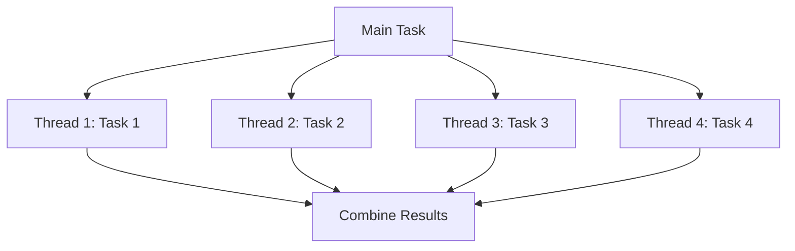

## 18.5 Optimizing Algorithms and Data Structures

In the realm of software development, the efficiency of your code can often be the difference between success and failure. This is particularly true in Julia, a language designed for high-performance numerical and scientific computing. In this section, we will delve into the art of optimizing algorithms and data structures, a crucial skill for any developer aiming to harness the full power of Julia.

### Algorithmic Complexity

Understanding algorithmic complexity is fundamental to optimizing performance. It involves evaluating both time and space complexity, which are measures of the resources required by an algorithm as a function of the input size.

#### Time Complexity

Time complexity refers to the amount of time an algorithm takes to complete as a function of the length of the input. Common time complexities include:

- **O(1)**: Constant time, where the operation's duration is independent of the input size.
- **O(n)**: Linear time, where the operation's duration grows linearly with the input size.
- **O(n^2)**: Quadratic time, where the operation's duration grows quadratically with the input size.

**Example: Evaluating Time Complexity**

```julia
function find_max(arr)
    max_val = arr[1]
    for val in arr
        if val > max_val
            max_val = val
        end
    end
    return max_val
end

```

#### Space Complexity

Space complexity measures the amount of memory an algorithm uses relative to the input size. It is crucial to consider both the memory used by the algorithm itself and any additional data structures it employs.

**Example: Evaluating Space Complexity**

```julia
function create_matrix(n)
    matrix = Array{Int, 2}(undef, n, n)
    for i in 1:n, j in 1:n
        matrix[i, j] = i * j
    end
    return matrix
end

```

### Choosing the Right Data Structures

Selecting the appropriate data structure is vital for optimizing performance. The choice depends on the operations you need to perform, such as insertion, deletion, or access.

#### Arrays vs. Dictionaries

- **Arrays**: Ideal for scenarios where you need fast access and iteration over elements. They provide O(1) access time but O(n) insertion and deletion time.
- **Dictionaries**: Suitable for situations requiring fast lookups, insertions, and deletions. They offer average O(1) time complexity for these operations.

**Example: Using Arrays and Dictionaries**

```julia
arr = [1, 2, 3, 4, 5]
push!(arr, 6)  # O(1) amortized time

dict = Dict("a" => 1, "b" => 2)
dict["c"] = 3  # O(1) average time
```

### Custom Data Structures

Sometimes, standard data structures do not meet specific requirements, necessitating custom implementations. Julia's type system and multiple dispatch make it easy to define custom data structures.

#### Implementing a Custom Stack

A stack is a data structure that follows the Last In, First Out (LIFO) principle. Let's implement a simple stack in Julia.

```julia
struct Stack{T}
    elements::Vector{T}
end

function Stack{T}() where T
    return Stack{T}(Vector{T}())
end

function push!(stack::Stack, item)
    push!(stack.elements, item)
end

function pop!(stack::Stack)
    return pop!(stack.elements)
end

function isempty(stack::Stack)
    return isempty(stack.elements)
end

s = Stack{Int}()
push!(s, 1)
push!(s, 2)
println(pop!(s))  # Outputs: 2
```

### Parallel Algorithms

Parallel algorithms leverage concurrency to improve performance, especially for computationally intensive tasks. Julia's built-in support for parallelism makes it an excellent choice for implementing parallel algorithms.

#### Employing Concurrency with `Threads.@threads`

Julia provides the `Threads.@threads` macro to parallelize loops, distributing iterations across available CPU threads.

**Example: Parallelizing a Loop**

```julia
using Base.Threads

function parallel_sum(arr)
    sum = 0
    @threads for i in 1:length(arr)
        sum += arr[i]
    end
    return sum
end

```

#### Visualizing Parallel Execution

To better understand parallel execution, consider the following diagram illustrating how tasks are distributed across threads:



### Try It Yourself

Experiment with the code examples provided above. Try modifying the `find_max` function to handle different data types or implement a custom queue data structure. Explore parallelism by parallelizing other operations and observe the performance improvements.

### Knowledge Check

- Explain the difference between time and space complexity.
- Describe a scenario where you would choose a dictionary over an array.
- Implement a custom data structure for a queue.
- Parallelize a matrix multiplication operation using `Threads.@threads`.

### Summary

Optimizing algorithms and data structures is a critical aspect of software development in Julia. By understanding algorithmic complexity, choosing the right data structures, implementing custom solutions, and leveraging parallel algorithms, you can significantly enhance the performance of your applications. Remember, this is just the beginning. As you progress, you'll build more complex and efficient systems. Keep experimenting, stay curious, and enjoy the journey!

## Quiz Time!



### What is the time complexity of accessing an element in an array?

- [x] O(1)
- [ ] O(n)
- [ ] O(n^2)
- [ ] O(log n)

> **Explanation:** Accessing an element in an array is a constant time operation, O(1), because it involves a direct index lookup.

### Which data structure is best for fast lookups and insertions?

- [ ] Array
- [x] Dictionary
- [ ] Stack
- [ ] Queue

> **Explanation:** Dictionaries provide average O(1) time complexity for lookups and insertions, making them ideal for these operations.

### What is the space complexity of creating an n x n matrix?

- [ ] O(1)
- [ ] O(n)
- [x] O(n^2)
- [ ] O(log n)

> **Explanation:** Creating an n x n matrix requires storing n^2 elements, resulting in a space complexity of O(n^2).

### What principle does a stack data structure follow?

- [ ] First In, First Out (FIFO)
- [x] Last In, First Out (LIFO)
- [ ] Random Access
- [ ] Priority Order

> **Explanation:** A stack follows the Last In, First Out (LIFO) principle, where the last element added is the first to be removed.

### Which Julia macro is used to parallelize loops?

- [ ] @parallel
- [x] Threads.@threads
- [ ] @async
- [ ] @distributed

> **Explanation:** The `Threads.@threads` macro is used in Julia to parallelize loops across available CPU threads.

### What is the main advantage of using parallel algorithms?

- [x] Improved performance for computationally intensive tasks
- [ ] Reduced code complexity
- [ ] Easier debugging
- [ ] Lower memory usage

> **Explanation:** Parallel algorithms improve performance by distributing tasks across multiple processors, making them ideal for computationally intensive tasks.

### What is the primary consideration when choosing a data structure?

- [ ] Aesthetics
- [x] Access speed, memory usage, and functionality
- [ ] Code length
- [ ] Language syntax

> **Explanation:** The choice of data structure should be based on access speed, memory usage, and the required functionality.

### What is the purpose of custom data structures?

- [x] To meet specific requirements not addressed by standard data structures
- [ ] To make code more complex
- [ ] To reduce performance
- [ ] To increase memory usage

> **Explanation:** Custom data structures are implemented to meet specific requirements that standard data structures may not address.

### What does the `Threads.@threads` macro do in Julia?

- [x] Distributes loop iterations across available CPU threads
- [ ] Executes code asynchronously
- [ ] Serializes data
- [ ] Compiles code

> **Explanation:** The `Threads.@threads` macro distributes loop iterations across available CPU threads, enabling parallel execution.

### True or False: A dictionary in Julia provides O(n) time complexity for lookups.

- [ ] True
- [x] False

> **Explanation:** A dictionary in Julia provides average O(1) time complexity for lookups, not O(n).




