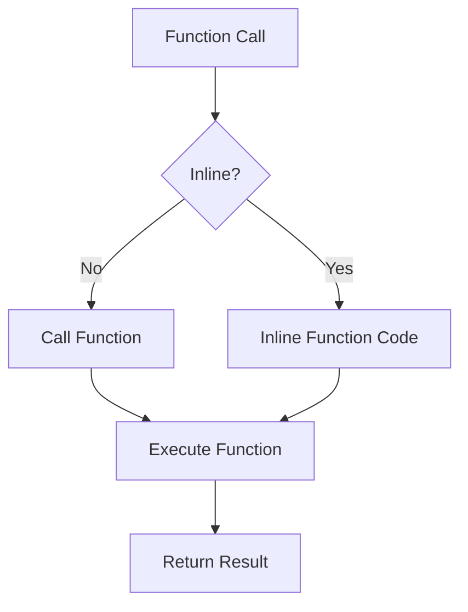

## 18.6 Utilizing Inlining and Function Barriers

In the world of high-performance computing, every millisecond counts. Julia, known for its speed and efficiency, offers powerful tools to optimize performance through inlining and function barriers. These techniques allow developers to fine-tune their code, ensuring it runs as efficiently as possible. In this section, we will delve into the concepts of function inlining and function barriers, exploring how they can be used to enhance the performance of Julia applications.

### Function Inlining

**Function inlining** is a compiler optimization technique where the function call is replaced with the actual code of the function. This can reduce the overhead of function calls, especially for small, frequently called functions. In Julia, inlining can be controlled using the `@inline` and `@noinline` macros.

#### Benefits of Inlining

- **Reduced Function Call Overhead**: By replacing function calls with the function's body, the overhead associated with calling a function is eliminated.
- **Improved Performance**: Inlining can lead to better performance, especially in tight loops where function calls are frequent.
- **Enhanced Compiler Optimization**: Inlining allows the compiler to perform further optimizations, such as constant folding and dead code elimination.

#### Using `@inline` and `@noinline`

Julia provides the `@inline` and `@noinline` macros to give developers control over inlining behavior. Let's explore how to use these macros effectively.

##### `@inline` Macro

The `@inline` macro suggests to the compiler that a function should be inlined. It is important to note that this is a suggestion, and the compiler may choose not to inline the function if it deems it inappropriate.

```julia
@inline function add(a, b)
    return a + b
end

result = add(3, 5)  # The call to add may be inlined
```

In this example, the `add` function is marked with `@inline`, suggesting to the compiler that it should inline the function when possible.

##### `@noinline` Macro

Conversely, the `@noinline` macro instructs the compiler not to inline a function. This can be useful when inlining would lead to code bloat or when debugging.

```julia
@noinline function multiply(a, b)
    return a * b
end

result = multiply(4, 6)  # The call to multiply will not be inlined
```

Here, the `multiply` function is marked with `@noinline`, ensuring that the function call is not inlined.

#### When to Use Inlining

- **Small Functions**: Inlining is most beneficial for small functions that are called frequently.
- **Performance-Critical Code**: Use inlining in performance-critical sections of your code where every millisecond counts.
- **Avoiding Inlining**: Avoid inlining large functions, as this can lead to code bloat and increased compile times.

### Function Barriers

**Function barriers** are a technique used to isolate type-unstable code, minimizing its impact on performance. In Julia, type stability is crucial for achieving optimal performance. A function barrier can help ensure that type-unstable code does not propagate type instability to other parts of the program.

#### Understanding Type Stability

A function is type-stable if the return type can be inferred from the input types. Type stability allows the compiler to generate more efficient machine code. Conversely, type instability can lead to performance degradation.

#### Implementing Function Barriers

To implement a function barrier, you can isolate type-unstable code within a separate function. This confines the type instability, allowing the rest of the code to remain type-stable.

```julia
function process_data(data)
    # Type-unstable operation
    result = type_unstable_operation(data)
    
    # Function barrier
    return stable_operation(result)
end

function type_unstable_operation(data)
    # Perform operations that may result in type instability
    return data[rand(1:end)]
end

function stable_operation(data)
    # Perform type-stable operations
    return sum(data)
end
```

In this example, `type_unstable_operation` is isolated within its own function, acting as a barrier. The `stable_operation` function operates on the result, ensuring that the rest of the code remains type-stable.

#### Benefits of Function Barriers

- **Isolate Type Instability**: By isolating type-unstable code, function barriers prevent type instability from affecting other parts of the program.
- **Maintain Performance**: Function barriers help maintain performance by ensuring that type-stable code remains efficient.
- **Simplify Debugging**: Isolating type-unstable code can simplify debugging by narrowing down the source of performance issues.

### Code Examples and Experimentation

Let's explore some code examples to solidify our understanding of inlining and function barriers.

#### Example 1: Inlining for Performance

```julia
@inline function fast_addition(a, b)
    return a + b
end

function compute_sum(arr)
    total = 0
    for num in arr
        total += fast_addition(num, 1)
    end
    return total
end

arr = [1, 2, 3, 4, 5]
println(compute_sum(arr))  # Output: 20
```

In this example, the `fast_addition` function is inlined, reducing the overhead of function calls within the loop.

#### Example 2: Function Barriers for Type Stability

```julia
function calculate_average(data)
    # Function barrier for type-unstable operation
    processed_data = process_data(data)
    
    # Type-stable operation
    return mean(processed_data)
end

function process_data(data)
    # Type-unstable operation
    return [rand() > 0.5 ? x : 0 for x in data]
end

data = [1, 2, 3, 4, 5]
println(calculate_average(data))  # Output: Varies due to randomness
```

Here, `process_data` acts as a function barrier, isolating the type-unstable operation from the type-stable `calculate_average` function.

### Visualizing Inlining and Function Barriers

To better understand the flow of inlining and function barriers, let's visualize the process using a Mermaid.js diagram.



**Diagram Description**: This diagram illustrates the decision process for inlining a function. If the function is inlined, the function code is directly inserted into the caller. Otherwise, a standard function call is made.

### References and Further Reading

- [Julia Documentation on Inlining](https://docs.julialang.org/en/v1/manual/performance-tips/#man-performance-inlining)
- [Understanding Type Stability in Julia](https://docs.julialang.org/en/v1/manual/performance-tips/#man-performance-type-stability)
- [Performance Optimization in Julia](https://julialang.org/blog/2019/07/multithreading/)

### Knowledge Check

To reinforce your understanding of inlining and function barriers, consider the following questions:

1. What is the primary benefit of function inlining?
2. How does the `@inline` macro influence the compiler's behavior?
3. When should you avoid inlining a function?
4. What is a function barrier, and why is it useful?
5. How can function barriers help maintain type stability?

### Try It Yourself

Experiment with the code examples provided in this section. Try modifying the functions to see how inlining and function barriers affect performance. Consider creating your own functions and applying these techniques to optimize them.

### Embrace the Journey

Remember, mastering performance optimization in Julia is a journey. As you continue to explore and experiment, you'll gain a deeper understanding of how to write efficient, high-performance code. Keep pushing the boundaries, stay curious, and enjoy the process!

## Quiz Time!



### What is the primary benefit of function inlining?

- [x] Reduces function call overhead
- [ ] Increases code readability
- [ ] Simplifies debugging
- [ ] Enhances code modularity

> **Explanation:** Function inlining reduces the overhead associated with function calls by replacing them with the actual function code.

### How does the `@inline` macro affect the compiler?

- [x] Suggests that a function should be inlined
- [ ] Forces the compiler to inline the function
- [ ] Prevents the function from being inlined
- [ ] Has no effect on the compiler

> **Explanation:** The `@inline` macro suggests to the compiler that a function should be inlined, but it does not force the compiler to do so.

### When should you avoid inlining a function?

- [x] When the function is large
- [ ] When the function is small
- [ ] When the function is frequently called
- [ ] When the function is performance-critical

> **Explanation:** Inlining large functions can lead to code bloat and increased compile times, so it is generally avoided.

### What is a function barrier?

- [x] A technique to isolate type-unstable code
- [ ] A method to inline functions
- [ ] A way to prevent code execution
- [ ] A tool for debugging

> **Explanation:** A function barrier is used to isolate type-unstable code, preventing it from affecting other parts of the program.

### How can function barriers help maintain type stability?

- [x] By isolating type-unstable operations
- [ ] By inlining functions
- [ ] By increasing code readability
- [ ] By simplifying debugging

> **Explanation:** Function barriers isolate type-unstable operations, ensuring that type stability is maintained in other parts of the code.

### What does the `@noinline` macro do?

- [x] Instructs the compiler not to inline a function
- [ ] Suggests that a function should be inlined
- [ ] Forces the compiler to inline the function
- [ ] Has no effect on the compiler

> **Explanation:** The `@noinline` macro instructs the compiler not to inline a function, ensuring that it remains a standard function call.

### Why is type stability important in Julia?

- [x] It allows the compiler to generate efficient machine code
- [ ] It increases code readability
- [ ] It simplifies debugging
- [ ] It enhances code modularity

> **Explanation:** Type stability is crucial for performance in Julia, as it allows the compiler to generate more efficient machine code.

### What is the effect of inlining on compiler optimization?

- [x] It allows for further optimizations like constant folding
- [ ] It prevents any further optimizations
- [ ] It simplifies the optimization process
- [ ] It has no effect on optimization

> **Explanation:** Inlining allows the compiler to perform further optimizations, such as constant folding and dead code elimination.

### How can you test the impact of inlining on performance?

- [x] By benchmarking the code with and without inlining
- [ ] By reading the code documentation
- [ ] By using a debugger
- [ ] By analyzing code readability

> **Explanation:** Benchmarking the code with and without inlining can help assess the impact of inlining on performance.

### True or False: Function barriers can simplify debugging by narrowing down performance issues.

- [x] True
- [ ] False

> **Explanation:** Function barriers can simplify debugging by isolating type-unstable code, making it easier to identify performance issues.




