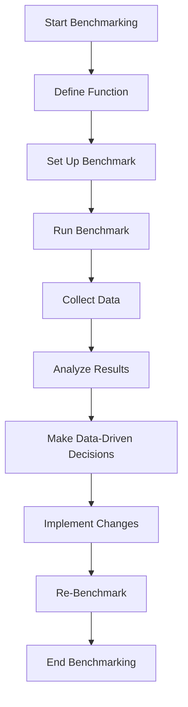

## 18.7 Benchmarking Techniques with BenchmarkTools.jl

In the realm of software development, performance optimization is a critical aspect that can significantly enhance the efficiency and responsiveness of applications. Julia, known for its high-performance capabilities, provides a powerful tool called BenchmarkTools.jl to facilitate precise performance measurement. In this section, we will delve into the intricacies of benchmarking in Julia, focusing on accurate performance measurement, setting up benchmarks, interpreting results, and comparing implementations.

### Accurate Performance Measurement

Accurate performance measurement is the cornerstone of effective optimization. Without precise data, any attempts to improve performance may be misguided or ineffective. Let's explore how to avoid common pitfalls in timing code and ensure accurate measurements.

#### Avoiding Common Pitfalls in Timing Code

Timing code execution in programming languages can be fraught with pitfalls. Here are some common issues and how to avoid them:

1. **Warm-Up Effects**: The first execution of a function may include compilation time, leading to skewed results. Always run the function multiple times before measuring.

2. **System Load Variability**: Background processes can affect timing. Ensure a consistent environment by minimizing other activities on your machine during benchmarking.

3. **Resolution of Timing Functions**: Built-in timing functions may not have sufficient resolution for short-running code. Use high-resolution timers like those provided by BenchmarkTools.jl.

4. **Garbage Collection**: Garbage collection can introduce variability. Consider disabling it temporarily during benchmarking, but be aware of the implications.

5. **Code Optimization**: Ensure that the code being benchmarked is representative of real-world usage and not overly optimized for the benchmark itself.

### Setting Up Benchmarks

BenchmarkTools.jl provides a robust framework for setting up benchmarks in Julia. It offers macros like `@btime` and `@benchmark` to facilitate this process.

#### Using `@btime` and `@benchmark`

- **`@btime`**: This macro is used for quick benchmarking. It provides a concise summary of execution time and memory allocation.

  ```julia
  using BenchmarkTools

  function sum_array(arr)
      return sum(arr)
  end

  arr = rand(1000)
  @btime sum_array($arr)
  ```

  In this example, `@btime` measures the execution time of `sum_array` with the input array `arr`. The `$` symbol is used to interpolate the variable, ensuring that the benchmark measures the function execution rather than the variable creation.

- **`@benchmark`**: This macro provides detailed statistical data, including minimum, median, and maximum execution times, as well as memory usage.

  ```julia
  using BenchmarkTools

  result = @benchmark sum_array($arr)
  display(result)
  ```

  The `@benchmark` macro returns a `BenchmarkTools.Trial` object containing comprehensive performance data.

### Interpreting Results

Understanding the results of benchmarks is crucial for making informed decisions. Let's explore how to interpret the statistical data provided by BenchmarkTools.jl.

#### Understanding Variability, Outliers, and Statistical Data

BenchmarkTools.jl provides a wealth of statistical information to help you understand the performance characteristics of your code:

- **Minimum Time**: The fastest observed execution time. It represents the best-case scenario.

- **Median Time**: The middle value of the execution times. It provides a robust measure of central tendency, less affected by outliers.

- **Maximum Time**: The slowest observed execution time. It indicates the worst-case scenario.

- **Memory Allocation**: The amount of memory allocated during execution. Minimizing allocations can lead to performance improvements.

- **Outliers**: Extreme values that can skew results. Consider excluding them when analyzing performance.

By examining these metrics, you can gain insights into the performance profile of your code and identify areas for improvement.

### Comparing Implementations

Benchmarking is not just about measuring performance; it's also about comparing different implementations to make data-driven decisions. Let's explore how to effectively compare implementations.

#### Making Data-Driven Decisions on Code Changes

When optimizing code, it's essential to compare different implementations to determine which one offers the best performance. Here are some strategies:

1. **Baseline Comparison**: Establish a baseline by benchmarking the current implementation. Use this as a reference point for evaluating changes.

2. **Iterative Testing**: Make incremental changes and benchmark each iteration. This approach helps isolate the impact of specific modifications.

3. **Statistical Significance**: Ensure that observed differences are statistically significant. Use the statistical data provided by BenchmarkTools.jl to validate your conclusions.

4. **Trade-Off Analysis**: Consider trade-offs between execution time, memory usage, and code complexity. Sometimes, a slightly slower implementation may be preferable if it offers significant memory savings or improved readability.

5. **Real-World Testing**: Complement benchmarks with real-world testing to ensure that optimizations translate to tangible improvements in actual usage scenarios.

### Try It Yourself

To solidify your understanding of benchmarking with BenchmarkTools.jl, try modifying the code examples provided. Experiment with different functions, input sizes, and optimization techniques. Observe how these changes affect the benchmark results and draw conclusions about their impact on performance.

### Visualizing Benchmark Results

Visualizing benchmark results can provide additional insights into performance characteristics. Let's create a simple diagram to illustrate the benchmarking process.



**Diagram Description**: This flowchart represents the benchmarking process using BenchmarkTools.jl. It starts with defining the function to be benchmarked, setting up the benchmark, running it, collecting data, analyzing results, making data-driven decisions, implementing changes, and re-benchmarking to validate improvements.

### References and Links

For further reading on benchmarking and performance optimization in Julia, consider the following resources:

- [BenchmarkTools.jl Documentation](https://github.com/JuliaCI/BenchmarkTools.jl)
- [JuliaLang Performance Tips](https://docs.julialang.org/en/v1/manual/performance-tips/)
- [High-Performance Julia](https://julialang.org/blog/2017/01/microbenchmarks/)

### Knowledge Check

To reinforce your understanding of benchmarking techniques with BenchmarkTools.jl, consider the following questions and exercises:

1. What are the common pitfalls in timing code, and how can they be avoided?
2. How does the `@btime` macro differ from the `@benchmark` macro?
3. What statistical data does BenchmarkTools.jl provide, and how can it be used to interpret results?
4. Why is it important to compare different implementations when optimizing code?
5. How can visualizing benchmark results aid in understanding performance characteristics?

### Embrace the Journey

Remember, mastering benchmarking techniques is a journey. As you progress, you'll gain deeper insights into performance optimization and develop a keen eye for identifying bottlenecks. Keep experimenting, stay curious, and enjoy the process of making your Julia applications faster and more efficient!

## Quiz Time!



### What is the purpose of using the `$` symbol in `@btime` and `@benchmark` macros?

- [x] To interpolate variables and ensure accurate measurement
- [ ] To denote a global variable
- [ ] To indicate a private variable
- [ ] To mark a deprecated function

> **Explanation:** The `$` symbol is used to interpolate variables, ensuring that the benchmark measures the function execution rather than the variable creation.

### Which macro provides detailed statistical data, including minimum, median, and maximum execution times?

- [ ] `@btime`
- [x] `@benchmark`
- [ ] `@time`
- [ ] `@profile`

> **Explanation:** The `@benchmark` macro provides detailed statistical data, including minimum, median, and maximum execution times, as well as memory usage.

### What is a common pitfall in timing code that can lead to skewed results?

- [x] Warm-up effects
- [ ] Using high-resolution timers
- [ ] Disabling garbage collection
- [ ] Running benchmarks multiple times

> **Explanation:** Warm-up effects can lead to skewed results because the first execution of a function may include compilation time.

### Why is it important to establish a baseline when comparing implementations?

- [x] To have a reference point for evaluating changes
- [ ] To ensure code readability
- [ ] To minimize memory usage
- [ ] To reduce execution time

> **Explanation:** Establishing a baseline provides a reference point for evaluating changes and determining the impact of optimizations.

### What should be considered when analyzing benchmark results?

- [x] Statistical significance
- [ ] Code readability
- [ ] Variable naming conventions
- [ ] Function documentation

> **Explanation:** Statistical significance should be considered to ensure that observed differences in benchmark results are meaningful.

### How can visualizing benchmark results aid in understanding performance characteristics?

- [x] By providing additional insights into performance characteristics
- [ ] By reducing execution time
- [ ] By minimizing memory usage
- [ ] By improving code readability

> **Explanation:** Visualizing benchmark results can provide additional insights into performance characteristics, helping to identify bottlenecks and areas for improvement.

### What is the role of memory allocation data in benchmarking?

- [x] To identify potential areas for performance improvement
- [ ] To ensure code readability
- [ ] To reduce execution time
- [ ] To establish a baseline

> **Explanation:** Memory allocation data helps identify potential areas for performance improvement by highlighting excessive allocations.

### Why is it important to complement benchmarks with real-world testing?

- [x] To ensure optimizations translate to tangible improvements
- [ ] To reduce execution time
- [ ] To minimize memory usage
- [ ] To improve code readability

> **Explanation:** Complementing benchmarks with real-world testing ensures that optimizations translate to tangible improvements in actual usage scenarios.

### What is a trade-off analysis in the context of benchmarking?

- [x] Considering trade-offs between execution time, memory usage, and code complexity
- [ ] Reducing execution time
- [ ] Minimizing memory usage
- [ ] Improving code readability

> **Explanation:** Trade-off analysis involves considering trade-offs between execution time, memory usage, and code complexity to make informed optimization decisions.

### True or False: Disabling garbage collection during benchmarking can introduce variability.

- [x] True
- [ ] False

> **Explanation:** Disabling garbage collection can introduce variability, as it may affect memory usage and execution time.



By mastering these benchmarking techniques, you'll be well-equipped to optimize your Julia applications and achieve peak performance. Keep exploring, experimenting, and refining your skills to become an expert in performance optimization!
