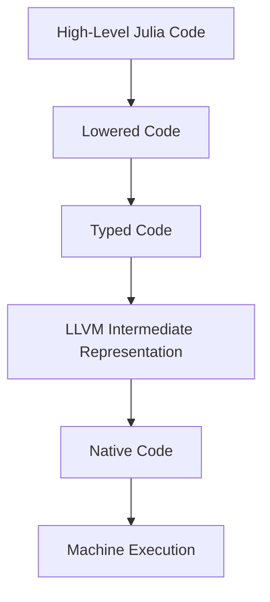

## 18.8 Leveraging Low-Level Code and `@code` Macros

In the world of high-performance computing, understanding how your code translates into machine-level instructions can be the key to unlocking significant performance improvements. Julia, with its powerful metaprogramming capabilities, provides developers with tools to inspect and analyze the transformation of high-level code into lower-level representations. This section will guide you through leveraging low-level code insights and `@code` macros to optimize your Julia applications.

### Inspecting Lowered Code

**Inspecting Lowered Code** is the first step in understanding how Julia translates your high-level code into a form that can be further optimized and executed. The `@code_lowered` macro is a powerful tool that allows you to see the intermediate representation of your code after it has been parsed and before it is compiled.

#### Using `@code_lowered`

The `@code_lowered` macro provides a glimpse into the lowered form of your Julia code. This representation is closer to the abstract syntax tree (AST) and is a crucial step in the compilation process. By examining the lowered code, you can gain insights into how Julia interprets your functions and prepares them for further optimization.

```julia
function add_numbers(a, b)
    return a + b
end

@code_lowered add_numbers(3, 5)
```

**Explanation:**

- **Lowered Code**: This is the stage where Julia converts your high-level code into a more uniform representation. It is still relatively close to the original code but is structured in a way that is easier for the compiler to optimize.
- **Understanding**: By examining the lowered code, you can identify potential inefficiencies or unexpected transformations that might affect performance.

### Analyzing Native Code

Once you understand the lowered code, the next step is to delve deeper into the machine-level instructions. The `@code_native` macro allows you to view the assembly output of your Julia functions, providing a detailed look at how your code is translated into instructions that the CPU can execute.

#### Viewing Assembly Output with `@code_native`

The `@code_native` macro is an invaluable tool for performance tuning, especially when you need to ensure that your code is as efficient as possible. By examining the native code, you can see how well the Julia compiler has optimized your function and identify any areas where further improvements might be possible.

```julia
function multiply_numbers(a, b)
    return a * b
end

@code_native multiply_numbers(3, 5)
```

**Explanation:**

- **Native Code**: This is the final stage of code transformation, where your high-level Julia code is converted into assembly language. This is what the CPU ultimately executes.
- **Optimization**: By analyzing the native code, you can determine if the compiler has effectively optimized your function and identify any unnecessary instructions or potential bottlenecks.

### Understanding Compiler Decisions

Understanding how high-level code translates to machine instructions is crucial for optimizing performance. The `@code_typed` and `@code_llvm` macros provide additional insights into the type inference and LLVM intermediate representation, respectively.

#### Type Inference with `@code_typed`

The `@code_typed` macro shows the type-inferred version of your code, which is essential for understanding how Julia's type system impacts performance.

```julia
function divide_numbers(a, b)
    return a / b
end

@code_typed divide_numbers(10, 2)
```

**Explanation:**

- **Type Inference**: Julia's ability to infer types is a significant factor in its performance. By examining the typed code, you can ensure that your functions are type-stable, which is crucial for efficient execution.

#### LLVM Intermediate Representation with `@code_llvm`

The `@code_llvm` macro provides a view of the LLVM intermediate representation, which is a lower-level representation used by the LLVM compiler infrastructure to optimize and generate machine code.

```julia
function subtract_numbers(a, b)
    return a - b
end

@code_llvm subtract_numbers(10, 5)
```

**Explanation:**

- **LLVM IR**: This intermediate representation is used by the LLVM compiler to perform optimizations before generating machine code. By examining the LLVM IR, you can gain insights into the optimizations applied by the compiler and identify potential areas for improvement.

### Visualizing the Compilation Process

To better understand the transformation of Julia code through various stages, let's visualize the process using a flowchart.



**Description:** This flowchart illustrates the stages of code transformation in Julia, from high-level code to machine execution. Each stage represents a critical step in the compilation process, where optimizations and transformations are applied to improve performance.

### Key Takeaways

- **Inspecting Lowered Code**: Use `@code_lowered` to understand how Julia interprets your functions and prepares them for optimization.
- **Analyzing Native Code**: Use `@code_native` to view the assembly output and ensure that your code is efficiently translated into machine instructions.
- **Understanding Compiler Decisions**: Use `@code_typed` and `@code_llvm` to gain insights into type inference and LLVM optimizations.

### Try It Yourself

Experiment with the provided code examples by modifying the functions and observing how the different `@code` macros reflect these changes. For instance, try adding more complex operations or using different data types to see how the lowered, typed, and native code representations change.

### References and Further Reading

- [Julia Documentation on Metaprogramming](https://docs.julialang.org/en/v1/manual/metaprogramming/)
- [LLVM Compiler Infrastructure](https://llvm.org/)
- [Understanding Assembly Language](https://en.wikipedia.org/wiki/Assembly_language)

### Embrace the Journey

Remember, this is just the beginning. As you progress, you'll gain a deeper understanding of how Julia optimizes your code and how you can leverage these insights to build high-performance applications. Keep experimenting, stay curious, and enjoy the journey!

## Quiz Time!



### What does the `@code_lowered` macro do in Julia?

- [x] It shows the intermediate representation of the code after parsing.
- [ ] It displays the native assembly code.
- [ ] It provides the LLVM intermediate representation.
- [ ] It shows the type-inferred version of the code.

> **Explanation:** The `@code_lowered` macro provides the lowered form of the code, which is an intermediate representation after parsing.

### Which macro would you use to view the assembly output of a Julia function?

- [ ] `@code_lowered`
- [x] `@code_native`
- [ ] `@code_llvm`
- [ ] `@code_typed`

> **Explanation:** The `@code_native` macro is used to view the assembly output of a Julia function.

### What is the purpose of the `@code_typed` macro?

- [ ] To display the native assembly code.
- [x] To show the type-inferred version of the code.
- [ ] To provide the LLVM intermediate representation.
- [ ] To show the intermediate representation after parsing.

> **Explanation:** The `@code_typed` macro shows the type-inferred version of the code, which is crucial for understanding type stability.

### How can you view the LLVM intermediate representation of a Julia function?

- [ ] Using `@code_lowered`
- [ ] Using `@code_native`
- [x] Using `@code_llvm`
- [ ] Using `@code_typed`

> **Explanation:** The `@code_llvm` macro provides the LLVM intermediate representation of a Julia function.

### What is the final stage of code transformation in Julia?

- [ ] Lowered Code
- [ ] Typed Code
- [ ] LLVM Intermediate Representation
- [x] Native Code

> **Explanation:** Native code is the final stage of code transformation, where the high-level Julia code is converted into assembly language.

### Which macro helps in understanding Julia's type inference?

- [ ] `@code_lowered`
- [ ] `@code_native`
- [ ] `@code_llvm`
- [x] `@code_typed`

> **Explanation:** The `@code_typed` macro helps in understanding Julia's type inference by showing the type-inferred version of the code.

### What does the LLVM intermediate representation help with?

- [x] Optimizing and generating machine code.
- [ ] Displaying the native assembly code.
- [ ] Showing the type-inferred version of the code.
- [ ] Providing the intermediate representation after parsing.

> **Explanation:** The LLVM intermediate representation is used by the LLVM compiler to perform optimizations before generating machine code.

### Which of the following is NOT a stage in Julia's code transformation process?

- [ ] Lowered Code
- [ ] Typed Code
- [ ] LLVM Intermediate Representation
- [x] Bytecode

> **Explanation:** Bytecode is not a stage in Julia's code transformation process. Julia uses lowered code, typed code, LLVM IR, and native code stages.

### What is the primary benefit of inspecting lowered code?

- [ ] To view the assembly output.
- [x] To understand how Julia interprets and prepares functions for optimization.
- [ ] To see the LLVM intermediate representation.
- [ ] To display the type-inferred version of the code.

> **Explanation:** Inspecting lowered code helps understand how Julia interprets and prepares functions for optimization.

### True or False: The `@code_native` macro can be used to inspect the LLVM intermediate representation.

- [ ] True
- [x] False

> **Explanation:** False. The `@code_native` macro is used to view the assembly output, not the LLVM intermediate representation.


