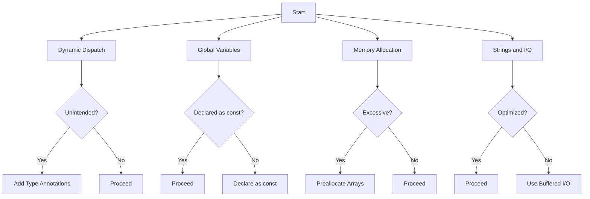

## 18.9 Avoiding Common Performance Pitfalls

In the world of programming, performance is often a critical factor that can make or break an application. Julia, known for its high performance and ease of use, is no exception. However, even in Julia, certain practices can lead to performance bottlenecks. In this section, we will explore some common performance pitfalls in Julia programming and provide strategies to avoid them. By understanding these pitfalls, you can write more efficient and effective Julia code.

### Dynamic Dispatch

Dynamic dispatch is a powerful feature in Julia that allows functions to be called based on the runtime types of their arguments. However, when used unintentionally, it can lead to performance issues. Let's explore how to recognize and correct unintended dynamic dispatch.

#### Recognizing Unintended Dynamic Dispatch

Dynamic dispatch occurs when the types of function arguments are not known at compile time, causing the Julia compiler to defer the method selection until runtime. This can introduce overhead and slow down your code. Consider the following example:

```julia
function add_numbers(a, b)
    return a + b
end

x = 5
y = 10.0
result = add_numbers(x, y)  # Dynamic dispatch occurs here
```

In this example, `add_numbers` is called with an `Int` and a `Float64`, leading to dynamic dispatch. To avoid this, you can use type annotations:

```julia
function add_numbers(a::Int, b::Float64)
    return a + b
end

result = add_numbers(x, y)  # No dynamic dispatch
```

#### Correcting Unintended Dynamic Dispatch

To correct unintended dynamic dispatch, ensure that function arguments have specific types. Use type annotations to guide the compiler in selecting the appropriate method at compile time. This can significantly improve performance.

### Globals Without `const`

Global variables in Julia can be a source of performance issues, especially when they are not declared as `const`. Let's understand why non-constant globals are slow and how to address this issue.

#### Understanding the Slowness of Non-Constant Globals

When a global variable is not declared as `const`, the Julia compiler cannot make assumptions about its type or value. This uncertainty forces the compiler to perform dynamic dispatch, leading to slower execution. Consider the following example:

```julia
global_variable = 42

function use_global()
    return global_variable + 1
end

result = use_global()  # Slower due to non-constant global
```

#### Declaring Globals as `const`

To improve performance, declare global variables as `const` whenever possible. This allows the compiler to optimize the code by assuming the variable's type and value remain constant:

```julia
const global_variable = 42

function use_global()
    return global_variable + 1
end

result = use_global()  # Faster with constant global
```

### Excessive Memory Allocation

Excessive memory allocation can lead to performance degradation in Julia applications. Identifying patterns that lead to unnecessary allocations is crucial for optimizing your code.

#### Identifying Unnecessary Allocations

Memory allocations can occur when creating new objects, resizing arrays, or performing certain operations. Use the `@time` macro to measure allocations and identify potential bottlenecks:

```julia
function allocate_example()
    arr = []
    for i in 1:1000
        push!(arr, i)
    end
    return arr
end

@time allocate_example()
```

#### Reducing Memory Allocations

To reduce memory allocations, preallocate arrays and use in-place operations. For example, use `push!` with preallocated arrays:

```julia
function preallocate_example()
    arr = Vector{Int}(undef, 1000)
    for i in 1:1000
        arr[i] = i
    end
    return arr
end

@time preallocate_example()
```

### Poor Use of Strings and I/O

String manipulations and input/output operations can be performance-intensive if not handled properly. Let's explore how to optimize these operations.

#### Optimizing String Manipulations

String operations can be costly due to memory allocations and copying. Use `StringBuilder` for efficient string concatenation:

```julia
function concatenate_strings()
    sb = IOBuffer()
    for i in 1:1000
        print(sb, "String $i ")
    end
    return String(take!(sb))
end

@time concatenate_strings()
```

#### Improving I/O Performance

For input/output operations, use buffered I/O and avoid frequent small reads or writes. Use `open` with `do` blocks for efficient file handling:

```julia
function read_file(filename)
    open(filename, "r") do file
        for line in eachline(file)
            println(line)
        end
    end
end

@time read_file("example.txt")
```

### Visualizing Performance Pitfalls

To better understand the impact of these performance pitfalls, let's visualize the flow of dynamic dispatch and memory allocation using a flowchart.



### Try It Yourself

Experiment with the code examples provided in this section. Try modifying the types of function arguments, declaring globals as `const`, and optimizing string and I/O operations. Observe the impact on performance using the `@time` macro.

### References and Further Reading

- [Julia Performance Tips](https://docs.julialang.org/en/v1/manual/performance-tips/)
- [Dynamic Dispatch in Julia](https://docs.julialang.org/en/v1/manual/methods/#Method-dispatch)
- [Memory Management in Julia](https://docs.julialang.org/en/v1/manual/faq/#man-FAQ-memory)

### Knowledge Check

- What is dynamic dispatch, and how can it affect performance?
- Why should global variables be declared as `const`?
- How can you reduce memory allocations in Julia?
- What are some strategies for optimizing string manipulations?

### Embrace the Journey

Remember, optimizing performance is an ongoing process. As you continue to develop your skills in Julia, keep exploring new techniques and strategies to write efficient code. Stay curious, experiment with different approaches, and enjoy the journey of mastering Julia programming!

## Quiz Time!



### What is dynamic dispatch in Julia?

- [x] A method of selecting function implementations at runtime based on argument types.
- [ ] A technique for optimizing memory usage.
- [ ] A way to declare global variables.
- [ ] A method for handling string operations.

> **Explanation:** Dynamic dispatch refers to the selection of function implementations at runtime based on the types of arguments passed to the function.

### Why should global variables be declared as `const` in Julia?

- [x] To allow the compiler to optimize code by assuming the variable's type and value remain constant.
- [ ] To prevent the variable from being used in functions.
- [ ] To make the variable accessible only within a specific module.
- [ ] To enable dynamic dispatch.

> **Explanation:** Declaring global variables as `const` allows the compiler to optimize the code by assuming the variable's type and value remain constant, improving performance.

### How can you reduce memory allocations in Julia?

- [x] By preallocating arrays and using in-place operations.
- [ ] By using dynamic dispatch.
- [ ] By declaring all variables as global.
- [ ] By avoiding the use of functions.

> **Explanation:** Preallocating arrays and using in-place operations can help reduce memory allocations, leading to better performance.

### What is a common performance pitfall when working with strings in Julia?

- [x] Excessive memory allocation due to frequent string concatenation.
- [ ] Declaring strings as `const`.
- [ ] Using dynamic dispatch with strings.
- [ ] Avoiding the use of string functions.

> **Explanation:** Frequent string concatenation can lead to excessive memory allocation, which is a common performance pitfall.

### Which of the following is a strategy for optimizing I/O operations in Julia?

- [x] Using buffered I/O and avoiding frequent small reads or writes.
- [ ] Declaring I/O variables as `const`.
- [ ] Using dynamic dispatch for I/O functions.
- [ ] Avoiding the use of files.

> **Explanation:** Using buffered I/O and avoiding frequent small reads or writes can optimize I/O operations in Julia.

### What does the `@time` macro do in Julia?

- [x] Measures the execution time and memory allocations of a function or expression.
- [ ] Declares a variable as `const`.
- [ ] Enables dynamic dispatch.
- [ ] Optimizes string operations.

> **Explanation:** The `@time` macro measures the execution time and memory allocations of a function or expression, helping identify performance bottlenecks.

### What is the impact of unintended dynamic dispatch on performance?

- [x] It introduces overhead and slows down code execution.
- [ ] It improves memory allocation efficiency.
- [ ] It optimizes string operations.
- [ ] It enhances I/O performance.

> **Explanation:** Unintended dynamic dispatch introduces overhead and slows down code execution, negatively impacting performance.

### How can you correct unintended dynamic dispatch in Julia?

- [x] By using type annotations to specify function argument types.
- [ ] By declaring all variables as global.
- [ ] By avoiding the use of functions.
- [ ] By using dynamic dispatch intentionally.

> **Explanation:** Using type annotations to specify function argument types can help correct unintended dynamic dispatch, improving performance.

### What is the benefit of using `StringBuilder` for string concatenation?

- [x] It reduces memory allocations and improves performance.
- [ ] It enables dynamic dispatch for string operations.
- [ ] It declares strings as `const`.
- [ ] It avoids the use of string functions.

> **Explanation:** Using `StringBuilder` for string concatenation reduces memory allocations and improves performance by minimizing copying.

### True or False: Declaring global variables as `const` can improve performance in Julia.

- [x] True
- [ ] False

> **Explanation:** Declaring global variables as `const` allows the compiler to optimize code by assuming the variable's type and value remain constant, improving performance.


