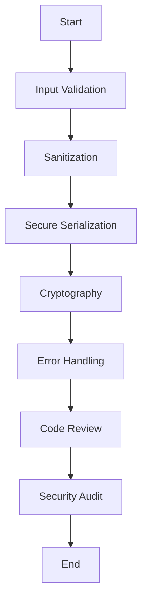

## 19.1 Secure Coding Practices in Julia

In today's digital landscape, security is paramount. As developers, we must ensure that the applications we build are robust against potential threats. This section delves into secure coding practices in Julia, focusing on fundamental security principles, common threats, and the importance of code reviews and audits. By mastering these practices, you can safeguard your applications and protect sensitive data.

### Fundamental Security Principles

Before diving into specific practices, it's crucial to understand the foundational principles of security: confidentiality, integrity, and availability, often abbreviated as CIA.

- **Confidentiality**: Ensure that sensitive information is accessible only to those authorized to view it. This involves implementing access controls and encryption to protect data from unauthorized access.

- **Integrity**: Maintain the accuracy and consistency of data over its lifecycle. Techniques such as checksums, hashes, and digital signatures can help detect unauthorized alterations.

- **Availability**: Guarantee that systems and data are accessible to authorized users when needed. This involves implementing redundancy, failover mechanisms, and regular backups to prevent downtime.

### Common Threats

Understanding common threats is the first step in defending against them. Here are some prevalent security threats that developers should be aware of:

- **Injection Attacks**: These occur when untrusted data is sent to an interpreter as part of a command or query. SQL injection is a well-known example. To prevent injection attacks, always validate and sanitize inputs.

- **Buffer Overflows**: This happens when a program writes more data to a buffer than it can hold, potentially leading to arbitrary code execution. While Julia's memory management reduces this risk, it's essential to be cautious with external libraries.

- **Insecure Deserialization**: Deserialization of untrusted data can lead to remote code execution. Always validate and sanitize data before deserialization and consider using secure serialization formats.

### Secure Coding Practices

Let's explore specific secure coding practices in Julia that address these threats and align with the CIA principles.

#### Input Validation and Sanitization

Input validation is the first line of defense against many security threats. Always validate inputs to ensure they meet expected formats and constraints. Use Julia's type system to enforce constraints and sanitize inputs to remove potentially harmful characters.

```julia
function sanitize_input(input::String)
    # Remove potentially harmful characters
    return replace(input, r"[^\w\s]" => "")
end

function validate_and_process(input::String)
    sanitized_input = sanitize_input(input)
    if length(sanitized_input) > 0
        println("Processing input: $sanitized_input")
    else
        println("Invalid input")
    end
end

validate_and_process("Hello, World!")  # Safe input
validate_and_process("DROP TABLE users;")  # Potentially harmful input
```

#### Secure Serialization and Deserialization

When working with data serialization, choose secure formats and libraries. Avoid deserializing data from untrusted sources without validation.

```julia
using JSON

function safe_deserialize(json_str::String)
    try
        data = JSON.parse(json_str)
        println("Deserialized data: $data")
    catch e
        println("Failed to deserialize: $e")
    end
end

safe_deserialize("{\"key\": \"value\"}")  # Safe JSON
safe_deserialize("malicious code")  # Unsafe input
```

#### Use of Cryptography

Cryptography is essential for ensuring confidentiality and integrity. Use well-established libraries and algorithms for encryption and hashing.

```julia
using Cryptography

function encrypt_data(data::String, key::String)
    encrypted = encrypt(data, key)
    println("Encrypted data: $encrypted")
    return encrypted
end

function decrypt_data(encrypted::String, key::String)
    decrypted = decrypt(encrypted, key)
    println("Decrypted data: $decrypted")
    return decrypted
end

key = "securekey123"
data = "Sensitive Information"
encrypted = encrypt_data(data, key)
decrypt_data(encrypted, key)
```

#### Error Handling and Logging

Proper error handling and logging are crucial for identifying and responding to security incidents. Avoid exposing sensitive information in error messages and logs.

```julia
function process_data(data::String)
    try
        # Simulate processing
        if data == "error"
            error("Simulated error")
        end
        println("Data processed successfully")
    catch e
        println("An error occurred: $(e.message)")
        # Log error details for further analysis
    end
end

process_data("valid data")
process_data("error")
```

### Code Reviews and Audits

Regular code reviews and audits are vital for maintaining secure code. They help identify vulnerabilities and ensure adherence to security best practices.

- **Code Reviews**: Encourage peer reviews to catch potential security issues early. Use tools like static analyzers to automate some aspects of the review process.

- **Security Audits**: Conduct regular security audits to assess the overall security posture of your application. This includes reviewing code, configurations, and dependencies.

### Visualizing Secure Coding Practices

To better understand the flow of secure coding practices, let's visualize the process using a flowchart.



**Figure 1**: Secure Coding Practices Flowchart

### Try It Yourself

Experiment with the code examples provided. Try modifying the input validation function to handle different types of inputs or extend the cryptography example to use different encryption algorithms. This hands-on practice will reinforce your understanding of secure coding practices in Julia.

### References and Links

For further reading on secure coding practices, consider exploring the following resources:

- [OWASP Secure Coding Practices](https://owasp.org/www-project-secure-coding-practices-quick-reference-guide/)
- [JuliaLang Security](https://julialang.org/security/)
- [Cryptography.jl Documentation](https://github.com/JuliaCrypto/Cryptography.jl)

### Knowledge Check

To reinforce your learning, consider the following questions:

- What are the three fundamental security principles?
- How can input validation prevent injection attacks?
- Why is it important to use established cryptographic libraries?
- What role do code reviews play in secure coding?

### Embrace the Journey

Remember, mastering secure coding practices is an ongoing journey. As you continue to develop applications in Julia, keep security at the forefront of your mind. Stay curious, keep learning, and enjoy the process of building secure and robust applications.

## Quiz Time!



### What are the three fundamental security principles?

- [x] Confidentiality, Integrity, Availability
- [ ] Authentication, Authorization, Accounting
- [ ] Encryption, Decryption, Hashing
- [ ] Input, Output, Processing

> **Explanation:** The three fundamental security principles are Confidentiality, Integrity, and Availability, often abbreviated as CIA.

### Which of the following is a common threat to application security?

- [x] Injection Attacks
- [ ] Secure Serialization
- [ ] Code Reviews
- [ ] Cryptography

> **Explanation:** Injection attacks are a common threat to application security, where untrusted data is sent to an interpreter as part of a command or query.

### How can input validation help prevent security threats?

- [x] By ensuring inputs meet expected formats and constraints
- [ ] By encrypting all data inputs
- [ ] By logging all user inputs
- [ ] By ignoring invalid inputs

> **Explanation:** Input validation helps prevent security threats by ensuring inputs meet expected formats and constraints, reducing the risk of injection attacks.

### Why is it important to use established cryptographic libraries?

- [x] They provide well-tested and secure algorithms
- [ ] They are easier to use than custom implementations
- [ ] They are free to use
- [ ] They require less code

> **Explanation:** Established cryptographic libraries provide well-tested and secure algorithms, reducing the risk of vulnerabilities in custom implementations.

### What is the purpose of code reviews in secure coding?

- [x] To identify vulnerabilities and ensure adherence to best practices
- [ ] To increase the speed of development
- [ ] To reduce the number of lines of code
- [ ] To automate code deployment

> **Explanation:** Code reviews help identify vulnerabilities and ensure adherence to security best practices, improving the overall security of the application.

### What should be avoided in error messages to maintain security?

- [x] Exposing sensitive information
- [ ] Logging error details
- [ ] Providing user-friendly messages
- [ ] Using technical jargon

> **Explanation:** To maintain security, error messages should avoid exposing sensitive information that could be exploited by attackers.

### How can secure serialization prevent security threats?

- [x] By validating and sanitizing data before deserialization
- [ ] By using custom serialization formats
- [ ] By encrypting all serialized data
- [ ] By logging serialization errors

> **Explanation:** Secure serialization prevents security threats by validating and sanitizing data before deserialization, reducing the risk of remote code execution.

### What is a key benefit of regular security audits?

- [x] Assessing the overall security posture of an application
- [ ] Increasing application performance
- [ ] Reducing development time
- [ ] Automating code deployment

> **Explanation:** Regular security audits help assess the overall security posture of an application, identifying areas for improvement.

### Which practice helps maintain data integrity?

- [x] Using checksums and hashes
- [ ] Encrypting all data
- [ ] Logging all data changes
- [ ] Using custom data formats

> **Explanation:** Using checksums and hashes helps maintain data integrity by detecting unauthorized alterations.

### True or False: Julia's memory management completely eliminates the risk of buffer overflows.

- [ ] True
- [x] False

> **Explanation:** While Julia's memory management reduces the risk of buffer overflows, developers must still be cautious, especially when using external libraries.


