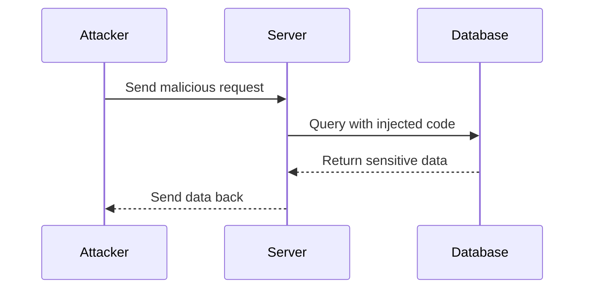

## 19.10 Case Studies: Learning from Security Breaches

In the ever-evolving landscape of software development, security remains a paramount concern. As developers, we must be vigilant and proactive in safeguarding our applications against potential threats. This section delves into real-world case studies of security breaches, analyzing how vulnerabilities were exploited and what lessons we can learn to fortify our Julia applications.

### Analyzing Past Breaches

Understanding past security breaches is crucial for preventing future incidents. By dissecting these events, we can identify common vulnerabilities and develop strategies to mitigate them.

#### Case Study 1: The Heartbleed Bug

The Heartbleed bug was a critical vulnerability in the OpenSSL cryptographic software library. It allowed attackers to read sensitive data from the memory of affected servers, potentially exposing private keys, passwords, and other confidential information.

**Key Takeaways:**

- **Vulnerability Exploitation:** The bug was a result of improper input validation in the heartbeat extension of OpenSSL. Attackers could send a malformed heartbeat request, causing the server to leak memory contents.
- **Lesson Learned:** Implement rigorous input validation and boundary checks to prevent buffer overflow vulnerabilities.

**Code Example: Input Validation in Julia**

```julia
function validate_input(input::String)
    if length(input) > 256
        error("Input exceeds maximum allowed length")
    end
    return input
end

try
    validate_input("A"^300)  # This will trigger an error
catch e
    println("Caught error: ", e)
end
```

#### Case Study 2: Equifax Data Breach

The Equifax data breach exposed the personal information of millions of individuals. The breach was attributed to a vulnerability in the Apache Struts framework, which was not patched in time.

**Key Takeaways:**

- **Vulnerability Exploitation:** Attackers exploited a known vulnerability in the framework to execute arbitrary code on Equifax's servers.
- **Lesson Learned:** Regularly update and patch software dependencies to protect against known vulnerabilities.

**Code Example: Dependency Management in Julia**

```julia
using Pkg

Pkg.update()

Pkg.status()
```

#### Case Study 3: Target Data Breach

The Target data breach involved the theft of credit card information from millions of customers. Attackers gained access through a third-party vendor's compromised credentials.

**Key Takeaways:**

- **Vulnerability Exploitation:** The breach was facilitated by weak authentication mechanisms and inadequate network segmentation.
- **Lesson Learned:** Implement strong authentication protocols and enforce network segmentation to limit access.

**Code Example: Strong Authentication in Julia**

```julia
using SHA

function hash_password(password::String)
    return sha256(password)
end

hashed_pw = hash_password("securepassword123")
println("Hashed password: ", hashed_pw)
```

### Applying Lessons Learned

To prevent similar security breaches, we must apply the lessons learned from these case studies. This involves implementing robust security measures and continuously monitoring for potential threats.

#### Implementing Security Measures

1. **Input Validation:** Ensure all user inputs are validated and sanitized to prevent injection attacks.
2. **Regular Updates:** Keep all software dependencies up-to-date to mitigate known vulnerabilities.
3. **Strong Authentication:** Use secure hashing algorithms for password storage and enforce multi-factor authentication.
4. **Network Segmentation:** Limit access to sensitive data by segmenting networks and enforcing strict access controls.

#### Continuous Monitoring and Improvement

Security is not a one-time effort but an ongoing process. We must continuously monitor our applications for vulnerabilities and adapt to the evolving security landscape.

**Code Example: Continuous Monitoring with Logging**

```julia
using Logging

function monitor_activity(activity::String)
    @info "User activity logged: $activity"
end

monitor_activity("User logged in from IP 192.168.1.1")
```

### Continuous Improvement

The security landscape is constantly changing, and so must our strategies. By staying informed about new threats and vulnerabilities, we can adapt our security measures to protect our applications.

#### Adapting to Evolving Threats

1. **Stay Informed:** Follow security news and updates to stay aware of emerging threats.
2. **Conduct Regular Audits:** Perform security audits and penetration testing to identify and address vulnerabilities.
3. **Educate Your Team:** Provide ongoing security training to ensure all team members are aware of best practices.

**Code Example: Security Audit Script in Julia**

```julia
function perform_security_audit()
    println("Performing security audit...")
    # Simulate audit checks
    println("Checking for outdated packages...")
    println("Validating input sanitization...")
    println("Reviewing authentication mechanisms...")
    println("Audit complete.")
end

perform_security_audit()
```

### Visualizing Security Breaches

To better understand the flow of a security breach, let's visualize the process using a sequence diagram. This diagram illustrates the steps an attacker might take to exploit a vulnerability.



**Diagram Description:** This sequence diagram shows how an attacker sends a malicious request to a server, which then queries the database with injected code. The database returns sensitive data, which is sent back to the attacker.

### References and Links

- [OpenSSL Heartbleed Bug](https://heartbleed.com/)
- [Equifax Data Breach](https://www.ftc.gov/enforcement/cases-proceedings/refunds/equifax-data-breach-settlement)
- [Target Data Breach](https://www.csoonline.com/article/3444488/the-target-data-breach-what-happened-and-what-have-we-learned.html)

### Knowledge Check

To reinforce your understanding, consider the following questions:

1. What are the common vulnerabilities that lead to security breaches?
2. How can input validation prevent buffer overflow attacks?
3. Why is it important to regularly update software dependencies?
4. What role does network segmentation play in securing sensitive data?
5. How can continuous monitoring help in maintaining application security?

### Embrace the Journey

Remember, security is a journey, not a destination. By learning from past breaches and continuously improving our security practices, we can build more resilient applications. Keep experimenting, stay curious, and enjoy the journey!

### Quiz Time!



### What was the main vulnerability exploited in the Heartbleed bug?

- [x] Improper input validation
- [ ] Weak encryption algorithms
- [ ] Lack of authentication
- [ ] Insecure network protocols

> **Explanation:** The Heartbleed bug was caused by improper input validation in the OpenSSL library, allowing attackers to read sensitive data from memory.

### How did attackers exploit the Equifax data breach?

- [x] By exploiting a known vulnerability in Apache Struts
- [ ] By using phishing emails
- [ ] By brute-forcing passwords
- [ ] By intercepting network traffic

> **Explanation:** Attackers exploited a known vulnerability in the Apache Struts framework, which was not patched in time, to execute arbitrary code on Equifax's servers.

### What security measure can prevent buffer overflow vulnerabilities?

- [x] Input validation
- [ ] Strong encryption
- [ ] Network segmentation
- [ ] Multi-factor authentication

> **Explanation:** Input validation ensures that user inputs are within expected bounds, preventing buffer overflow vulnerabilities.

### Why is it important to regularly update software dependencies?

- [x] To protect against known vulnerabilities
- [ ] To improve application performance
- [ ] To enhance user experience
- [ ] To reduce code complexity

> **Explanation:** Regularly updating software dependencies helps protect against known vulnerabilities that could be exploited by attackers.

### What role does network segmentation play in security?

- [x] It limits access to sensitive data
- [ ] It speeds up network traffic
- [ ] It simplifies network configuration
- [ ] It reduces hardware costs

> **Explanation:** Network segmentation limits access to sensitive data by enforcing strict access controls, reducing the risk of unauthorized access.

### How can continuous monitoring help in maintaining application security?

- [x] By detecting potential threats in real-time
- [ ] By reducing server load
- [ ] By improving code readability
- [ ] By enhancing user interface design

> **Explanation:** Continuous monitoring helps detect potential threats in real-time, allowing for timely responses to security incidents.

### What is a key takeaway from the Target data breach?

- [x] Implement strong authentication protocols
- [ ] Use open-source software
- [ ] Avoid cloud services
- [ ] Increase server capacity

> **Explanation:** The Target data breach highlighted the importance of implementing strong authentication protocols to prevent unauthorized access.

### What is the purpose of a security audit?

- [x] To identify and address vulnerabilities
- [ ] To increase application speed
- [ ] To improve user interface design
- [ ] To reduce development costs

> **Explanation:** A security audit is conducted to identify and address vulnerabilities in an application, ensuring its security.

### What should be included in a security training program?

- [x] Best practices for secure coding
- [ ] Advanced graphic design techniques
- [ ] Marketing strategies
- [ ] Financial planning tips

> **Explanation:** A security training program should include best practices for secure coding to ensure all team members are aware of how to protect applications.

### True or False: Security is a one-time effort.

- [ ] True
- [x] False

> **Explanation:** Security is an ongoing process that requires continuous monitoring and improvement to adapt to evolving threats.



By learning from these case studies and implementing the lessons learned, we can build more secure and resilient Julia applications. Stay vigilant, keep learning, and continue to improve your security practices.
