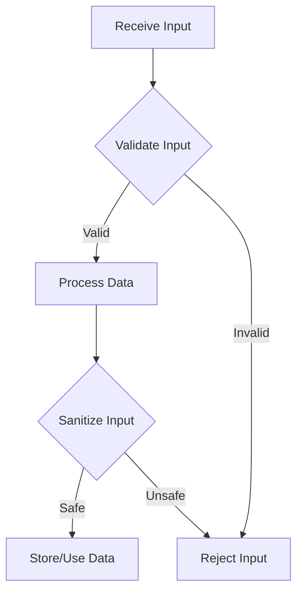

## 19.2 Input Validation and Sanitization Techniques

In the realm of software development, ensuring the integrity and security of data is paramount. Input validation and sanitization are critical techniques that help protect applications from malicious attacks and ensure that data conforms to expected formats. In this section, we will explore these techniques in the context of Julia programming, providing you with the knowledge and tools to implement robust data validation and sanitization in your applications.

### Understanding Input Validation

**Input validation** is the process of verifying that the data provided by users or external systems meets the expected criteria before it is processed by the application. This step is crucial to prevent invalid data from causing errors or vulnerabilities in your software.

#### Types of Input Validation

1. **Syntactic Validation**: This involves checking the format of the input data. For example, ensuring that an email address contains an "@" symbol and a domain name.

2. **Semantic Validation**: This goes beyond syntax to ensure that the data makes sense in the given context. For instance, verifying that a date of birth is not set in the future.

3. **Range Validation**: Ensuring that numeric inputs fall within a specified range, such as age being between 0 and 120.

4. **Cross-Field Validation**: Checking that related fields are consistent, such as ensuring that a start date is before an end date.

### Implementing Input Validation in Julia

Julia provides several ways to implement input validation, ranging from simple conditional checks to using specialized libraries.

#### Basic Validation with Conditional Statements

Let's start with a simple example of validating user input using conditional statements:

```julia
function validate_age(age::Int)
    if age < 0 || age > 120
        error("Invalid age: must be between 0 and 120.")
    end
    return true
end

try
    validate_age(25)  # Valid input
    validate_age(-5)  # Invalid input
catch e
    println(e)
end
```

In this example, we define a function `validate_age` that checks if the age is within a valid range. If not, it raises an error.

#### Using Regular Expressions for Syntactic Validation

Regular expressions are powerful tools for validating the format of strings. Julia's `Regex` type allows you to define and use regular expressions easily.

```julia
function validate_email(email::String)
    email_regex = r"^[a-zA-Z0-9._%+-]+@[a-zA-Z0-9.-]+\.[a-zA-Z]{2,}$"
    if !ismatch(email_regex, email)
        error("Invalid email format.")
    end
    return true
end

try
    validate_email("example@example.com")  # Valid email
    validate_email("invalid-email")        # Invalid email
catch e
    println(e)
end
```

Here, we use a regular expression to validate the format of an email address.

### Sanitizing User Input

**Sanitization** involves cleaning or encoding input data to remove or neutralize potentially harmful content. This is especially important when dealing with user-generated content that might be used in SQL queries, HTML pages, or other contexts where malicious input could lead to security vulnerabilities.

#### Common Sanitization Techniques

1. **Escaping**: Adding escape characters to special characters to prevent them from being interpreted as code.

2. **Encoding**: Converting data into a safe format, such as HTML encoding to prevent cross-site scripting (XSS) attacks.

3. **Stripping**: Removing unwanted characters or tags from input data.

### Implementing Sanitization in Julia

Julia does not have built-in functions for sanitization like some other languages, but you can implement these techniques using existing libraries or custom functions.

#### HTML Encoding Example

To prevent XSS attacks, you can encode HTML special characters:

```julia
function html_encode(input::String)
    replacements = Dict(
        "&" => "&amp;",
        "<" => "&lt;",
        ">" => "&gt;",
        "\"" => "&quot;",
        "'" => "&#x27;"
    )
    return replace(input, replacements)
end

unsafe_input = "<script>alert('XSS');</script>"
safe_output = html_encode(unsafe_input)
println(safe_output)  # Output: &lt;script&gt;alert(&#x27;XSS&#x27;);&lt;/script&gt;
```

In this example, we define a function `html_encode` that replaces HTML special characters with their encoded equivalents.

### Libraries and Tools for Validation and Sanitization

While Julia's standard library provides basic tools for validation and sanitization, there are also third-party packages that can simplify these tasks.

#### Using `DataFrames.jl` for Data Validation

`DataFrames.jl` is a powerful package for handling tabular data in Julia. It can be used to validate data frames by applying validation functions to columns.

```julia
using DataFrames

function validate_dataframe(df::DataFrame)
    for row in eachrow(df)
        validate_age(row[:age])
        validate_email(row[:email])
    end
end

df = DataFrame(age = [25, -5, 30], email = ["valid@example.com", "invalid-email", "another@example.com"])

try
    validate_dataframe(df)
catch e
    println(e)
end
```

In this example, we apply our previously defined validation functions to each row of a `DataFrame`.

#### Exploring `Sanitize.jl` for Input Sanitization

`Sanitize.jl` is a package designed for sanitizing user input in Julia. It provides functions for escaping and encoding data.

```julia
using Sanitize

unsafe_html = "<div onclick='alert(\"XSS\")'>Click me!</div>"
safe_html = Sanitize.html(unsafe_html)
println(safe_html)  # Output: &lt;div onclick=&#34;alert(&quot;XSS&quot;)&#34;&gt;Click me!&lt;/div&gt;
```

Here, we use `Sanitize.jl` to encode potentially dangerous HTML content.

### Visualizing the Validation and Sanitization Process

To better understand the flow of input validation and sanitization, let's visualize the process using a flowchart.



**Figure 1: Input Validation and Sanitization Process**

This flowchart illustrates the steps involved in validating and sanitizing input data before it is processed or stored.

### Best Practices for Input Validation and Sanitization

1. **Validate Early and Often**: Perform validation as soon as data is received and at every stage where it might change.

2. **Use Whitelists Over Blacklists**: Define what is allowed rather than trying to block known bad inputs.

3. **Keep Validation and Sanitization Separate**: Validation ensures data integrity, while sanitization ensures security. Keep these concerns distinct in your code.

4. **Leverage Existing Libraries**: Use well-tested libraries for common validation and sanitization tasks to reduce the risk of errors.

5. **Regularly Update Your Techniques**: Stay informed about new security threats and update your validation and sanitization techniques accordingly.

### Try It Yourself

To reinforce your understanding, try modifying the code examples provided. For instance, extend the `validate_email` function to check for additional email constraints, or experiment with different sanitization techniques using `Sanitize.jl`.

### Knowledge Check

- What is the difference between input validation and sanitization?
- Why is it important to validate input data before processing?
- How can regular expressions be used in input validation?
- What are some common techniques for sanitizing user input?
- How does the `Sanitize.jl` package help in sanitizing input data?

### Embrace the Journey

Remember, mastering input validation and sanitization is a journey. As you continue to develop your skills in Julia, you'll encounter new challenges and opportunities to apply these techniques. Keep experimenting, stay curious, and enjoy the process of building secure and reliable applications.

## Quiz Time!



### What is the primary goal of input validation?

- [x] To ensure data conforms to expected formats and constraints before processing.
- [ ] To encode data for safe storage.
- [ ] To remove all special characters from input.
- [ ] To convert data into a different format.

> **Explanation:** Input validation ensures that data meets expected criteria before it is processed, preventing errors and vulnerabilities.

### Which of the following is a type of input validation?

- [x] Syntactic Validation
- [x] Semantic Validation
- [ ] Data Encoding
- [ ] Data Encryption

> **Explanation:** Syntactic and semantic validation are types of input validation, while data encoding and encryption are related to data transformation and security.

### What is the purpose of sanitizing user input?

- [x] To remove or neutralize potentially harmful content.
- [ ] To ensure data is in the correct format.
- [ ] To compress data for storage.
- [ ] To encrypt data for security.

> **Explanation:** Sanitization involves cleaning or encoding input data to prevent security vulnerabilities, such as XSS attacks.

### Which Julia package can be used for sanitizing HTML content?

- [x] Sanitize.jl
- [ ] DataFrames.jl
- [ ] CSV.jl
- [ ] HTTP.jl

> **Explanation:** Sanitize.jl is a package designed for sanitizing user input, including HTML content.

### What is a common technique for preventing XSS attacks?

- [x] HTML Encoding
- [ ] Data Compression
- [ ] Data Encryption
- [ ] Data Hashing

> **Explanation:** HTML encoding converts special characters into a safe format, preventing them from being interpreted as code in XSS attacks.

### Why is it recommended to use whitelists over blacklists in input validation?

- [x] Whitelists define what is allowed, reducing the risk of missing new threats.
- [ ] Whitelists block known bad inputs.
- [ ] Whitelists are easier to maintain.
- [ ] Whitelists are faster to implement.

> **Explanation:** Whitelists specify allowed inputs, making it harder for new or unknown threats to bypass validation.

### What is the role of regular expressions in input validation?

- [x] To define patterns for matching and validating string formats.
- [ ] To encode data for safe transmission.
- [ ] To compress data for storage.
- [ ] To encrypt data for security.

> **Explanation:** Regular expressions are used to define patterns for matching and validating the format of strings, such as email addresses.

### How can `DataFrames.jl` be used in input validation?

- [x] By applying validation functions to columns of a DataFrame.
- [ ] By encoding data for safe storage.
- [ ] By compressing data for efficient processing.
- [ ] By encrypting data for security.

> **Explanation:** `DataFrames.jl` can be used to apply validation functions to each column or row of a DataFrame, ensuring data integrity.

### What is the benefit of keeping validation and sanitization separate in your code?

- [x] It ensures clarity and separation of concerns, making the code easier to maintain.
- [ ] It improves the performance of the application.
- [ ] It reduces the size of the codebase.
- [ ] It simplifies the deployment process.

> **Explanation:** Keeping validation and sanitization separate ensures clarity and separation of concerns, making the code easier to understand and maintain.

### True or False: Input validation should only be performed at the point of data entry.

- [ ] True
- [x] False

> **Explanation:** Input validation should be performed at multiple stages, including data entry, to ensure data integrity throughout the application.


