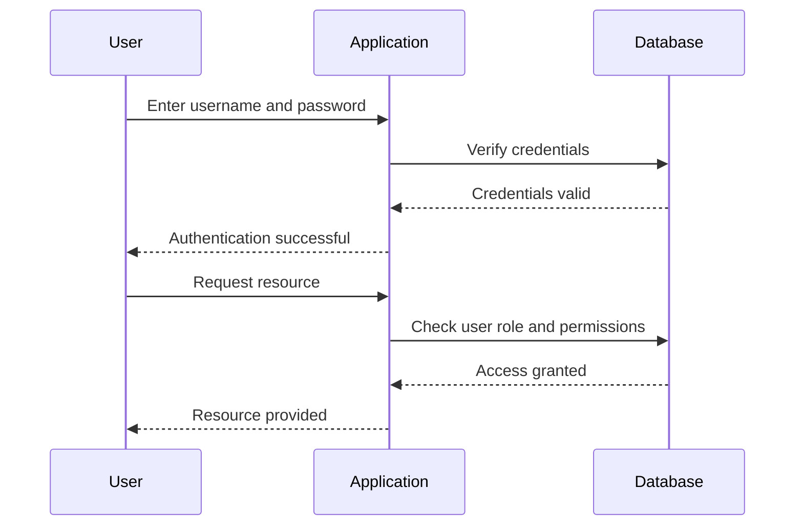

## 19.3 Authentication and Authorization Mechanisms

In the realm of software development, ensuring that users are who they claim to be (authentication) and that they have the appropriate permissions to perform actions (authorization) is crucial. In this section, we will explore how to implement robust authentication and authorization mechanisms in Julia applications. We will cover secure password handling, multi-factor authentication, role-based access control (RBAC), and session management.

### Implementing Authentication

Authentication is the process of verifying the identity of a user or system. In Julia, implementing authentication involves several key components, including secure password handling and multi-factor authentication.

#### Secure Password Handling

Passwords are a common method of authentication, but they must be handled securely to prevent unauthorized access. Here are some best practices for secure password handling in Julia:

1. **Hashing Passwords**: Never store passwords in plain text. Use a strong hashing algorithm such as Argon2 or bcrypt to hash passwords before storing them in a database.

2. **Salting Passwords**: Add a unique salt to each password before hashing to prevent rainbow table attacks. A salt is a random string that is combined with the password before hashing.

3. **Password Policies**: Implement password policies to enforce complexity requirements, such as minimum length and the inclusion of special characters.

4. **Password Reset Mechanism**: Provide a secure method for users to reset their passwords, such as sending a reset link to their registered email address.

Here is an example of how you might implement secure password handling in Julia using the `Argon2` hashing algorithm:

```julia
using Argon2

function hash_password(password::String)
    salt = Argon2.gen_salt()
    hashed_password = Argon2.hash_pwd(password, salt)
    return hashed_password
end

function verify_password(password::String, hashed_password::String)
    return Argon2.verify_pwd(password, hashed_password)
end

password = "SecurePassword123!"
hashed_password = hash_password(password)
println("Hashed Password: $hashed_password")

is_valid = verify_password(password, hashed_password)
println("Password is valid: $is_valid")
```

In this example, we use the `Argon2` package to hash and verify passwords. The `hash_password` function generates a salt and hashes the password, while the `verify_password` function checks if a given password matches the hashed password.

#### Multi-Factor Authentication (MFA)

Multi-factor authentication adds an extra layer of security by requiring users to provide two or more verification factors. Common factors include something the user knows (password), something the user has (a smartphone or token), and something the user is (biometric data).

To implement MFA in Julia, you can use a combination of password authentication and a one-time password (OTP) sent via email or SMS. Here's a simple example using the `OTPAuth` package:

```julia
using OTPAuth

secret = OTPAuth.gen_secret()

totp = TOTP(secret)

otp = OTPAuth.generate(totp)
println("One-Time Password: $otp")

is_valid_otp = OTPAuth.verify(totp, otp)
println("OTP is valid: $is_valid_otp")
```

In this example, we generate a time-based one-time password (TOTP) using the `OTPAuth` package. The `generate` function creates an OTP, and the `verify` function checks its validity.

### Role-Based Access Control (RBAC)

Role-Based Access Control (RBAC) is a method of restricting access based on the roles assigned to users. Each role has a set of permissions that define what actions the user can perform.

#### Defining Permissions Based on User Roles

To implement RBAC in Julia, you can define roles and permissions in a database or configuration file. Here's a simple example using a dictionary to represent roles and permissions:

```julia
roles_permissions = Dict(
    "admin" => ["create", "read", "update", "delete"],
    "editor" => ["read", "update"],
    "viewer" => ["read"]
)

function has_permission(role::String, permission::String)
    return permission in get(roles_permissions, role, [])
end

user_role = "editor"
permission_to_check = "update"
println("User has permission: $(has_permission(user_role, permission_to_check))")
```

In this example, we define a dictionary `roles_permissions` that maps roles to their respective permissions. The `has_permission` function checks if a given role has a specific permission.

### Session Management

Session management is crucial for maintaining user sessions securely. It involves creating, maintaining, and terminating sessions to ensure that users remain authenticated while interacting with an application.

#### Maintaining User Sessions Securely

To manage sessions in Julia, you can use a session management library or implement your own session handling logic. Here's a basic example of session management using a dictionary to store session data:

```julia
sessions = Dict{String, Dict}()

function create_session(user_id::String)
    session_id = Base64.encode(rand(UInt8, 16))
    sessions[session_id] = Dict("user_id" => user_id, "created_at" => time())
    return session_id
end

function get_session(session_id::String)
    return get(sessions, session_id, nothing)
end

function terminate_session(session_id::String)
    delete!(sessions, session_id)
end

user_id = "user123"
session_id = create_session(user_id)
println("Session ID: $session_id")

session_data = get_session(session_id)
println("Session Data: $session_data")

terminate_session(session_id)
println("Session terminated.")
```

In this example, we use a dictionary `sessions` to store session data. The `create_session` function generates a new session ID and stores the user ID and creation time. The `get_session` function retrieves session data, and the `terminate_session` function deletes a session.

### Visualizing Authentication and Authorization Flow

To better understand the flow of authentication and authorization, let's visualize the process using a sequence diagram:



This diagram illustrates the interaction between the user, application, and database during authentication and authorization. The user provides credentials, which the application verifies against the database. Once authenticated, the user requests a resource, and the application checks the user's role and permissions before granting access.

### References and Further Reading

- [Argon2 Password Hashing](https://github.com/JuliaCrypto/Argon2.jl)
- [OTPAuth Package for Julia](https://github.com/JuliaCrypto/OTPAuth.jl)
- [Role-Based Access Control (RBAC) Overview](https://en.wikipedia.org/wiki/Role-based_access_control)

### Knowledge Check

Let's reinforce our understanding with some questions and exercises:

1. **What is the purpose of salting passwords before hashing?**
2. **Explain how multi-factor authentication enhances security.**
3. **Describe the role of RBAC in authorization.**
4. **Implement a simple session management system using a different data structure.**
5. **Modify the password hashing example to use bcrypt instead of Argon2.**

### Embrace the Journey

Remember, mastering authentication and authorization mechanisms is a continuous journey. As you progress, you'll build more secure and robust applications. Keep experimenting, stay curious, and enjoy the journey!

## Quiz Time!



### What is the primary purpose of hashing passwords?

- [x] To securely store passwords by converting them into a fixed-length string
- [ ] To encrypt passwords for transmission over the network
- [ ] To compress passwords for efficient storage
- [ ] To convert passwords into binary format

> **Explanation:** Hashing converts passwords into a fixed-length string, making it secure for storage without revealing the original password.

### Why is salting important in password hashing?

- [x] To prevent rainbow table attacks
- [ ] To increase the length of the password
- [ ] To encrypt the password
- [ ] To convert the password into binary format

> **Explanation:** Salting adds a unique value to each password before hashing, preventing attackers from using precomputed tables to crack passwords.

### What is a common method for implementing multi-factor authentication?

- [x] Using a combination of password and one-time password (OTP)
- [ ] Using only a password
- [ ] Using biometric data alone
- [ ] Using a security question

> **Explanation:** Multi-factor authentication often combines something the user knows (password) with something they have (OTP) for added security.

### In RBAC, what determines a user's permissions?

- [x] The role assigned to the user
- [ ] The user's password strength
- [ ] The user's session duration
- [ ] The user's IP address

> **Explanation:** In Role-Based Access Control (RBAC), a user's permissions are determined by the role assigned to them.

### What is the purpose of session management?

- [x] To maintain user authentication state across requests
- [ ] To encrypt user data
- [ ] To store user passwords
- [ ] To compress user data

> **Explanation:** Session management maintains the user's authentication state, allowing them to remain logged in across multiple requests.

### Which package is used for generating one-time passwords in Julia?

- [x] OTPAuth
- [ ] Argon2
- [ ] bcrypt
- [ ] JWT

> **Explanation:** The `OTPAuth` package is used for generating one-time passwords (OTPs) in Julia.

### What is the role of a salt in password hashing?

- [x] To add randomness to the password before hashing
- [ ] To encrypt the password
- [ ] To compress the password
- [ ] To convert the password into binary format

> **Explanation:** A salt adds randomness to the password, ensuring that even identical passwords result in different hashes.

### How does RBAC enhance security?

- [x] By restricting access based on user roles
- [ ] By encrypting user data
- [ ] By compressing user data
- [ ] By storing user passwords securely

> **Explanation:** RBAC enhances security by restricting access to resources based on the roles assigned to users.

### What is a key benefit of using multi-factor authentication?

- [x] Increased security by requiring multiple verification factors
- [ ] Faster authentication process
- [ ] Reduced password complexity requirements
- [ ] Simplified user experience

> **Explanation:** Multi-factor authentication increases security by requiring multiple verification factors, making it harder for attackers to gain unauthorized access.

### True or False: Session management is only necessary for web applications.

- [ ] True
- [x] False

> **Explanation:** Session management is necessary for any application that requires maintaining user authentication state, not just web applications.


