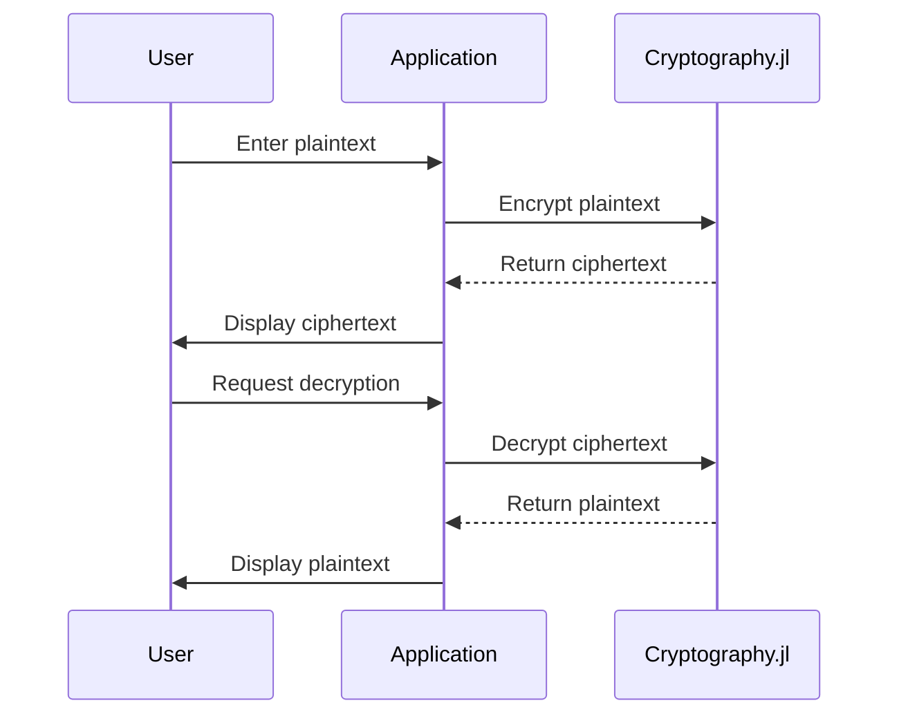

## 19.4 Encryption and Cryptography with Cryptography.jl

In today's digital age, securing data is paramount. As developers, understanding and implementing cryptographic techniques is crucial for protecting sensitive information. Julia, with its rich ecosystem, offers the `Cryptography.jl` package, a powerful tool for implementing encryption, decryption, and hashing. This section will guide you through using `Cryptography.jl` to secure your applications, covering key management and best practices for hashing passwords.

### Introduction to Cryptography.jl

`Cryptography.jl` is a comprehensive library in Julia designed to provide robust cryptographic functionalities. It supports various encryption algorithms, hashing functions, and key management techniques. Let's delve into how you can leverage this library to enhance the security of your applications.

### Understanding Cryptography Concepts

Before diving into the implementation, let's clarify some fundamental cryptography concepts:

- **Encryption**: The process of converting plaintext into ciphertext using an algorithm and a key. It ensures that only authorized parties can access the original data.
- **Decryption**: The reverse process of encryption, converting ciphertext back to plaintext using a key.
- **Hashing**: A one-way function that converts data into a fixed-size string of characters, which is typically a hash code. Hashing is used for data integrity and password storage.
- **Key Management**: The process of handling cryptographic keys, including their generation, exchange, storage, and destruction.

### Implementing Encryption and Decryption

Encryption and decryption are fundamental to securing data. `Cryptography.jl` provides several algorithms for symmetric and asymmetric encryption. Let's explore how to implement these using the library.

#### Symmetric Encryption

Symmetric encryption uses the same key for both encryption and decryption. It's efficient for encrypting large amounts of data.

```julia
using Cryptography

key = rand(UInt8, 32)  # 256-bit key

cipher = AES(key)

plaintext = "Hello, Julia!"
ciphertext = encrypt(cipher, plaintext)

decrypted_text = decrypt(cipher, ciphertext)

println("Original: $plaintext")
println("Encrypted: $ciphertext")
println("Decrypted: $decrypted_text")
```

In this example, we use the AES (Advanced Encryption Standard) algorithm. The key is randomly generated, and the same key is used for both encryption and decryption.

#### Asymmetric Encryption

Asymmetric encryption uses a pair of keys: a public key for encryption and a private key for decryption. It's suitable for secure key exchange and digital signatures.

```julia
using Cryptography

private_key, public_key = generate_rsa_keypair(2048)

plaintext = "Secure message"
ciphertext = encrypt(public_key, plaintext)

decrypted_text = decrypt(private_key, ciphertext)

println("Original: $plaintext")
println("Encrypted: $ciphertext")
println("Decrypted: $decrypted_text")
```

Here, we generate an RSA key pair and use the public key for encryption and the private key for decryption.

### Key Management

Effective key management is crucial for maintaining the security of encrypted data. Let's explore best practices for handling cryptographic keys.

#### Generating and Storing Keys

Keys should be generated using secure random number generators and stored securely. Avoid hardcoding keys in your source code.

```julia
using Random

key = rand(UInt8, 32)

```

#### Key Rotation

Regularly rotating keys minimizes the risk of key compromise. Implement a key rotation policy and automate the process where possible.

#### Key Exchange

For asymmetric encryption, securely exchange public keys using trusted channels. Consider using protocols like TLS for secure key exchange.

### Hashing Passwords

Hashing is essential for storing passwords securely. `Cryptography.jl` provides robust hashing algorithms to ensure password integrity.

#### Using Secure Hashing Algorithms

Always use secure hashing algorithms like SHA-256 or SHA-3 for password hashing. Avoid using outdated algorithms like MD5 or SHA-1.

```julia
using Cryptography

password = "securepassword"
hashed_password = hash(SHA256, password)

println("Hashed Password: $hashed_password")
```

#### Salting Passwords

Add a unique salt to each password before hashing to prevent rainbow table attacks. Store the salt alongside the hashed password.

```julia
using Random

salt = rand(UInt8, 16)

salted_password = string(salt, password)

hashed_password = hash(SHA256, salted_password)

println("Salt: $salt")
println("Hashed Password: $hashed_password")
```

### Try It Yourself

Experiment with the code examples provided. Try changing the encryption algorithms, key sizes, and hashing functions. Observe how these changes affect the security and performance of your application.

### Visualizing Cryptographic Processes

To better understand the flow of encryption and decryption, let's visualize the process using a sequence diagram.



This diagram illustrates the interaction between the user, application, and `Cryptography.jl` during the encryption and decryption process.

### References and Further Reading

- [Cryptography.jl Documentation](https://github.com/JuliaCrypto/Cryptography.jl)
- [NIST Guidelines on Cryptographic Key Management](https://csrc.nist.gov/publications/detail/sp/800-57-part-1/rev-5/final)
- [OWASP Cryptographic Storage Cheat Sheet](https://cheatsheetseries.owasp.org/cheatsheets/Cryptographic_Storage_Cheat_Sheet.html)

### Knowledge Check

- What is the difference between symmetric and asymmetric encryption?
- Why is key management important in cryptography?
- How does salting improve password security?

### Embrace the Journey

Remember, mastering cryptography is a journey. As you continue to explore and implement these techniques, you'll gain a deeper understanding of securing data in your applications. Stay curious, keep experimenting, and enjoy the process!

## Quiz Time!



### What is the primary purpose of encryption?

- [x] To convert plaintext into ciphertext to protect data from unauthorized access
- [ ] To convert ciphertext into plaintext
- [ ] To hash data for integrity
- [ ] To generate cryptographic keys

> **Explanation:** Encryption is used to convert plaintext into ciphertext, ensuring that only authorized parties can access the original data.

### Which algorithm is commonly used for symmetric encryption?

- [x] AES
- [ ] RSA
- [ ] SHA-256
- [ ] MD5

> **Explanation:** AES (Advanced Encryption Standard) is a widely used algorithm for symmetric encryption.

### What is the role of a public key in asymmetric encryption?

- [x] To encrypt data
- [ ] To decrypt data
- [ ] To hash data
- [ ] To generate random numbers

> **Explanation:** In asymmetric encryption, the public key is used to encrypt data, while the private key is used for decryption.

### Why is salting important in password hashing?

- [x] To prevent rainbow table attacks
- [ ] To speed up the hashing process
- [ ] To reduce the size of the hash
- [ ] To make the password more readable

> **Explanation:** Salting adds a unique value to each password before hashing, making it more difficult for attackers to use precomputed tables (rainbow tables) to crack passwords.

### What is a key benefit of using Cryptography.jl in Julia?

- [x] It provides robust cryptographic functionalities for encryption, decryption, and hashing
- [ ] It simplifies the process of writing Julia code
- [ ] It enhances the graphical capabilities of Julia
- [ ] It improves the performance of Julia applications

> **Explanation:** Cryptography.jl offers a comprehensive set of tools for implementing cryptographic techniques in Julia, enhancing data security.

### How often should cryptographic keys be rotated?

- [x] Regularly, to minimize the risk of key compromise
- [ ] Never, to maintain consistency
- [ ] Only when a breach occurs
- [ ] Once a year

> **Explanation:** Regular key rotation is a best practice to minimize the risk of key compromise and maintain data security.

### What is the primary use of hashing in cryptography?

- [x] To ensure data integrity and secure password storage
- [ ] To encrypt data
- [ ] To decrypt data
- [ ] To generate random numbers

> **Explanation:** Hashing is primarily used to ensure data integrity and securely store passwords by converting them into fixed-size hash codes.

### Which of the following is a secure hashing algorithm?

- [x] SHA-256
- [ ] MD5
- [ ] DES
- [ ] Blowfish

> **Explanation:** SHA-256 is a secure hashing algorithm, while MD5 is considered outdated and insecure.

### What is the purpose of key management in cryptography?

- [x] To handle the generation, exchange, storage, and destruction of cryptographic keys
- [ ] To encrypt data
- [ ] To decrypt data
- [ ] To hash passwords

> **Explanation:** Key management involves handling the lifecycle of cryptographic keys, ensuring their secure generation, exchange, storage, and destruction.

### True or False: Asymmetric encryption uses the same key for encryption and decryption.

- [ ] True
- [x] False

> **Explanation:** Asymmetric encryption uses a pair of keys: a public key for encryption and a private key for decryption.



By mastering these concepts and techniques, you'll be well-equipped to implement robust security measures in your Julia applications. Keep exploring and refining your skills to stay ahead in the ever-evolving field of cryptography.
