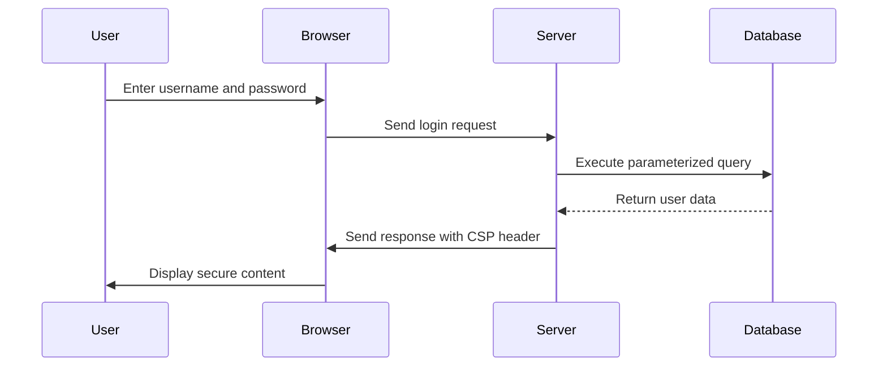

## 19.5 Protecting Against Common Vulnerabilities

In the ever-evolving landscape of software development, security remains a paramount concern. As developers, we must be vigilant in protecting our applications from common vulnerabilities that can compromise data integrity, confidentiality, and availability. In this section, we will explore strategies to safeguard Julia applications against some of the most prevalent security threats, including injection attacks, cross-site scripting (XSS), and insecure configurations.

### Injection Prevention

Injection attacks, such as SQL injection, are among the most common and dangerous vulnerabilities. They occur when untrusted data is sent to an interpreter as part of a command or query. The attacker's hostile data can trick the interpreter into executing unintended commands or accessing unauthorized data.

#### Parameterized Queries

One of the most effective ways to prevent injection attacks is by using parameterized queries. Parameterized queries ensure that user input is treated as data rather than executable code. This approach is particularly crucial when interacting with databases.

**Example: Using Parameterized Queries in Julia**

```julia
using SQLite

db = SQLite.DB("mydatabase.db")

stmt = SQLite.Stmt(db, "SELECT * FROM users WHERE username = ?")

username = "john_doe"
SQLite.bind!(stmt, 1, username)

results = SQLite.execute(stmt)

for row in results
    println(row)
end

SQLite.finalize(stmt)
SQLite.close(db)
```

In this example, the `?` placeholder in the SQL query is replaced with the actual value of `username` using the `bind!` function. This ensures that the input is safely handled, preventing any potential injection attack.

#### Avoiding String Interpolation for Commands

String interpolation can be dangerous when constructing commands or queries, as it may inadvertently introduce vulnerabilities. Instead, always use safe methods to handle user input.

**Example: Avoiding String Interpolation**

```julia
command = "SELECT * FROM users WHERE username = '$username'"

stmt = SQLite.Stmt(db, "SELECT * FROM users WHERE username = ?")
SQLite.bind!(stmt, 1, username)
```

By avoiding string interpolation and opting for parameterized queries, we can significantly reduce the risk of injection attacks.

### Cross-Site Scripting (XSS) Defense

Cross-site scripting (XSS) attacks occur when an attacker injects malicious scripts into content from otherwise trusted websites. These scripts can execute in the context of the user's browser, potentially stealing sensitive information or performing actions on behalf of the user.

#### Proper Output Encoding

To defend against XSS, it's essential to properly encode output that includes user-generated content. This ensures that any potentially harmful scripts are rendered harmless by the browser.

**Example: Encoding Output in Julia**

```julia
using HTMLSanitizer

user_input = "<script>alert('XSS Attack!');</script>"

safe_output = HTMLSanitizer.sanitize(user_input)

println(safe_output)
```

In this example, the `HTMLSanitizer` package is used to sanitize user input, preventing any embedded scripts from executing.

#### Content Security Policy (CSP)

Implementing a Content Security Policy (CSP) is another effective measure to mitigate XSS attacks. CSP is a security feature that helps prevent a variety of attacks by specifying which dynamic resources are allowed to load.

**Example: Setting a Content Security Policy**

```html
<!DOCTYPE html>
<html lang="en">
<head>
    <meta charset="UTF-8">
    <meta http-equiv="Content-Security-Policy" content="default-src 'self'; script-src 'self' https://trusted.cdn.com;">
    <title>Secure Page</title>
</head>
<body>
    <h1>Welcome to the Secure Page</h1>
</body>
</html>
```

In this HTML example, the CSP header restricts scripts to only load from the same origin (`'self'`) and a trusted CDN (`https://trusted.cdn.com`). This prevents unauthorized scripts from executing.

### Secure Configuration

A secure configuration is crucial for minimizing the attack surface of an application. This involves disabling unnecessary features and services, ensuring that only essential components are active.

#### Disabling Unnecessary Features and Services

Review your application's configuration settings and disable any features or services that are not required for its operation. This reduces the potential entry points for attackers.

**Example: Secure Configuration in Julia**

```julia
const DEBUG_MODE = false

function sensitive_operation()
    if !DEBUG_MODE
        error("This operation is not allowed in production.")
    end
    # Perform sensitive operation
end
```

In this example, a constant `DEBUG_MODE` is used to control access to a sensitive operation. By disabling debug mode in production, we prevent unauthorized access to potentially harmful functions.

### Visualizing Security Measures

To better understand the flow of security measures in a web application, let's visualize the process using a sequence diagram.



**Diagram Description:** This sequence diagram illustrates the process of a user logging into a web application. The server executes a parameterized query to retrieve user data and sends a response with a CSP header to ensure secure content delivery.

### References and Links

For further reading on securing applications, consider exploring the following resources:

- [OWASP Top Ten](https://owasp.org/www-project-top-ten/): A list of the most critical security risks to web applications.
- [SQLite Documentation](https://www.sqlite.org/docs.html): Official documentation for SQLite, including security best practices.
- [Content Security Policy (CSP) Guide](https://developer.mozilla.org/en-US/docs/Web/HTTP/CSP): A comprehensive guide to implementing CSP.

### Knowledge Check

Let's reinforce our understanding with a few questions and exercises.

1. **What is the primary purpose of parameterized queries?**
   - To prevent injection attacks by treating user input as data rather than executable code.

2. **How does output encoding help prevent XSS attacks?**
   - By ensuring that user-generated content is rendered harmless by the browser.

3. **What is the role of a Content Security Policy (CSP)?**
   - To specify which dynamic resources are allowed to load, preventing unauthorized scripts from executing.

4. **Why is it important to disable unnecessary features and services in an application?**
   - To reduce the attack surface and minimize potential entry points for attackers.

### Embrace the Journey

Remember, security is an ongoing process. As you continue to develop and maintain your Julia applications, stay informed about emerging threats and best practices. Keep experimenting, stay curious, and enjoy the journey of building secure software!

## Quiz Time!



### What is the primary purpose of parameterized queries?

- [x] To prevent injection attacks by treating user input as data rather than executable code.
- [ ] To improve the performance of database queries.
- [ ] To simplify the syntax of SQL queries.
- [ ] To allow dynamic generation of SQL commands.

> **Explanation:** Parameterized queries prevent injection attacks by ensuring user input is treated as data, not executable code.

### How does output encoding help prevent XSS attacks?

- [x] By ensuring that user-generated content is rendered harmless by the browser.
- [ ] By encrypting the content before displaying it.
- [ ] By blocking all scripts from executing on the page.
- [ ] By validating user input before processing.

> **Explanation:** Output encoding ensures that any potentially harmful scripts in user-generated content are rendered harmless by the browser.

### What is the role of a Content Security Policy (CSP)?

- [x] To specify which dynamic resources are allowed to load, preventing unauthorized scripts from executing.
- [ ] To encrypt all data transmitted between the server and client.
- [ ] To block all external resources from loading on the page.
- [ ] To validate user input before processing.

> **Explanation:** CSP helps prevent unauthorized scripts from executing by specifying which dynamic resources are allowed to load.

### Why is it important to disable unnecessary features and services in an application?

- [x] To reduce the attack surface and minimize potential entry points for attackers.
- [ ] To improve the performance of the application.
- [ ] To simplify the codebase and reduce maintenance efforts.
- [ ] To ensure compatibility with older systems.

> **Explanation:** Disabling unnecessary features and services reduces the attack surface, minimizing potential entry points for attackers.

### Which of the following is a common vulnerability in web applications?

- [x] SQL injection
- [x] Cross-site scripting (XSS)
- [ ] Buffer overflow
- [ ] Denial of service (DoS)

> **Explanation:** SQL injection and XSS are common vulnerabilities in web applications, while buffer overflow and DoS are more general security issues.

### What is a key benefit of using parameterized queries?

- [x] They prevent SQL injection attacks.
- [ ] They improve the readability of SQL code.
- [ ] They allow for dynamic query generation.
- [ ] They reduce the size of the database.

> **Explanation:** Parameterized queries prevent SQL injection attacks by treating user input as data, not executable code.

### How can a Content Security Policy (CSP) be implemented?

- [x] By setting the `Content-Security-Policy` HTTP header.
- [ ] By encrypting all data transmitted between the server and client.
- [ ] By blocking all external resources from loading on the page.
- [ ] By validating user input before processing.

> **Explanation:** CSP is implemented by setting the `Content-Security-Policy` HTTP header to specify which dynamic resources are allowed to load.

### What is the purpose of output encoding in web applications?

- [x] To prevent XSS attacks by rendering user-generated content harmless.
- [ ] To encrypt all data transmitted between the server and client.
- [ ] To block all scripts from executing on the page.
- [ ] To validate user input before processing.

> **Explanation:** Output encoding prevents XSS attacks by ensuring user-generated content is rendered harmless by the browser.

### Why should debug mode be disabled in production environments?

- [x] To prevent unauthorized access to sensitive operations.
- [ ] To improve the performance of the application.
- [ ] To simplify the codebase and reduce maintenance efforts.
- [ ] To ensure compatibility with older systems.

> **Explanation:** Disabling debug mode in production prevents unauthorized access to sensitive operations, enhancing security.

### True or False: Cross-site scripting (XSS) attacks can steal sensitive information from users.

- [x] True
- [ ] False

> **Explanation:** XSS attacks can execute malicious scripts in the context of the user's browser, potentially stealing sensitive information.


