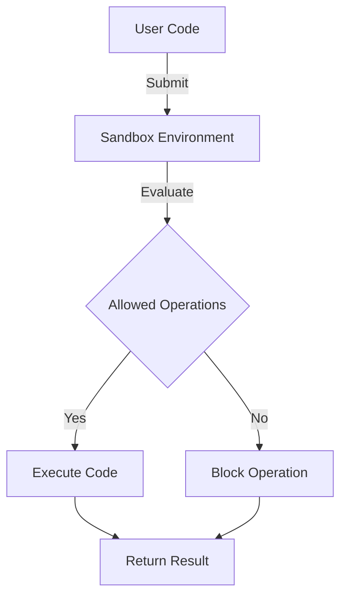

## 19.6 Sandboxing and Safe Code Execution

In the realm of software development, ensuring the security of code execution is paramount. Sandboxing and safe code execution are critical techniques employed to mitigate risks associated with running untrusted or potentially harmful code. In this section, we will delve into the concepts of sandboxing and safe code execution within the context of Julia programming. We will explore the limitations, implementation strategies, and practical use cases, providing you with a comprehensive understanding of how to secure your Julia applications.

### Understanding Sandboxing

**Sandboxing** is a security mechanism used to isolate running programs, preventing them from accessing unauthorized resources or executing malicious actions. By creating a controlled environment, sandboxing limits the potential damage that untrusted code can cause. This is particularly important in scenarios where code from external sources is executed, such as plugin systems or user-generated scripts.

#### Limitations of Sandboxing

While sandboxing is a powerful tool for enhancing security, it is not without its limitations. Understanding these limitations is crucial for implementing effective sandboxing strategies:

- **Complexity and Overhead**: Implementing a sandbox can introduce complexity and performance overhead. The sandbox must be carefully designed to balance security with usability and performance.
- **Incomplete Isolation**: Absolute security is challenging to achieve. Sandboxes may not completely isolate all system resources, leaving potential vulnerabilities.
- **Bypassing Mechanisms**: Skilled attackers may find ways to bypass sandbox restrictions, especially if the sandbox is not properly configured or maintained.
- **Resource Constraints**: Sandboxes often impose resource constraints, which can limit the functionality of the code being executed.

### Implementing Sandboxes in Julia

Implementing sandboxing in Julia involves creating a restricted execution environment where code can run safely without compromising the host system. Here are some strategies and tools that can be used to implement sandboxing in Julia:

#### Using `SafeREPL.jl`

`SafeREPL.jl` is a Julia package designed to provide a safer REPL (Read-Eval-Print Loop) environment. It restricts access to certain functions and modules, preventing potentially harmful operations. Here's a basic example of how to use `SafeREPL.jl`:

```julia
using SafeREPL

safe_repl = SafeREPL()

function evaluate_safe(code::String)
    try
        result = eval(safe_repl, Meta.parse(code))
        println("Result: ", result)
    catch e
        println("Error: ", e)
    end
end

evaluate_safe("2 + 2")

evaluate_safe("run(`rm -rf /`)")  # This will be blocked
```

In this example, `SafeREPL.jl` is used to create a restricted environment where potentially dangerous operations, such as deleting files, are blocked.

#### Leveraging `Sandbox.jl`

`Sandbox.jl` is another package that provides sandboxing capabilities in Julia. It allows you to define a set of allowed operations and restrict access to system resources. Here's how you can use `Sandbox.jl`:

```julia
using Sandbox

sandbox = Sandbox(allow_network=false, allow_file_system=false)

function execute_in_sandbox(code::String)
    try
        result = Sandbox.eval(sandbox, Meta.parse(code))
        println("Sandboxed Result: ", result)
    catch e
        println("Sandbox Error: ", e)
    end
end

execute_in_sandbox("3 * 3")

execute_in_sandbox("open(\"/etc/passwd\")")  # This will be blocked
```

`Sandbox.jl` provides a more granular control over what operations are permitted, making it suitable for scenarios where specific restrictions are needed.

### Use Cases for Sandboxing

Sandboxing is particularly useful in scenarios where untrusted code needs to be executed. Here are some common use cases:

#### Running Untrusted Code

In environments where users can submit and execute code, such as online coding platforms or educational tools, sandboxing ensures that the code runs safely without affecting the host system. By isolating the execution, you can prevent malicious actions and protect sensitive data.

#### Plugin Systems

Many applications support plugins or extensions to enhance functionality. Sandboxing these plugins ensures that they do not perform unauthorized actions or access restricted resources. This is crucial for maintaining the integrity and security of the host application.

#### Research and Experimentation

Sandboxing allows researchers and developers to experiment with new code or algorithms in a controlled environment. This reduces the risk of unintended consequences or system crashes, facilitating a safer development process.

### Visualizing Sandboxing in Julia

To better understand the concept of sandboxing, let's visualize the process using a Mermaid.js diagram. This diagram illustrates the flow of code execution within a sandboxed environment:



**Diagram Description**: This diagram represents the flow of code execution in a sandboxed environment. User code is submitted to the sandbox, where it is evaluated against a set of allowed operations. If the operation is allowed, the code is executed, and the result is returned. If not, the operation is blocked, ensuring safe execution.

### Best Practices for Safe Code Execution

Implementing sandboxing effectively requires adherence to best practices. Here are some guidelines to ensure safe code execution in Julia:

- **Define Clear Boundaries**: Clearly define what operations are allowed and what resources are accessible within the sandbox. This helps prevent unauthorized actions.
- **Regularly Update and Patch**: Keep your sandboxing tools and libraries up to date to protect against known vulnerabilities and exploits.
- **Monitor and Log Activity**: Implement logging and monitoring to track the activity within the sandbox. This can help identify potential security breaches or misuse.
- **Test for Vulnerabilities**: Regularly test your sandbox for vulnerabilities and attempt to bypass restrictions to ensure its robustness.
- **Educate Users**: Educate users about the limitations and capabilities of the sandboxed environment to set appropriate expectations.

### Try It Yourself

To gain hands-on experience with sandboxing in Julia, try modifying the code examples provided. Experiment with different restrictions and observe how the sandbox behaves. For instance, try allowing network access in `Sandbox.jl` and see how it affects the execution of network-related operations.

### References and Further Reading

For more information on sandboxing and safe code execution, consider exploring the following resources:

- [JuliaLang Documentation](https://docs.julialang.org/)
- [SafeREPL.jl GitHub Repository](https://github.com/JuliaLang/SafeREPL.jl)
- [Sandbox.jl GitHub Repository](https://github.com/JuliaLang/Sandbox.jl)

### Knowledge Check

Before we conclude, let's reinforce what we've learned with a few questions:

- What are the key limitations of sandboxing?
- How does `SafeREPL.jl` enhance the security of code execution?
- In what scenarios is sandboxing particularly useful?
- What are some best practices for implementing sandboxing in Julia?

### Embrace the Journey

Remember, mastering sandboxing and safe code execution is a journey. As you continue to explore and experiment, you'll gain a deeper understanding of how to secure your Julia applications effectively. Stay curious, keep learning, and enjoy the process!

## Quiz Time!



### What is the primary purpose of sandboxing in software development?

- [x] To isolate running programs and prevent unauthorized access to resources
- [ ] To enhance the performance of applications
- [ ] To simplify code execution
- [ ] To improve user interface design

> **Explanation:** Sandboxing is primarily used to isolate running programs, preventing them from accessing unauthorized resources or executing malicious actions.

### Which Julia package provides a safer REPL environment by restricting access to certain functions and modules?

- [x] SafeREPL.jl
- [ ] Sandbox.jl
- [ ] SecureExec.jl
- [ ] JuliaSecure.jl

> **Explanation:** SafeREPL.jl is a Julia package designed to provide a safer REPL environment by restricting access to certain functions and modules.

### What is a common limitation of sandboxing?

- [x] Incomplete isolation of system resources
- [ ] Increased application speed
- [ ] Simplified code execution
- [ ] Enhanced graphical user interface

> **Explanation:** A common limitation of sandboxing is the incomplete isolation of system resources, which can leave potential vulnerabilities.

### How does `Sandbox.jl` enhance security in Julia applications?

- [x] By allowing granular control over permitted operations
- [ ] By improving application performance
- [ ] By simplifying code syntax
- [ ] By enhancing graphical design

> **Explanation:** Sandbox.jl enhances security by allowing granular control over what operations are permitted, making it suitable for scenarios where specific restrictions are needed.

### In which scenario is sandboxing particularly useful?

- [x] Running untrusted code
- [ ] Enhancing graphical design
- [ ] Simplifying code syntax
- [ ] Improving application speed

> **Explanation:** Sandboxing is particularly useful in scenarios where untrusted code needs to be executed, such as online coding platforms or educational tools.

### What is a best practice for implementing sandboxing in Julia?

- [x] Define clear boundaries for allowed operations
- [ ] Increase application speed
- [ ] Simplify code syntax
- [ ] Enhance graphical design

> **Explanation:** A best practice for implementing sandboxing is to define clear boundaries for allowed operations to prevent unauthorized actions.

### What should be regularly updated to protect against known vulnerabilities in sandboxing?

- [x] Sandboxing tools and libraries
- [ ] Graphical design elements
- [ ] Application speed settings
- [ ] Code syntax

> **Explanation:** Sandboxing tools and libraries should be regularly updated to protect against known vulnerabilities and exploits.

### What is the role of monitoring and logging in sandboxing?

- [x] To track activity and identify potential security breaches
- [ ] To enhance graphical design
- [ ] To simplify code syntax
- [ ] To improve application speed

> **Explanation:** Monitoring and logging are used to track activity within the sandbox, helping to identify potential security breaches or misuse.

### What is a key takeaway from implementing sandboxing in Julia?

- [x] It enhances security by isolating code execution
- [ ] It simplifies code syntax
- [ ] It improves graphical design
- [ ] It increases application speed

> **Explanation:** A key takeaway from implementing sandboxing is that it enhances security by isolating code execution, preventing unauthorized actions.

### True or False: Sandboxing can completely eliminate all security risks.

- [ ] True
- [x] False

> **Explanation:** False. While sandboxing enhances security, it cannot completely eliminate all security risks due to potential vulnerabilities and bypass mechanisms.


