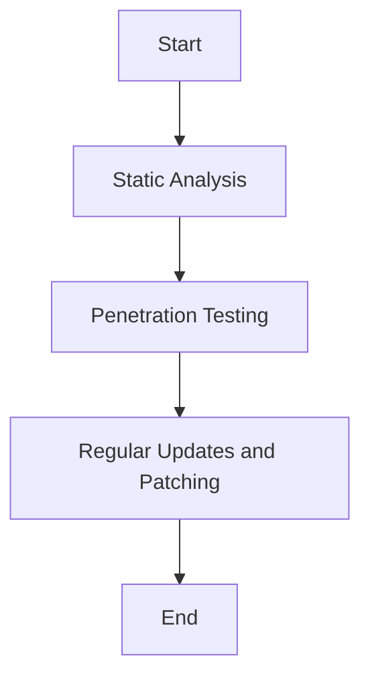

## 19.7 Security Testing and Vulnerability Scanning

In the realm of software development, security is paramount. As developers, we must ensure that our applications are not only functional but also secure against potential threats. This section delves into the critical aspects of security testing and vulnerability scanning in Julia applications. We will explore various tools and techniques, including static analysis, penetration testing, and the importance of regular updates and patching.

### Understanding Security Testing

Security testing is a process designed to uncover vulnerabilities in software applications. It ensures that the software is free from any loopholes that could be exploited by attackers. Security testing can be broadly categorized into:

- **Static Analysis**: Examining the code without executing it to find vulnerabilities.
- **Dynamic Analysis**: Testing the application in a runtime environment to identify security issues.
- **Penetration Testing**: Simulating attacks to evaluate the security of the application.

### Static Analysis Tools

Static analysis tools are essential for detecting vulnerabilities in code before it is deployed. These tools analyze the source code or compiled code to identify potential security flaws. In Julia, while there are fewer dedicated static analysis tools compared to other languages, there are still effective strategies and tools that can be employed.

#### Benefits of Static Analysis

- **Early Detection**: Identifies vulnerabilities early in the development cycle.
- **Cost-Effective**: Reduces the cost of fixing vulnerabilities by addressing them before deployment.
- **Comprehensive**: Analyzes the entire codebase for potential issues.

#### Popular Static Analysis Tools

1. **JuliLint.jl**: A linter for Julia that checks for common coding errors and potential security issues.
2. **SonarQube**: Though not specific to Julia, it can be configured to analyze Julia code and provide insights into code quality and security.
3. **Brakeman**: Originally for Ruby, but can be adapted for use with Julia to some extent, focusing on security vulnerabilities.

#### Implementing Static Analysis in Julia

Let's explore how to use JuliLint.jl for static analysis in a Julia project.

```julia
using Pkg
Pkg.add("JuliLint")

using JuliLint

lintfile("path/to/your/file.jl")

lintdir("path/to/your/directory")
```

**Key Points**:
- Ensure that the linter is integrated into your CI/CD pipeline for continuous monitoring.
- Regularly update the linter to benefit from the latest security checks.

### Penetration Testing

Penetration testing, or pen testing, involves simulating attacks on your application to identify vulnerabilities that could be exploited by malicious actors. This type of testing is crucial for understanding how your application might be attacked and how it can be fortified.

#### Steps in Penetration Testing

1. **Planning**: Define the scope and objectives of the test.
2. **Reconnaissance**: Gather information about the application and its environment.
3. **Scanning**: Identify potential entry points and vulnerabilities.
4. **Exploitation**: Attempt to exploit identified vulnerabilities to understand their impact.
5. **Reporting**: Document findings and recommend remediation strategies.

#### Tools for Penetration Testing

While there are no Julia-specific penetration testing tools, several general-purpose tools can be used:

- **Metasploit**: A widely-used framework for developing and executing exploit code against a remote target machine.
- **OWASP ZAP**: An open-source web application security scanner.
- **Burp Suite**: A comprehensive platform for web application security testing.

#### Example: Using OWASP ZAP

OWASP ZAP can be used to test web applications built with Julia frameworks like Genie.jl. Here's a basic workflow:

1. **Install OWASP ZAP**: Download and install from the [official website](https://www.zaproxy.org/).
2. **Configure ZAP**: Set up ZAP to proxy your web application.
3. **Scan the Application**: Use ZAP's automated scanner to identify vulnerabilities.
4. **Analyze Results**: Review the findings and address any security issues.

**Try It Yourself**:
- Experiment with different configurations in ZAP to understand how it affects the scanning process.
- Modify your application to fix identified vulnerabilities and re-scan to verify the fixes.

### Regular Updates and Patching

Keeping your software and its dependencies up to date is a fundamental aspect of maintaining security. Regular updates and patching help address known vulnerabilities and improve the overall security posture of your application.

#### Best Practices for Updates and Patching

- **Automate Updates**: Use tools like Dependabot or Renovate to automate dependency updates.
- **Monitor Vulnerability Databases**: Stay informed about vulnerabilities in your dependencies by monitoring databases like the [National Vulnerability Database (NVD)](https://nvd.nist.gov/).
- **Test Updates**: Before deploying updates, test them in a staging environment to ensure they do not introduce new issues.

#### Example: Automating Updates in Julia

Julia's package manager, Pkg.jl, can be used to automate updates:

```julia
using Pkg
Pkg.update()

Pkg.status()

Pkg.add(PackageSpec(name="ExamplePackage", version="1.2.3"))
```

**Key Points**:
- Regularly review and update your project's dependencies.
- Consider using a lock file to ensure consistent environments across different systems.

### Visualizing the Security Testing Process

To better understand the security testing process, let's visualize it using a flowchart.



**Diagram Description**: This flowchart represents the sequential process of security testing, starting with static analysis, followed by penetration testing, and concluding with regular updates and patching.

### Knowledge Check

Before we conclude, let's reinforce what we've learned with a few questions:

- What are the benefits of static analysis in security testing?
- How does penetration testing differ from static analysis?
- Why is it important to keep software dependencies up to date?

### Summary

In this section, we've explored the critical aspects of security testing and vulnerability scanning in Julia applications. By leveraging static analysis tools, conducting thorough penetration testing, and maintaining regular updates and patching, we can significantly enhance the security of our applications. Remember, security is an ongoing process, and staying vigilant is key to protecting your software from potential threats.

### Embrace the Journey

As you continue your journey in Julia development, remember that security is an integral part of the process. Keep experimenting with different tools and techniques, stay curious, and enjoy the journey of building secure and robust applications.

## Quiz Time!



### What is the primary goal of security testing?

- [x] To uncover vulnerabilities in software applications
- [ ] To improve the user interface of applications
- [ ] To enhance the performance of applications
- [ ] To reduce the size of the application

> **Explanation:** Security testing aims to identify and address vulnerabilities that could be exploited by attackers.

### Which of the following is a static analysis tool for Julia?

- [x] JuliLint.jl
- [ ] Metasploit
- [ ] OWASP ZAP
- [ ] Burp Suite

> **Explanation:** JuliLint.jl is a linter for Julia that checks for coding errors and potential security issues.

### What is the main difference between static and dynamic analysis?

- [x] Static analysis examines code without executing it, while dynamic analysis tests the application in a runtime environment.
- [ ] Static analysis is performed after deployment, while dynamic analysis is done during development.
- [ ] Static analysis is more expensive than dynamic analysis.
- [ ] Static analysis is less reliable than dynamic analysis.

> **Explanation:** Static analysis involves examining code without execution, whereas dynamic analysis involves testing the application during runtime.

### What is the purpose of penetration testing?

- [x] To simulate attacks and evaluate the security of an application
- [ ] To improve the application's user experience
- [ ] To optimize the application's performance
- [ ] To reduce the application's memory usage

> **Explanation:** Penetration testing simulates attacks to identify and address vulnerabilities in an application.

### Which tool is commonly used for web application security testing?

- [x] OWASP ZAP
- [ ] JuliLint.jl
- [ ] Pkg.jl
- [ ] Dependabot

> **Explanation:** OWASP ZAP is an open-source web application security scanner used for testing web applications.

### Why is it important to keep software dependencies up to date?

- [x] To address known vulnerabilities and improve security
- [ ] To increase the application's file size
- [ ] To decrease the application's performance
- [ ] To make the application more complex

> **Explanation:** Regular updates and patching help address known vulnerabilities and enhance the security of the application.

### What is the role of a vulnerability database?

- [x] To provide information about known vulnerabilities in software
- [ ] To store user data securely
- [ ] To improve the application's performance
- [ ] To manage software licenses

> **Explanation:** Vulnerability databases provide information about known vulnerabilities, helping developers stay informed and address them.

### How can you automate dependency updates in Julia?

- [x] By using Pkg.jl to update packages
- [ ] By manually editing the source code
- [ ] By using OWASP ZAP
- [ ] By disabling automatic updates

> **Explanation:** Pkg.jl can be used to automate the process of updating packages in Julia.

### What is the first step in penetration testing?

- [x] Planning
- [ ] Exploitation
- [ ] Scanning
- [ ] Reporting

> **Explanation:** The first step in penetration testing is planning, where the scope and objectives of the test are defined.

### Regular updates and patching help in:

- [x] Addressing known vulnerabilities
- [ ] Increasing application complexity
- [ ] Reducing application usability
- [ ] Decreasing application security

> **Explanation:** Regular updates and patching help address known vulnerabilities, thereby enhancing the security of the application.


