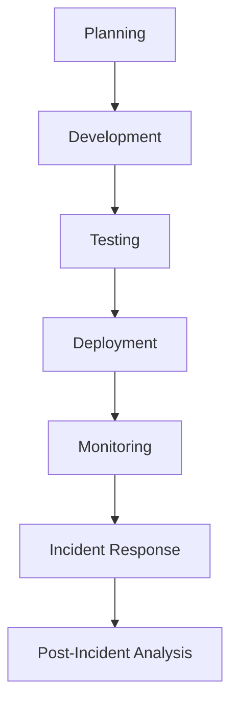

## 19.8 Best Practices for Secure Application Development

In today's digital landscape, security is paramount. As developers, we must ensure that our applications are robust against threats and vulnerabilities. This section will guide you through best practices for secure application development in Julia, focusing on principles like the Least Privilege Principle, Secure Defaults, and Incident Response Planning. By the end of this guide, you'll be equipped with the knowledge to build secure, resilient applications.

### Understanding the Importance of Security in Software Development

Security is not just an add-on feature; it's a fundamental aspect of software development. With increasing cyber threats, it's crucial to integrate security into every phase of the software development lifecycle. This proactive approach helps in mitigating risks and protecting sensitive data.

### Least Privilege Principle

The Least Privilege Principle is a security concept that advocates granting only the minimal necessary permissions to users and applications. This limits the potential damage in case of a security breach.

#### Implementing Least Privilege in Julia

1. **Role-Based Access Control (RBAC):** Define roles with specific permissions and assign them to users. This ensures that users have access only to the resources they need.

```julia
const ROLES = Dict(
    "admin" => ["read", "write", "delete"],
    "user" => ["read", "write"],
    "guest" => ["read"]
)

function has_permission(role::String, action::String)
    return action in get(ROLES, role, [])
end

println(has_permission("user", "delete"))  # Output: false
```

2. **Minimize Privileges for Services:** Ensure that services run with the least privileges necessary. For instance, avoid running services as root unless absolutely required.

3. **Use Environment Variables for Sensitive Data:** Store sensitive information like API keys and database credentials in environment variables rather than hardcoding them.

```julia
db_password = ENV["DB_PASSWORD"]
```

### Secure Defaults

Secure Defaults ensure that applications are secure out-of-the-box, minimizing the need for users to configure security settings manually.

#### Strategies for Secure Defaults

1. **Default to Secure Protocols:** Use secure protocols like HTTPS by default. This ensures data is encrypted during transmission.

2. **Secure Configuration Files:** Provide configuration files with secure default settings. For example, disable unnecessary services and features by default.

3. **Input Validation:** Implement strict input validation to prevent injection attacks. Use libraries like `Sanitize.jl` to sanitize user inputs.

```julia
using Sanitize

user_input = "<script>alert('XSS')</script>"
safe_input = Sanitize.sanitize(user_input)
println(safe_input)  # Output: ""
```

### Incident Response Planning

Incident Response Planning involves preparing for security breaches with predefined procedures. This ensures a swift and effective response to minimize damage.

#### Key Components of Incident Response Planning

1. **Incident Detection:** Implement monitoring tools to detect suspicious activities. Use logging libraries like `Logging.jl` to track application behavior.

```julia
using Logging

@info "User login attempt" user_id=123
```

2. **Response Procedures:** Define clear procedures for responding to incidents. This includes identifying the breach, containing it, and eradicating the threat.

3. **Communication Plan:** Establish a communication plan to inform stakeholders about the incident and the steps being taken to address it.

4. **Post-Incident Analysis:** Conduct a thorough analysis after an incident to identify the root cause and implement measures to prevent future occurrences.

### Code Examples and Best Practices

#### Secure Coding Practices

1. **Avoid Hardcoding Sensitive Information:** Use environment variables or secure vaults to store sensitive data.

2. **Implement Error Handling:** Use proper error handling to prevent information leakage through error messages.

```julia
try
    # Code that might throw an error
    result = risky_operation()
catch e
    @warn "An error occurred" exception=e
end
```

3. **Regularly Update Dependencies:** Keep your dependencies up-to-date to protect against known vulnerabilities.

#### Secure Communication

1. **Use Encryption:** Encrypt sensitive data both at rest and in transit. Use libraries like `Cryptography.jl` for encryption.

```julia
using Cryptography

encrypted_data = encrypt("my_secret_data", "encryption_key")
```

2. **Implement Secure Authentication:** Use secure authentication mechanisms like OAuth2 for user authentication.

### Visualizing Secure Application Development

Below is a flowchart illustrating the secure application development process, from planning to post-incident analysis.



### References and Further Reading

- [OWASP Top Ten](https://owasp.org/www-project-top-ten/): A list of the top ten security risks for web applications.
- [NIST Cybersecurity Framework](https://www.nist.gov/cyberframework): A framework for improving critical infrastructure cybersecurity.
- [JuliaLang Security](https://julialang.org/security/): Official Julia security guidelines.

### Knowledge Check

- What is the Least Privilege Principle, and why is it important?
- How can you implement secure defaults in your application?
- What are the key components of an incident response plan?

### Embrace the Journey

Remember, security is an ongoing process. As you continue to develop applications, keep security at the forefront of your mind. Stay informed about the latest security threats and best practices, and continuously improve your security measures. Keep experimenting, stay curious, and enjoy the journey!

## Quiz Time!



### What is the Least Privilege Principle?

- [x] Granting minimal necessary permissions
- [ ] Granting maximum permissions to all users
- [ ] Allowing unrestricted access to resources
- [ ] Disabling all permissions by default

> **Explanation:** The Least Privilege Principle involves granting only the minimal necessary permissions to users and applications to limit potential damage in case of a security breach.

### Which of the following is a strategy for secure defaults?

- [x] Default to secure protocols like HTTPS
- [ ] Allow all features by default
- [ ] Disable encryption by default
- [ ] Use HTTP instead of HTTPS

> **Explanation:** Secure defaults involve using secure protocols like HTTPS by default to ensure data is encrypted during transmission.

### What is the purpose of incident response planning?

- [x] Preparing for security breaches with predefined procedures
- [ ] Ignoring security incidents
- [ ] Allowing incidents to resolve themselves
- [ ] Disabling security measures during an incident

> **Explanation:** Incident response planning involves preparing for security breaches with predefined procedures to ensure a swift and effective response.

### How can you store sensitive information securely in Julia?

- [x] Use environment variables
- [ ] Hardcode in the source code
- [ ] Store in plain text files
- [ ] Share publicly

> **Explanation:** Sensitive information should be stored in environment variables or secure vaults to prevent unauthorized access.

### What is a key component of post-incident analysis?

- [x] Identifying the root cause of the incident
- [ ] Ignoring the incident
- [ ] Blaming users for the incident
- [ ] Disabling all security measures

> **Explanation:** Post-incident analysis involves identifying the root cause of the incident and implementing measures to prevent future occurrences.

### Which library can be used for input validation in Julia?

- [x] Sanitize.jl
- [ ] Logging.jl
- [ ] HTTP.jl
- [ ] CSV.jl

> **Explanation:** Sanitize.jl is a library used for input validation to prevent injection attacks.

### What should be included in a communication plan during an incident?

- [x] Informing stakeholders about the incident
- [ ] Keeping the incident secret
- [ ] Blaming external factors
- [ ] Ignoring the incident

> **Explanation:** A communication plan should include informing stakeholders about the incident and the steps being taken to address it.

### Why is it important to regularly update dependencies?

- [x] To protect against known vulnerabilities
- [ ] To increase application size
- [ ] To reduce application performance
- [ ] To introduce new bugs

> **Explanation:** Regularly updating dependencies helps protect against known vulnerabilities and ensures the application remains secure.

### What is the role of encryption in secure communication?

- [x] Encrypting sensitive data both at rest and in transit
- [ ] Disabling data encryption
- [ ] Allowing data to be accessed by anyone
- [ ] Storing data in plain text

> **Explanation:** Encryption is used to protect sensitive data both at rest and in transit, ensuring it cannot be accessed by unauthorized parties.

### True or False: Security is a one-time process.

- [ ] True
- [x] False

> **Explanation:** Security is an ongoing process that requires continuous monitoring and improvement to protect against evolving threats.


