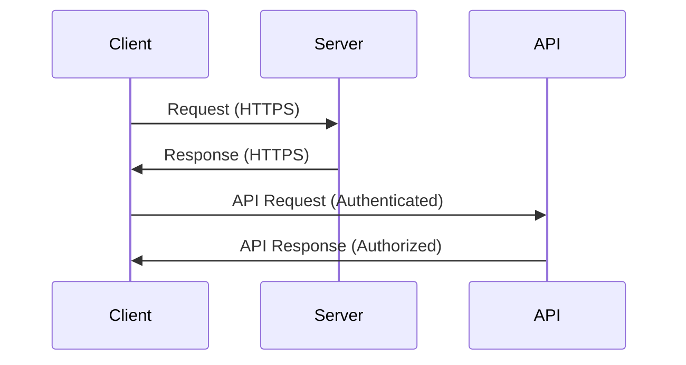

## 19.9 Security in Web Applications and APIs

In today's digital landscape, securing web applications and APIs is paramount. As developers, we must ensure that our applications are not only functional but also resilient against various security threats. This section delves into the essential security practices for web applications and APIs, focusing on HTTPS enforcement, API security, and content security policies, all within the context of Julia programming.

### Introduction to Web Security

Web security involves protecting web applications and APIs from unauthorized access, data breaches, and other cyber threats. As Julia developers, we must be vigilant in implementing security measures to safeguard our applications and user data. Let's explore some foundational security concepts and practices.

### HTTPS Enforcement

**HTTPS (Hypertext Transfer Protocol Secure)** is a protocol for secure communication over a computer network. It encrypts the data exchanged between the client and server, ensuring confidentiality and integrity.

#### Why HTTPS Matters

- **Data Encryption**: HTTPS encrypts data, preventing eavesdroppers from intercepting sensitive information.
- **Data Integrity**: Ensures that data is not altered during transmission.
- **Authentication**: Confirms the identity of the communicating parties.
- **SEO Benefits**: Search engines favor HTTPS-enabled sites, improving visibility.

#### Implementing HTTPS in Julia

To enforce HTTPS in your Julia web applications, you can use the `HTTP.jl` package. Here's a basic example of setting up an HTTPS server:

```julia
using HTTP
using Sockets

cert = "path/to/certificate.pem"
key = "path/to/privatekey.pem"

HTTP.serve(HTTP.SSLConfig(cert, key)) do request::HTTP.Request
    return HTTP.Response(200, "Hello, secure world!")
end
```

**Key Points**:
- Ensure your SSL/TLS certificates are valid and up-to-date.
- Redirect all HTTP traffic to HTTPS to enforce secure connections.

### API Security

APIs (Application Programming Interfaces) are crucial for enabling communication between different software systems. Securing APIs is vital to prevent unauthorized access and data breaches.

#### Protecting Endpoints

- **Authentication**: Verify the identity of users or systems accessing the API.
- **Authorization**: Ensure users have the necessary permissions to access resources.
- **Rate Limiting**: Control the number of requests a client can make in a given time frame to prevent abuse.

#### Implementing API Security in Julia

Let's explore how to secure API endpoints using `Genie.jl`, a popular web framework for Julia.

```julia
using Genie
using Genie.Router

route("/api/secure", method = POST) do
    # Implement authentication logic
    if !authenticated(request)
        return HTTP.Response(401, "Unauthorized")
    end

    # Process the request
    return HTTP.Response(200, "Secure data")
end

function authenticated(req::HTTP.Request)
    # Example authentication logic
    token = getheader(req, "Authorization", "")
    return token == "valid_token"
end
```

**Key Points**:
- Use secure tokens (e.g., JWT) for authentication.
- Implement role-based access control (RBAC) for authorization.
- Monitor API usage and implement rate limiting to prevent abuse.

### Content Security Policies (CSP)

Content Security Policy (CSP) is a security feature that helps prevent cross-site scripting (XSS) and other code injection attacks by specifying which content sources are trusted.

#### Why CSP is Important

- **Mitigates XSS Attacks**: Prevents malicious scripts from executing on your site.
- **Reduces Data Injection Risks**: Limits the sources from which content can be loaded.

#### Implementing CSP in Julia

To implement CSP, you need to set the `Content-Security-Policy` HTTP header in your responses. Here's how you can do it using `HTTP.jl`:

```julia
using HTTP

function secure_response()
    headers = Dict("Content-Security-Policy" => "default-src 'self'; script-src 'self'; style-src 'self'")
    return HTTP.Response(200, "Secure content", headers)
end

HTTP.serve() do request::HTTP.Request
    return secure_response()
end
```

**Key Points**:
- Define a strict CSP policy that only allows trusted sources.
- Regularly review and update your CSP policy to adapt to new threats.

### Visualizing Web Security Concepts

To better understand the flow of securing web applications and APIs, let's visualize the process using a sequence diagram.



**Diagram Explanation**:
- The client communicates securely with the server using HTTPS.
- The client makes an authenticated request to the API.
- The API verifies the request and responds if authorized.

### Best Practices for Web Security

- **Regularly Update Dependencies**: Keep your libraries and frameworks up-to-date to patch known vulnerabilities.
- **Use Strong Passwords and Hashing**: Implement secure password policies and use hashing algorithms like bcrypt.
- **Validate and Sanitize Inputs**: Prevent injection attacks by validating and sanitizing user inputs.
- **Monitor and Log Activity**: Keep track of access logs and monitor for suspicious activity.

### Try It Yourself

Experiment with the code examples provided. Try modifying the authentication logic or CSP policy to see how it affects security. Consider setting up a local HTTPS server and testing API endpoints with different authentication methods.

### References and Further Reading

- [OWASP: Open Web Application Security Project](https://owasp.org/)
- [Mozilla Developer Network: Web Security](https://developer.mozilla.org/en-US/docs/Web/Security)
- [HTTP.jl Documentation](https://juliaweb.github.io/HTTP.jl/stable/)

### Knowledge Check

- What is the primary purpose of HTTPS?
- How can you implement rate limiting in a Julia API?
- Why is CSP important for web security?

### Embrace the Journey

Remember, securing web applications and APIs is an ongoing process. Stay informed about the latest security threats and best practices. Keep experimenting, stay curious, and enjoy the journey of building secure applications with Julia!

---

## Quiz Time!



### What is the primary purpose of HTTPS?

- [x] Encrypt data between client and server
- [ ] Improve website loading speed
- [ ] Enhance website design
- [ ] Increase server storage capacity

> **Explanation:** HTTPS encrypts data exchanged between the client and server, ensuring confidentiality and integrity.

### Which of the following is a method to protect API endpoints?

- [x] Authentication
- [x] Rate Limiting
- [ ] Using HTTP instead of HTTPS
- [ ] Disabling logging

> **Explanation:** Authentication verifies user identity, and rate limiting controls request frequency to protect APIs.

### What does CSP stand for in web security?

- [x] Content Security Policy
- [ ] Central Security Protocol
- [ ] Cyber Security Plan
- [ ] Comprehensive Security Package

> **Explanation:** CSP stands for Content Security Policy, which helps prevent XSS and data injection attacks.

### How can you enforce HTTPS in a Julia web application?

- [x] Use SSL/TLS certificates with HTTP.jl
- [ ] Disable HTTP requests
- [ ] Use plain text communication
- [ ] Increase server bandwidth

> **Explanation:** Enforcing HTTPS involves using SSL/TLS certificates to secure communication.

### What is a benefit of using JWT for API authentication?

- [x] Secure token-based authentication
- [ ] Faster data processing
- [ ] Reduced server costs
- [ ] Improved graphics rendering

> **Explanation:** JWT provides secure token-based authentication for APIs.

### Which HTTP header is used to implement CSP?

- [x] Content-Security-Policy
- [ ] Authorization
- [ ] Accept-Language
- [ ] User-Agent

> **Explanation:** The Content-Security-Policy header is used to define CSP rules.

### Why is input validation important in web security?

- [x] Prevents injection attacks
- [ ] Speeds up data processing
- [ ] Enhances user interface
- [ ] Reduces server load

> **Explanation:** Input validation prevents injection attacks by ensuring data integrity.

### What is the role of rate limiting in API security?

- [x] Controls the number of requests a client can make
- [ ] Enhances data encryption
- [ ] Improves server uptime
- [ ] Increases data storage

> **Explanation:** Rate limiting controls request frequency to prevent abuse and ensure API security.

### Which of the following is a common web security threat?

- [x] Cross-Site Scripting (XSS)
- [ ] Data Compression
- [ ] Image Optimization
- [ ] Server Caching

> **Explanation:** Cross-Site Scripting (XSS) is a common web security threat that CSP helps mitigate.

### True or False: HTTPS improves SEO rankings.

- [x] True
- [ ] False

> **Explanation:** Search engines favor HTTPS-enabled sites, improving their visibility and SEO rankings.


