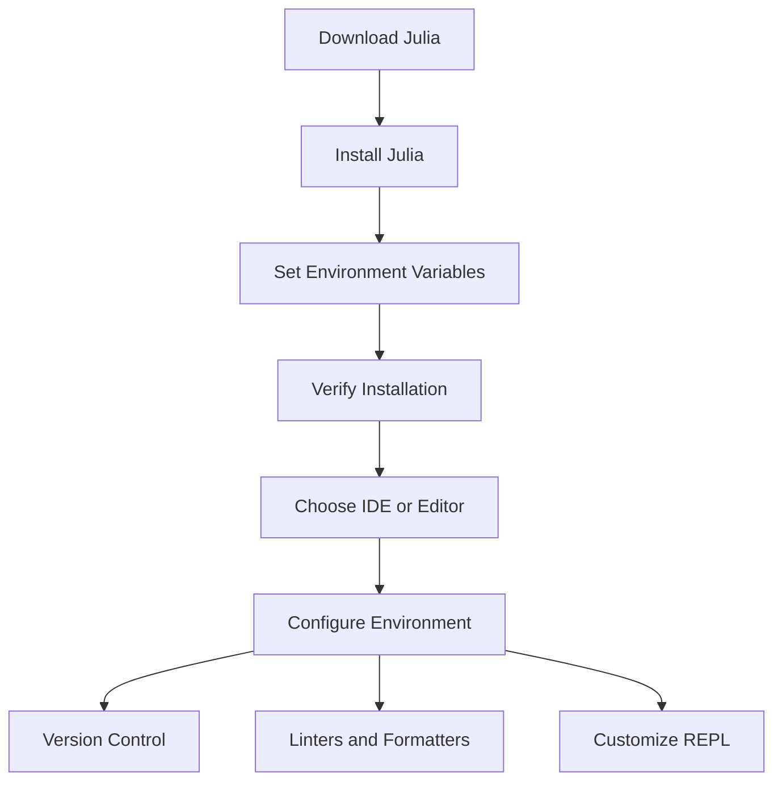

## 2.1 Installing Julia and Setting Up the Development Environment

Welcome to the exciting world of Julia programming! Before we dive into the intricacies of design patterns and best practices, let's ensure your development environment is set up correctly. This section will guide you through downloading and installing Julia on various operating systems, choosing the right Integrated Development Environment (IDE) or text editor, and configuring your environment for a seamless coding experience.

### Downloading Julia

Julia is a high-level, high-performance programming language for technical computing. It is open-source and free to use. Let's get started with the installation process on different platforms.

#### Installing Julia on Windows

1. **Download Julia**: Visit the [official Julia website](https://julialang.org/downloads/) and download the Windows installer. Choose the appropriate version for your system architecture (32-bit or 64-bit).

2. **Run the Installer**: Double-click the downloaded `.exe` file to start the installation process. Follow the on-screen instructions to complete the installation. By default, Julia will be installed in `C:\Users\<YourUsername>\AppData\Local\Programs\Julia`.

3. **Set Environment Variables**: To use Julia from the command line, add the Julia `bin` directory to your system's PATH environment variable. This allows you to run Julia from any command prompt window.

4. **Verify Installation**: Open a command prompt and type `julia`. If installed correctly, this should launch the Julia REPL (Read-Eval-Print Loop).

#### Installing Julia on macOS

1. **Download Julia**: Go to the [Julia downloads page](https://julialang.org/downloads/) and download the macOS `.dmg` file.

2. **Install Julia**: Open the downloaded `.dmg` file and drag the Julia app to your Applications folder.

3. **Add Julia to PATH**: To run Julia from the terminal, you need to add it to your PATH. Open Terminal and add the following line to your `.bash_profile` or `.zshrc` file, depending on your shell:
   ```bash
   export PATH="/Applications/Julia-1.x.app/Contents/Resources/julia/bin:$PATH"
   ```
   Replace `1.x` with your installed Julia version.

4. **Verify Installation**: Open a new terminal window and type `julia`. The Julia REPL should start, confirming a successful installation.

#### Installing Julia on Linux

1. **Download Julia**: Visit the [Julia downloads page](https://julialang.org/downloads/) and download the appropriate tarball for your Linux distribution.

2. **Extract the Tarball**: Open a terminal and navigate to the directory where the tarball was downloaded. Extract it using:
   ```bash
   tar -xvzf julia-1.x.x-linux-x86_64.tar.gz
   ```
   Replace `1.x.x` with the version number.

3. **Move to /opt**: Move the extracted folder to `/opt` for system-wide access:
   ```bash
   sudo mv julia-1.x.x /opt/
   ```

4. **Create a Symlink**: Create a symbolic link to make Julia accessible from anywhere:
   ```bash
   sudo ln -s /opt/julia-1.x.x/bin/julia /usr/local/bin/julia
   ```

5. **Verify Installation**: Type `julia` in the terminal to start the REPL and verify the installation.

### Choosing an IDE or Editor

Selecting the right development environment can significantly enhance your productivity. Let's explore some popular options for Julia development.

#### Visual Studio Code (VS Code)

VS Code is a lightweight, powerful code editor with excellent support for Julia through the Julia extension.

- **Installation**: Download and install [VS Code](https://code.visualstudio.com/).
- **Julia Extension**: Open VS Code, go to the Extensions view (`Ctrl+Shift+X`), and search for "Julia". Install the Julia extension by Julia Language.
- **Features**: The extension provides syntax highlighting, code completion, integrated REPL, and debugging support.

#### Atom with Juno

Atom is a hackable text editor that, when combined with the Juno package, offers a robust environment for Julia.

- **Installation**: Download and install [Atom](https://atom.io/).
- **Juno Package**: Open Atom, go to the Install Packages view, and search for "uber-juno". Install the package to enable Juno.
- **Features**: Juno offers an integrated REPL, plot pane, workspace viewer, and more.

#### Emacs

Emacs is a highly customizable text editor with support for Julia through the `julia-mode` package.

- **Installation**: Install Emacs from your system's package manager or download it from [GNU Emacs](https://www.gnu.org/software/emacs/).
- **Julia Mode**: Add the following to your Emacs configuration file to enable Julia support:
  ```emacs-lisp
  (use-package julia-mode
    :ensure t)
  ```
- **Features**: Syntax highlighting, REPL integration, and more.

### Configuring the Environment

Once you've chosen your IDE or editor, it's time to configure your development environment for efficiency and productivity.

#### Version Control with Git

Version control is essential for managing changes to your codebase. Git is the most widely used version control system.

- **Installation**: Install Git from [git-scm.com](https://git-scm.com/).
- **Configuration**: Set up your Git username and email:
  ```bash
  git config --global user.name "Your Name"
  git config --global user.email "you@example.com"
  ```

#### Linters and Formatters

Linters and formatters help maintain code quality by enforcing coding standards and style.

- **JuliaFormatter.jl**: A popular formatter for Julia code. Install it using Julia's package manager:
  ```julia
  using Pkg
  Pkg.add("JuliaFormatter")
  ```
- **Lint.jl**: A linter for Julia code. Install it similarly:
  ```julia
  using Pkg
  Pkg.add("Lint")
  ```

#### Setting Up the Julia REPL

The Julia REPL is a powerful tool for interactive programming. Customize it to suit your workflow.

- **Startup File**: Create a `.julia/config/startup.jl` file to run custom code at startup. For example, load frequently used packages:
  ```julia
  using LinearAlgebra
  using Statistics
  ```

- **REPL Modes**: Julia's REPL supports various modes, such as shell mode (`;`) and help mode (`?`). Use these to enhance your productivity.

### Visualizing the Setup Process

To better understand the setup process, let's visualize the steps involved in setting up Julia and configuring your development environment.



**Diagram Explanation**: This flowchart illustrates the sequential steps to install Julia, choose an IDE, and configure your development environment for optimal performance.

### Try It Yourself

Now that you've set up your Julia environment, try running a simple Julia script to ensure everything is working correctly.

```julia
println("Hello, Julia World!")
```

- **Experiment**: Modify the script to print your name or perform a simple calculation. This will help you get comfortable with the Julia REPL and script execution.

### References and Links

For further reading and resources, consider exploring the following:

- [JuliaLang Official Documentation](https://docs.julialang.org/)
- [Julia VS Code Extension](https://marketplace.visualstudio.com/items?itemName=julialang.language-julia)
- [Juno for Atom](http://junolab.org/)
- [GNU Emacs](https://www.gnu.org/software/emacs/)

### Knowledge Check

Before moving on, let's reinforce what we've learned with a few questions:

- What are the steps to install Julia on Windows?
- How do you add Julia to your PATH on macOS?
- Which IDEs are popular for Julia development?
- How can you configure Git for version control?
- What is the purpose of linters and formatters?

### Embrace the Journey

Remember, setting up your development environment is just the beginning. As you progress, you'll explore more complex Julia features and design patterns. Keep experimenting, stay curious, and enjoy the journey!

## Quiz Time!



### What is the first step in installing Julia on Windows?

- [x] Download the Windows installer from the official Julia website.
- [ ] Run the installer directly from the browser.
- [ ] Set environment variables before downloading.
- [ ] Install an IDE first.

> **Explanation:** The first step is to download the installer from the official Julia website.

### How do you verify Julia installation on macOS?

- [x] Open a terminal and type `julia`.
- [ ] Check the Applications folder for Julia.
- [ ] Run a Julia script from Finder.
- [ ] Use Spotlight to search for Julia.

> **Explanation:** Typing `julia` in the terminal should start the REPL, confirming the installation.

### Which IDE provides an integrated REPL for Julia?

- [x] Visual Studio Code with the Julia extension.
- [ ] Notepad++.
- [ ] Sublime Text.
- [ ] Microsoft Word.

> **Explanation:** VS Code with the Julia extension provides an integrated REPL.

### What is the purpose of adding Julia to the PATH?

- [x] To run Julia from any command line or terminal window.
- [ ] To improve Julia's performance.
- [ ] To enable syntax highlighting.
- [ ] To install additional packages.

> **Explanation:** Adding Julia to the PATH allows it to be run from any command line interface.

### Which package is used for formatting Julia code?

- [x] JuliaFormatter.jl
- [ ] Lint.jl
- [ ] PyCall.jl
- [ ] DataFrames.jl

> **Explanation:** JuliaFormatter.jl is used for formatting Julia code.

### What is the role of linters in coding?

- [x] To enforce coding standards and style.
- [ ] To execute code faster.
- [ ] To create graphical interfaces.
- [ ] To manage project dependencies.

> **Explanation:** Linters help maintain code quality by enforcing standards and style.

### How can you customize the Julia REPL?

- [x] By creating a `.julia/config/startup.jl` file.
- [ ] By installing additional hardware.
- [ ] By using a different operating system.
- [ ] By changing the screen resolution.

> **Explanation:** The `.julia/config/startup.jl` file allows customization of the REPL.

### What is the function of the `git config` command?

- [x] To set up Git username and email.
- [ ] To install Git on the system.
- [ ] To create a new repository.
- [ ] To delete a branch.

> **Explanation:** `git config` is used to set up user information for Git.

### Which editor is known for its hackability and support for Julia through Juno?

- [x] Atom
- [ ] VS Code
- [ ] Emacs
- [ ] Nano

> **Explanation:** Atom, combined with Juno, provides robust support for Julia.

### True or False: Emacs requires a separate package to support Julia syntax highlighting.

- [x] True
- [ ] False

> **Explanation:** Emacs requires the `julia-mode` package for Julia syntax highlighting.


