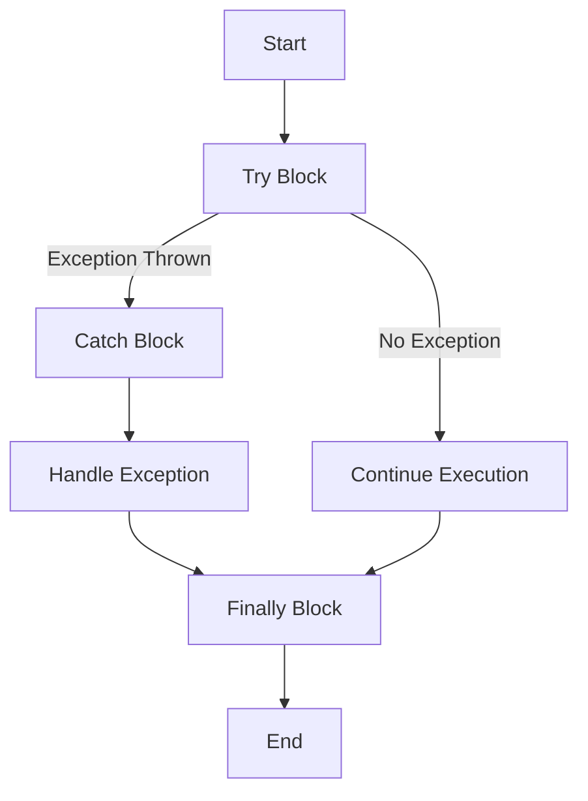

## 2.10 Error Handling and Exceptions

Error handling is a crucial aspect of software development, ensuring that programs can gracefully manage unexpected situations and continue to operate or fail safely. In Julia, error handling is primarily managed through exceptions, which are objects that represent an error or unexpected event. This section will guide you through the mechanisms Julia provides for error handling, including the use of try-catch blocks, throwing exceptions, and best practices for writing robust and maintainable code.

### The Try-Catch Block

The try-catch block is a fundamental construct in Julia for handling exceptions. It allows you to execute a block of code and catch any exceptions that occur, enabling you to handle errors gracefully.

#### Syntax and Usage

The basic syntax of a try-catch block in Julia is as follows:

```julia
try
    # Code that might throw an exception
catch e
    # Code to handle the exception
    println("An error occurred: ", e)
finally
    # Code that will always run, regardless of whether an exception was thrown
    println("Execution completed.")
end
```

- **try**: This block contains the code that might throw an exception.
- **catch**: This block is executed if an exception is thrown in the try block. The exception object is typically captured in a variable (e.g., `e`).
- **finally**: This optional block contains code that will always be executed, regardless of whether an exception was thrown. It's useful for cleanup operations.

#### Example: Handling Division by Zero

Let's consider a simple example where we handle a division by zero error:

```julia
function safe_divide(a, b)
    try
        result = a / b
        println("Result: ", result)
    catch e
        println("Caught an exception: ", e)
    finally
        println("Division attempt completed.")
    end
end

safe_divide(10, 0)
```

In this example, the division by zero will throw a `DivideError`, which is caught in the catch block, allowing us to print a custom error message.

### Throwing Exceptions

In Julia, you can throw exceptions using the `throw` function. This is useful when you want to signal an error condition explicitly.

#### Using `throw`

The `throw` function is used to raise an exception. You can throw built-in exceptions or define your own custom exceptions.

```julia
function check_positive(x)
    if x < 0
        throw(ArgumentError("x must be non-negative"))
    end
    println("x is positive")
end

check_positive(-5)
```

In this example, if `x` is negative, an `ArgumentError` is thrown with a custom message.

#### Defining Custom Exception Types

Julia allows you to define custom exception types by creating new types that inherit from `Exception`. This is useful for creating domain-specific errors.

```julia
struct MyCustomError <: Exception
    msg::String
end

function risky_operation()
    throw(MyCustomError("Something went wrong"))
end

try
    risky_operation()
catch e
    println("Caught a custom exception: ", e.msg)
end
```

Here, `MyCustomError` is a custom exception type with a message field. When thrown, it can be caught and handled like any other exception.

### Best Practices for Error Handling

Effective error handling involves more than just catching exceptions. It requires thoughtful design to ensure that your program can recover gracefully from errors and provide informative feedback to users.

#### Graceful Error Recovery

1. **Anticipate Errors**: Identify potential error conditions and handle them proactively.
2. **Use Specific Exceptions**: Catch specific exceptions rather than using a generic catch-all. This allows for more precise error handling.
3. **Fallback Strategies**: Implement fallback strategies to recover from errors, such as retrying operations or using default values.

#### Informative Error Messages

1. **Be Descriptive**: Provide clear and descriptive error messages that help users understand what went wrong.
2. **Include Context**: Include relevant context in error messages, such as variable values or operation details.
3. **Avoid Technical Jargon**: Use language that is understandable to the intended audience.

#### Example: Robust File Reading

Consider a function that reads data from a file. We'll implement error handling to manage potential issues, such as file not found or read errors.

```julia
function read_file(filename)
    try
        open(filename, "r") do file
            for line in eachline(file)
                println(line)
            end
        end
    catch e
        if isa(e, SystemError)
            println("System error: ", e)
        elseif isa(e, IOError)
            println("I/O error: ", e)
        else
            println("Unexpected error: ", e)
        end
    finally
        println("File read operation completed.")
    end
end

read_file("nonexistent.txt")
```

In this example, we handle different types of errors separately, providing specific messages for system and I/O errors.

### Visualizing Error Handling Flow

To better understand the flow of error handling in Julia, let's visualize the process using a flowchart.



**Figure 1: Error Handling Flow in Julia**

This flowchart illustrates the sequence of execution in a try-catch block, showing how exceptions are caught and handled.

### Try It Yourself

Experiment with the code examples provided. Try modifying the `safe_divide` function to handle other types of exceptions, or create your own custom exception type and see how it can be used in a program.

### References and Links

- [Julia Documentation on Error Handling](https://docs.julialang.org/en/v1/manual/control-flow/#Exception-Handling)
- [MDN Web Docs on Error Handling](https://developer.mozilla.org/en-US/docs/Web/JavaScript/Guide/Control_flow_and_error_handling#Exception_handling_statements)

### Knowledge Check

1. What is the purpose of a try-catch block in Julia?
2. How can you throw a custom exception in Julia?
3. Why is it important to provide informative error messages?

### Embrace the Journey

Remember, mastering error handling is a journey. As you continue to develop your skills, you'll become more adept at writing robust and resilient code. Keep experimenting, stay curious, and enjoy the process!

## Quiz Time!



### What is the primary purpose of a try-catch block in Julia?

- [x] To handle exceptions and errors gracefully
- [ ] To execute code in parallel
- [ ] To optimize performance
- [ ] To define custom types

> **Explanation:** A try-catch block is used to handle exceptions and errors gracefully, allowing the program to continue or fail safely.

### How do you throw an exception in Julia?

- [x] Using the `throw` function
- [ ] Using the `raise` function
- [ ] Using the `error` function
- [ ] Using the `catch` function

> **Explanation:** The `throw` function is used to raise exceptions in Julia.

### Which block in a try-catch structure always executes?

- [x] finally
- [ ] try
- [ ] catch
- [ ] except

> **Explanation:** The `finally` block always executes, regardless of whether an exception was thrown.

### What is a best practice for error messages?

- [x] Be descriptive and include context
- [ ] Use technical jargon
- [ ] Be vague to avoid confusion
- [ ] Use generic messages

> **Explanation:** Error messages should be descriptive and include context to help users understand what went wrong.

### How can you define a custom exception type in Julia?

- [x] By creating a new type that inherits from `Exception`
- [ ] By using the `custom` keyword
- [ ] By modifying the `Exception` type directly
- [ ] By using the `define` function

> **Explanation:** Custom exception types are defined by creating a new type that inherits from `Exception`.

### What should you do when catching exceptions?

- [x] Handle specific exceptions rather than using a generic catch-all
- [ ] Ignore the exception and continue
- [ ] Always terminate the program
- [ ] Log the exception without handling it

> **Explanation:** Handling specific exceptions allows for more precise error handling.

### What is the role of the `finally` block?

- [x] To execute cleanup operations
- [ ] To catch exceptions
- [ ] To define custom exceptions
- [ ] To optimize code execution

> **Explanation:** The `finally` block is used for cleanup operations that should always occur.

### What is an example of a fallback strategy?

- [x] Retrying an operation
- [ ] Ignoring the error
- [ ] Throwing a new exception
- [ ] Logging the error

> **Explanation:** A fallback strategy like retrying an operation helps recover from errors.

### Why is it important to anticipate errors?

- [x] To handle them proactively and prevent program crashes
- [ ] To increase code complexity
- [ ] To make debugging easier
- [ ] To reduce code readability

> **Explanation:** Anticipating errors allows you to handle them proactively and prevent program crashes.

### True or False: The `catch` block is optional in a try-catch structure.

- [ ] True
- [x] False

> **Explanation:** The `catch` block is not optional; it is required to handle exceptions.


