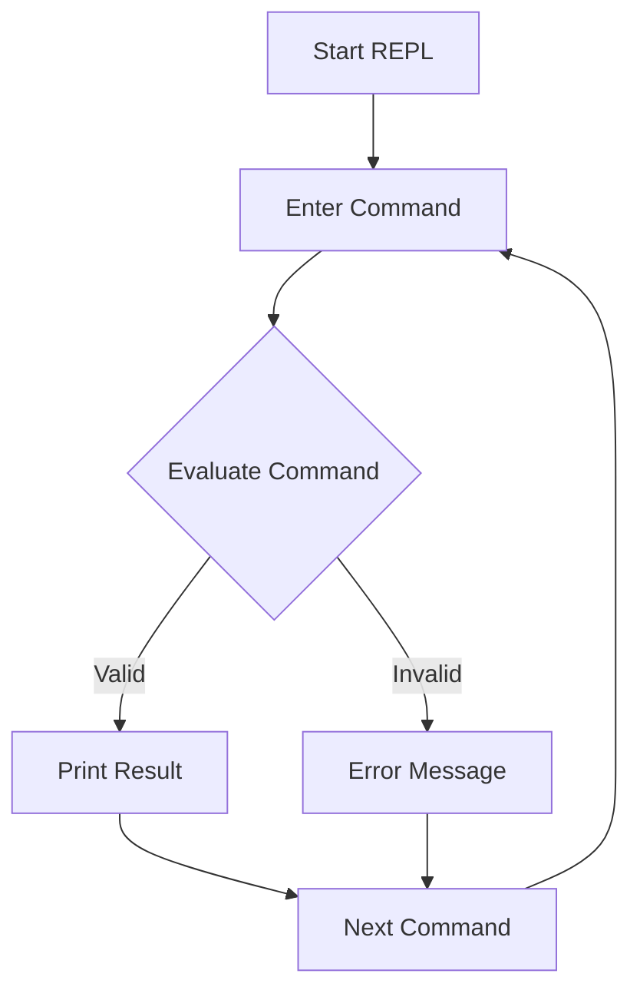

## 2.2 Exploring the Julia REPL and Interactive Usage

The Julia REPL (Read-Eval-Print Loop) is an interactive command-line interface that allows developers to execute Julia commands and see results immediately. It is a powerful tool for experimenting with code, testing functions, and exploring the Julia language. In this section, we will explore the features of the Julia REPL, its various modes, and productivity tips to enhance your interactive programming experience.

### Introduction to the REPL

The REPL is an integral part of the Julia programming environment, providing a dynamic and interactive way to work with the language. It allows you to enter expressions, execute them, and see the results instantly. This immediate feedback loop is invaluable for learning, debugging, and rapid prototyping.

#### Benefits of Using the REPL

- **Immediate Feedback**: Execute code and see results instantly, which is ideal for testing and debugging.
- **Interactive Exploration**: Experiment with new ideas and concepts without the need for a full development environment.
- **Convenience**: Quickly perform calculations, test functions, and explore libraries.
- **Customization**: Tailor the REPL environment to suit your workflow with custom configurations and scripts.

### REPL Modes

The Julia REPL offers several modes that provide different functionalities. Understanding these modes will help you leverage the full power of the REPL.

#### 1. Normal Mode

This is the default mode when you start the Julia REPL. You can enter any valid Julia expression, and it will be evaluated immediately.

```julia
julia> 2 + 2
4

julia> println("Hello, Julia!")
Hello, Julia!
```

#### 2. Help Mode (`?`)

Help mode is activated by typing `?`. It allows you to access documentation for functions and types directly from the REPL.

```julia
julia> ?
help?> println
search: println print_with_color printstyled print print_shortest print_matrix print_to_string

  println([io::IO], xs...)

  Print (using print) xs followed by a newline. If io is not supplied, prints to stdout.
```

#### 3. Shell Mode (`;`)

Shell mode lets you execute shell commands directly from the REPL. This is useful for performing system tasks without leaving the Julia environment.

```julia
julia> ;
shell> ls
Desktop  Documents  Downloads  Music  Pictures  Videos
```

#### 4. Package Mode (`]`)

Package mode is used for managing Julia packages. You can add, remove, and update packages using this mode.

```julia
julia> ]
pkg> add DataFrames
```

### Productivity Tips

To maximize your efficiency in the Julia REPL, consider the following productivity tips:

#### Customizing the REPL

You can customize the REPL to enhance your workflow. This includes setting up a `.julia/config/startup.jl` file to execute custom scripts or configurations every time you start the REPL.

```julia
println("Welcome to Julia!")
using Revise
```

#### Using History and Tab Completion

The REPL keeps a history of commands, which you can navigate using the up and down arrow keys. This allows you to quickly re-execute previous commands.

Tab completion is another powerful feature that helps you complete variable names, function names, and paths. Simply start typing and press `Tab` to see suggestions.

```julia
julia> pri[TAB]
print       println
```

### Visualizing the REPL Workflow

To better understand how the REPL operates, let's visualize its workflow using a flowchart.



**Figure 1**: The workflow of the Julia REPL, illustrating the cycle of entering commands, evaluating them, and printing results or errors.

### Try It Yourself

To get the most out of this section, try experimenting with the REPL on your own:

1. **Explore Help Mode**: Use `?` to look up documentation for different functions and types.
2. **Execute Shell Commands**: Try running some shell commands using `;`.
3. **Manage Packages**: Use `]` to add or update a package.
4. **Customize Your REPL**: Create a `startup.jl` file and add some custom configurations.

### References and Links

- [Julia Documentation: REPL](https://docs.julialang.org/en/v1/stdlib/REPL/)
- [JuliaLang: Getting Started](https://julialang.org/learning/getting-started/)
- [MDN Web Docs: Command Line Interface](https://developer.mozilla.org/en-US/docs/Glossary/Command_line_interface)

### Knowledge Check

- **What is the primary purpose of the Julia REPL?**
- **How do you access help mode in the REPL?**
- **What is the benefit of using shell mode?**
- **How can you customize the REPL environment?**

### Embrace the Journey

Remember, the REPL is just the beginning of your Julia journey. As you become more familiar with its features, you'll find it an indispensable tool for development. Keep experimenting, stay curious, and enjoy the process of learning and discovery!

## Quiz Time!



### What does REPL stand for in Julia?

- [x] Read-Eval-Print Loop
- [ ] Run-Execute-Print Loop
- [ ] Read-Execute-Print Loop
- [ ] Run-Evaluate-Print Loop

> **Explanation:** REPL stands for Read-Eval-Print Loop, which describes the process of reading user input, evaluating it, and printing the result.

### How do you enter help mode in the Julia REPL?

- [x] By typing `?`
- [ ] By typing `;`
- [ ] By typing `]`
- [ ] By typing `!`

> **Explanation:** Typing `?` in the Julia REPL switches to help mode, allowing you to access documentation.

### Which mode allows you to execute shell commands in the REPL?

- [x] Shell mode
- [ ] Help mode
- [ ] Package mode
- [ ] Normal mode

> **Explanation:** Shell mode, activated by typing `;`, allows you to execute shell commands directly from the REPL.

### What is the purpose of package mode in the REPL?

- [x] To manage Julia packages
- [ ] To execute shell commands
- [ ] To access documentation
- [ ] To run scripts

> **Explanation:** Package mode, accessed by typing `]`, is used for managing Julia packages, such as adding or updating them.

### How can you customize the Julia REPL?

- [x] By creating a `startup.jl` file
- [ ] By modifying the REPL source code
- [ ] By installing a custom REPL package
- [ ] By using a different terminal emulator

> **Explanation:** You can customize the Julia REPL by creating a `startup.jl` file in the `.julia/config` directory to execute custom scripts or configurations.

### What is the benefit of using tab completion in the REPL?

- [x] To quickly complete variable and function names
- [ ] To execute commands faster
- [ ] To switch between modes
- [ ] To access documentation

> **Explanation:** Tab completion helps you quickly complete variable names, function names, and paths, enhancing productivity.

### Which key allows you to navigate through command history in the REPL?

- [x] Up arrow key
- [ ] Down arrow key
- [ ] Left arrow key
- [ ] Right arrow key

> **Explanation:** The up arrow key allows you to navigate through the command history in the REPL.

### What is the default mode when you start the Julia REPL?

- [x] Normal mode
- [ ] Help mode
- [ ] Shell mode
- [ ] Package mode

> **Explanation:** The default mode when you start the Julia REPL is normal mode, where you can enter and evaluate Julia expressions.

### True or False: The REPL can only be used for executing Julia code.

- [ ] True
- [x] False

> **Explanation:** False. The REPL can also be used for executing shell commands, managing packages, and accessing documentation.

### What is the primary advantage of using the REPL for learning Julia?

- [x] Immediate feedback and interactive exploration
- [ ] Access to advanced debugging tools
- [ ] Ability to run large-scale applications
- [ ] Integration with other programming languages

> **Explanation:** The primary advantage of using the REPL is the immediate feedback and interactive exploration it provides, which is ideal for learning and experimenting with Julia.




