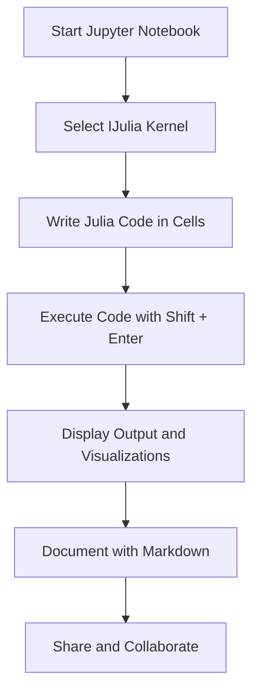

## 2.3 Using Julia with Jupyter Notebooks (IJulia)

Jupyter Notebooks have become a staple in the data science and scientific computing communities due to their interactive nature and ability to combine code execution, rich text, and visualizations in a single document. In this section, we will explore how to leverage the power of Julia within Jupyter Notebooks using the IJulia kernel. We will guide you through setting up IJulia, demonstrate the benefits of using notebooks for data exploration and visualization, and cover basic operations to get you started.

### Setting Up IJulia

#### Installing Jupyter and IJulia

To begin using Julia with Jupyter Notebooks, you need to install the Jupyter platform and the IJulia kernel. Follow these steps to set up your environment:

1. **Install Julia**: Ensure you have Julia installed on your system. You can download it from the [official Julia website](https://julialang.org/downloads/).

2. **Install Jupyter**: Jupyter can be installed using Python's package manager, pip. If you don't have Python installed, you can use the Anaconda distribution, which includes Jupyter.

   ```bash
   pip install jupyter
   ```

3. **Install IJulia**: Open the Julia REPL and add the IJulia package.

   ```julia
   using Pkg
   Pkg.add("IJulia")
   ```

4. **Launch Jupyter Notebook**: Once IJulia is installed, you can launch Jupyter Notebook from the Julia REPL:

   ```julia
   using IJulia
   notebook()
   ```

   This command will open a new tab in your default web browser with the Jupyter Notebook interface.

#### Configuring the IJulia Kernel

The IJulia kernel allows you to run Julia code within Jupyter Notebooks. By default, IJulia should be configured correctly after installation. However, if you encounter issues, you can manually specify the path to your Julia executable by editing the `kernel.json` file located in the Jupyter kernels directory.

### Benefits of Notebooks

Jupyter Notebooks offer several advantages for data exploration, visualization, and sharing results:

- **Interactive Exploration**: Notebooks allow you to run code in small, manageable chunks, making it easy to experiment and iterate on your analysis.
- **Rich Visualizations**: You can embed plots and interactive visualizations directly within the notebook, providing immediate feedback and insights.
- **Documentation and Sharing**: Combine code, text, and visualizations in a single document, making it easy to document your workflow and share results with others.
- **Reproducibility**: Notebooks provide a linear, step-by-step record of your analysis, enhancing reproducibility.

### Basic Operations

#### Running Code Cells

In Jupyter Notebooks, code is organized into cells. You can execute a cell by selecting it and pressing `Shift + Enter`. This will run the code and display the output directly below the cell.

```julia
a = 10
b = 20
a + b
```

#### Displaying Plots

Julia's plotting libraries, such as Plots.jl and Makie.jl, integrate seamlessly with Jupyter Notebooks. You can generate and display plots inline within the notebook.

```julia
using Plots

x = 0:0.1:2π
y = sin.(x)
plot(x, y, title="Sine Wave", xlabel="x", ylabel="sin(x)")
```

#### Integrating Markdown

Jupyter Notebooks support Markdown, allowing you to add formatted text, lists, links, and images to your notebook. This is useful for documenting your analysis and providing context.

```markdown
## Analysis of Sine Wave
The plot above shows a simple sine wave generated using Julia's Plots.jl library.
```

### Visualizing Julia's Integration with Jupyter Notebooks

To better understand how Julia integrates with Jupyter Notebooks, let's visualize the workflow using a Mermaid.js diagram.



**Diagram Description**: This flowchart illustrates the typical workflow when using Julia with Jupyter Notebooks. You start by launching Jupyter, select the IJulia kernel, write and execute Julia code, visualize outputs, document with Markdown, and finally share your notebook.

### Try It Yourself

To deepen your understanding, try modifying the code examples provided:

- Change the arithmetic operation in the first code cell to subtraction or multiplication.
- Experiment with different functions in the plotting example, such as `cos` or `tan`.
- Add a Markdown cell to describe your changes and observations.

### References and Links

- [Jupyter Documentation](https://jupyter.org/documentation)
- [IJulia GitHub Repository](https://github.com/JuliaLang/IJulia.jl)
- [Plots.jl Documentation](https://docs.juliaplots.org/latest/)

### Knowledge Check

1. What are the primary benefits of using Jupyter Notebooks for data exploration?
2. How do you install the IJulia kernel in Julia?
3. Describe the process of running a code cell in Jupyter Notebooks.
4. How can you integrate Markdown into your Jupyter Notebook?

### Embrace the Journey

Remember, this is just the beginning of your journey with Julia and Jupyter Notebooks. As you become more familiar with these tools, you'll be able to create more complex analyses and visualizations. Keep experimenting, stay curious, and enjoy the process!

## Quiz Time!



### What is the primary purpose of the IJulia kernel?

- [x] To run Julia code within Jupyter Notebooks
- [ ] To compile Julia code into executables
- [ ] To convert Julia code into Python
- [ ] To provide a graphical interface for Julia

> **Explanation:** The IJulia kernel allows you to execute Julia code within Jupyter Notebooks, enabling interactive computing and data exploration.

### How do you execute a code cell in Jupyter Notebooks?

- [x] Press `Shift + Enter`
- [ ] Click the "Run" button
- [ ] Press `Ctrl + Enter`
- [ ] Double-click the cell

> **Explanation:** Pressing `Shift + Enter` runs the current cell and moves to the next one, a standard operation in Jupyter Notebooks.

### Which library is commonly used for plotting in Julia within Jupyter Notebooks?

- [x] Plots.jl
- [ ] NumPy
- [ ] Matplotlib
- [ ] Pandas

> **Explanation:** Plots.jl is a popular plotting library in Julia that integrates well with Jupyter Notebooks for creating visualizations.

### What is the advantage of using Markdown in Jupyter Notebooks?

- [x] To add formatted text and documentation
- [ ] To execute Python code
- [ ] To compile Julia code
- [ ] To create interactive widgets

> **Explanation:** Markdown allows you to add formatted text, lists, links, and images, enhancing the documentation and readability of your notebook.

### What command is used to launch Jupyter Notebook from the Julia REPL?

- [x] `notebook()`
- [ ] `launch()`
- [ ] `start()`
- [ ] `open()`

> **Explanation:** The `notebook()` function from the IJulia package is used to launch Jupyter Notebook from the Julia REPL.

### Which of the following is NOT a benefit of using Jupyter Notebooks?

- [ ] Interactive exploration
- [ ] Rich visualizations
- [ ] Reproducibility
- [x] Compiling code into executables

> **Explanation:** Jupyter Notebooks are designed for interactive exploration and visualization, not for compiling code into executables.

### What is the first step in setting up IJulia?

- [x] Install Julia
- [ ] Install Python
- [ ] Install R
- [ ] Install MATLAB

> **Explanation:** The first step is to have Julia installed on your system, as IJulia is a Julia package.

### How can you manually specify the path to the Julia executable for IJulia?

- [x] Edit the `kernel.json` file
- [ ] Use the `julia_path` command
- [ ] Modify the `jupyter_config` file
- [ ] Set the `JULIA_HOME` environment variable

> **Explanation:** If there are issues with the IJulia kernel, you can manually specify the path to the Julia executable by editing the `kernel.json` file.

### True or False: Jupyter Notebooks can only be used with Python.

- [ ] True
- [x] False

> **Explanation:** Jupyter Notebooks support multiple languages through different kernels, including Julia, R, and more.

### What is the main advantage of using IJulia for data visualization?

- [x] Seamless integration of plots and code
- [ ] Faster execution of code
- [ ] Automatic code optimization
- [ ] Built-in machine learning algorithms

> **Explanation:** IJulia allows for seamless integration of plots and code, making it ideal for data visualization and exploration.




