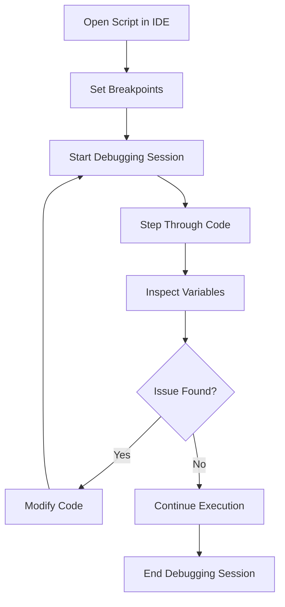

## 2.4 Running and Debugging Julia Scripts

Running and debugging scripts are fundamental skills for any Julia developer. In this section, we will explore how to execute Julia scripts from the command line, handle command-line arguments, and leverage powerful debugging tools to troubleshoot and optimize your code. Whether you're a beginner or an expert, mastering these techniques will enhance your productivity and code quality.

### Executing Scripts

Julia scripts are typically saved with a `.jl` extension and can be executed directly from the command line. This allows for efficient testing and deployment of your code. Let's explore how to run these scripts and pass arguments to them.

#### Running Julia Scripts from the Command Line

To execute a Julia script, open your terminal or command prompt and navigate to the directory containing your script. Use the following command to run your script:

```bash
julia my_script.jl
```

This command will execute the `my_script.jl` file using the Julia interpreter. Ensure that the Julia executable is in your system's PATH for this command to work seamlessly.

#### Passing Arguments to Julia Scripts

Often, you may need to pass arguments to your script to modify its behavior without changing the code. Julia provides a straightforward way to handle command-line arguments using the `ARGS` array.

Consider the following example script, `greet.jl`, which takes a name as an argument and prints a greeting:

```julia
if length(ARGS) == 0
    println("Usage: julia greet.jl <name>")
else
    name = ARGS[1]
    println("Hello, $name!")
end
```

To run this script with an argument, use the following command:

```bash
julia greet.jl Alice
```

This will output:

```
Hello, Alice!
```

The `ARGS` array contains all the arguments passed to the script, allowing you to access and manipulate them as needed.

### Debugging Tools

Debugging is a critical aspect of software development, enabling you to identify and fix errors in your code. Julia offers several tools for debugging, with Debugger.jl being one of the most powerful and widely used.

#### Introduction to Debugger.jl

Debugger.jl is a comprehensive debugging package for Julia that integrates seamlessly with various Integrated Development Environments (IDEs) such as Visual Studio Code and Juno. It provides features like breakpoints, step execution, and variable inspection, making it an indispensable tool for developers.

##### Installing Debugger.jl

To get started with Debugger.jl, you need to install it using Julia's package manager. Open the Julia REPL and run the following command:

```julia
using Pkg
Pkg.add("Debugger")
```

Once installed, you can start using Debugger.jl in your scripts and IDEs.

##### Basic Debugging Workflow

Let's walk through a basic debugging workflow using Debugger.jl. Consider the following script, `factorial.jl`, which calculates the factorial of a number:

```julia
function factorial(n::Int)
    if n < 0
        error("Factorial is not defined for negative numbers")
    elseif n == 0
        return 1
    else
        return n * factorial(n - 1)
    end
end

println(factorial(5))
```

To debug this script, follow these steps:

1. **Set Breakpoints**: Open the script in your IDE and set breakpoints at lines where you want to pause execution. For example, set a breakpoint at the line `return n * factorial(n - 1)`.

2. **Start Debugging**: Use the IDE's debugging interface to start the debugging session. This will execute the script and pause at the breakpoints.

3. **Step Through Code**: Use the step-over, step-into, and step-out functions to navigate through your code. This allows you to observe the flow of execution and inspect variables at each step.

4. **Inspect Variables**: Examine the values of variables at different points in the code to identify any discrepancies or errors.

5. **Modify and Continue**: If you identify an issue, modify the code and continue execution to test your changes.

##### Debugging in Visual Studio Code

Visual Studio Code (VS Code) is a popular IDE for Julia development, offering robust support for debugging with Debugger.jl. To set up debugging in VS Code, follow these steps:

1. **Install Julia Extension**: Ensure that the Julia extension for VS Code is installed. This extension provides syntax highlighting, code completion, and debugging support.

2. **Configure Launch Settings**: Create a `launch.json` file in the `.vscode` directory of your project. This file defines the configuration for debugging sessions. Here is a sample configuration:

   ```json
   {
       "version": "0.2.0",
       "configurations": [
           {
               "type": "julia",
               "request": "launch",
               "name": "Launch Julia Script",
               "program": "${workspaceFolder}/factorial.jl"
           }
       ]
   }
   ```

3. **Start Debugging**: Open the script you want to debug and press `F5` to start the debugging session. Use the debugging controls to manage breakpoints and step through your code.

##### Debugging in Juno

Juno is another powerful IDE for Julia, built on the Atom editor. It offers integrated debugging support with Debugger.jl. To debug in Juno, follow these steps:

1. **Install Juno**: Ensure that Juno is installed and configured for Julia development.

2. **Open the Script**: Open the script you want to debug in Juno.

3. **Set Breakpoints**: Click on the line numbers to set breakpoints where you want to pause execution.

4. **Start Debugging**: Use the debugging toolbar to start the debugging session and control execution flow.

5. **Inspect Variables**: Use the workspace panel to inspect variables and their values during execution.

### Visualizing the Debugging Process

To better understand the debugging process, let's visualize the workflow using a flowchart. This diagram illustrates the steps involved in setting breakpoints, starting a debugging session, and inspecting variables.



**Figure 1**: Debugging Workflow in Julia

### Try It Yourself

Now that we've covered the basics of running and debugging Julia scripts, it's time to put your skills to the test. Try modifying the `factorial.jl` script to handle additional edge cases, such as non-integer inputs. Use Debugger.jl to step through your code and verify that it behaves as expected.

### References and Links

- [Julia Documentation](https://docs.julialang.org/en/v1/)
- [Debugger.jl GitHub Repository](https://github.com/JuliaDebug/Debugger.jl)
- [Visual Studio Code Julia Extension](https://marketplace.visualstudio.com/items?itemName=julialang.language-julia)
- [Juno IDE](https://junolab.org/)

### Knowledge Check

Before we wrap up, let's reinforce what we've learned with a few questions and exercises.

- **Question**: How do you pass command-line arguments to a Julia script?
- **Exercise**: Modify the `greet.jl` script to accept multiple names and greet each one individually.

### Embrace the Journey

Remember, mastering the art of running and debugging Julia scripts is just the beginning. As you continue to explore and experiment, you'll gain deeper insights into the language and its capabilities. Stay curious, keep learning, and enjoy the journey!

## Quiz Time!



### How do you execute a Julia script from the command line?

- [x] `julia my_script.jl`
- [ ] `run my_script.jl`
- [ ] `execute my_script.jl`
- [ ] `start my_script.jl`

> **Explanation:** The correct command to execute a Julia script from the command line is `julia my_script.jl`.

### What is the purpose of the `ARGS` array in Julia?

- [x] To handle command-line arguments
- [ ] To store environment variables
- [ ] To manage script outputs
- [ ] To define global constants

> **Explanation:** The `ARGS` array in Julia is used to handle command-line arguments passed to the script.

### Which package is commonly used for debugging in Julia?

- [x] Debugger.jl
- [ ] PyCall.jl
- [ ] DataFrames.jl
- [ ] Plots.jl

> **Explanation:** Debugger.jl is a popular package used for debugging Julia scripts.

### What is the first step in a basic debugging workflow?

- [x] Set breakpoints
- [ ] Inspect variables
- [ ] Start debugging session
- [ ] Modify code

> **Explanation:** The first step in a basic debugging workflow is to set breakpoints where you want to pause execution.

### Which IDE is known for its robust support for Julia debugging?

- [x] Visual Studio Code
- [ ] Eclipse
- [ ] NetBeans
- [ ] IntelliJ IDEA

> **Explanation:** Visual Studio Code is known for its robust support for Julia debugging, especially with the Julia extension.

### How do you start a debugging session in Visual Studio Code?

- [x] Press `F5`
- [ ] Press `Ctrl+D`
- [ ] Press `Alt+S`
- [ ] Press `Shift+Enter`

> **Explanation:** In Visual Studio Code, you start a debugging session by pressing `F5`.

### What is the role of breakpoints in debugging?

- [x] To pause execution at specific lines
- [ ] To execute code faster
- [ ] To remove errors automatically
- [ ] To compile the script

> **Explanation:** Breakpoints are used to pause execution at specific lines, allowing you to inspect the state of the program.

### Which tool is used to inspect variables during debugging in Juno?

- [x] Workspace panel
- [ ] Terminal
- [ ] Console
- [ ] Editor

> **Explanation:** In Juno, the workspace panel is used to inspect variables during debugging.

### What should you do if you find an issue during debugging?

- [x] Modify the code and continue execution
- [ ] Restart the computer
- [ ] Ignore the issue
- [ ] Close the IDE

> **Explanation:** If you find an issue during debugging, you should modify the code and continue execution to test your changes.

### True or False: Debugger.jl can only be used in Visual Studio Code.

- [ ] True
- [x] False

> **Explanation:** False. Debugger.jl can be used in various IDEs, including Visual Studio Code and Juno.




