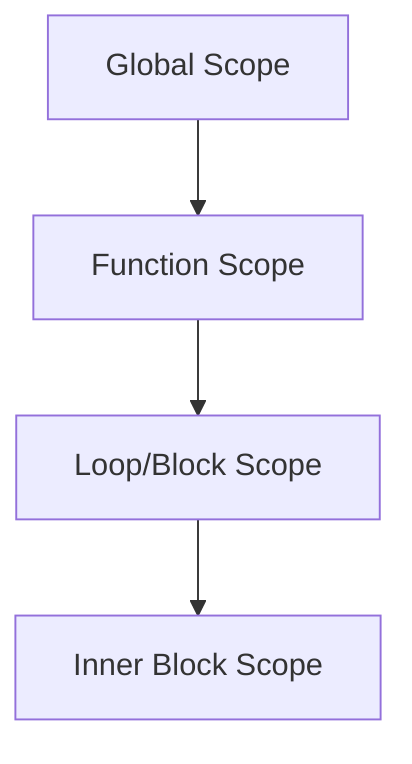

## 2.6 Variables, Types, and Scope

In this section, we will delve into the fundamental concepts of variables, types, and scope in Julia. Understanding these concepts is crucial for writing efficient, scalable, and maintainable code. We will explore the different data types available in Julia, how to use type annotations effectively, and the rules governing variable scope.

### Introduction to Variables in Julia

Variables are the building blocks of any programming language. In Julia, variables are used to store data that can be manipulated throughout your program. Let's start by understanding how to declare and use variables in Julia.

```julia
x = 10

println(x)  # Output: 10
```

In Julia, variables are dynamically typed, meaning you don't need to explicitly declare the type of a variable when you create it. The type is inferred from the value assigned to it.

### Data Types in Julia

Julia provides a rich set of data types that allow you to represent a wide range of values. Let's explore some of the primitive data types available in Julia.

#### Integer Types

Julia supports several integer types, including `Int8`, `Int16`, `Int32`, `Int64`, and `Int128`. The default integer type is `Int`, which is platform-dependent (either `Int32` or `Int64`).

```julia
a = 42          # Default integer type
b = Int8(127)   # 8-bit integer
c = Int64(1234) # 64-bit integer
```

#### Floating-Point Types

Floating-point numbers are used to represent real numbers. Julia supports `Float16`, `Float32`, and `Float64`, with `Float64` being the default.

```julia
x = 3.14        # Default floating-point type
y = Float32(2.71) # 32-bit floating-point
```

#### Boolean Type

The Boolean type in Julia is represented by `Bool`, with two possible values: `true` and `false`.

```julia
is_valid = true
is_empty = false
```

#### Character Type

Characters in Julia are represented by the `Char` type and are enclosed in single quotes.

```julia
letter = 'A'
```

#### String Type

Strings are sequences of characters and are represented by the `String` type.

```julia
greeting = "Hello, Julia!"
```

### Type Annotations

While Julia is dynamically typed, you can specify types explicitly using type annotations. This can help with code clarity and performance optimization.

#### Type Annotations for Variables

You can annotate the type of a variable by using a colon followed by the type.

```julia
x::Int = 10
```

#### Type Annotations for Functions

Type annotations can also be used in function definitions to specify the types of arguments and return values.

```julia
function add(a::Int, b::Int)::Int
    return a + b
end
```

Type annotations are not mandatory, but they can improve performance by allowing the Julia compiler to generate more efficient code.

### Scope Rules in Julia

Scope refers to the region of a program where a variable is accessible. Julia has two main types of scope: global and local.

#### Global Scope

Variables declared in the global scope are accessible from anywhere in the program. However, modifying global variables inside functions is discouraged due to performance implications.

```julia
x = 10

function modify_global()
    global x
    x = 20
end

modify_global()
println(x)  # Output: 20
```

#### Local Scope

Local scope refers to variables declared within a function, loop, or block. These variables are only accessible within that specific scope.

```julia
function local_example()
    y = 5  # Local variable
    println(y)
end

local_example()
```

#### Best Practices for Scope

- **Minimize the use of global variables**: Use local variables whenever possible to avoid unintended side effects and improve performance.
- **Use the `global` keyword sparingly**: Only use it when necessary to modify global variables within functions.
- **Leverage local scope**: Encapsulate variables within functions or blocks to maintain clean and modular code.

### Visualizing Scope in Julia

To better understand how scope works in Julia, let's visualize the scope chain using a diagram.



**Caption**: This diagram illustrates the hierarchy of scopes in Julia, showing how variables are accessible within nested scopes.

### Try It Yourself

Experiment with the following code to see how scope affects variable accessibility:

```julia
x = 100

function test_scope()
    x = 50
    println("Inside function: ", x)
end

test_scope()
println("Outside function: ", x)
```

**Challenge**: Modify the code to change the value of `x` inside the function and reflect the change outside the function.

### References and Further Reading

- [Julia Documentation on Types](https://docs.julialang.org/en/v1/manual/types/)
- [Julia Documentation on Scope](https://docs.julialang.org/en/v1/manual/variables-and-scoping/)

### Knowledge Check

- What is the default integer type in Julia?
- How do you specify a type annotation for a variable?
- What is the difference between global and local scope?

### Embrace the Journey

Remember, mastering variables, types, and scope is just the beginning of your Julia programming journey. As you progress, you'll build more complex and interactive applications. Keep experimenting, stay curious, and enjoy the journey!

## Quiz Time!



### What is the default integer type in Julia?

- [x] Int
- [ ] Int32
- [ ] Int64
- [ ] Int128

> **Explanation:** The default integer type in Julia is `Int`, which is platform-dependent and typically `Int64` on 64-bit systems.

### How do you specify a type annotation for a variable in Julia?

- [x] Using a colon followed by the type
- [ ] Using a semicolon followed by the type
- [ ] Using a double colon followed by the type
- [ ] Using a hash followed by the type

> **Explanation:** In Julia, you specify a type annotation for a variable using a colon followed by the type, e.g., `x::Int`.

### Which of the following is a primitive data type in Julia?

- [x] Int
- [ ] List
- [ ] Map
- [ ] Set

> **Explanation:** `Int` is a primitive data type in Julia, representing integer values.

### What keyword is used to modify a global variable inside a function?

- [x] global
- [ ] local
- [ ] var
- [ ] let

> **Explanation:** The `global` keyword is used to modify a global variable inside a function in Julia.

### What is the default floating-point type in Julia?

- [x] Float64
- [ ] Float32
- [ ] Float16
- [ ] Float128

> **Explanation:** The default floating-point type in Julia is `Float64`.

### Which of the following is NOT a scope type in Julia?

- [x] Static
- [ ] Global
- [ ] Local
- [ ] Block

> **Explanation:** Static is not a scope type in Julia. The main scope types are Global, Local, and Block.

### How can you improve performance using type annotations?

- [x] By allowing the compiler to generate more efficient code
- [ ] By making the code more readable
- [ ] By reducing the number of variables
- [ ] By increasing the number of functions

> **Explanation:** Type annotations can improve performance by allowing the Julia compiler to generate more efficient code.

### What is the Boolean type in Julia?

- [x] Bool
- [ ] Boolean
- [ ] TrueFalse
- [ ] Binary

> **Explanation:** The Boolean type in Julia is `Bool`, with possible values `true` and `false`.

### Which of the following is a correct way to declare a character in Julia?

- [x] 'A'
- [ ] "A"
- [ ] `A`
- [ ] (A)

> **Explanation:** Characters in Julia are declared using single quotes, e.g., `'A'`.

### True or False: Variables in Julia are statically typed.

- [ ] True
- [x] False

> **Explanation:** Variables in Julia are dynamically typed, meaning their type is inferred from the value assigned to them.



By mastering variables, types, and scope in Julia, you lay a strong foundation for building efficient and robust applications. Keep exploring and experimenting with these concepts to deepen your understanding and enhance your coding skills.
