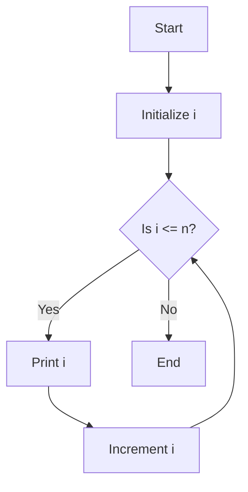

## 2.7 Control Structures: Conditionals and Loops

Control structures are fundamental to programming, allowing us to dictate the flow of execution in our code. In Julia, control structures such as conditionals and loops enable us to perform decision-making and repetitive tasks efficiently. This section will guide you through the essentials of using these constructs in Julia, providing you with the knowledge to write robust and flexible code.

### Conditional Statements

Conditional statements allow us to execute specific blocks of code based on certain conditions. In Julia, the primary conditional constructs are `if`, `elseif`, and `else`.

#### Using `if`, `elseif`, and `else`

The `if` statement evaluates a condition and executes a block of code if the condition is true. If the condition is false, the `elseif` and `else` blocks provide alternative paths.

```julia
function check_number(x)
    if x > 0
        println("The number is positive.")
    elseif x < 0
        println("The number is negative.")
    else
        println("The number is zero.")
    end
end

check_number(10)  # Output: The number is positive.
check_number(-5)  # Output: The number is negative.
check_number(0)   # Output: The number is zero.
```

**Key Points:**
- The `if` block is mandatory, while `elseif` and `else` are optional.
- You can have multiple `elseif` blocks, but only one `else` block.
- Conditions are evaluated in order, and the first true condition's block is executed.

#### Nested Conditionals

You can nest `if` statements within each other to handle more complex decision-making scenarios.

```julia
function categorize_number(x)
    if x > 0
        if x % 2 == 0
            println("The number is positive and even.")
        else
            println("The number is positive and odd.")
        end
    elseif x < 0
        println("The number is negative.")
    else
        println("The number is zero.")
    end
end

categorize_number(4)   # Output: The number is positive and even.
categorize_number(3)   # Output: The number is positive and odd.
categorize_number(-1)  # Output: The number is negative.
```

**Try It Yourself:** Modify the `categorize_number` function to include a check for numbers greater than 100 and print a special message for them.

### Looping Constructs

Loops allow us to execute a block of code multiple times. Julia provides `for` and `while` loops to handle repetitive tasks.

#### Implementing `for` Loops

The `for` loop iterates over a range or collection, executing the loop body for each element.

```julia
function print_numbers(n)
    for i in 1:n
        println(i)
    end
end

print_numbers(5)  # Output: 1 2 3 4 5
```

**Key Points:**
- The loop variable `i` takes on each value in the specified range or collection.
- The loop body is executed once for each value.

#### Iterating Over Collections

You can use `for` loops to iterate over arrays, tuples, and other collections.

```julia
fruits = ["apple", "banana", "cherry"]
for fruit in fruits
    println(fruit)
end
```

**Try It Yourself:** Create a `for` loop that iterates over a dictionary and prints each key-value pair.

#### Implementing `while` Loops

The `while` loop continues to execute as long as a specified condition is true.

```julia
function countdown(n)
    while n > 0
        println(n)
        n -= 1
    end
    println("Liftoff!")
end

countdown(5)  # Output: 5 4 3 2 1 Liftoff!
```

**Key Points:**
- Ensure the loop condition eventually becomes false to avoid infinite loops.
- Use `while` loops when the number of iterations is not predetermined.

### Control Flow Modifiers

Julia provides several control flow modifiers to alter the execution of loops and functions: `break`, `continue`, and `return`.

#### Using `break`

The `break` statement exits the nearest enclosing loop immediately.

```julia
function find_first_even(numbers)
    for number in numbers
        if number % 2 == 0
            println("First even number: $number")
            break
        end
    end
end

find_first_even([1, 3, 5, 8, 10])  # Output: First even number: 8
```

#### Using `continue`

The `continue` statement skips the current iteration and proceeds to the next iteration of the loop.

```julia
function print_odd_numbers(n)
    for i in 1:n
        if i % 2 == 0
            continue
        end
        println(i)
    end
end

print_odd_numbers(5)  # Output: 1 3 5
```

#### Using `return`

The `return` statement exits a function and optionally returns a value.

```julia
function is_even(x)
    if x % 2 == 0
        return true
    else
        return false
    end
end

println(is_even(4))  # Output: true
println(is_even(5))  # Output: false
```

### Visualizing Control Flow

To better understand how control structures work, let's visualize the flow of a simple `if...else` statement and a `for` loop using Mermaid.js diagrams.

#### If...Else Flowchart

```mermaid
flowchart TD
    A[Start] --> B{Is x > 0?}
    B -->|Yes| C[Print "Positive"]
    B -->|No| D{Is x < 0?}
    D -->|Yes| E[Print "Negative"]
    D -->|No| F[Print "Zero"]
    C --> G[End]
    E --> G
    F --> G
```

**Description:** This flowchart represents the decision-making process in an `if...else` statement, determining whether a number is positive, negative, or zero.

#### For Loop Flowchart



**Description:** This flowchart illustrates the execution flow of a `for` loop iterating from 1 to `n`, printing each number.

### References and Links

For further reading on control structures in Julia, consider exploring the following resources:

- [Julia Documentation on Control Flow](https://docs.julialang.org/en/v1/manual/control-flow/)
- [W3Schools Julia Tutorial](https://www.w3schools.com/julia/)
- [MDN Web Docs on Control Structures](https://developer.mozilla.org/en-US/docs/Web/JavaScript/Guide/Control_flow_and_error_handling) (Note: While this is for JavaScript, the concepts are similar across languages.)

### Knowledge Check

Let's reinforce what we've learned with a few questions and exercises:

- **Question:** What is the difference between `break` and `continue` in a loop?
- **Exercise:** Write a function that uses a `while` loop to print the Fibonacci sequence up to a given number.
- **Challenge:** Modify the `check_number` function to handle complex numbers and print whether they are purely real, purely imaginary, or neither.

### Embrace the Journey

Remember, mastering control structures is just the beginning of your journey in Julia programming. As you continue to explore and experiment, you'll discover more advanced techniques and patterns that will enhance your coding skills. Stay curious, keep practicing, and enjoy the process!

## Quiz Time!



### What is the primary purpose of an `if` statement in Julia?

- [x] To execute a block of code based on a condition
- [ ] To iterate over a collection
- [ ] To define a function
- [ ] To declare a variable

> **Explanation:** An `if` statement is used to execute a block of code only if a specified condition is true.

### Which keyword is used to exit a loop immediately in Julia?

- [ ] continue
- [x] break
- [ ] return
- [ ] exit

> **Explanation:** The `break` keyword is used to exit the nearest enclosing loop immediately.

### How do you skip the current iteration of a loop in Julia?

- [ ] break
- [x] continue
- [ ] return
- [ ] skip

> **Explanation:** The `continue` keyword is used to skip the current iteration and proceed to the next iteration of the loop.

### What will the following code print?
```julia
for i in 1:3
    if i == 2
        continue
    end
    println(i)
end
```

- [x] 1 3
- [ ] 1 2 3
- [ ] 2 3
- [ ] 1 2

> **Explanation:** The `continue` statement skips the iteration when `i` is 2, so only 1 and 3 are printed.

### Which statement is used to return a value from a function in Julia?

- [ ] break
- [ ] continue
- [x] return
- [ ] exit

> **Explanation:** The `return` statement is used to exit a function and optionally return a value.

### What is the output of the following code?
```julia
x = 0
if x > 0
    println("Positive")
elseif x < 0
    println("Negative")
else
    println("Zero")
end
```

- [ ] Positive
- [ ] Negative
- [x] Zero
- [ ] None of the above

> **Explanation:** Since `x` is 0, the `else` block is executed, printing "Zero".

### What is the purpose of a `while` loop?

- [x] To execute a block of code repeatedly as long as a condition is true
- [ ] To execute a block of code once
- [ ] To define a function
- [ ] To declare a variable

> **Explanation:** A `while` loop continues to execute as long as the specified condition remains true.

### In a `for` loop, what does the loop variable represent?

- [x] Each element in the specified range or collection
- [ ] The total number of iterations
- [ ] The index of the current iteration
- [ ] The condition to be checked

> **Explanation:** The loop variable represents each element in the specified range or collection during the iteration.

### What will the following code output?
```julia
n = 5
while n > 0
    println(n)
    n -= 1
end
```

- [x] 5 4 3 2 1
- [ ] 5 4 3 2 1 0
- [ ] 4 3 2 1
- [ ] 5 4 3 2

> **Explanation:** The loop decrements `n` from 5 to 1, printing each value.

### True or False: An `if` statement must always be followed by an `else` block.

- [ ] True
- [x] False

> **Explanation:** An `if` statement can stand alone without an `else` block. The `else` block is optional.


