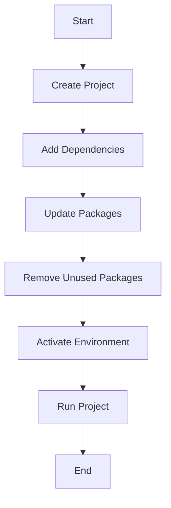

## 2.9 Modules and Package Management with Pkg.jl

In the world of software development, organizing code into reusable and maintainable components is crucial. Julia, with its powerful module system and robust package manager, Pkg.jl, provides developers with the tools necessary to achieve this. In this section, we will delve into the intricacies of creating modules, managing packages, and handling project dependencies in Julia. By the end of this guide, you'll be equipped to build scalable and maintainable Julia applications.

### Creating Modules

Modules in Julia are a way to encapsulate code, providing namespaces to prevent naming conflicts and enabling code reuse. Let's explore how to create and use modules effectively.

#### Defining a Module

To define a module in Julia, use the `module` keyword followed by the module name. Here's a simple example:

```julia
module MyModule

export greet

function greet(name::String)
    println("Hello, $name!")
end

end # End of module
```

In this example, `MyModule` is a module containing a single function `greet`. The `export` keyword is used to specify which functions or variables should be accessible from outside the module.

#### Using a Module

To use a module, you need to include it in your script and then use the `using` or `import` keyword:

```julia
include("MyModule.jl")
using .MyModule

greet("Julia Developer")
```

The `include` function loads the module file, and `using .MyModule` makes the exported functions available in the current namespace.

#### Organizing Code with Modules

Modules can be nested, allowing for a hierarchical organization of code. This is particularly useful for large projects. Here's an example of nested modules:

```julia
module OuterModule

module InnerModule

export inner_function

function inner_function()
    println("This is an inner function.")
end

end # End of InnerModule

export OuterModule

end # End of OuterModule
```

You can access `inner_function` by using:

```julia
using .OuterModule.InnerModule

inner_function()
```

### Using Packages with Pkg.jl

Julia's package manager, Pkg.jl, is a powerful tool for managing dependencies and distributing code. It allows you to add, update, and remove packages with ease.

#### Adding Packages

To add a package, use the `add` command in the Pkg REPL mode. Enter the Pkg mode by pressing `]` in the Julia REPL:

```julia
] add ExamplePackage
```

This command installs `ExamplePackage` and adds it to your project's dependencies.

#### Updating Packages

Keeping packages up to date is crucial for maintaining compatibility and security. Use the `update` command to update all packages:

```julia
] update
```

To update a specific package, specify its name:

```julia
] update ExamplePackage
```

#### Removing Packages

If you no longer need a package, remove it using the `rm` command:

```julia
] rm ExamplePackage
```

This command removes `ExamplePackage` from your project.

### Project and Manifest Files

Julia uses `Project.toml` and `Manifest.toml` files to manage project dependencies. These files ensure that your project has a consistent environment across different systems.

#### Project.toml

The `Project.toml` file contains metadata about your project, including its dependencies. Here's an example:

```toml
name = "MyProject"
uuid = "12345678-1234-5678-1234-567812345678"
authors = ["Your Name <your.email@example.com>"]
version = "0.1.0"

[deps]
ExamplePackage = "9a3f8284-3d6f-5b3e-8f2c-8d7e6f3a1b3d"
```

The `[deps]` section lists the packages your project depends on, along with their UUIDs.

#### Manifest.toml

The `Manifest.toml` file is automatically generated and contains a complete snapshot of the exact versions of all dependencies, including transitive dependencies. This ensures reproducibility.

#### Creating a New Project

To create a new project with its own environment, use the `generate` command:

```julia
] generate MyNewProject
```

This command creates a new directory with a `Project.toml` file.

#### Activating a Project

Activate a project environment using the `activate` command:

```julia
] activate MyNewProject
```

This sets the current environment to `MyNewProject`, isolating its dependencies from other projects.

### Visualizing Package Management Workflow

To better understand the workflow of package management in Julia, let's visualize it using a flowchart.



**Figure 1:** Package Management Workflow in Julia

This flowchart illustrates the typical steps involved in managing packages within a Julia project, from creation to execution.

### Try It Yourself

Experiment with creating your own module and managing packages. Try the following:

1. Create a module with multiple functions and export them.
2. Add a package to your project and use it within your module.
3. Update the package and observe any changes.
4. Remove the package and ensure your project still functions as expected.

### Knowledge Check

- What is the purpose of the `export` keyword in a module?
- How do you add a package using Pkg.jl?
- What is the difference between `Project.toml` and `Manifest.toml`?

### Embrace the Journey

Remember, mastering modules and package management in Julia is a journey. As you progress, you'll find new ways to organize and optimize your code. Keep experimenting, stay curious, and enjoy the process!

## Quiz Time!



### What is the primary purpose of a module in Julia?

- [x] To encapsulate code and provide namespaces
- [ ] To execute code in parallel
- [ ] To manage memory allocation
- [ ] To handle exceptions

> **Explanation:** Modules in Julia are used to encapsulate code and provide namespaces, preventing naming conflicts and enabling code reuse.

### How do you add a package in Julia using Pkg.jl?

- [x] `] add PackageName`
- [ ] `] install PackageName`
- [ ] `] include PackageName`
- [ ] `] load PackageName`

> **Explanation:** The `add` command in Pkg mode is used to install a package in Julia.

### What file contains a complete snapshot of all dependencies in a Julia project?

- [x] `Manifest.toml`
- [ ] `Project.toml`
- [ ] `Dependencies.toml`
- [ ] `Environment.toml`

> **Explanation:** The `Manifest.toml` file contains a complete snapshot of all dependencies, ensuring reproducibility.

### Which command is used to update all packages in a Julia project?

- [x] `] update`
- [ ] `] upgrade`
- [ ] `] refresh`
- [ ] `] renew`

> **Explanation:** The `update` command in Pkg mode updates all packages in the current environment.

### What is the function of the `activate` command in Pkg.jl?

- [x] To set the current environment to a specific project
- [ ] To install a new package
- [ ] To remove a package
- [ ] To export a module

> **Explanation:** The `activate` command sets the current environment to a specific project, isolating its dependencies.

### Which keyword is used to specify which functions should be accessible from outside a module?

- [x] `export`
- [ ] `import`
- [ ] `include`
- [ ] `using`

> **Explanation:** The `export` keyword is used to specify which functions or variables should be accessible from outside the module.

### How do you remove a package in Julia using Pkg.jl?

- [x] `] rm PackageName`
- [ ] `] delete PackageName`
- [ ] `] remove PackageName`
- [ ] `] uninstall PackageName`

> **Explanation:** The `rm` command in Pkg mode is used to remove a package from the current environment.

### What is the purpose of the `Project.toml` file?

- [x] To contain metadata about the project and its dependencies
- [ ] To store the project's source code
- [ ] To manage memory allocation
- [ ] To handle exceptions

> **Explanation:** The `Project.toml` file contains metadata about the project, including its dependencies.

### Can modules in Julia be nested?

- [x] True
- [ ] False

> **Explanation:** Modules in Julia can be nested, allowing for hierarchical organization of code.

### What command is used to create a new project with its own environment in Julia?

- [x] `] generate ProjectName`
- [ ] `] create ProjectName`
- [ ] `] new ProjectName`
- [ ] `] init ProjectName`

> **Explanation:** The `generate` command in Pkg mode is used to create a new project with its own environment.



By mastering modules and package management in Julia, you'll be well on your way to building efficient, scalable, and maintainable applications. Keep exploring and experimenting with these powerful tools!
