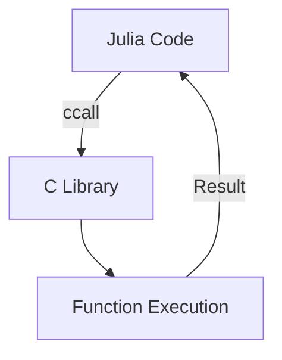
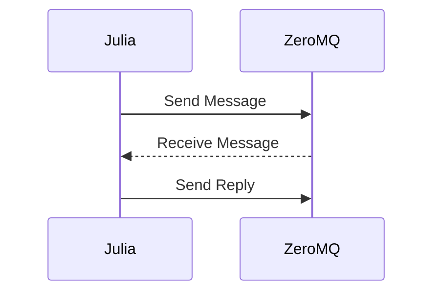

## 20.1 Working with External Libraries and Systems

In the world of software development, no language or framework exists in isolation. Julia, with its powerful computational capabilities, often needs to interact with other languages, libraries, and systems to leverage existing functionalities, enhance performance, or integrate into larger ecosystems. This section will guide you through the various methods and best practices for integrating Julia with external libraries and systems.

### Understanding Interoperability

Interoperability refers to the ability of different systems, applications, or components to work together seamlessly. In the context of Julia, this means being able to call functions from other programming languages, use external libraries, or communicate with other systems. This capability is crucial for several reasons:

- **Leveraging Existing Code**: Many libraries and systems are already written in languages like C, Python, or R. Instead of rewriting these in Julia, you can directly use them.
- **Performance Optimization**: Some tasks may be more efficiently handled by specialized libraries in other languages.
- **System Integration**: Julia applications often need to interact with databases, web services, or other enterprise systems.

### Integration Approaches

There are several approaches to integrating Julia with external libraries and systems. Each has its own use cases, advantages, and limitations.

#### Direct Linking

Direct linking involves calling functions from compiled libraries written in languages like C or Fortran. Julia provides the `ccall` function to facilitate this.

##### Example: Using `ccall` to Access C Libraries

```julia
function c_sqrt(x::Float64)::Float64
    return ccall(:sqrt, Float64, (Float64,), x)
end

println(c_sqrt(9.0))  # Output: 3.0
```

In this example, `ccall` is used to call the `sqrt` function from the C standard library. The first argument is the name of the function, the second is the return type, and the third is a tuple of argument types.

#### Messaging Systems

Messaging systems allow different applications to communicate asynchronously. Julia can interact with messaging systems like ZeroMQ or RabbitMQ to send and receive messages.

##### Example: Using ZeroMQ with Julia

```julia
using ZMQ

ctx = Context()
socket = Socket(ctx, REP)

bind(socket, "tcp://*:5555")

msg = recv(socket)
println("Received: $msg")

send(socket, "Hello from Julia!")
```

In this example, Julia uses ZeroMQ to create a simple server that receives a message and sends a reply.

#### RESTful APIs

RESTful APIs are a common way to interact with web services. Julia can easily make HTTP requests to consume or provide RESTful services.

##### Example: Making HTTP Requests with HTTP.jl

```julia
using HTTP

response = HTTP.get("https://api.example.com/data")
println(response.status)
println(String(response.body))

response = HTTP.post("https://api.example.com/data", body = "key=value")
println(response.status)
println(String(response.body))
```

This example demonstrates how to make GET and POST requests using the HTTP.jl package.

### Key Considerations for Integration

When integrating Julia with external libraries and systems, consider the following:

- **Compatibility**: Ensure that the external library or system is compatible with Julia's architecture and version.
- **Performance**: Evaluate the performance implications of the integration. Direct linking is usually faster than messaging systems or RESTful APIs.
- **Error Handling**: Implement robust error handling to manage failures in external calls.
- **Security**: Be mindful of security implications, especially when dealing with web services or external systems.

### Visualizing Integration Approaches

To better understand the integration approaches, let's visualize them using Mermaid.js diagrams.

#### Diagram: Direct Linking with `ccall`



*Caption: This diagram illustrates the flow of a direct function call from Julia to a C library using `ccall`.*

#### Diagram: Messaging System Integration



*Caption: This sequence diagram shows the interaction between Julia and a messaging system like ZeroMQ.*

### Try It Yourself

To solidify your understanding, try modifying the provided code examples:

- **Direct Linking**: Experiment with calling different C library functions using `ccall`.
- **Messaging Systems**: Set up a simple client-server communication using ZeroMQ.
- **RESTful APIs**: Create a small Julia application that consumes a public RESTful API.

### References and Further Reading

- [Julia Interoperability Documentation](https://docs.julialang.org/en/v1/manual/calling-c-and-fortran-code/)
- [ZeroMQ Documentation](https://zeromq.org/)
- [HTTP.jl GitHub Repository](https://github.com/JuliaWeb/HTTP.jl)

### Knowledge Check

- What are the benefits of integrating Julia with external libraries?
- How does `ccall` facilitate direct linking in Julia?
- What are some common use cases for messaging systems in Julia applications?

### Embrace the Journey

Remember, integrating Julia with external libraries and systems is a powerful way to extend its capabilities. As you explore these integration techniques, you'll unlock new possibilities for your applications. Keep experimenting, stay curious, and enjoy the journey!

## Quiz Time!



### What is the primary purpose of interoperability in Julia?

- [x] To enable seamless interaction with other languages and systems
- [ ] To improve Julia's syntax
- [ ] To make Julia applications run faster
- [ ] To simplify Julia's type system

> **Explanation:** Interoperability allows Julia to interact with other languages and systems, leveraging existing code and enhancing functionality.

### Which function is used in Julia for direct linking with C libraries?

- [x] `ccall`
- [ ] `cfunction`
- [ ] `clink`
- [ ] `cinterface`

> **Explanation:** `ccall` is the function used in Julia to call functions from C libraries directly.

### What is a common use case for messaging systems in Julia?

- [x] Asynchronous communication between applications
- [ ] Directly linking to C libraries
- [ ] Improving Julia's performance
- [ ] Simplifying Julia's syntax

> **Explanation:** Messaging systems like ZeroMQ are used for asynchronous communication between applications.

### Which package is used in Julia for making HTTP requests?

- [x] HTTP.jl
- [ ] Requests.jl
- [ ] Web.jl
- [ ] Net.jl

> **Explanation:** HTTP.jl is the package used in Julia for making HTTP requests.

### What should be considered when integrating Julia with external libraries?

- [x] Compatibility and performance
- [ ] Only syntax
- [ ] Only performance
- [ ] Only compatibility

> **Explanation:** Compatibility and performance are key considerations when integrating Julia with external libraries.

### How does `ccall` improve performance in Julia?

- [x] By allowing direct function calls to compiled C libraries
- [ ] By simplifying Julia's syntax
- [ ] By improving error handling
- [ ] By enhancing Julia's type system

> **Explanation:** `ccall` allows direct function calls to compiled C libraries, which can improve performance.

### What is the role of ZeroMQ in Julia applications?

- [x] Facilitating messaging between applications
- [ ] Directly linking to C libraries
- [ ] Improving Julia's syntax
- [ ] Enhancing Julia's type system

> **Explanation:** ZeroMQ facilitates messaging between applications, allowing for asynchronous communication.

### Which of the following is a RESTful API integration approach in Julia?

- [x] Using HTTP.jl to make HTTP requests
- [ ] Using ZeroMQ for messaging
- [ ] Using `ccall` for direct linking
- [ ] Using PyCall for Python integration

> **Explanation:** Using HTTP.jl to make HTTP requests is a RESTful API integration approach in Julia.

### What is a benefit of using RESTful APIs in Julia?

- [x] Interacting with web services
- [ ] Directly linking to C libraries
- [ ] Simplifying Julia's syntax
- [ ] Enhancing Julia's type system

> **Explanation:** RESTful APIs allow Julia to interact with web services, extending its capabilities.

### True or False: Direct linking is usually faster than messaging systems.

- [x] True
- [ ] False

> **Explanation:** Direct linking is usually faster because it involves direct function calls to compiled libraries, whereas messaging systems involve additional communication overhead.


