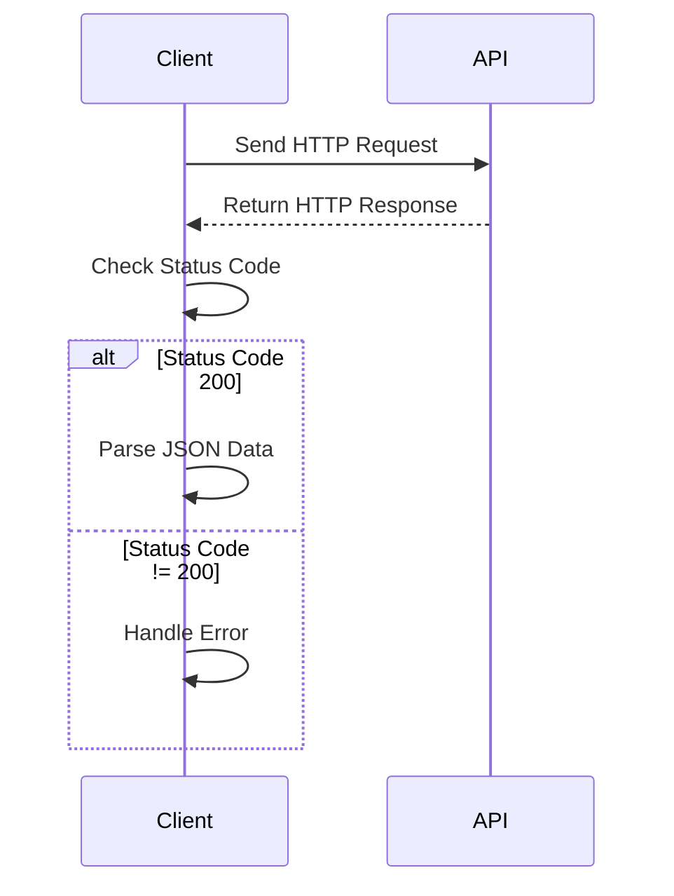

## 20.10 Interacting with Web APIs and RESTful Services

In today's interconnected world, interacting with Web APIs and RESTful services is a crucial skill for any developer. Julia, with its powerful features and libraries, provides an efficient way to consume APIs, handle responses, and build robust API clients. In this section, we will explore how to interact with Web APIs using Julia, focusing on making requests, handling responses, authentication, and building reusable API clients with error handling and retries.

### Understanding Web APIs and RESTful Services

**Web APIs** (Application Programming Interfaces) allow different software applications to communicate with each other over the internet. They provide a set of rules and protocols for building and interacting with software applications. **RESTful services** (Representational State Transfer) are a type of Web API that adhere to REST principles, which include statelessness, client-server architecture, and resource-based interactions.

#### Key Concepts

- **HTTP Methods**: RESTful services use standard HTTP methods such as GET, POST, PUT, DELETE, etc., to perform operations on resources.
- **Endpoints**: URLs that represent the resources you want to interact with.
- **Headers**: Metadata sent with requests and responses, such as content type and authentication tokens.
- **Status Codes**: Indicate the result of the HTTP request, such as 200 (OK), 404 (Not Found), 500 (Internal Server Error), etc.

### Consuming APIs in Julia

To interact with Web APIs in Julia, we primarily use the `HTTP.jl` package, which provides a simple and flexible way to make HTTP requests and handle responses.

#### Making HTTP Requests

Let's start by making a basic GET request to a public API. We'll use the `HTTP.jl` package to send a request and receive a response.

```julia
using HTTP

url = "https://api.example.com/data"

response = HTTP.get(url)

println("Status: ", response.status)
println("Body: ", String(response.body))
```

In this example, we define the API endpoint and use `HTTP.get` to send a GET request. The response object contains the status code and body, which we print to the console.

#### Handling Responses

Handling responses involves checking the status code and parsing the response body. JSON is a common format for API responses, so we'll use `JSON.jl` to parse JSON data.

```julia
using JSON

if response.status == 200
    # Parse the JSON response
    data = JSON.parse(String(response.body))
    println("Data: ", data)
else
    println("Failed to retrieve data. Status: ", response.status)
end
```

Here, we check if the status code is 200 (OK) and parse the JSON response using `JSON.parse`.

#### Authentication

Many APIs require authentication, typically using API keys or tokens. We include authentication information in the request headers.

```julia
api_key = "your_api_key"

response = HTTP.get(url, ["Authorization" => "Bearer $api_key"])

if response.status == 200
    data = JSON.parse(String(response.body))
    println("Data: ", data)
else
    println("Failed to retrieve data. Status: ", response.status)
end
```

In this example, we add an `Authorization` header with a Bearer token to authenticate the request.

### Building Reusable API Clients

Building reusable API clients involves creating functions or modules that encapsulate API interactions, handle errors, and support retries.

#### Creating a Basic API Client

Let's create a simple API client for interacting with a hypothetical weather API.

```julia
module WeatherAPI

using HTTP
using JSON

const BASE_URL = "https://api.weather.com"

function get_weather(city::String, api_key::String)
    url = "$BASE_URL/weather?city=$city"
    headers = ["Authorization" => "Bearer $api_key"]
    
    try
        response = HTTP.get(url, headers)
        if response.status == 200
            return JSON.parse(String(response.body))
        else
            error("Failed to retrieve weather data. Status: ", response.status)
        end
    catch e
        error("An error occurred: ", e)
    end
end

end # module
```

This module defines a `get_weather` function that sends a GET request to the weather API, handles the response, and returns the parsed data. It also includes basic error handling using a `try-catch` block.

#### Implementing Error Handling and Retries

To make our API client more robust, we can implement error handling and retries using the `Retry.jl` package.

```julia
using Retry

function get_weather_with_retries(city::String, api_key::String; retries::Int = 3)
    url = "$BASE_URL/weather?city=$city"
    headers = ["Authorization" => "Bearer $api_key"]
    
    retry(retries) do
        response = HTTP.get(url, headers)
        if response.status == 200
            return JSON.parse(String(response.body))
        else
            error("Failed to retrieve weather data. Status: ", response.status)
        end
    end
end
```

In this function, we use the `retry` function from `Retry.jl` to attempt the request multiple times in case of failure.

### Visualizing API Interaction

To better understand the flow of interacting with Web APIs, let's visualize the process using a sequence diagram.



This diagram illustrates the sequence of events when interacting with a Web API: sending a request, receiving a response, checking the status code, and handling the response accordingly.

### Try It Yourself

Now that we've covered the basics, try modifying the code examples to interact with a different API. Experiment with different HTTP methods, headers, and authentication mechanisms. Consider building a more complex API client that supports additional features like caching or rate limiting.

### References and Links

- [HTTP.jl Documentation](https://juliaweb.github.io/HTTP.jl/stable/)
- [JSON.jl Documentation](https://github.com/JuliaIO/JSON.jl)
- [Retry.jl Documentation](https://github.com/samoconnor/Retry.jl)
- [RESTful API Design](https://restfulapi.net/)

### Knowledge Check

1. What is the purpose of an API key in web API interactions?
2. How can you handle JSON responses in Julia?
3. What package can you use for retrying failed requests in Julia?
4. Describe the sequence of events when interacting with a Web API.
5. What are some common HTTP methods used in RESTful services?

### Embrace the Journey

Remember, mastering API interactions is just the beginning. As you progress, you'll build more complex and interactive applications. Keep experimenting, stay curious, and enjoy the journey!

## Quiz Time!



### What is the primary purpose of an API key in web API interactions?

- [x] To authenticate requests
- [ ] To format JSON responses
- [ ] To handle errors
- [ ] To parse XML data

> **Explanation:** An API key is used to authenticate requests to the API, ensuring that only authorized users can access the service.

### Which package in Julia is commonly used for making HTTP requests?

- [x] HTTP.jl
- [ ] JSON.jl
- [ ] Retry.jl
- [ ] DataFrames.jl

> **Explanation:** HTTP.jl is the package used in Julia for making HTTP requests to interact with web APIs.

### How can you parse JSON responses in Julia?

- [x] Using JSON.parse
- [ ] Using HTTP.get
- [ ] Using Retry.retry
- [ ] Using DataFrames.read

> **Explanation:** JSON.parse is used to parse JSON data in Julia, converting it into a usable format.

### What is the role of the `retry` function in the Retry.jl package?

- [x] To attempt a request multiple times in case of failure
- [ ] To parse JSON data
- [ ] To authenticate API requests
- [ ] To handle HTTP headers

> **Explanation:** The `retry` function is used to attempt a request multiple times if it fails, improving the robustness of API interactions.

### Which HTTP status code indicates a successful request?

- [x] 200
- [ ] 404
- [ ] 500
- [ ] 403

> **Explanation:** A status code of 200 indicates that the request was successful and the server returned the requested data.

### What is a common format for API responses?

- [x] JSON
- [ ] XML
- [ ] CSV
- [ ] HTML

> **Explanation:** JSON (JavaScript Object Notation) is a common format for API responses due to its lightweight and easy-to-read structure.

### What is the purpose of headers in an HTTP request?

- [x] To provide metadata such as content type and authentication
- [ ] To store the response body
- [ ] To define the URL endpoint
- [ ] To specify the HTTP method

> **Explanation:** Headers provide metadata about the request, such as content type and authentication information.

### Which HTTP method is typically used to retrieve data from a server?

- [x] GET
- [ ] POST
- [ ] PUT
- [ ] DELETE

> **Explanation:** The GET method is used to retrieve data from a server without modifying it.

### What does a status code of 404 indicate?

- [x] Resource not found
- [ ] Successful request
- [ ] Internal server error
- [ ] Unauthorized access

> **Explanation:** A status code of 404 indicates that the requested resource could not be found on the server.

### True or False: RESTful services must always use JSON for data exchange.

- [ ] True
- [x] False

> **Explanation:** While JSON is commonly used, RESTful services can use other formats like XML or plain text for data exchange.




