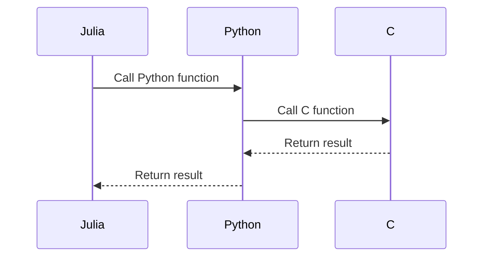

## 20.11 Best Practices for Cross-Language Interoperability

In today's interconnected software ecosystem, cross-language interoperability is crucial for leveraging the strengths of different programming languages within a single application. Julia, known for its high performance and ease of use, offers robust tools for interacting with other languages such as Python, R, C, and more. This section will guide you through best practices for achieving seamless interoperability, focusing on designing clear interfaces, error propagation, and leveraging automation and tooling.

### Designing Clear Interfaces

A well-defined interface is the cornerstone of successful cross-language interoperability. It ensures that different components of your application can communicate effectively, regardless of the language they are written in.

#### Well-Defined APIs and Data Contracts

**APIs (Application Programming Interfaces)** serve as the bridge between different software components. When designing APIs for cross-language interoperability, clarity and consistency are paramount.

- **Define Clear Data Contracts**: Establish a common understanding of data structures and types that will be exchanged between languages. Use JSON, XML, or Protocol Buffers to define these contracts.
  
- **Use Consistent Naming Conventions**: Ensure that function names, parameters, and data structures follow a consistent naming convention across languages to avoid confusion.

- **Document Thoroughly**: Provide comprehensive documentation for your API, including usage examples, expected inputs and outputs, and error codes.

**Example: Defining a JSON API Contract**

```json
{
  "name": "calculateStatistics",
  "parameters": {
    "data": "array of numbers",
    "operation": "string"
  },
  "returns": {
    "result": "number",
    "error": "string"
  }
}
```

This JSON contract specifies a function `calculateStatistics` that takes an array of numbers and a string indicating the operation, returning a number or an error message.

#### Code Example: Interfacing Julia with Python

Let's demonstrate how to create a clear interface between Julia and Python using the `PyCall.jl` package.

```julia
using PyCall

math = pyimport("math")

function calculate_sin(angle::Float64)
    return math.sin(angle)
end

result = calculate_sin(1.0)
println("The sine of 1.0 is: $result")
```

In this example, we import Python's `math` module and define a Julia function `calculate_sin` that uses Python's `sin` function. This demonstrates a clear interface where Julia and Python components interact seamlessly.

### Error Propagation

Handling errors effectively is crucial when integrating multiple languages, as each language may have its own error handling mechanisms.

#### Handling and Translating Exceptions Across Languages

- **Map Exceptions to Common Error Codes**: Define a set of common error codes that can be used across languages to represent different types of errors.

- **Use Language-Specific Error Handling**: Leverage each language's native error handling features to catch and translate exceptions into a format that can be understood by other languages.

- **Log Errors for Debugging**: Implement logging mechanisms to capture and store error details for debugging purposes.

**Example: Translating Python Exceptions to Julia**

```julia
using PyCall

try
    py"""
    def divide(a, b):
        if b == 0:
            raise ValueError("Division by zero")
        return a / b
    """
    divide = py"divide"
    result = divide(10, 0)
catch e
    println("Caught an error: ", e)
end
```

In this example, we define a Python function `divide` that raises a `ValueError` for division by zero. We then call this function from Julia and catch the exception, demonstrating how to handle and translate errors across languages.

### Automation and Tooling

Automation and tooling can significantly streamline the process of achieving cross-language interoperability.

#### Using Code Generators and Interface Definition Languages (IDLs)

- **Leverage Code Generators**: Use tools like SWIG (Simplified Wrapper and Interface Generator) to automatically generate wrapper code for interfacing different languages.

- **Utilize IDLs**: Interface Definition Languages such as Protocol Buffers or Thrift can be used to define data structures and service interfaces, generating code for multiple languages.

- **Automate Build Processes**: Use build automation tools like CMake or Make to manage the compilation and linking of multi-language projects.

**Example: Using SWIG for Julia and C Integration**

```c
/* C function to be called from Julia */
double add(double a, double b) {
    return a + b;
}
```

```swig
/* SWIG interface file */
%module add
%{
extern double add(double a, double b);
%}

extern double add(double a, double b);
```

```bash
swig -c++ -julia add.i

gcc -fPIC -c add_wrap.c add.c
gcc -shared add_wrap.o add.o -o _add.so
```

```julia
ccall((:add, "./_add"), Float64, (Float64, Float64), 3.0, 4.0)
```

In this example, we define a simple C function `add`, create a SWIG interface file, and use SWIG to generate wrapper code. We then compile and link the code, allowing us to call the C function from Julia using `ccall`.

### Visualizing Cross-Language Interoperability

To better understand the flow of data and control between languages, let's visualize the interaction using a sequence diagram.



**Diagram Description**: This sequence diagram illustrates the flow of a function call from Julia to Python, which then calls a C function. The result is returned back through the layers, demonstrating the interoperability between these languages.

### Best Practices Summary

- **Design Clear Interfaces**: Establish well-defined APIs and data contracts to ensure seamless communication between languages.
- **Handle Errors Gracefully**: Implement robust error handling and translation mechanisms to manage exceptions across languages.
- **Leverage Automation Tools**: Use code generators and IDLs to automate the creation of cross-language interfaces and streamline the build process.

### Try It Yourself

Experiment with the code examples provided by modifying the data types or adding additional functionality. For instance, try extending the Python-Julia interface to include more complex data structures or error handling scenarios.

### References and Further Reading

- [PyCall.jl Documentation](https://github.com/JuliaPy/PyCall.jl)
- [SWIG Documentation](http://www.swig.org/)
- [Protocol Buffers](https://developers.google.com/protocol-buffers)

### Knowledge Check

- What are the key components of a well-defined API for cross-language interoperability?
- How can exceptions be translated across different programming languages?
- What are some tools and languages that can automate the creation of cross-language interfaces?

### Embrace the Journey

Remember, mastering cross-language interoperability is a journey. As you progress, you'll discover new tools and techniques to enhance your applications. Keep experimenting, stay curious, and enjoy the process!

## Quiz Time!



### What is the primary purpose of designing clear interfaces in cross-language interoperability?

- [x] To ensure seamless communication between different software components.
- [ ] To increase the complexity of the codebase.
- [ ] To make debugging more difficult.
- [ ] To reduce the need for documentation.

> **Explanation:** Clear interfaces ensure that different components of an application can communicate effectively, regardless of the language they are written in.

### Which of the following is a recommended practice for handling errors across languages?

- [x] Map exceptions to common error codes.
- [ ] Ignore exceptions and proceed with execution.
- [ ] Use language-specific error codes without translation.
- [ ] Log errors without handling them.

> **Explanation:** Mapping exceptions to common error codes allows for consistent error handling across different languages.

### What tool can be used to automatically generate wrapper code for interfacing different languages?

- [x] SWIG
- [ ] PyCall
- [ ] JSON
- [ ] XML

> **Explanation:** SWIG (Simplified Wrapper and Interface Generator) is a tool that can automatically generate wrapper code for interfacing different languages.

### What is the role of Interface Definition Languages (IDLs) in cross-language interoperability?

- [x] To define data structures and service interfaces for multiple languages.
- [ ] To compile code for different languages.
- [ ] To execute code in different languages.
- [ ] To debug code in different languages.

> **Explanation:** IDLs are used to define data structures and service interfaces, generating code for multiple languages.

### Which of the following is NOT a benefit of using automation tools in cross-language interoperability?

- [ ] Streamlining the build process.
- [ ] Reducing manual coding effort.
- [x] Increasing the likelihood of errors.
- [ ] Enhancing code consistency.

> **Explanation:** Automation tools help streamline the build process, reduce manual coding effort, and enhance code consistency, thereby reducing the likelihood of errors.

### What is the purpose of using consistent naming conventions across languages?

- [x] To avoid confusion and ensure clarity.
- [ ] To increase the complexity of the code.
- [ ] To make the code harder to read.
- [ ] To reduce the need for comments.

> **Explanation:** Consistent naming conventions help avoid confusion and ensure clarity when interfacing different languages.

### How can logging be beneficial in cross-language interoperability?

- [x] By capturing and storing error details for debugging.
- [ ] By increasing the execution time of the application.
- [ ] By making the code more complex.
- [ ] By reducing the need for error handling.

> **Explanation:** Logging captures and stores error details, which is beneficial for debugging and understanding issues in cross-language interoperability.

### What is the advantage of using JSON or XML for defining data contracts?

- [x] They provide a common understanding of data structures and types.
- [ ] They increase the complexity of data exchange.
- [ ] They are only compatible with specific languages.
- [ ] They reduce the need for documentation.

> **Explanation:** JSON and XML provide a common understanding of data structures and types, facilitating data exchange between different languages.

### Which package in Julia is used to interface with Python?

- [x] PyCall.jl
- [ ] RCall.jl
- [ ] CCall.jl
- [ ] JSON.jl

> **Explanation:** PyCall.jl is a package in Julia used to interface with Python.

### True or False: Cross-language interoperability is only important for large-scale applications.

- [ ] True
- [x] False

> **Explanation:** Cross-language interoperability is important for applications of all sizes, as it allows developers to leverage the strengths of different programming languages.


