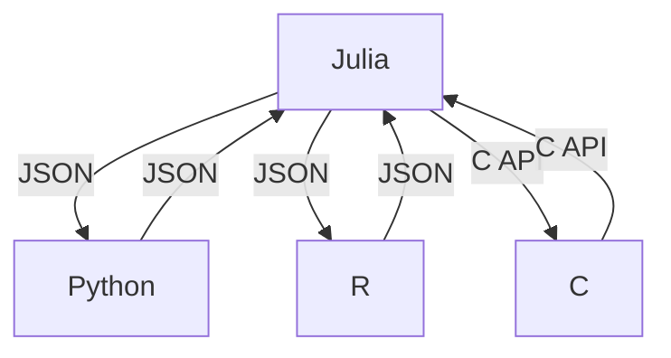

## 20.12 Case Study: Building a Polyglot Application

In today's diverse technological landscape, leveraging the strengths of multiple programming languages within a single application can lead to significant performance and functionality gains. This case study explores the process of building a polyglot application using Julia alongside other languages, addressing integration challenges, and implementing solutions for seamless interoperability.

### Overview

A polyglot application is one that utilizes multiple programming languages to achieve optimal functionality. Each language is chosen for its unique strengths, allowing developers to harness the best tools for specific tasks. In this case study, we focus on integrating Julia with Python, R, and C, creating an application that benefits from Julia's performance, Python's extensive libraries, R's statistical prowess, and C's low-level control.

#### Key Objectives

- **Leverage Julia for high-performance computations**: Julia's speed and efficiency make it ideal for computationally intensive tasks.
- **Utilize Python's rich ecosystem**: Python offers a vast array of libraries for data manipulation, machine learning, and more.
- **Incorporate R for statistical analysis**: R is renowned for its statistical capabilities and data visualization tools.
- **Employ C for system-level operations**: C provides low-level access to system resources, enabling fine-tuned performance optimizations.

### Integration Challenges

Building a polyglot application involves several challenges, primarily related to data representation discrepancies and performance trade-offs. Let's explore these challenges in detail.

#### Data Representation Discrepancies

Different languages often have distinct ways of representing data, which can lead to compatibility issues. For instance, Julia and Python handle arrays differently, and R's data frames may not directly map to Julia's data structures.

- **Challenge**: Ensuring consistent data representation across languages.
- **Solution**: Standardizing data formats using common interchange formats like JSON or CSV, and employing libraries that facilitate data conversion.

#### Performance Trade-offs

While combining languages can enhance functionality, it may also introduce performance bottlenecks due to the overhead of language interoperability.

- **Challenge**: Minimizing performance overhead when interfacing between languages.
- **Solution**: Using asynchronous communication and optimizing data transfer mechanisms to reduce latency.

### Solutions Implemented

To address the integration challenges, we implemented several solutions that facilitated smooth interoperability between Julia, Python, R, and C.

#### Standardizing Data Formats

We standardized data formats using JSON, a lightweight data interchange format that is easy to read and write for both humans and machines. This approach ensured that data could be easily shared and understood across different languages.

```julia
using JSON

julia_data = Dict("name" => "Julia", "version" => 1.6)
json_data = JSON.json(julia_data)

# import json

# library(jsonlite)
```

#### Asynchronous Communication

To mitigate performance trade-offs, we implemented asynchronous communication between components. This approach allowed different parts of the application to operate independently, reducing wait times and improving overall efficiency.

```julia
using Distributed

@everywhere function compute_heavy_task(x)
    sleep(2)  # Simulate a time-consuming task
    return x^2
end

future_result = @spawn compute_heavy_task(10)

println("Performing other tasks...")

result = fetch(future_result)
println("Result: ", result)
```

### Outcome and Impact

By effectively integrating Julia with Python, R, and C, we achieved our goals of creating a high-performance, feature-rich application. The standardized data formats and asynchronous communication mechanisms ensured seamless interoperability, allowing each language to contribute its strengths without introducing significant overhead.

#### Key Outcomes

- **Improved Performance**: Julia's computational efficiency enhanced the application's speed, particularly in data-intensive operations.
- **Enhanced Functionality**: Python's libraries and R's statistical tools expanded the application's capabilities, providing a comprehensive solution for data analysis and visualization.
- **Seamless Interoperability**: The use of standardized data formats and asynchronous communication facilitated smooth interactions between languages, minimizing integration challenges.

### Visualizing the Integration Process

To better understand the integration process, let's visualize the architecture of our polyglot application using a Mermaid.js diagram.



**Diagram Description**: This diagram illustrates the flow of data between the different components of our polyglot application. Julia serves as the central hub, interfacing with Python and R through JSON data interchange, and with C through a C API.

### Try It Yourself

To gain hands-on experience with building a polyglot application, try modifying the code examples provided. Experiment with different data formats, implement additional asynchronous tasks, or integrate another language into the mix. This exercise will deepen your understanding of polyglot programming and the challenges of language interoperability.

### Knowledge Check

Before we conclude, let's reinforce your understanding of the concepts covered in this case study. Consider the following questions:

1. What are the main challenges of building a polyglot application?
2. How can data representation discrepancies be addressed?
3. What role does asynchronous communication play in minimizing performance trade-offs?

### Embrace the Journey

Remember, building a polyglot application is a complex but rewarding endeavor. As you continue to explore the world of polyglot programming, keep experimenting, stay curious, and enjoy the journey. The skills you develop will open new doors and enable you to create innovative solutions that leverage the best of multiple programming languages.

## Quiz Time!



### What is a polyglot application?

- [x] An application that uses multiple programming languages.
- [ ] An application that only uses Julia.
- [ ] An application that uses a single programming language.
- [ ] An application that doesn't require integration.

> **Explanation:** A polyglot application utilizes multiple programming languages to leverage their unique strengths.

### Which data format was used to standardize data representation in the case study?

- [x] JSON
- [ ] XML
- [ ] YAML
- [ ] CSV

> **Explanation:** JSON was used as a lightweight data interchange format to ensure consistent data representation across languages.

### What is the primary benefit of asynchronous communication in a polyglot application?

- [x] Reducing performance overhead.
- [ ] Increasing data size.
- [ ] Simplifying code structure.
- [ ] Enhancing security.

> **Explanation:** Asynchronous communication allows different parts of the application to operate independently, reducing wait times and improving efficiency.

### Which language was used for high-performance computations in the case study?

- [x] Julia
- [ ] Python
- [ ] R
- [ ] C

> **Explanation:** Julia was chosen for its computational efficiency, making it ideal for high-performance tasks.

### How does JSON facilitate interoperability between languages?

- [x] By providing a common data format.
- [ ] By executing code in multiple languages.
- [ ] By optimizing performance.
- [ ] By enhancing security.

> **Explanation:** JSON provides a common data format that is easy to read and write for both humans and machines, facilitating interoperability.

### What role does Python play in the polyglot application?

- [x] Providing access to a rich ecosystem of libraries.
- [ ] Handling low-level system operations.
- [ ] Performing statistical analysis.
- [ ] Managing memory.

> **Explanation:** Python offers a vast array of libraries for data manipulation, machine learning, and more, enhancing the application's functionality.

### What challenge does data representation discrepancy pose?

- [x] Compatibility issues between languages.
- [ ] Increased security risks.
- [ ] Simplified data processing.
- [ ] Enhanced performance.

> **Explanation:** Different languages often have distinct ways of representing data, leading to compatibility issues.

### Why was C included in the polyglot application?

- [x] For system-level operations and performance optimizations.
- [ ] For statistical analysis.
- [ ] For data visualization.
- [ ] For machine learning.

> **Explanation:** C provides low-level access to system resources, enabling fine-tuned performance optimizations.

### What is the impact of effective interoperability in a polyglot application?

- [x] Achieving goals through seamless functionality.
- [ ] Reducing application complexity.
- [ ] Limiting language usage.
- [ ] Increasing development time.

> **Explanation:** Effective interoperability allows each language to contribute its strengths without introducing significant overhead, achieving the application's goals.

### True or False: Building a polyglot application is a simple process.

- [ ] True
- [x] False

> **Explanation:** Building a polyglot application involves complex challenges related to data representation, performance trade-offs, and language interoperability.



By understanding the intricacies of building a polyglot application, you can harness the power of multiple programming languages to create robust, efficient, and feature-rich software solutions. Keep exploring, experimenting, and pushing the boundaries of what's possible with polyglot programming!
