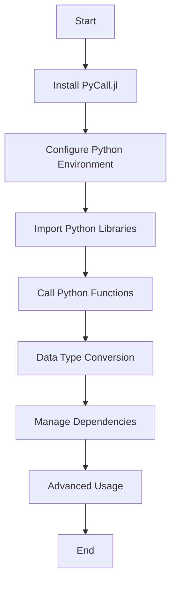

## 20.2 Interfacing with Python Using PyCall.jl

In the ever-evolving landscape of programming, the ability to leverage multiple languages within a single project can be a game-changer. Julia, known for its high-performance capabilities, and Python, renowned for its extensive libraries and ease of use, can be seamlessly integrated using PyCall.jl. This powerful package allows Julia developers to call Python functions, use Python libraries, and manage Python dependencies directly from Julia. Let's dive into the world of PyCall.jl and explore how it can enhance your Julia projects.

### Key Features of PyCall.jl

#### Seamless Calling of Python Libraries

PyCall.jl provides a bridge between Julia and Python, enabling you to call Python libraries as if they were native Julia packages. This feature is particularly useful when you want to leverage Python's rich ecosystem without leaving the Julia environment.

#### Data Type Conversion

One of the standout features of PyCall.jl is its ability to handle data type conversion between Julia and Python. It automatically converts data types where possible and provides mechanisms for manual conversion when necessary.

#### Handling Python Dependencies

Managing Python dependencies within a Julia project can be challenging. PyCall.jl simplifies this process by allowing you to manage Python environments and packages directly from Julia, ensuring that your dependencies are always in sync.

### Getting Started with PyCall.jl

Before we delve into the specifics of using PyCall.jl, let's start by installing the package and setting up our environment.

#### Installing PyCall.jl

To install PyCall.jl, open your Julia REPL and execute the following command:

```julia
using Pkg
Pkg.add("PyCall")
```

This command installs the PyCall.jl package, which you can then use to interface with Python.

#### Configuring PyCall.jl

Once installed, PyCall.jl needs to be configured to use a specific Python installation. By default, PyCall.jl will attempt to use the Python version that comes with your system. However, you can specify a different Python version by setting the `PYTHON` environment variable before building PyCall.jl:

```julia
ENV["PYTHON"] = "/path/to/your/python"
Pkg.build("PyCall")
```

Replace `"/path/to/your/python"` with the path to the desired Python executable. This step ensures that PyCall.jl uses the specified Python version.

### Using Python Libraries in Julia

With PyCall.jl installed and configured, you can now start using Python libraries in your Julia projects. Let's explore how to import and use a Python library.

#### Importing Python Libraries

To import a Python library, use the `pyimport` function provided by PyCall.jl. For example, to import the popular NumPy library, you can do the following:

```julia
using PyCall

np = pyimport("numpy")
```

This code imports the NumPy library and assigns it to the variable `np`, which you can then use to call NumPy functions.

#### Calling Python Functions

Once a Python library is imported, you can call its functions just like you would in Python. Here's an example of using NumPy to create an array and perform operations on it:

```julia
array = np.array([1, 2, 3, 4, 5])

sum = np.sum(array)
mean = np.mean(array)

println("Sum: $sum")
println("Mean: $mean")
```

In this example, we create a NumPy array and calculate its sum and mean using NumPy functions.

### Data Type Conversion

PyCall.jl handles data type conversion between Julia and Python automatically in many cases. However, there are situations where you may need to perform manual conversions.

#### Automatic Conversion

PyCall.jl automatically converts basic data types such as integers, floats, and strings between Julia and Python. For example, when you pass a Julia integer to a Python function, PyCall.jl converts it to a Python integer.

#### Manual Conversion

For more complex data types, you may need to perform manual conversions. PyCall.jl provides functions such as `PyObject` and `convert` to facilitate this process.

Here's an example of converting a Julia array to a Python list:

```julia
julia_array = [1, 2, 3, 4, 5]
python_list = PyObject(julia_array)

println("Python List: ", python_list)
```

In this example, we use `PyObject` to convert a Julia array to a Python list.

### Handling Python Dependencies

Managing Python dependencies is crucial for ensuring that your Julia project runs smoothly. PyCall.jl provides tools for managing Python environments and packages.

#### Managing Python Environments

PyCall.jl allows you to specify a Python environment for your Julia project. This feature is particularly useful when you need to isolate dependencies for different projects.

To create a new Python environment, you can use the `Conda.jl` package, which is a dependency of PyCall.jl:

```julia
using Conda

Conda.add("numpy")
```

This command creates a new Python environment and installs the NumPy package.

#### Using Virtual Environments

If you prefer to use Python's virtual environments, you can activate a virtual environment before starting Julia. PyCall.jl will then use the activated environment.

```bash
source /path/to/venv/bin/activate
julia
```

This command activates a Python virtual environment and starts the Julia REPL.

### Advanced Usage of PyCall.jl

PyCall.jl offers advanced features that allow you to customize its behavior and optimize performance.

#### Customizing Data Conversion

You can customize data conversion between Julia and Python by defining conversion methods. This feature is useful when you need to handle custom data types.

Here's an example of defining a custom conversion method:

```julia
import PyCall

function PyCall.pytype(::Type{MyType})
    return PyCall.PyObject
end

function PyCall.jlconvert(::Type{MyType}, obj::PyCall.PyObject)
    return MyType(obj[:field1], obj[:field2])
end
```

In this example, we define conversion methods for a custom type `MyType`.

#### Performance Optimization

To optimize performance, you can use PyCall.jl's `pycall` function, which allows you to call Python functions with minimal overhead. This function is particularly useful when calling Python functions in a loop.

```julia
result = pycall(np.sum, PyCall.PyObject, array)
```

In this example, we use `pycall` to call the `sum` function from NumPy with minimal overhead.

### Visualizing the Integration Process

To better understand how PyCall.jl integrates Julia and Python, let's visualize the process using a flowchart.



**Figure 1: Integration Process with PyCall.jl**

This flowchart illustrates the steps involved in integrating Python libraries into a Julia project using PyCall.jl.

### Try It Yourself

Now that we've covered the basics of using PyCall.jl, it's time to try it yourself. Experiment with different Python libraries and see how they can enhance your Julia projects. Here are a few suggestions:

- **Modify the NumPy Example**: Try using other NumPy functions, such as `np.dot` for matrix multiplication or `np.linalg.inv` for matrix inversion.
- **Explore Other Libraries**: Import and use other popular Python libraries, such as `pandas` for data manipulation or `matplotlib` for plotting.
- **Create a Custom Conversion**: Define a custom conversion method for a complex data type and test it with a Python library.

### Knowledge Check

To reinforce your understanding of PyCall.jl, consider the following questions:

- How does PyCall.jl handle data type conversion between Julia and Python?
- What are the benefits of using PyCall.jl to manage Python dependencies?
- How can you optimize performance when calling Python functions in a loop?

### Conclusion

Interfacing with Python using PyCall.jl opens up a world of possibilities for Julia developers. By leveraging Python's extensive library ecosystem, you can enhance your Julia projects with powerful tools and functionalities. Remember, this is just the beginning. As you continue to explore PyCall.jl, you'll discover new ways to integrate Python and Julia seamlessly. Keep experimenting, stay curious, and enjoy the journey!

## Quiz Time!



### What is the primary purpose of PyCall.jl?

- [x] To interface Julia with Python libraries
- [ ] To convert Julia code to Python code
- [ ] To manage Julia environments
- [ ] To compile Julia code into Python

> **Explanation:** PyCall.jl is used to interface Julia with Python libraries, allowing Julia to call Python functions and use Python packages.

### How do you specify a different Python version for PyCall.jl?

- [x] By setting the `PYTHON` environment variable
- [ ] By editing the Julia configuration file
- [ ] By using a special PyCall.jl command
- [ ] By installing a specific Julia package

> **Explanation:** You specify a different Python version for PyCall.jl by setting the `PYTHON` environment variable before building PyCall.jl.

### What function is used to import Python libraries in Julia using PyCall.jl?

- [x] `pyimport`
- [ ] `import`
- [ ] `using`
- [ ] `include`

> **Explanation:** The `pyimport` function is used to import Python libraries in Julia when using PyCall.jl.

### Which package can be used to create a new Python environment within Julia?

- [x] Conda.jl
- [ ] PyEnv.jl
- [ ] VirtualEnv.jl
- [ ] PyPkg.jl

> **Explanation:** Conda.jl is used to create and manage Python environments within Julia.

### What is the purpose of the `pycall` function in PyCall.jl?

- [x] To call Python functions with minimal overhead
- [ ] To convert Julia functions to Python functions
- [ ] To manage Python dependencies
- [ ] To build Python packages

> **Explanation:** The `pycall` function is used to call Python functions with minimal overhead, optimizing performance.

### How does PyCall.jl handle basic data type conversion?

- [x] Automatically
- [ ] Manually
- [ ] Using a configuration file
- [ ] Through a separate package

> **Explanation:** PyCall.jl automatically handles basic data type conversion between Julia and Python.

### What is a benefit of using Python's virtual environments with PyCall.jl?

- [x] Isolating dependencies for different projects
- [ ] Improving Julia's performance
- [ ] Simplifying Julia's syntax
- [ ] Enhancing Julia's plotting capabilities

> **Explanation:** Using Python's virtual environments with PyCall.jl helps in isolating dependencies for different projects.

### Which function is used to convert a Julia array to a Python list?

- [x] `PyObject`
- [ ] `convert`
- [ ] `pyconvert`
- [ ] `tolist`

> **Explanation:** The `PyObject` function is used to convert a Julia array to a Python list.

### What is the role of `Conda.jl` in managing Python dependencies?

- [x] It creates and manages Python environments
- [ ] It converts Python code to Julia
- [ ] It compiles Julia code into Python
- [ ] It provides plotting capabilities

> **Explanation:** Conda.jl is used to create and manage Python environments, helping in managing Python dependencies within Julia.

### True or False: PyCall.jl can only be used with the default Python installation on your system.

- [ ] True
- [x] False

> **Explanation:** False. PyCall.jl can be configured to use any Python installation by setting the `PYTHON` environment variable.


