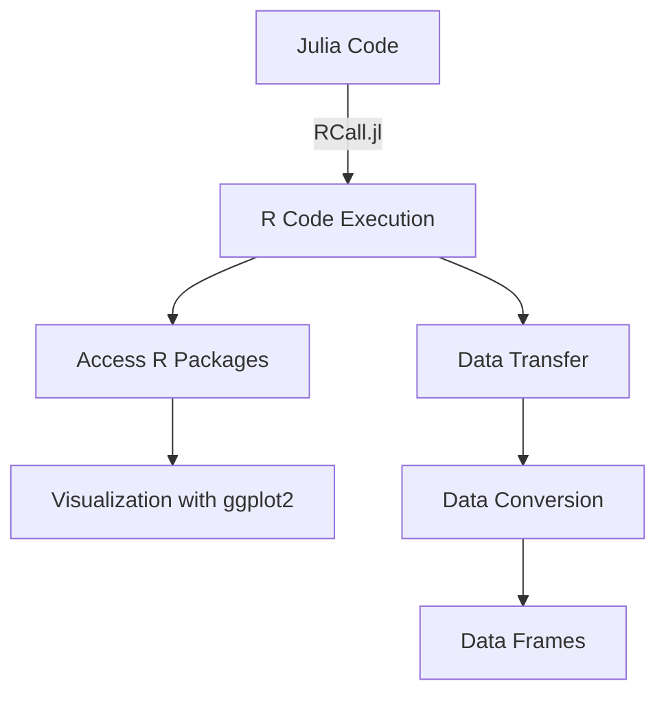

## 20.3 Calling R Code with RCall.jl

In the world of data science and statistical computing, R has established itself as a powerful tool for data analysis, visualization, and statistical modeling. Julia, on the other hand, is gaining popularity for its high-performance capabilities and ease of use in scientific computing. By leveraging the strengths of both languages, developers can create robust and efficient applications. This section will guide you through the process of integrating R code into Julia using the RCall.jl package, enabling seamless interoperability between the two languages.

### Introduction to RCall.jl

**RCall.jl** is a Julia package that provides an interface to R, allowing you to execute R code, access R packages, and transfer data between Julia and R. This integration is particularly useful for data scientists and statisticians who want to leverage R's extensive library ecosystem while benefiting from Julia's speed and performance.

#### Key Features of RCall.jl

- **Execute R Code**: Run R scripts and commands directly from Julia.
- **Access R Packages**: Utilize R's vast array of packages for statistical analysis and data visualization.
- **Data Transfer**: Efficiently exchange data between Julia and R, maintaining data integrity and structure.
- **Seamless Integration**: Combine the strengths of both languages in a single workflow.

### Setting Up RCall.jl

Before diving into the integration, ensure that you have both Julia and R installed on your system. Additionally, you need to install the RCall.jl package in Julia and configure it to communicate with your R installation.

#### Installing RCall.jl

To install RCall.jl, open the Julia REPL and execute the following command:

```julia
using Pkg
Pkg.add("RCall")
```

#### Configuring RCall.jl

RCall.jl automatically detects the R installation on your system. However, if you have multiple R installations or need to specify a particular version, you can set the `R_HOME` environment variable to point to the desired R installation directory.

```julia
ENV["R_HOME"] = "/path/to/R"
```

### Executing R Code from Julia

Once RCall.jl is installed and configured, you can start executing R code from within Julia. This is achieved using the `R` string macro, which allows you to embed R code directly in your Julia scripts.

#### Basic R Code Execution

Here's a simple example of executing R code in Julia:

```julia
using RCall

R"print('Hello from R!')"
```

In this example, the `R` macro is used to run the R command `print('Hello from R!')`, which outputs a message from R.

#### Running R Scripts

You can also execute entire R scripts stored in files. This is useful for integrating existing R workflows into your Julia projects.

```julia
R"""
source('path/to/script.R')
"""
```

### Accessing R Packages

One of the main advantages of using RCall.jl is the ability to access R's extensive package ecosystem. You can load and use R packages directly from Julia, enabling you to perform complex statistical analyses and visualizations.

#### Loading R Packages

To load an R package, use the `RCall.@rlibrary` macro:

```julia
RCall.@rlibrary ggplot2
```

This command loads the `ggplot2` package, a popular R package for data visualization.

#### Using R Functions

Once a package is loaded, you can call its functions using the `R` macro. For example, to create a simple plot using `ggplot2`, you can write:

```julia
R"""
library(ggplot2)
data <- data.frame(x = 1:10, y = rnorm(10))
ggplot(data, aes(x = x, y = y)) + geom_point()
"""
```

### Data Transfer Mechanisms

Efficient data transfer between Julia and R is crucial for maintaining performance and data integrity. RCall.jl provides several mechanisms for transferring data between the two languages.

#### Converting Data Types

RCall.jl automatically converts data types between Julia and R. For example, Julia arrays are converted to R vectors, and vice versa. Here's an example of transferring data from Julia to R:

```julia
julia_array = [1, 2, 3, 4, 5]
R"r_vector <- $julia_array"
```

In this example, the Julia array `julia_array` is transferred to R as `r_vector`.

#### Transferring Data Frames

Data frames are a common data structure in both Julia and R. RCall.jl provides seamless conversion between Julia's `DataFrame` and R's `data.frame`.

```julia
using DataFrames

julia_df = DataFrame(A = 1:5, B = rand(5))
R"r_df <- $julia_df"
```

This code snippet transfers a Julia `DataFrame` to R as a `data.frame`.

### Advanced Usage of RCall.jl

Beyond basic execution and data transfer, RCall.jl offers advanced features for more complex integrations.

#### Handling R Output

RCall.jl captures R output and returns it to Julia. You can store R results in Julia variables for further processing.

```julia
result = R"mean(c(1, 2, 3, 4, 5))"
println(result)
```

In this example, the mean of a vector is calculated in R, and the result is stored in the Julia variable `result`.

#### Error Handling

RCall.jl provides mechanisms for handling errors that occur during R code execution. You can use Julia's exception handling to manage R errors.

```julia
try
    R"stop('An error occurred in R')"
catch e
    println("Caught an R error: ", e)
end
```

### Visualizing Data with RCall.jl

R is renowned for its data visualization capabilities. By integrating R with Julia, you can leverage R's visualization tools to create stunning plots and charts.

#### Creating Plots

Here's an example of creating a plot using R's `ggplot2` package:

```julia
R"""
library(ggplot2)
data <- data.frame(x = 1:10, y = rnorm(10))
plot <- ggplot(data, aes(x = x, y = y)) + geom_line()
print(plot)
"""
```

This code generates a line plot using `ggplot2` and displays it in the R graphics window.

#### Customizing Visualizations

You can customize R plots by modifying the R code within the `R` macro. For example, you can change plot aesthetics, add titles, and adjust axis labels.

```julia
R"""
plot + ggtitle('Random Data Plot') + xlab('Index') + ylab('Value')
"""
```

### Try It Yourself

To get hands-on experience with RCall.jl, try modifying the code examples provided in this section. Experiment with different R functions, data structures, and visualization techniques. For instance, you can:

- Change the data used in the `ggplot2` examples to visualize different datasets.
- Explore other R packages and integrate their functionality into your Julia projects.
- Transfer complex data structures between Julia and R to test data conversion capabilities.

### Visualizing Julia and R Integration

To better understand the integration process, let's visualize the workflow of calling R code from Julia using RCall.jl.



**Diagram Description**: This flowchart illustrates the process of integrating R code into Julia using RCall.jl. It shows how Julia code interacts with R code execution, accesses R packages, and transfers data between the two languages.

### References and Further Reading

For more information on RCall.jl and its capabilities, consider exploring the following resources:

- [RCall.jl Documentation](https://cran.r-project.org/web/packages/RCall/index.html)
- [JuliaLang Documentation](https://docs.julialang.org/)
- [R Project for Statistical Computing](https://www.r-project.org/)

### Knowledge Check

To reinforce your understanding of RCall.jl and its integration capabilities, consider the following questions and exercises:

- What are the key features of RCall.jl?
- How do you execute R code from Julia using RCall.jl?
- Describe the process of transferring data frames between Julia and R.
- Experiment with different R packages and integrate their functionality into a Julia project.

### Embrace the Journey

Integrating R with Julia using RCall.jl opens up a world of possibilities for data analysis and scientific computing. By combining the strengths of both languages, you can create powerful and efficient applications. Remember, this is just the beginning. As you continue to explore and experiment, you'll discover new ways to leverage the capabilities of Julia and R. Keep learning, stay curious, and enjoy the journey!

## Quiz Time!



### What is RCall.jl used for in Julia?

- [x] Executing R code and accessing R packages from Julia
- [ ] Compiling Julia code into R scripts
- [ ] Converting Julia code into R language
- [ ] Debugging R code within Julia

> **Explanation:** RCall.jl is a Julia package that allows executing R code and accessing R packages directly from Julia.

### How do you install RCall.jl in Julia?

- [x] Using the command `Pkg.add("RCall")`
- [ ] Using the command `install("RCall")`
- [ ] By downloading it from the R website
- [ ] By compiling it from source

> **Explanation:** RCall.jl is installed in Julia using the package manager command `Pkg.add("RCall")`.

### Which macro is used to execute R code in Julia?

- [x] `R`
- [ ] `@R`
- [ ] `RCall`
- [ ] `@executeR`

> **Explanation:** The `R` macro is used to execute R code within Julia scripts.

### How can you load an R package in Julia using RCall.jl?

- [x] Using the `RCall.@rlibrary` macro
- [ ] Using the `RCall.load` function
- [ ] By importing it directly in Julia
- [ ] By converting it to a Julia package

> **Explanation:** The `RCall.@rlibrary` macro is used to load R packages in Julia.

### What is the purpose of the `R_HOME` environment variable?

- [x] To specify the R installation directory
- [ ] To set the default R script to run
- [ ] To configure RCall.jl logging
- [ ] To define the R package repository

> **Explanation:** The `R_HOME` environment variable is used to specify the directory of the R installation that RCall.jl should use.

### How does RCall.jl handle data type conversion between Julia and R?

- [x] It automatically converts data types between the two languages
- [ ] It requires manual conversion functions
- [ ] It does not support data type conversion
- [ ] It uses a third-party library for conversion

> **Explanation:** RCall.jl automatically handles data type conversion between Julia and R, making data transfer seamless.

### What is the benefit of using RCall.jl for data visualization?

- [x] It allows leveraging R's powerful visualization libraries like ggplot2
- [ ] It converts R plots into Julia plots
- [ ] It simplifies the creation of 3D plots
- [ ] It enhances Julia's plotting speed

> **Explanation:** RCall.jl enables the use of R's visualization libraries, such as ggplot2, directly from Julia.

### How can you handle errors in R code executed via RCall.jl?

- [x] By using Julia's exception handling mechanisms
- [ ] By writing error-handling code in R
- [ ] By using a special RCall.jl error function
- [ ] By ignoring errors during execution

> **Explanation:** Errors in R code executed through RCall.jl can be managed using Julia's exception handling mechanisms.

### What is the advantage of transferring data frames between Julia and R?

- [x] It allows seamless data manipulation and analysis using both languages
- [ ] It speeds up data processing in R
- [ ] It converts data frames into matrices
- [ ] It simplifies data visualization

> **Explanation:** Transferring data frames between Julia and R allows for seamless data manipulation and analysis using the strengths of both languages.

### True or False: RCall.jl can only execute R code, not access R packages.

- [ ] True
- [x] False

> **Explanation:** RCall.jl can both execute R code and access R packages, providing a comprehensive integration between Julia and R.


