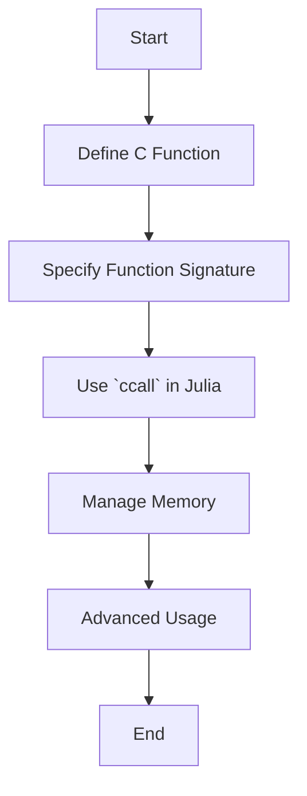

## 20.4 Using `ccall` for C Language Integration

Integrating C functions into Julia using `ccall` is a powerful feature that allows developers to leverage existing C libraries and functions directly within Julia applications. This capability is crucial for performance optimization and extending the functionality of Julia programs by utilizing the vast ecosystem of C libraries. In this section, we will explore the intricacies of using `ccall` for C language integration, covering everything from defining foreign function interfaces to managing memory across languages.

### Introduction to `ccall`

`ccall` is a built-in Julia function that provides a foreign function interface (FFI) to call C functions directly from Julia. This allows Julia programs to execute C code without the need for additional wrappers or bindings, making it an efficient way to integrate C libraries.

#### Why Use `ccall`?

- **Performance**: C functions can be called with minimal overhead, making `ccall` suitable for performance-critical applications.
- **Interoperability**: Access a wide range of existing C libraries, expanding the capabilities of your Julia programs.
- **Flexibility**: Seamlessly integrate C code into Julia, allowing for mixed-language programming.

### Defining Foreign Function Interfaces

To use `ccall`, you need to specify the correct function signatures for the C functions you wish to call. This involves defining the return type, argument types, and the library where the function is located.

#### Specifying Function Signatures

When calling a C function, you must provide:

- **Return Type**: The type of value the C function returns.
- **Argument Types**: The types of arguments the C function expects.
- **Library Name**: The shared library (.so, .dll, .dylib) containing the C function.

Here's a basic example of using `ccall` to call the `sqrt` function from the C standard library:

```julia
result = ccall((:sqrt, "libm"), Cdouble, (Cdouble,), 9.0)

println("The square root of 9.0 is $result")
```

**Explanation**:
- `:sqrt` is the name of the C function.
- `"libm"` is the library containing the function.
- `Cdouble` specifies that both the return type and the argument type are double precision floating-point numbers.

### Memory Considerations

When integrating C functions, managing memory correctly is crucial to avoid leaks and ensure stability.

#### Managing Memory Across Languages

C and Julia have different memory management models. While Julia uses garbage collection, C requires explicit memory management. When calling C functions that allocate memory, you must ensure that memory is properly freed.

**Example: Allocating and Freeing Memory**

Suppose you have a C function that allocates memory:

```c
// C function that allocates memory
double* allocate_array(int size) {
    return (double*)malloc(size * sizeof(double));
}
```

To use this function in Julia, you must also provide a way to free the allocated memory:

```julia
array_ptr = ccall((:allocate_array, "libmylib"), Ptr{Cdouble}, (Cint,), 10)

# ...

ccall((:free, "libc"), Cvoid, (Ptr{Cvoid},), array_ptr)
```

**Key Points**:
- Use `Ptr{T}` to represent pointers to C types.
- Always free memory allocated by C functions to prevent leaks.

### Advanced `ccall` Usage

Beyond basic function calls, `ccall` can handle more complex scenarios, such as passing arrays, handling structs, and dealing with callbacks.

#### Passing Arrays

To pass arrays to C functions, use pointers. Julia arrays can be converted to pointers using the `pointer` function.

```julia
function modify_array(arr::Vector{Cdouble})
    ccall((:modify_array, "libmylib"), Cvoid, (Ptr{Cdouble}, Cint), pointer(arr), length(arr))
end

arr = [1.0, 2.0, 3.0]
modify_array(arr)
println("Modified array: $arr")
```

#### Handling Structs

To pass structs between Julia and C, define corresponding Julia types using `struct` and ensure they match the C struct layout.

```c
// C struct definition
typedef struct {
    int x;
    double y;
} MyStruct;
```

```julia
struct MyStruct
    x::Cint
    y::Cdouble
end

function process_struct(s::MyStruct)
    ccall((:process_struct, "libmylib"), Cvoid, (Ref{MyStruct},), s)
end
```

#### Using Callbacks

C functions that accept function pointers (callbacks) can be integrated using Julia functions.

```c
// C function that accepts a callback
void register_callback(void (*callback)(int)) {
    callback(42);
}
```

```julia
function my_callback(x::Cint)
    println("Callback called with value: $x")
end

ccall((:register_callback, "libmylib"), Cvoid, (Ptr{Cvoid},), @cfunction(my_callback, Cvoid, (Cint,)))
```

### Visualizing `ccall` Integration

To better understand how `ccall` integrates C functions into Julia, let's visualize the process using a flowchart.



**Caption**: This flowchart illustrates the steps involved in integrating C functions into Julia using `ccall`, from defining the C function to managing memory and advanced usage scenarios.

### Best Practices for `ccall` Integration

- **Ensure Compatibility**: Verify that the C library is compatible with your system architecture and Julia version.
- **Use Type Aliases**: Define type aliases for complex types to improve code readability.
- **Handle Errors Gracefully**: Implement error handling in both C and Julia to manage unexpected situations.
- **Test Thoroughly**: Write tests to ensure that the integration works as expected and handles edge cases.

### Differences and Similarities with Other Patterns

`ccall` is similar to other foreign function interfaces (FFIs) in that it allows calling functions from other languages. However, it is unique in its seamless integration with Julia's type system and performance optimizations.

### Try It Yourself

Experiment with `ccall` by modifying the provided examples. Try calling different C functions, passing various data types, and handling more complex scenarios like nested structs or multi-dimensional arrays.

### References and Further Reading

- [Julia Documentation on `ccall`](https://docs.julialang.org/en/v1/manual/calling-c-and-fortran-code/)
- [C Programming Language](https://en.wikipedia.org/wiki/C_(programming_language))
- [Foreign Function Interface (FFI)](https://en.wikipedia.org/wiki/Foreign_function_interface)

### Knowledge Check

- What is the primary purpose of `ccall` in Julia?
- How do you manage memory when using `ccall` to call C functions?
- What are some advanced use cases for `ccall`?

### Embrace the Journey

Remember, integrating C functions into Julia is just the beginning. As you progress, you'll unlock new possibilities for performance optimization and functionality extension. Keep experimenting, stay curious, and enjoy the journey!

## Quiz Time!



### What is the primary purpose of `ccall` in Julia?

- [x] To call C functions directly from Julia
- [ ] To compile Julia code into C
- [ ] To convert Julia code into a C library
- [ ] To debug C code using Julia

> **Explanation:** `ccall` is used to call C functions directly from Julia, enabling seamless integration of C libraries.

### Which of the following is NOT a component of a `ccall` function signature?

- [ ] Return type
- [ ] Argument types
- [x] Julia module name
- [ ] Library name

> **Explanation:** A `ccall` function signature includes the return type, argument types, and library name, but not the Julia module name.

### How do you pass an array to a C function using `ccall`?

- [x] Use the `pointer` function to convert the array to a pointer
- [ ] Directly pass the array as an argument
- [ ] Convert the array to a string
- [ ] Use the `Ref` function to pass the array

> **Explanation:** The `pointer` function is used to convert a Julia array to a pointer, which can then be passed to a C function.

### What is the role of `@cfunction` in `ccall`?

- [x] To create a C-compatible function pointer from a Julia function
- [ ] To compile a Julia function into C code
- [ ] To convert a C function into a Julia function
- [ ] To debug a Julia function using C

> **Explanation:** `@cfunction` creates a C-compatible function pointer from a Julia function, allowing it to be used as a callback in C.

### What must you do after calling a C function that allocates memory?

- [x] Free the allocated memory using `ccall`
- [ ] Convert the memory to a Julia object
- [ ] Save the memory address for later use
- [ ] Ignore the memory allocation

> **Explanation:** You must free the allocated memory using `ccall` to prevent memory leaks.

### Which of the following is a best practice when using `ccall`?

- [x] Test thoroughly to ensure integration works as expected
- [ ] Avoid using type aliases for complex types
- [ ] Ignore error handling in C functions
- [ ] Use `ccall` only for simple functions

> **Explanation:** Thorough testing is essential to ensure that the integration works as expected and handles edge cases.

### What is a common use case for `ccall`?

- [x] Integrating existing C libraries into Julia applications
- [ ] Compiling Julia code into C
- [ ] Debugging C code using Julia
- [ ] Converting Julia code into a C library

> **Explanation:** `ccall` is commonly used to integrate existing C libraries into Julia applications, leveraging their functionality.

### How do you handle structs when using `ccall`?

- [x] Define corresponding Julia types using `struct`
- [ ] Convert structs to arrays
- [ ] Use `Ref` to pass structs as pointers
- [ ] Ignore structs and use primitive types

> **Explanation:** Define corresponding Julia types using `struct` to match the C struct layout when handling structs with `ccall`.

### What is the benefit of using `ccall` for performance-critical applications?

- [x] Minimal overhead when calling C functions
- [ ] Automatic memory management
- [ ] Simplified error handling
- [ ] Enhanced debugging capabilities

> **Explanation:** `ccall` provides minimal overhead when calling C functions, making it suitable for performance-critical applications.

### True or False: `ccall` can only be used with C functions that do not return a value.

- [ ] True
- [x] False

> **Explanation:** `ccall` can be used with C functions that return values, as well as those that do not.


