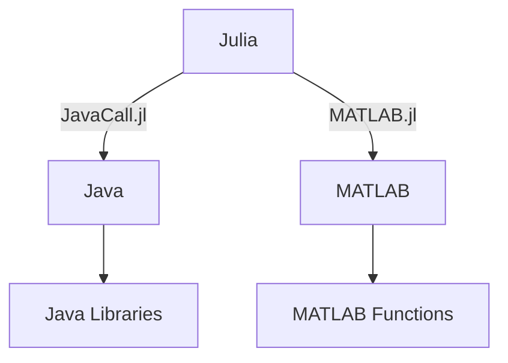

## 20.5 Integrating with Java and MATLAB

In the world of scientific computing and data analysis, the ability to integrate different programming languages and tools is invaluable. Julia, known for its high performance and ease of use, can be seamlessly integrated with Java and MATLAB, two widely used languages in various domains. This section will guide you through the process of integrating Julia with Java using **JavaCall.jl** and with MATLAB using **MATLAB.jl**. We'll explore how to call Java classes and methods from Julia, execute MATLAB code, and efficiently transfer data between these environments.

### Introduction to Integration

Integrating Julia with Java and MATLAB allows developers to leverage the strengths of each language. Java's extensive libraries and robust ecosystem, combined with MATLAB's powerful numerical computing capabilities, can be harnessed alongside Julia's speed and simplicity. This integration is particularly useful in scenarios where existing Java or MATLAB codebases need to be extended or optimized using Julia.

### JavaCall.jl: Bridging Julia and Java

**JavaCall.jl** is a Julia package that provides a bridge to the Java Virtual Machine (JVM), allowing you to call Java classes and methods directly from Julia. This integration is beneficial for accessing Java libraries and frameworks that are not available in Julia.

#### Setting Up JavaCall.jl

To get started with JavaCall.jl, you need to have Java installed on your system. Follow these steps to set up JavaCall.jl:

1. **Install Java**: Ensure that Java is installed and the `JAVA_HOME` environment variable is set correctly. You can download Java from the [official website](https://www.oracle.com/java/technologies/javase-downloads.html).

2. **Install JavaCall.jl**: Open the Julia REPL and run the following command to install JavaCall.jl:

   ```julia
   using Pkg
   Pkg.add("JavaCall")
   ```

3. **Load JavaCall.jl**: Once installed, load the package in your Julia session:

   ```julia
   using JavaCall
   ```

#### Calling Java Methods from Julia

With JavaCall.jl, you can instantiate Java objects, call methods, and access fields. Here's a simple example demonstrating how to call a Java method from Julia:

```julia
using JavaCall

JavaCall.init()

jclass = @jimport java.util.Date

date_instance = jcall(jclass, "new", jobject)

date_string = jcall(date_instance, "toString", JString)

println("Current Date: ", date_string)

JavaCall.destroy()
```

**Explanation**:
- **`@jimport`**: This macro imports a Java class.
- **`jcall`**: This function is used to call Java methods. It requires the Java object, method name, and return type.

#### Handling Java Exceptions

Java exceptions can be caught and handled in Julia using the `try-catch` block. Here's an example:

```julia
try
    # Attempt to call a Java method
    result = jcall(some_java_object, "someMethod", JString)
catch e
    println("Java Exception: ", e)
end
```

### MATLAB.jl: Running MATLAB Code from Julia

**MATLAB.jl** is a Julia package that allows you to run MATLAB code and transfer data between Julia and MATLAB. This integration is useful for utilizing MATLAB's extensive toolboxes and functions directly from Julia.

#### Setting Up MATLAB.jl

To use MATLAB.jl, you need to have MATLAB installed on your system. Follow these steps to set up MATLAB.jl:

1. **Install MATLAB**: Ensure that MATLAB is installed and accessible from your system's PATH.

2. **Install MATLAB.jl**: Open the Julia REPL and run the following command to install MATLAB.jl:

   ```julia
   using Pkg
   Pkg.add("MATLAB")
   ```

3. **Load MATLAB.jl**: Once installed, load the package in your Julia session:

   ```julia
   using MATLAB
   ```

#### Running MATLAB Code

MATLAB.jl allows you to execute MATLAB code and retrieve results in Julia. Here's an example:

```julia
using MATLAB

mat"""
disp('Hello from MATLAB!')
"""

mat"""
function y = square(x)
    y = x^2;
end
"""

result = mat"y = square(3); y"
println("Result from MATLAB: ", result)
```

**Explanation**:
- **`mat"""`**: This macro is used to execute MATLAB code within Julia.
- **Data Transfer**: You can pass variables between Julia and MATLAB using the `mat` macro.

#### Transferring Data Between Julia and MATLAB

Data can be transferred between Julia and MATLAB using the `mat` macro. Here's an example of transferring a matrix:

```julia
using MATLAB

julia_matrix = [1 2; 3 4]

mat"""
A = $julia_matrix;
disp('Matrix in MATLAB:');
disp(A);
"""

mat"""
B = A + 1;
"""
julia_result = mat"B"
println("Modified Matrix in Julia: ", julia_result)
```

### Visualizing the Integration Process

To better understand the integration process, let's visualize the workflow of calling Java and MATLAB from Julia using Mermaid.js diagrams.



**Diagram Description**: This flowchart illustrates the integration of Julia with Java and MATLAB. Julia communicates with Java through JavaCall.jl and with MATLAB through MATLAB.jl, allowing access to Java libraries and MATLAB functions.

### Design Considerations

When integrating Julia with Java and MATLAB, consider the following:

- **Performance**: While Julia is known for its speed, calling external languages may introduce overhead. Optimize data transfer and minimize context switching.
- **Error Handling**: Ensure robust error handling to manage exceptions from Java and MATLAB.
- **Data Types**: Be mindful of data type conversions between Julia, Java, and MATLAB to avoid unexpected behavior.

### Differences and Similarities

- **JavaCall.jl vs. MATLAB.jl**: Both packages facilitate integration but cater to different languages. JavaCall.jl is used for Java, while MATLAB.jl is for MATLAB.
- **Data Transfer**: Both packages support data transfer, but the mechanisms and supported data types may differ.

### Try It Yourself

Experiment with the provided code examples by modifying them to call different Java methods or MATLAB functions. Try transferring complex data structures and observe how they are handled across languages.

### References and Links

- [JavaCall.jl Documentation](https://github.com/JuliaInterop/JavaCall.jl)
- [MATLAB.jl Documentation](https://github.com/JuliaInterop/MATLAB.jl)
- [Oracle Java Downloads](https://www.oracle.com/java/technologies/javase-downloads.html)
- [MATLAB Official Website](https://www.mathworks.com/products/matlab.html)

### Knowledge Check

- What are the primary benefits of integrating Julia with Java and MATLAB?
- How does JavaCall.jl facilitate calling Java methods from Julia?
- Describe the process of transferring data between Julia and MATLAB using MATLAB.jl.

### Embrace the Journey

Remember, integrating Julia with Java and MATLAB is just the beginning. As you progress, you'll discover new ways to leverage the strengths of each language. Keep experimenting, stay curious, and enjoy the journey!

## Quiz Time!



### What is the primary purpose of JavaCall.jl in Julia?

- [x] To call Java classes and methods from Julia
- [ ] To compile Java code within Julia
- [ ] To convert Julia code to Java bytecode
- [ ] To run Java applications independently

> **Explanation:** JavaCall.jl is used to call Java classes and methods directly from Julia, enabling integration with Java libraries.

### Which macro is used to execute MATLAB code in Julia using MATLAB.jl?

- [ ] `@matlab`
- [x] `mat"""` 
- [ ] `@jimport`
- [ ] `@mat`

> **Explanation:** The `mat"""` macro is used to execute MATLAB code within Julia when using MATLAB.jl.

### What is a key consideration when transferring data between Julia and MATLAB?

- [ ] Ensuring data is encrypted
- [x] Ensuring data type compatibility
- [ ] Ensuring data is compressed
- [ ] Ensuring data is in JSON format

> **Explanation:** Ensuring data type compatibility is crucial to avoid unexpected behavior during data transfer between Julia and MATLAB.

### How do you initialize the Java Virtual Machine (JVM) in Julia using JavaCall.jl?

- [ ] `JavaCall.start()`
- [x] `JavaCall.init()`
- [ ] `JavaCall.run()`
- [ ] `JavaCall.begin()`

> **Explanation:** The `JavaCall.init()` function is used to initialize the JVM in Julia when using JavaCall.jl.

### What is the purpose of the `@jimport` macro in JavaCall.jl?

- [x] To import a Java class into Julia
- [ ] To export a Julia class to Java
- [ ] To compile Java code in Julia
- [ ] To convert Java code to Julia

> **Explanation:** The `@jimport` macro is used to import a Java class into Julia, allowing access to its methods and fields.

### Which package is used to integrate MATLAB with Julia?

- [ ] JavaCall.jl
- [x] MATLAB.jl
- [ ] PyCall.jl
- [ ] RCall.jl

> **Explanation:** MATLAB.jl is the package used to integrate MATLAB with Julia, enabling execution of MATLAB code and data transfer.

### What is a common use case for integrating Julia with MATLAB?

- [ ] Running web servers
- [x] Utilizing MATLAB's numerical computing capabilities
- [ ] Developing mobile applications
- [ ] Creating video games

> **Explanation:** A common use case for integrating Julia with MATLAB is to leverage MATLAB's powerful numerical computing capabilities.

### How can you handle Java exceptions in Julia when using JavaCall.jl?

- [ ] Using `try-catch` blocks
- [ ] Using `if-else` statements
- [x] Using `try-catch` blocks
- [ ] Using `while` loops

> **Explanation:** Java exceptions can be caught and handled in Julia using `try-catch` blocks when using JavaCall.jl.

### What is the benefit of using MATLAB.jl for data transfer between Julia and MATLAB?

- [ ] It compresses data automatically
- [x] It allows seamless data transfer and execution of MATLAB code
- [ ] It encrypts data for security
- [ ] It converts data to JSON format

> **Explanation:** MATLAB.jl allows seamless data transfer and execution of MATLAB code, facilitating integration between Julia and MATLAB.

### True or False: JavaCall.jl can be used to run Java applications independently from Julia.

- [ ] True
- [x] False

> **Explanation:** JavaCall.jl is used to call Java classes and methods from Julia, not to run Java applications independently.


