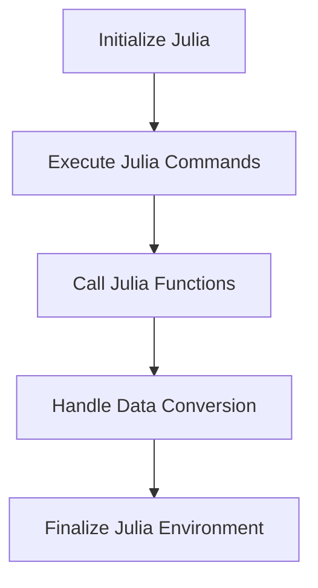

## 20.6 Using Julia from Other Languages

In today's interconnected programming landscape, the ability to leverage multiple languages within a single project is invaluable. Julia, known for its high performance and ease of use in scientific computing, can be seamlessly integrated with other languages like C, Python, and R. This section will guide you through the process of embedding Julia code within these languages, enabling you to harness Julia's capabilities while maintaining the flexibility of your existing codebase.

### Embedding Julia

Embedding Julia in other languages allows you to run Julia code from within a host language, such as C, Python, or R. This integration can be particularly useful when you want to take advantage of Julia's performance for specific tasks while using the host language for other parts of your application.

#### Running Julia Code from C

C is a widely used language for system-level programming, and embedding Julia within C can enhance performance-critical sections of your application. Here's how you can achieve this:

1. **Initialize the Julia Environment**: Before running any Julia code, you need to initialize the Julia environment within your C program.

2. **Execute Julia Commands**: Use the Julia C API to execute Julia commands and functions.

3. **Handle Julia Data**: Convert data between C and Julia types to ensure smooth interoperability.

4. **Finalize the Julia Environment**: Properly close the Julia environment to free resources.

Here's a simple example demonstrating these steps:

```c
#include <julia.h>

int main(int argc, char *argv[]) {
    // Initialize the Julia environment
    jl_init();

    // Execute a simple Julia command
    jl_eval_string("println(\"Hello from Julia!\")");

    // Define a Julia function and call it from C
    jl_eval_string("function add(x, y) return x + y end");
    jl_function_t *add_func = jl_get_function(jl_main_module, "add");
    jl_value_t *result = jl_call2(add_func, jl_box_float64(3.0), jl_box_float64(4.0));
    double sum = jl_unbox_float64(result);
    printf("The sum is: %f\n", sum);

    // Finalize the Julia environment
    jl_atexit_hook(0);

    return 0;
}
```

**Key Points**:
- **Initialization**: `jl_init()` sets up the Julia runtime.
- **Execution**: `jl_eval_string()` runs Julia code.
- **Function Calls**: Use `jl_get_function()` and `jl_call2()` to call Julia functions.
- **Data Conversion**: Use `jl_box_float64()` and `jl_unbox_float64()` for type conversion.

#### Running Julia Code from Python

Python is a popular language for data science and machine learning. By embedding Julia in Python, you can leverage Julia's speed for computationally intensive tasks while using Python's rich ecosystem for data manipulation and visualization.

To embed Julia in Python, you can use the `julia` package, which provides a convenient interface for calling Julia functions from Python.

1. **Install the Julia Package**: Use pip to install the `julia` package.

2. **Initialize Julia in Python**: Import the `julia` module and initialize it.

3. **Call Julia Functions**: Use the `julia` module to call Julia functions and pass data between Python and Julia.

Here's an example:

```python
# pip install julia

from julia import Main

Main.eval('println("Hello from Julia!")')

Main.eval('function multiply(x, y) return x * y end')
result = Main.multiply(3, 4)
print(f"The product is: {result}")
```

**Key Points**:
- **Installation**: Use `pip install julia` to install the package.
- **Initialization**: Use `from julia import Main` to initialize Julia.
- **Function Calls**: Use `Main.eval()` to define and call Julia functions.

#### Running Julia Code from R

R is a language widely used for statistical computing and graphics. By embedding Julia in R, you can enhance the performance of your R scripts with Julia's computational capabilities.

The `JuliaCall` package provides an interface for calling Julia from R.

1. **Install JuliaCall**: Use R's package manager to install `JuliaCall`.

2. **Initialize Julia in R**: Load the `JuliaCall` library and initialize Julia.

3. **Call Julia Functions**: Use `julia_call()` to call Julia functions from R.

Here's an example:

```r
# install.packages("JuliaCall")

library(JuliaCall)

julia_setup()

julia_command('println("Hello from Julia!")')

julia_command('function divide(x, y) return x / y end')
result <- julia_call("divide", 10, 2)
print(paste("The quotient is:", result))
```

**Key Points**:
- **Installation**: Use `install.packages("JuliaCall")` to install the package.
- **Initialization**: Use `julia_setup()` to initialize Julia.
- **Function Calls**: Use `julia_call()` to call Julia functions.

### JuliaCall in R

The `JuliaCall` package is a powerful tool for integrating Julia with R. It allows you to use Julia's functionality within R scripts, providing a seamless interface between the two languages.

#### Setting Up JuliaCall

To use `JuliaCall`, you need to install it and set up the Julia environment within R. This involves installing the package and configuring Julia's path.

```r
install.packages("JuliaCall")

library(JuliaCall)

julia_setup()
```

#### Using Julia Functions in R

Once `JuliaCall` is set up, you can define and call Julia functions directly from R. This allows you to leverage Julia's performance for specific tasks while using R's statistical capabilities.

```r
julia_command('function power(x, y) return x^y end')

result <- julia_call("power", 2, 3)
print(paste("2 raised to the power of 3 is:", result))
```

#### Data Exchange Between R and Julia

`JuliaCall` facilitates data exchange between R and Julia, allowing you to pass data frames, vectors, and other data structures between the two languages.

```r
df <- data.frame(a = 1:5, b = 6:10)

julia_assign("df", df)

julia_command('df[:c] = df[:a] + df[:b]')

df_modified <- julia_eval("df")
print(df_modified)
```

**Key Points**:
- **Data Exchange**: Use `julia_assign()` and `julia_eval()` for data exchange.
- **Function Calls**: Use `julia_call()` to call Julia functions.

### Visualizing Julia's Integration with Other Languages

To better understand how Julia integrates with other languages, let's visualize the process using a flowchart. This diagram illustrates the steps involved in embedding Julia within C, Python, and R.



**Diagram Description**: This flowchart represents the typical steps involved in embedding Julia within other languages. It starts with initializing the Julia environment, executing commands, calling functions, handling data conversion, and finalizing the environment.

### References and Links

For further reading and resources on integrating Julia with other languages, consider the following links:

- [Julia Documentation](https://docs.julialang.org/en/v1/manual/embedding/)
- [JuliaCall GitHub Repository](https://github.com/Non-Contradiction/JuliaCall)
- [Python Julia Package](https://github.com/JuliaPy/pyjulia)

### Knowledge Check

To reinforce your understanding of using Julia from other languages, consider the following questions:

1. What are the key steps involved in embedding Julia within a C program?
2. How can you call a Julia function from Python using the `julia` package?
3. What is the purpose of the `JuliaCall` package in R?
4. How do you exchange data between R and Julia using `JuliaCall`?

### Embrace the Journey

Remember, integrating Julia with other languages is just the beginning. As you progress, you'll discover more ways to leverage Julia's capabilities within your existing projects. Keep experimenting, stay curious, and enjoy the journey!

## Quiz Time!



### What is the first step in embedding Julia within a C program?

- [x] Initialize the Julia environment
- [ ] Execute Julia commands
- [ ] Call Julia functions
- [ ] Handle data conversion

> **Explanation:** Initializing the Julia environment is the first step to set up the runtime before executing any Julia code.

### Which package is used to embed Julia in Python?

- [x] julia
- [ ] JuliaCall
- [ ] PyCall
- [ ] RCall

> **Explanation:** The `julia` package is used to embed Julia in Python, providing an interface for calling Julia functions.

### How do you install the JuliaCall package in R?

- [x] install.packages("JuliaCall")
- [ ] pip install julia
- [ ] julia install JuliaCall
- [ ] apt-get install JuliaCall

> **Explanation:** The `install.packages("JuliaCall")` command is used in R to install the JuliaCall package.

### What function is used to call a Julia function from R using JuliaCall?

- [x] julia_call()
- [ ] julia_eval()
- [ ] julia_command()
- [ ] julia_execute()

> **Explanation:** The `julia_call()` function is used to call Julia functions from R using JuliaCall.

### Which of the following is NOT a step in embedding Julia within another language?

- [ ] Initialize the Julia environment
- [ ] Execute Julia commands
- [x] Compile Julia code
- [ ] Handle data conversion

> **Explanation:** Compiling Julia code is not a step in embedding Julia within another language; Julia code is interpreted.

### What is the purpose of the `julia_assign()` function in JuliaCall?

- [x] To pass data from R to Julia
- [ ] To call a Julia function from R
- [ ] To execute a Julia command in R
- [ ] To finalize the Julia environment

> **Explanation:** The `julia_assign()` function is used to pass data from R to Julia.

### Which command is used to initialize Julia in Python?

- [x] from julia import Main
- [ ] julia_setup()
- [ ] julia_initialize()
- [ ] import julia

> **Explanation:** The `from julia import Main` command is used to initialize Julia in Python.

### True or False: You can use JuliaCall to call R functions from Julia.

- [ ] True
- [x] False

> **Explanation:** JuliaCall is used to call Julia functions from R, not the other way around.

### What is the role of `jl_eval_string()` in embedding Julia in C?

- [x] To execute Julia commands
- [ ] To initialize the Julia environment
- [ ] To call a Julia function
- [ ] To handle data conversion

> **Explanation:** The `jl_eval_string()` function is used to execute Julia commands from C.

### Which of the following is a benefit of embedding Julia in other languages?

- [x] Leveraging Julia's performance for specific tasks
- [ ] Replacing the host language entirely
- [ ] Avoiding data conversion between languages
- [ ] Eliminating the need for the host language's libraries

> **Explanation:** Embedding Julia allows you to leverage its performance for specific tasks while still using the host language for other parts of your application.


