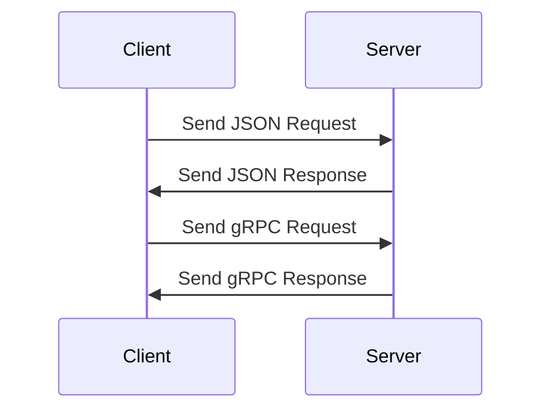

## 20.7 Data Serialization and Communication Protocols

In the realm of software development, data serialization and communication protocols play a pivotal role in enabling efficient data exchange and inter-process communication. In Julia, a language renowned for its performance and ease of use, mastering these concepts is crucial for building scalable and interoperable applications. This section delves into the intricacies of data serialization formats and communication protocols, providing you with the knowledge and tools to excel in Julia software development.

### Introduction to Data Serialization

Data serialization is the process of converting data structures or objects into a format that can be easily stored or transmitted and later reconstructed. This is essential for data exchange between different systems or components, especially when dealing with distributed systems or microservices.

#### Why Serialization Matters

- **Interoperability**: Serialization allows data to be exchanged between systems written in different programming languages.
- **Persistence**: Serialized data can be stored in files or databases for later retrieval.
- **Communication**: Enables data exchange over networks, facilitating communication between distributed components.

### Serialization Formats

Choosing the right serialization format is critical for ensuring efficient data exchange. Let's explore some popular serialization formats and their use cases in Julia.

#### JSON (JavaScript Object Notation)

JSON is a lightweight data interchange format that is easy for humans to read and write and easy for machines to parse and generate. It is widely used for web APIs and configuration files.

**Example: Serializing and Deserializing JSON in Julia**

```julia
using JSON

data = Dict("name" => "Julia", "version" => 1.6, "features" => ["fast", "dynamic", "easy"])

json_string = JSON.json(data)
println("Serialized JSON: ", json_string)

parsed_data = JSON.parse(json_string)
println("Deserialized Data: ", parsed_data)
```

**Key Points:**

- JSON is human-readable and widely supported.
- It is suitable for simple data structures but may not be efficient for complex or binary data.

#### BSON (Binary JSON)

BSON is a binary representation of JSON-like documents. It extends JSON by providing additional data types and is more efficient for storage and transmission.

**Example: Using BSON in Julia**

```julia
using BSON

data = Dict("name" => "Julia", "version" => 1.6, "features" => ["fast", "dynamic", "easy"])

BSON.@save "data.bson" data

loaded_data = BSON.@load "data.bson" data
println("Loaded Data: ", loaded_data)
```

**Key Points:**

- BSON supports additional data types like dates and binary data.
- It is more efficient than JSON for large or complex data structures.

#### MessagePack

MessagePack is a binary serialization format that is compact and efficient. It is suitable for high-performance applications where bandwidth or storage is a concern.

**Example: Using MessagePack in Julia**

```julia
using MsgPack

data = Dict("name" => "Julia", "version" => 1.6, "features" => ["fast", "dynamic", "easy"])

msgpack_data = MsgPack.pack(data)

unpacked_data = MsgPack.unpack(msgpack_data)
println("Unpacked Data: ", unpacked_data)
```

**Key Points:**

- MessagePack is more compact than JSON, making it ideal for network transmission.
- It supports a wide range of data types and is easy to use in Julia.

### Communication Protocols

Communication protocols define the rules and conventions for data exchange between systems. In Julia, implementing protocols like gRPC or REST is essential for building robust and scalable applications.

#### REST (Representational State Transfer)

REST is an architectural style for designing networked applications. It relies on stateless, client-server communication and is widely used for web services.

**Example: Implementing a REST API in Julia**

```julia
using HTTP

function hello_world(req)
    return HTTP.Response(200, "Hello, World!")
end

HTTP.serve(hello_world, "127.0.0.1", 8080)
```

**Key Points:**

- REST is simple and stateless, making it easy to implement and scale.
- It uses standard HTTP methods (GET, POST, PUT, DELETE) for communication.

#### gRPC (gRPC Remote Procedure Calls)

gRPC is a high-performance, open-source RPC framework that uses HTTP/2 for transport and Protocol Buffers for serialization. It is suitable for microservices and distributed systems.

**Example: Implementing gRPC in Julia**

```julia

using GRPC

service HelloWorld {
    rpc SayHello (HelloRequest) returns (HelloResponse);
}

function say_hello(request)
    return HelloResponse(message = "Hello, $(request.name)!")
end

GRPC.serve(say_hello, "127.0.0.1", 50051)
```

**Key Points:**

- gRPC supports multiple languages and is ideal for polyglot environments.
- It provides features like load balancing, authentication, and streaming.

### Visualizing Data Serialization and Communication

To better understand the flow of data serialization and communication protocols, let's visualize the process using a sequence diagram.



**Diagram Description:**

- The client sends a JSON request to the server, which processes it and sends a JSON response.
- The client then sends a gRPC request, and the server responds with a gRPC response.

### Try It Yourself

Experiment with the code examples provided in this section. Try modifying the data structures, serialization formats, or communication protocols to see how they affect the performance and behavior of your applications.

### References and Further Reading

- [JSON Documentation](https://www.json.org/json-en.html)
- [BSON Specification](http://bsonspec.org/)
- [MessagePack Official Site](https://msgpack.org/)
- [RESTful API Design](https://restfulapi.net/)
- [gRPC Official Documentation](https://grpc.io/docs/)

### Knowledge Check

To reinforce your understanding of data serialization and communication protocols in Julia, let's pose some questions and challenges.

## Quiz Time!



### What is the primary purpose of data serialization?

- [x] To convert data structures into a format that can be easily stored or transmitted
- [ ] To execute code faster
- [ ] To enhance security
- [ ] To improve user interface design

> **Explanation:** Data serialization is primarily used to convert data structures into a format that can be easily stored or transmitted, enabling data exchange between different systems or components.

### Which serialization format is known for being human-readable and widely supported?

- [x] JSON
- [ ] BSON
- [ ] MessagePack
- [ ] Protocol Buffers

> **Explanation:** JSON (JavaScript Object Notation) is known for being human-readable and widely supported, making it a popular choice for web APIs and configuration files.

### What is a key advantage of using BSON over JSON?

- [x] BSON supports additional data types like dates and binary data
- [ ] BSON is more human-readable than JSON
- [ ] BSON is slower than JSON
- [ ] BSON is only used for text data

> **Explanation:** BSON supports additional data types like dates and binary data, making it more efficient for storage and transmission compared to JSON.

### Which communication protocol is commonly used for web services and relies on stateless, client-server communication?

- [x] REST
- [ ] gRPC
- [ ] SOAP
- [ ] FTP

> **Explanation:** REST (Representational State Transfer) is commonly used for web services and relies on stateless, client-server communication, using standard HTTP methods for data exchange.

### What is a key feature of gRPC that makes it suitable for microservices?

- [x] gRPC uses HTTP/2 for transport and Protocol Buffers for serialization
- [ ] gRPC is only compatible with Java
- [ ] gRPC does not support streaming
- [ ] gRPC is slower than REST

> **Explanation:** gRPC uses HTTP/2 for transport and Protocol Buffers for serialization, providing high performance and features like load balancing, authentication, and streaming, making it suitable for microservices.

### Which serialization format is known for being compact and efficient, suitable for high-performance applications?

- [x] MessagePack
- [ ] JSON
- [ ] XML
- [ ] YAML

> **Explanation:** MessagePack is a binary serialization format that is compact and efficient, making it suitable for high-performance applications where bandwidth or storage is a concern.

### What is the role of communication protocols in software development?

- [x] To define the rules and conventions for data exchange between systems
- [ ] To execute code faster
- [ ] To enhance security
- [ ] To improve user interface design

> **Explanation:** Communication protocols define the rules and conventions for data exchange between systems, enabling efficient and reliable communication in distributed applications.

### Which protocol is known for using standard HTTP methods like GET, POST, PUT, and DELETE?

- [x] REST
- [ ] gRPC
- [ ] SOAP
- [ ] FTP

> **Explanation:** REST (Representational State Transfer) uses standard HTTP methods like GET, POST, PUT, and DELETE for communication, making it a widely used protocol for web services.

### What is a key benefit of using gRPC in a polyglot environment?

- [x] gRPC supports multiple languages
- [ ] gRPC is only compatible with Python
- [ ] gRPC does not support streaming
- [ ] gRPC is slower than REST

> **Explanation:** gRPC supports multiple languages, making it ideal for polyglot environments where different components may be written in different programming languages.

### True or False: JSON is more efficient than MessagePack for large or complex data structures.

- [ ] True
- [x] False

> **Explanation:** False. MessagePack is more efficient than JSON for large or complex data structures due to its compact binary format, making it ideal for network transmission and storage.



Remember, mastering data serialization and communication protocols is a journey. As you continue to explore and experiment with these concepts in Julia, you'll gain the skills needed to build efficient, scalable, and interoperable applications. Keep experimenting, stay curious, and enjoy the journey!
