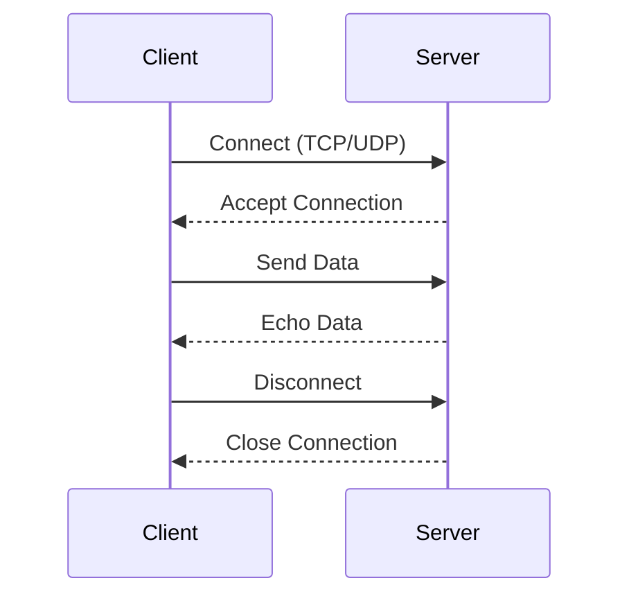

## 20.8 Networking and Web Protocol Integration

In the modern software landscape, networking and web protocol integration are essential components for building robust, scalable, and interactive applications. Julia, with its high-performance capabilities and rich ecosystem, provides powerful tools for both low-level networking and high-level web protocol handling. In this section, we will delve into the details of using Julia for networking, covering both low-level socket programming and high-level HTTP client and server development.

### Low-Level Networking

Low-level networking involves direct communication over the network using protocols such as TCP (Transmission Control Protocol) and UDP (User Datagram Protocol). Julia provides the `Sockets.jl` library, which allows developers to create and manage socket connections for both TCP and UDP communications.

#### Using Sockets.jl for TCP/UDP Communications

Sockets are endpoints for sending and receiving data across a network. In Julia, the `Sockets.jl` library provides a straightforward interface for working with sockets. Let's explore how to use this library for TCP and UDP communications.

##### TCP Communication

TCP is a connection-oriented protocol that ensures reliable data transmission between two endpoints. Here's how you can create a simple TCP server and client in Julia using `Sockets.jl`.

###### TCP Server Example

```julia
using Sockets

server = listen(8080)

println("Server is listening on port 8080...")

while true
    client = accept(server)  # Accept a client connection
    @async begin
        println("Client connected: ", client)
        while isopen(client)
            data = read(client, String)
            println("Received: ", data)
            write(client, "Echo: " * data)  # Echo the received data back to the client
        end
        close(client)
        println("Client disconnected.")
    end
end
```

###### TCP Client Example

```julia
using Sockets

client = connect("localhost", 8080)

println("Connected to server.")

write(client, "Hello, Server!")

response = read(client, String)
println("Server response: ", response)

close(client)
```

In the above examples, the server listens for incoming connections on port 8080 and echoes back any data it receives. The client connects to the server, sends a message, and prints the server's response.

##### UDP Communication

UDP is a connectionless protocol that allows for fast, but unreliable, data transmission. Here's how you can set up a simple UDP server and client in Julia.

###### UDP Server Example

```julia
using Sockets

server = UDPSocket()
bind(server, ip"0.0.0.0", 8081)

println("UDP server is listening on port 8081...")

while true
    data, client_addr = recvfrom(server)  # Receive data from a client
    println("Received from ", client_addr, ": ", String(data))
    sendto(server, client_addr, "Echo: " * String(data))  # Echo the data back to the client
end
```

###### UDP Client Example

```julia
using Sockets

client = UDPSocket()

sendto(client, ip"127.0.0.1", 8081, "Hello, UDP Server!")

data, server_addr = recvfrom(client)
println("Server response: ", String(data))

close(client)
```

In these examples, the UDP server listens on port 8081 and echoes back any data it receives. The client sends a message to the server and prints the server's response.

### High-Level HTTP Clients and Servers

For web applications, HTTP is the protocol of choice. Julia's `HTTP.jl` library provides a comprehensive suite of tools for building HTTP clients and servers, making it easy to integrate web protocols into your applications.

#### Building Web Clients with HTTP.jl

HTTP clients are used to send requests to web servers and receive responses. With `HTTP.jl`, you can easily create HTTP requests and handle responses.

##### HTTP Client Example

```julia
using HTTP

response = HTTP.get("http://httpbin.org/get")

println("Status: ", response.status)
println("Response: ", String(response.body))
```

In this example, we send a GET request to `http://httpbin.org/get` and print the status code and response body.

##### Handling Different HTTP Methods

`HTTP.jl` supports various HTTP methods such as GET, POST, PUT, DELETE, etc. Here's how you can use these methods:

```julia
response = HTTP.post("http://httpbin.org/post", 
                     headers = ["Content-Type" => "application/json"],
                     body = JSON.json(Dict("key" => "value")))

println("POST Response: ", String(response.body))

response = HTTP.put("http://httpbin.org/put", 
                    headers = ["Content-Type" => "application/json"],
                    body = JSON.json(Dict("update" => "data")))

println("PUT Response: ", String(response.body))

response = HTTP.delete("http://httpbin.org/delete")

println("DELETE Response: ", String(response.body))
```

These examples demonstrate how to send POST, PUT, and DELETE requests using `HTTP.jl`.

#### Building Web Servers with HTTP.jl

Creating a web server in Julia is straightforward with `HTTP.jl`. You can define routes and handle requests with ease.

##### HTTP Server Example

```julia
using HTTP

function request_handler(req)
    if req.method == "GET"
        return HTTP.Response(200, "Hello, World!")
    else
        return HTTP.Response(405, "Method Not Allowed")
    end
end

HTTP.serve(request_handler, "0.0.0.0", 8082)

println("HTTP server is running on port 8082...")
```

In this example, the server listens on port 8082 and responds with "Hello, World!" to GET requests. Other methods receive a "Method Not Allowed" response.

#### Advanced HTTP Server Features

`HTTP.jl` supports more advanced features such as middleware, routing, and handling JSON data. Let's explore some of these features.

##### Middleware and Routing

Middleware functions can be used to process requests before they reach the main handler. Routing allows you to define different handlers for different paths.

```julia
using HTTP

function logger_middleware(req, next)
    println("Received request: ", req.method, " ", req.target)
    return next(req)
end

function router(req)
    if req.target == "/"
        return HTTP.Response(200, "Welcome to the homepage!")
    elseif req.target == "/about"
        return HTTP.Response(200, "About us page.")
    else
        return HTTP.Response(404, "Page not found.")
    end
end

HTTP.serve(logger_middleware, router, "0.0.0.0", 8083)

println("HTTP server with routing is running on port 8083...")
```

In this example, the server logs each request and routes requests to different handlers based on the path.

##### Handling JSON Data

JSON is a common data format for web applications. `HTTP.jl` makes it easy to work with JSON data.

```julia
using HTTP
using JSON

function json_handler(req)
    if req.method == "POST" && req.headers["Content-Type"] == "application/json"
        data = JSON.parse(String(req.body))
        return HTTP.Response(200, "Received data: " * JSON.json(data))
    else
        return HTTP.Response(400, "Bad Request")
    end
end

HTTP.serve(json_handler, "0.0.0.0", 8084)

println("HTTP server for JSON handling is running on port 8084...")
```

In this example, the server processes JSON data from POST requests and echoes it back to the client.

### Visualizing Networking and Web Protocol Integration

To better understand the flow of data in networking and web protocol integration, let's visualize the interaction between clients and servers using a sequence diagram.



**Diagram Description:** This sequence diagram illustrates the interaction between a client and a server. The client connects to the server, sends data, receives an echo of the data, and then disconnects.

### References and Links

- [Julia Sockets Documentation](https://docs.julialang.org/en/v1/stdlib/Sockets/)
- [HTTP.jl GitHub Repository](https://github.com/JuliaWeb/HTTP.jl)
- [MDN Web Docs on HTTP](https://developer.mozilla.org/en-US/docs/Web/HTTP)

### Knowledge Check

To reinforce your understanding of networking and web protocol integration in Julia, consider the following questions:

- What are the key differences between TCP and UDP?
- How can you handle JSON data in an HTTP server using `HTTP.jl`?
- What is the purpose of middleware in an HTTP server?

### Embrace the Journey

Remember, mastering networking and web protocol integration in Julia is a journey. As you experiment with different protocols and build more complex applications, you'll gain a deeper understanding of how to leverage Julia's capabilities for networking. Keep exploring, stay curious, and enjoy the process!

### Quiz Time!



### What library in Julia is used for low-level socket programming?

- [x] Sockets.jl
- [ ] HTTP.jl
- [ ] JSON.jl
- [ ] DataFrames.jl

> **Explanation:** Sockets.jl is the library used for low-level socket programming in Julia.

### Which protocol is connection-oriented and ensures reliable data transmission?

- [x] TCP
- [ ] UDP
- [ ] HTTP
- [ ] FTP

> **Explanation:** TCP is a connection-oriented protocol that ensures reliable data transmission.

### What function is used to accept a client connection in a TCP server?

- [x] accept()
- [ ] connect()
- [ ] listen()
- [ ] bind()

> **Explanation:** The accept() function is used to accept a client connection in a TCP server.

### Which HTTP method is used to send data to a server?

- [x] POST
- [ ] GET
- [ ] DELETE
- [ ] OPTIONS

> **Explanation:** The POST method is used to send data to a server.

### What is the purpose of middleware in an HTTP server?

- [x] To process requests before they reach the main handler
- [ ] To handle JSON data
- [ ] To manage socket connections
- [ ] To send HTTP responses

> **Explanation:** Middleware is used to process requests before they reach the main handler.

### Which library in Julia is used for high-level HTTP client and server development?

- [x] HTTP.jl
- [ ] Sockets.jl
- [ ] JSON.jl
- [ ] DataFrames.jl

> **Explanation:** HTTP.jl is used for high-level HTTP client and server development in Julia.

### How can you send a GET request using HTTP.jl?

- [x] HTTP.get(url)
- [ ] HTTP.post(url)
- [ ] HTTP.put(url)
- [ ] HTTP.delete(url)

> **Explanation:** HTTP.get(url) is used to send a GET request using HTTP.jl.

### What is the default port used in the TCP server example?

- [x] 8080
- [ ] 80
- [ ] 443
- [ ] 21

> **Explanation:** The default port used in the TCP server example is 8080.

### Which function is used to send data in a UDP client?

- [x] sendto()
- [ ] recvfrom()
- [ ] write()
- [ ] read()

> **Explanation:** The sendto() function is used to send data in a UDP client.

### True or False: UDP is a connectionless protocol.

- [x] True
- [ ] False

> **Explanation:** UDP is a connectionless protocol, meaning it does not establish a connection before sending data.


