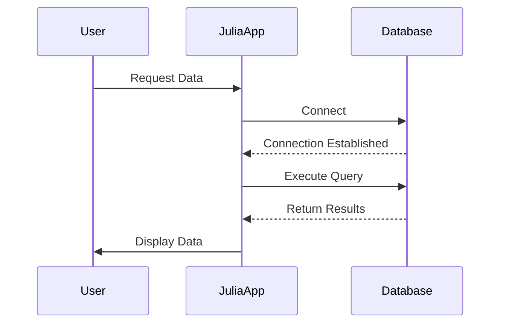

## 20.9 Interfacing with Databases and Data Stores

Interfacing with databases and data stores is a crucial aspect of modern software development. Julia, with its powerful capabilities and extensive ecosystem, provides robust tools for connecting to both relational and NoSQL databases. In this section, we will explore how to effectively interface with databases using Julia, covering essential tools like JDBC.jl and ODBC.jl for relational databases, as well as techniques for working with NoSQL databases such as MongoDB and Redis.

### Introduction to Database Interfacing in Julia

Databases are the backbone of most applications, providing a structured way to store, retrieve, and manipulate data. Julia offers several packages and libraries that facilitate database connectivity, allowing developers to harness the power of databases within their applications. Whether you are dealing with traditional SQL databases or modern NoSQL solutions, Julia has you covered.

#### Key Concepts

- **Database Drivers**: These are libraries that enable applications to communicate with databases. In Julia, JDBC.jl and ODBC.jl are popular choices for connecting to SQL databases.
- **Object-Relational Mappers (ORMs)**: ORMs provide a higher-level abstraction for interacting with databases, allowing developers to work with database records as if they were native Julia objects.
- **NoSQL Databases**: These databases provide flexible schemas and are designed for distributed data storage. Julia supports interfacing with popular NoSQL databases like MongoDB and Redis.

### Database Drivers and ORMs

#### Using JDBC.jl for Relational Databases

JDBC.jl is a Julia package that provides a JDBC (Java Database Connectivity) interface for connecting to a wide range of relational databases. It is particularly useful for databases that have robust JDBC support.

##### Setting Up JDBC.jl

To use JDBC.jl, you need to have Java installed on your system. You can install JDBC.jl using Julia's package manager:

```julia
using Pkg
Pkg.add("JDBC")
```

##### Connecting to a Database

Here's a basic example of how to connect to a PostgreSQL database using JDBC.jl:

```julia
using JDBC

JDBC.load_driver("org.postgresql.Driver")

url = "jdbc:postgresql://localhost:5432/mydatabase"

conn = JDBC.Connection(url, "username", "password")

stmt = JDBC.Statement(conn)
result = JDBC.execute(stmt, "SELECT * FROM mytable")

for row in result
    println(row)
end

JDBC.close(conn)
```

**Key Points:**
- **Driver Loading**: Ensure the appropriate JDBC driver is loaded.
- **Connection URL**: The URL specifies the database type, host, port, and database name.
- **Query Execution**: Use `JDBC.Statement` and `JDBC.execute` to run SQL queries.

#### Using ODBC.jl for Relational Databases

ODBC.jl is another powerful package for connecting to databases using the Open Database Connectivity (ODBC) standard. It is widely used for databases like SQL Server, Oracle, and others.

##### Setting Up ODBC.jl

Install ODBC.jl using Julia's package manager:

```julia
using Pkg
Pkg.add("ODBC")
```

##### Connecting to a Database

Here's how you can connect to a SQL Server database using ODBC.jl:

```julia
using ODBC

dsn = "Driver={ODBC Driver 17 for SQL Server};Server=localhost;Database=mydatabase;UID=username;PWD=password;"

conn = ODBC.Connection(dsn)

query = "SELECT * FROM mytable"
result = ODBC.query(conn, query)

for row in result
    println(row)
end

ODBC.close(conn)
```

**Key Points:**
- **DSN Configuration**: The DSN string includes driver information and connection details.
- **Query Execution**: Use `ODBC.query` to execute SQL commands and retrieve results.

#### Object-Relational Mappers (ORMs)

While Julia does not have a native ORM like Django's ORM for Python, packages like `SearchLight.jl` provide ORM-like capabilities, allowing developers to map database tables to Julia structs.

### NoSQL Databases

NoSQL databases offer flexible schemas and are designed for handling large volumes of unstructured data. Julia supports interfacing with several popular NoSQL databases.

#### Interfacing with MongoDB

MongoDB is a widely-used NoSQL database known for its flexibility and scalability. Julia provides the `Mongo.jl` package for interacting with MongoDB databases.

##### Setting Up Mongo.jl

Install Mongo.jl using Julia's package manager:

```julia
using Pkg
Pkg.add("Mongo")
```

##### Connecting to MongoDB

Here's an example of how to connect to a MongoDB database and perform basic operations:

```julia
using Mongo

client = MongoClient("mongodb://localhost:27017")

db = client["mydatabase"]
collection = db["mycollection"]

insert_one(collection, Dict("name" => "Alice", "age" => 30))

cursor = find(collection, Dict("age" => 30))

for doc in cursor
    println(doc)
end

close(client)
```

**Key Points:**
- **Connection String**: Use the MongoDB URI to connect to the server.
- **CRUD Operations**: Perform Create, Read, Update, and Delete operations using functions like `insert_one` and `find`.

#### Interfacing with Redis

Redis is an in-memory data store often used for caching and real-time analytics. Julia provides the `Redis.jl` package for interacting with Redis.

##### Setting Up Redis.jl

Install Redis.jl using Julia's package manager:

```julia
using Pkg
Pkg.add("Redis")
```

##### Connecting to Redis

Here's how to connect to a Redis server and perform basic operations:

```julia
using Redis

client = RedisConnection()

set(client, "mykey", "myvalue")

value = get(client, "mykey")
println("Value for 'mykey': $value")

close(client)
```

**Key Points:**
- **Connection**: Establish a connection using `RedisConnection`.
- **Key-Value Operations**: Use `set` and `get` for basic key-value operations.

### Design Considerations

When interfacing with databases, consider the following design patterns and best practices:

- **Connection Pooling**: Use connection pooling to manage database connections efficiently and improve performance.
- **Error Handling**: Implement robust error handling to manage database connection failures and query errors.
- **Security**: Ensure secure handling of database credentials and use encryption for sensitive data.
- **Scalability**: Design your application to handle increased load and data volume by optimizing queries and using appropriate indexing.

### Visualizing Database Interactions

To better understand how Julia interacts with databases, let's visualize the process using a sequence diagram.



**Diagram Explanation:**
- **User**: Initiates a request for data.
- **JuliaApp**: Connects to the database, executes a query, and returns the results to the user.
- **Database**: Processes the connection and query, returning the requested data.

### Try It Yourself

Experiment with the code examples provided by modifying the connection parameters or queries. Try connecting to different databases or performing more complex operations like joins or aggregations.

### References and Links

- [JDBC.jl Documentation](https://github.com/JuliaDatabases/JDBC.jl)
- [ODBC.jl Documentation](https://github.com/JuliaDatabases/ODBC.jl)
- [Mongo.jl Documentation](https://github.com/JuliaDatabases/Mongo.jl)
- [Redis.jl Documentation](https://github.com/JuliaDatabases/Redis.jl)

### Knowledge Check

- Explain the difference between JDBC.jl and ODBC.jl.
- Demonstrate how to perform a basic CRUD operation in MongoDB using Julia.
- Provide an example of how to use Redis for caching in a Julia application.

### Embrace the Journey

Interfacing with databases in Julia opens up a world of possibilities for data-driven applications. Remember, this is just the beginning. As you progress, you'll be able to build more complex and efficient systems. Keep experimenting, stay curious, and enjoy the journey!

## Quiz Time!



### What is the primary purpose of JDBC.jl in Julia?

- [x] To connect to relational databases using JDBC drivers
- [ ] To interface with NoSQL databases
- [ ] To perform data visualization
- [ ] To manage Julia packages

> **Explanation:** JDBC.jl is used to connect to relational databases using JDBC drivers, allowing Julia applications to communicate with a wide range of SQL databases.

### Which package would you use to connect to a SQL Server database in Julia?

- [ ] Mongo.jl
- [x] ODBC.jl
- [ ] Redis.jl
- [ ] DataFrames.jl

> **Explanation:** ODBC.jl is the package used to connect to SQL Server databases in Julia, utilizing the ODBC standard for database connectivity.

### How do you perform a basic query in MongoDB using Mongo.jl?

- [x] Use the `find` function on a collection
- [ ] Use the `execute` function on a database
- [ ] Use the `query` function on a client
- [ ] Use the `select` function on a table

> **Explanation:** In Mongo.jl, the `find` function is used on a collection to perform queries and retrieve documents from a MongoDB database.

### What is the function used to set a key-value pair in Redis using Redis.jl?

- [ ] get
- [x] set
- [ ] insert
- [ ] put

> **Explanation:** The `set` function is used in Redis.jl to store a key-value pair in a Redis database.

### Which of the following is a best practice when interfacing with databases?

- [x] Implementing connection pooling
- [ ] Using global variables for database connections
- [ ] Hardcoding database credentials in the code
- [ ] Ignoring error handling

> **Explanation:** Implementing connection pooling is a best practice for managing database connections efficiently and improving application performance.

### What is the main advantage of using NoSQL databases?

- [x] Flexible schemas and scalability
- [ ] Strong consistency and ACID transactions
- [ ] Built-in data visualization tools
- [ ] Native support for SQL queries

> **Explanation:** NoSQL databases offer flexible schemas and are designed for scalability, making them suitable for handling large volumes of unstructured data.

### Which package provides ORM-like capabilities in Julia?

- [x] SearchLight.jl
- [ ] JDBC.jl
- [ ] ODBC.jl
- [ ] Redis.jl

> **Explanation:** SearchLight.jl provides ORM-like capabilities in Julia, allowing developers to map database tables to Julia structs.

### What is a common use case for Redis in applications?

- [ ] Data visualization
- [x] Caching and real-time analytics
- [ ] Performing complex joins
- [ ] Managing user authentication

> **Explanation:** Redis is commonly used for caching and real-time analytics due to its in-memory data store capabilities.

### What is the purpose of the DSN string in ODBC.jl?

- [x] To specify driver information and connection details
- [ ] To define the database schema
- [ ] To execute SQL queries
- [ ] To visualize data

> **Explanation:** The DSN (Data Source Name) string in ODBC.jl specifies the driver information and connection details required to connect to a database.

### True or False: Julia has a native ORM similar to Django's ORM for Python.

- [ ] True
- [x] False

> **Explanation:** Julia does not have a native ORM like Django's ORM for Python, but packages like SearchLight.jl provide ORM-like capabilities.


