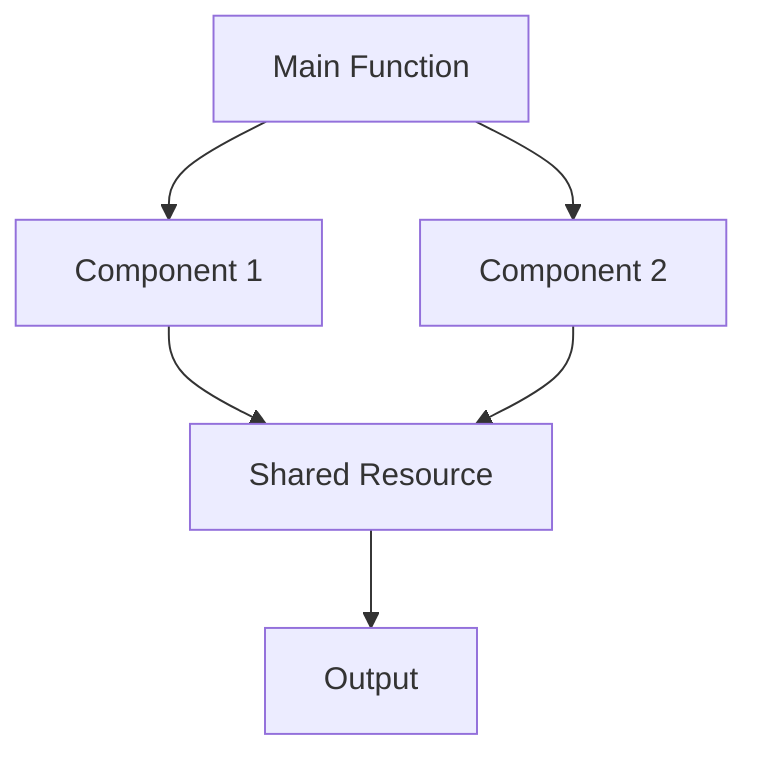

## 21.1 Recognizing Common Anti-Patterns in Julia

In the world of software development, design patterns are celebrated for providing time-tested solutions to common problems. However, the flip side of this coin is the existence of anti-patterns—recurring practices that are counterproductive and can lead to inefficient, unmaintainable, or buggy code. In this section, we will delve into the concept of anti-patterns, their impact on code quality, and explore some common anti-patterns specific to Julia programming.

### Definition of Anti-Patterns

**Anti-patterns** are common responses to recurring problems that are ineffective and often counterproductive. Unlike design patterns, which offer solutions, anti-patterns highlight pitfalls to avoid. They emerge when developers, often with good intentions, apply solutions that seem appropriate but ultimately lead to negative consequences.

### Impact on Code Quality

Anti-patterns can significantly degrade the quality of your codebase. Here are some ways they can impact your projects:

- **Maintainability Issues**: Code becomes difficult to understand, modify, or extend.
- **Performance Problems**: Inefficient practices can lead to slow execution and high resource consumption.
- **Increased Bug Risk**: Poor design choices can introduce subtle bugs that are hard to detect and fix.
- **Technical Debt**: Accumulation of anti-patterns can lead to a codebase that requires significant refactoring.

### List of Common Anti-Patterns

Let's explore some common anti-patterns in Julia and how to recognize and avoid them.

#### 1. Overuse of Global Variables

**Problem**: Global variables can lead to code that is difficult to debug and maintain. They introduce hidden dependencies and make it hard to track changes.

**Solution**: Use local variables and pass data explicitly between functions. Consider using modules to encapsulate state.

```julia
global_counter = 0

function increment_counter()
    global global_counter
    global_counter += 1
end

function increment_counter(counter)
    return counter + 1
end
```

#### 2. Ignoring Type Stability

**Problem**: Type instability occurs when the type of a variable cannot be inferred at compile time, leading to performance degradation.

**Solution**: Ensure that functions return consistent types and use type annotations where necessary.

```julia
function unstable_function(x)
    if x > 0
        return x
    else
        return "negative"
    end
end

function stable_function(x)
    if x > 0
        return x
    else
        return 0
    end
end
```

#### 3. Misusing Macros and Metaprogramming

**Problem**: Overusing macros can lead to code that is hard to read and debug. Metaprogramming should be used judiciously.

**Solution**: Use macros only when necessary and prefer functions for most tasks.

```julia
macro debug(expr)
    quote
        println("Debug: ", $(string(expr)), " = ", $expr)
    end
end

function debug(expr)
    println("Debug: ", expr)
end
```

#### 4. Premature Optimization

**Problem**: Optimizing code before understanding the problem can lead to complex and unreadable code.

**Solution**: Focus on writing clear and correct code first. Optimize only after identifying performance bottlenecks.

```julia
function optimized_function(x)
    result = 0
    for i in 1:x
        result += i * i
    end
    return result
end

function simple_function(x)
    return sum(i^2 for i in 1:x)
end
```

#### 5. Over-Engineering

**Problem**: Adding unnecessary complexity to the codebase can make it difficult to understand and maintain.

**Solution**: Follow the KISS (Keep It Simple, Stupid) principle. Implement only what is necessary.

```julia
abstract type Shape end

struct Circle <: Shape
    radius::Float64
end

struct Square <: Shape
    side::Float64
end

function area(shape::Shape)
    if shape isa Circle
        return π * shape.radius^2
    elseif shape isa Square
        return shape.side^2
    else
        error("Unknown shape")
    end
end

struct CircleSimple
    radius::Float64
end

struct SquareSimple
    side::Float64
end

function area(circle::CircleSimple)
    return π * circle.radius^2
end

function area(square::SquareSimple)
    return square.side^2
end
```

#### 6. Lack of Error Handling

**Problem**: Failing to handle errors gracefully can lead to crashes and unpredictable behavior.

**Solution**: Use try-catch blocks and define custom error types where appropriate.

```julia
function divide(a, b)
    return a / b
end

function safe_divide(a, b)
    try
        return a / b
    catch e
        println("Error: ", e)
        return nothing
    end
end
```

#### 7. Tight Coupling

**Problem**: Components that are tightly coupled are difficult to modify or reuse independently.

**Solution**: Use interfaces and abstract types to decouple components.

```julia
struct Engine
    horsepower::Int
end

struct Car
    engine::Engine
end

abstract type Vehicle end

struct EngineInterface <: Vehicle
    horsepower::Int
end

struct CarInterface <: Vehicle
    engine::EngineInterface
end
```

#### 8. Spaghetti Code

**Problem**: Code that is tangled and difficult to follow, often due to excessive use of GOTO statements or similar constructs.

**Solution**: Use structured programming techniques and modularize code.

```julia
function process_data(data)
    for i in 1:length(data)
        if data[i] < 0
            println("Negative value")
        else
            println("Positive value")
        end
    end
end

function process_data(data)
    for value in data
        process_value(value)
    end
end

function process_value(value)
    if value < 0
        println("Negative value")
    else
        println("Positive value")
    end
end
```

#### 9. Magic Numbers

**Problem**: Using hard-coded numbers in the code makes it difficult to understand and maintain.

**Solution**: Use named constants to improve readability.

```julia
function calculate_area(radius)
    return 3.14159 * radius^2
end

const PI = 3.14159

function calculate_area(radius)
    return PI * radius^2
end
```

#### 10. Copy-Paste Programming

**Problem**: Duplicating code leads to maintenance challenges and inconsistencies.

**Solution**: Use functions and modules to encapsulate reusable logic.

```julia
function calculate_sum1(a, b)
    return a + b
end

function calculate_sum2(a, b)
    return a + b
end

function calculate_sum(a, b)
    return a + b
end
```

### Visualizing Anti-Patterns

To better understand the impact of anti-patterns, let's visualize the flow of a program suffering from tight coupling and spaghetti code.



**Diagram Description**: This diagram illustrates a tightly coupled system where multiple components depend on a shared resource, leading to complex interdependencies and potential maintenance challenges.

### References and Links

- [JuliaLang Documentation](https://docs.julialang.org/)
- [Design Patterns: Elements of Reusable Object-Oriented Software](https://en.wikipedia.org/wiki/Design_Patterns)
- [Refactoring: Improving the Design of Existing Code](https://martinfowler.com/books/refactoring.html)

### Knowledge Check

- What are anti-patterns, and how do they differ from design patterns?
- How can global variables negatively impact your code?
- Why is type stability important in Julia?
- What are the risks of overusing macros in Julia?
- How can premature optimization affect code quality?

### Embrace the Journey

Remember, recognizing and avoiding anti-patterns is a crucial step in becoming a proficient Julia developer. As you continue to learn and grow, keep experimenting, stay curious, and enjoy the journey of mastering Julia programming!

## Quiz Time!



### What is an anti-pattern?

- [x] A common response to a recurring problem that is ineffective and counterproductive
- [ ] A design pattern that solves a specific problem
- [ ] A type of algorithm used in Julia
- [ ] A feature of the Julia language

> **Explanation:** Anti-patterns are ineffective solutions to recurring problems, unlike design patterns which provide effective solutions.

### How can global variables affect code quality?

- [x] They introduce hidden dependencies and make code hard to debug
- [ ] They improve performance by reducing memory usage
- [ ] They simplify code by reducing the need for function arguments
- [ ] They enhance code readability

> **Explanation:** Global variables can lead to hidden dependencies and make code difficult to debug and maintain.

### What is the consequence of type instability in Julia?

- [x] Performance degradation due to inability to infer types at compile time
- [ ] Improved readability of the code
- [ ] Increased memory efficiency
- [ ] Enhanced error handling

> **Explanation:** Type instability can lead to performance issues as the compiler cannot optimize code effectively.

### Why should macros be used cautiously in Julia?

- [x] They can make code hard to read and debug
- [ ] They always improve performance
- [ ] They are necessary for all Julia programs
- [ ] They simplify error handling

> **Explanation:** Overusing macros can lead to code that is difficult to read and debug.

### What is the risk of premature optimization?

- [x] It can lead to complex and unreadable code
- [ ] It always improves code performance
- [ ] It simplifies code maintenance
- [ ] It reduces the need for error handling

> **Explanation:** Premature optimization can make code unnecessarily complex and hard to maintain.

### How can tight coupling affect a codebase?

- [x] It makes components difficult to modify or reuse independently
- [ ] It improves code readability
- [ ] It enhances performance
- [ ] It simplifies debugging

> **Explanation:** Tight coupling makes it hard to modify or reuse components independently, leading to maintenance challenges.

### What is a magic number in programming?

- [x] A hard-coded number that makes code difficult to understand
- [ ] A constant that improves code readability
- [ ] A variable used for debugging
- [ ] A type of algorithm in Julia

> **Explanation:** Magic numbers are hard-coded values that make code difficult to understand and maintain.

### How can copy-paste programming affect a project?

- [x] It leads to maintenance challenges and inconsistencies
- [ ] It improves code performance
- [ ] It enhances code readability
- [ ] It simplifies error handling

> **Explanation:** Copy-paste programming can lead to inconsistencies and make maintenance difficult.

### What is the KISS principle?

- [x] Keep It Simple, Stupid
- [ ] Keep It Secure and Safe
- [ ] Keep It Stable and Strong
- [ ] Keep It Synchronized and Simple

> **Explanation:** The KISS principle stands for "Keep It Simple, Stupid," emphasizing simplicity in design.

### True or False: Anti-patterns are beneficial practices in software development.

- [ ] True
- [x] False

> **Explanation:** Anti-patterns are ineffective and counterproductive practices that should be avoided.




