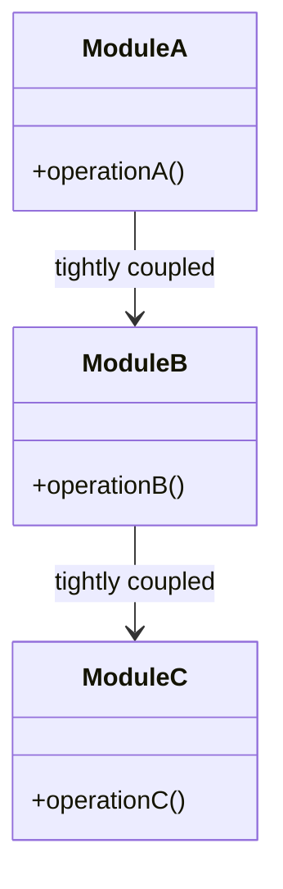
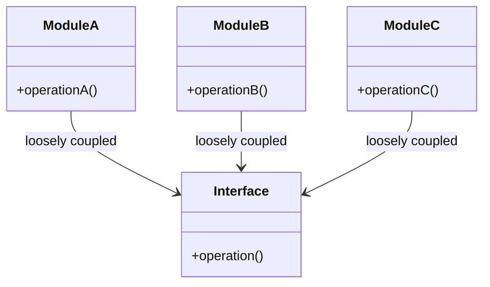

## 21.10 Avoiding Tight Coupling in System Design

In the realm of software development, achieving a balance between cohesion and coupling is crucial for creating robust, maintainable, and scalable systems. In this section, we will delve into the concept of tight coupling, its drawbacks, and strategies to avoid it in system design using Julia. By the end of this guide, you'll be equipped with practical techniques to enhance the flexibility and scalability of your applications.

### Understanding Coupling

**Coupling** refers to the degree of interdependence between software modules. When modules are tightly coupled, changes in one module can have a ripple effect, necessitating changes in others. This can lead to a fragile codebase that is difficult to maintain and extend.

#### The Negative Impact of Tight Coupling

1. **Reduced Flexibility**: Tightly coupled systems are rigid and difficult to modify. Any change in one part of the system often requires changes in other parts, making it challenging to adapt to new requirements.

2. **Increased Complexity**: As dependencies between modules increase, the overall complexity of the system grows, making it harder to understand and manage.

3. **Difficult Testing**: Testing tightly coupled systems is cumbersome because it often requires setting up complex environments to simulate dependencies.

4. **Limited Reusability**: Components in a tightly coupled system are often not reusable in other contexts because they rely heavily on specific implementations.

### Decoupling Strategies

To mitigate the issues associated with tight coupling, we can employ various decoupling strategies. These strategies aim to reduce dependencies between modules, making the system more flexible and easier to maintain.

#### Using Abstract Types and Interfaces

In Julia, abstract types and interfaces can be used to define contracts that different modules can adhere to. This allows for flexibility in implementation while maintaining a consistent interface.

```julia
abstract type AbstractLogger end

function log(logger::AbstractLogger, message::String)
    error("log method not implemented")
end

struct ConsoleLogger <: AbstractLogger end

function log(logger::ConsoleLogger, message::String)
    println("Console: $message")
end

struct FileLogger <: AbstractLogger
    filename::String
end

function log(logger::FileLogger, message::String)
    open(logger.filename, "a") do file
        write(file, "File: $message\n")
    end
end
```

In this example, `AbstractLogger` serves as a contract for different logging implementations. This allows us to switch between `ConsoleLogger` and `FileLogger` without altering the code that uses the logger.

#### Dependency Injection

Dependency Injection (DI) is a design pattern that promotes loose coupling by injecting dependencies into a module rather than having the module create them. This can be achieved in Julia using function arguments or higher-order functions.

```julia
function perform_task(logger::AbstractLogger)
    log(logger, "Task started")
    # Perform some task
    log(logger, "Task completed")
end

perform_task(ConsoleLogger())

perform_task(FileLogger("log.txt"))
```

By injecting the logger dependency, we can easily switch between different logging implementations without modifying the `perform_task` function.

#### Event-Driven Architecture

An event-driven architecture decouples components by using events to communicate between them. This allows components to react to events without being directly dependent on each other.

```julia
mutable struct EventSystem
    listeners::Dict{Symbol, Vector{Function}}
end

function EventSystem()
    EventSystem(Dict{Symbol, Vector{Function}}())
end

function add_listener(event_system::EventSystem, event::Symbol, listener::Function)
    if !haskey(event_system.listeners, event)
        event_system.listeners[event] = Vector{Function}()
    end
    push!(event_system.listeners[event], listener)
end

function trigger_event(event_system::EventSystem, event::Symbol, args...)
    for listener in get(event_system.listeners, event, [])
        listener(args...)
    end
end

event_system = EventSystem()

add_listener(event_system, :task_completed, (args...) -> println("Listener 1: Task completed with args: ", args))
add_listener(event_system, :task_completed, (args...) -> println("Listener 2: Task completed with args: ", args))

trigger_event(event_system, :task_completed, "arg1", "arg2")
```

In this example, listeners are decoupled from the event source. They can be added or removed without affecting the rest of the system.

### Benefits of Decoupling

1. **Easier Maintenance**: Decoupled systems are easier to maintain because changes in one module do not necessitate changes in others.

2. **Increased Testability**: With reduced dependencies, modules can be tested in isolation, leading to more reliable and faster tests.

3. **Enhanced Extensibility**: Decoupled systems are more adaptable to change, allowing for easy addition of new features or modifications.

4. **Improved Reusability**: Components in a decoupled system are more likely to be reusable in different contexts, reducing duplication of effort.

### Visualizing Coupling and Decoupling

To better understand the concept of coupling and decoupling, let's visualize it using a class diagram.



In the above diagram, `ModuleA`, `ModuleB`, and `ModuleC` are tightly coupled, meaning changes in one module can affect the others.

Now, let's visualize a decoupled system:



In this decoupled system, `ModuleA`, `ModuleB`, and `ModuleC` interact with each other through an `Interface`, reducing direct dependencies.

### Try It Yourself

Experiment with the code examples provided. Try modifying the logger implementations or adding new event listeners. Observe how these changes can be made without affecting other parts of the system. This exercise will help reinforce the concepts of decoupling and its benefits.

### References and Links

- [MDN Web Docs: Coupling](https://developer.mozilla.org/en-US/docs/Glossary/Coupling)
- [Wikipedia: Dependency Injection](https://en.wikipedia.org/wiki/Dependency_injection)
- [Design Patterns: Elements of Reusable Object-Oriented Software](https://en.wikipedia.org/wiki/Design_Patterns)

### Knowledge Check

- What is coupling, and why is it important to manage it in software design?
- How can abstract types and interfaces help in reducing coupling?
- What are the benefits of using dependency injection?
- How does an event-driven architecture contribute to decoupling?
- What are the advantages of a decoupled system?

### Embrace the Journey

Remember, mastering the art of decoupling is a journey. As you continue to explore and apply these concepts, you'll find yourself building more flexible, maintainable, and scalable systems. Keep experimenting, stay curious, and enjoy the process of learning and growing as a developer!

## Quiz Time!



### What is coupling in software design?

- [x] The degree of interdependence between software modules
- [ ] The process of combining multiple modules into one
- [ ] The separation of concerns in a software system
- [ ] The use of abstract types to define interfaces

> **Explanation:** Coupling refers to the degree of interdependence between software modules, which affects their flexibility and maintainability.

### Which of the following is a negative impact of tight coupling?

- [x] Reduced flexibility
- [ ] Increased reusability
- [ ] Easier testing
- [ ] Simplified codebase

> **Explanation:** Tight coupling reduces flexibility, making it difficult to modify and extend the system.

### How can abstract types help in reducing coupling?

- [x] By defining contracts that different modules can adhere to
- [ ] By increasing the complexity of the system
- [ ] By enforcing strict dependencies between modules
- [ ] By eliminating the need for interfaces

> **Explanation:** Abstract types define contracts that allow for flexible implementations, reducing direct dependencies between modules.

### What is dependency injection?

- [x] A design pattern that promotes loose coupling by injecting dependencies into a module
- [ ] A method of combining multiple modules into one
- [ ] A technique for increasing coupling between modules
- [ ] A way to eliminate the need for interfaces

> **Explanation:** Dependency injection is a design pattern that promotes loose coupling by injecting dependencies into a module rather than having the module create them.

### How does an event-driven architecture contribute to decoupling?

- [x] By using events to communicate between components without direct dependencies
- [ ] By enforcing strict dependencies between components
- [ ] By combining multiple components into one
- [ ] By eliminating the need for communication between components

> **Explanation:** An event-driven architecture uses events to communicate between components, reducing direct dependencies and promoting decoupling.

### What is a benefit of a decoupled system?

- [x] Easier maintenance
- [ ] Increased complexity
- [ ] Reduced testability
- [ ] Limited reusability

> **Explanation:** Decoupled systems are easier to maintain because changes in one module do not necessitate changes in others.

### Which of the following is a strategy to avoid tight coupling?

- [x] Using abstract types and interfaces
- [ ] Increasing dependencies between modules
- [ ] Combining multiple modules into one
- [ ] Eliminating the need for communication between modules

> **Explanation:** Using abstract types and interfaces is a strategy to reduce dependencies and avoid tight coupling.

### What is the role of interfaces in reducing coupling?

- [x] They provide a consistent way for modules to interact without direct dependencies
- [ ] They increase the complexity of the system
- [ ] They enforce strict dependencies between modules
- [ ] They eliminate the need for communication between modules

> **Explanation:** Interfaces provide a consistent way for modules to interact, reducing direct dependencies and promoting decoupling.

### How can dependency injection improve testability?

- [x] By allowing modules to be tested in isolation
- [ ] By increasing the complexity of the test environment
- [ ] By enforcing strict dependencies between modules
- [ ] By eliminating the need for testing

> **Explanation:** Dependency injection allows modules to be tested in isolation, improving testability and reliability.

### True or False: A tightly coupled system is easier to extend than a decoupled system.

- [ ] True
- [x] False

> **Explanation:** A tightly coupled system is more difficult to extend because changes in one module often require changes in others, whereas a decoupled system is more adaptable to change.


