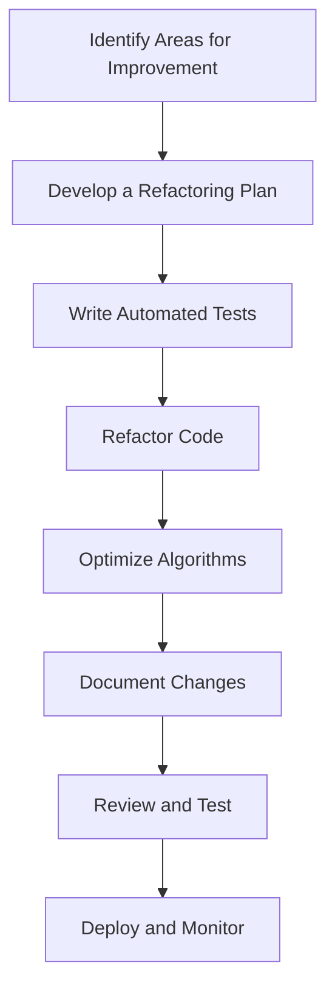

## 21.11 Case Studies: Refactoring Legacy Codebases

Refactoring legacy codebases is a critical task in software development, especially when dealing with languages like Julia, which is often used for high-performance computing and scientific applications. This section explores real-world case studies of refactoring efforts in Julia, highlighting the challenges faced, strategies employed, and successful outcomes achieved. By examining these narratives, we aim to provide insights and best practices for developers looking to improve their own legacy systems.

### Understanding Legacy Codebases

Legacy codebases are often characterized by outdated practices, lack of documentation, and minimal test coverage. These factors can make refactoring a daunting task. However, with a structured approach, it's possible to transform a legacy codebase into a more maintainable and efficient system.

#### Key Characteristics of Legacy Code

- **Outdated Practices**: Code that relies on deprecated libraries or outdated language features.
- **Lack of Documentation**: Minimal or no comments and documentation, making it hard to understand the code's purpose.
- **Minimal Test Coverage**: Few or no automated tests, increasing the risk of introducing bugs during refactoring.
- **Complex Dependencies**: Intertwined modules and functions that make changes risky and time-consuming.

### Real-world Examples of Refactoring in Julia

Let's delve into some real-world examples where developers have successfully refactored legacy Julia codebases. These case studies illustrate the challenges faced and the strategies employed to overcome them.

#### Case Study 1: Optimizing a Scientific Computing Application

**Background**: A scientific computing application written in Julia was suffering from performance issues and was difficult to maintain. The codebase had grown organically over several years, resulting in a tangled web of dependencies and poorly optimized algorithms.

**Challenges**:
- **Performance Bottlenecks**: The application was slow, with several functions taking longer than expected to execute.
- **Complex Dependencies**: Functions were tightly coupled, making it difficult to isolate and optimize individual components.
- **Lack of Tests**: There were no automated tests, making it risky to refactor the code.

**Refactoring Approach**:
1. **Profiling and Benchmarking**: The first step was to identify performance bottlenecks using Julia's `Profile` and `BenchmarkTools.jl` packages.
2. **Modularization**: The code was restructured into smaller, more manageable modules, reducing dependencies and improving readability.
3. **Algorithm Optimization**: Key algorithms were optimized for performance, leveraging Julia's strengths in numerical computing.
4. **Test Suite Development**: A comprehensive test suite was developed to ensure that refactoring did not introduce new bugs.

**Outcome**:
- **Performance Improvement**: Execution time was reduced by 50%, significantly improving user satisfaction.
- **Enhanced Maintainability**: The modular structure made the codebase easier to understand and modify.
- **Increased Developer Confidence**: The presence of a robust test suite allowed developers to make changes with confidence.

#### Case Study 2: Modernizing a Data Analysis Pipeline

**Background**: A data analysis pipeline written in Julia was becoming increasingly difficult to maintain. The codebase was using outdated libraries and lacked clear documentation, leading to frequent errors and confusion among developers.

**Challenges**:
- **Outdated Libraries**: The pipeline relied on deprecated libraries, leading to compatibility issues.
- **Poor Documentation**: Developers struggled to understand the code's logic and purpose.
- **Resistance to Change**: Some team members were resistant to refactoring, fearing it would introduce new issues.

**Refactoring Approach**:
1. **Library Updates**: Deprecated libraries were replaced with modern alternatives, improving compatibility and performance.
2. **Documentation Overhaul**: Comprehensive documentation was created, including inline comments and a detailed README file.
3. **Stakeholder Engagement**: Regular meetings were held with team members to address concerns and ensure buy-in for the refactoring process.

**Outcome**:
- **Improved Compatibility**: The pipeline was now compatible with the latest versions of Julia and its libraries.
- **Enhanced Readability**: Clear documentation made it easier for new developers to onboard and contribute.
- **Positive Team Dynamics**: Engaging stakeholders throughout the process fostered a collaborative environment and reduced resistance to change.

### Challenges Faced in Refactoring Legacy Codebases

Refactoring legacy codebases is not without its challenges. Here are some common obstacles developers may encounter:

#### Dealing with Inherited Code

Inherited code can be difficult to work with, especially if it lacks documentation or follows outdated practices. It's important to approach such code with patience and a willingness to learn its intricacies.

#### Lack of Tests

A lack of automated tests can make refactoring risky, as there's no safety net to catch regressions. Developing a test suite should be a priority before making significant changes.

#### Resistance to Change

Team members may resist refactoring efforts, fearing that changes will introduce new bugs or disrupt existing workflows. It's crucial to communicate the benefits of refactoring and involve stakeholders in the process.

### Successful Outcomes of Refactoring

Despite the challenges, refactoring can lead to significant improvements in a codebase. Here are some successful outcomes that can be achieved:

#### Performance Improvements

Refactoring can lead to optimized algorithms and reduced execution times, enhancing the overall performance of an application.

#### Enhanced Readability

A well-structured codebase with clear documentation is easier to understand and maintain, reducing the cognitive load on developers.

#### Increased Developer Satisfaction

A maintainable codebase with a robust test suite allows developers to work more efficiently and confidently, leading to higher job satisfaction.

### Best Practices for Refactoring Legacy Codebases

To ensure a successful refactoring process, consider the following best practices:

#### Start with a Plan

Before diving into the code, develop a clear plan outlining the goals of the refactoring effort and the steps needed to achieve them.

#### Prioritize Testing

Develop a comprehensive test suite to catch regressions and ensure that changes do not introduce new bugs.

#### Modularize the Code

Break the code into smaller, more manageable modules to reduce dependencies and improve readability.

#### Engage Stakeholders

Involve team members and stakeholders throughout the process to address concerns and ensure buy-in.

#### Document Changes

Keep detailed documentation of the changes made during refactoring to aid future maintenance efforts.

### Try It Yourself

To practice refactoring, try applying these principles to a small Julia project. Start by identifying areas for improvement, such as performance bottlenecks or complex dependencies. Develop a plan, write tests, and refactor the code, keeping track of the changes made. Experiment with different approaches and observe the impact on performance and readability.

### Visualizing the Refactoring Process

Below is a flowchart illustrating the typical steps involved in refactoring a legacy codebase:

**Figure 1**: A flowchart depicting the refactoring process, from identifying areas for improvement to deploying and monitoring the refactored code.

### References and Further Reading

- [Refactoring: Improving the Design of Existing Code](https://martinfowler.com/books/refactoring.html) by Martin Fowler
- [JuliaLang Documentation](https://docs.julialang.org/)
- [BenchmarkTools.jl Documentation](https://github.com/JuliaCI/BenchmarkTools.jl)

### Knowledge Check

To reinforce your understanding of refactoring legacy codebases, consider the following questions:

1. What are some common characteristics of legacy codebases?
2. Why is it important to develop a test suite before refactoring?
3. How can engaging stakeholders benefit the refactoring process?
4. What are some successful outcomes of refactoring a codebase?

### Embrace the Journey

Refactoring legacy codebases can be challenging, but it's a rewarding process that leads to more maintainable and efficient systems. Remember, this is just the beginning. As you gain experience, you'll develop your own strategies and techniques for tackling complex codebases. Keep experimenting, stay curious, and enjoy the journey!

## Quiz Time!



### What is a common characteristic of legacy codebases?

- [x] Minimal test coverage
- [ ] Extensive documentation
- [ ] Modern libraries
- [ ] Simple dependencies

> **Explanation:** Legacy codebases often lack automated tests, making refactoring risky.

### Why is it important to develop a test suite before refactoring?

- [x] To catch regressions and ensure changes don't introduce new bugs
- [ ] To increase code complexity
- [ ] To reduce the need for documentation
- [ ] To make the codebase more difficult to understand

> **Explanation:** A test suite acts as a safety net, ensuring that refactoring does not introduce new issues.

### How can engaging stakeholders benefit the refactoring process?

- [x] It fosters collaboration and reduces resistance to change
- [ ] It increases the complexity of the codebase
- [ ] It decreases developer satisfaction
- [ ] It leads to more performance bottlenecks

> **Explanation:** Engaging stakeholders helps address concerns and ensures buy-in for the refactoring process.

### What is a successful outcome of refactoring a codebase?

- [x] Improved performance and readability
- [ ] Increased code complexity
- [ ] Reduced developer satisfaction
- [ ] More outdated libraries

> **Explanation:** Refactoring can lead to optimized algorithms and a more maintainable codebase.

### Which of the following is a best practice for refactoring?

- [x] Start with a plan
- [ ] Avoid writing tests
- [ ] Increase dependencies
- [ ] Ignore stakeholder input

> **Explanation:** A clear plan helps guide the refactoring process and ensures that goals are met.

### What is the first step in the refactoring process according to the flowchart?

- [x] Identify areas for improvement
- [ ] Write automated tests
- [ ] Optimize algorithms
- [ ] Deploy and monitor

> **Explanation:** Identifying areas for improvement is the initial step in the refactoring process.

### What tool can be used to identify performance bottlenecks in Julia?

- [x] BenchmarkTools.jl
- [ ] PyCall.jl
- [ ] RCall.jl
- [ ] HTTP.jl

> **Explanation:** BenchmarkTools.jl is used for profiling and benchmarking Julia code.

### What is a challenge faced when refactoring legacy codebases?

- [x] Dealing with inherited code
- [ ] Having too many automated tests
- [ ] Using modern libraries
- [ ] Simple dependencies

> **Explanation:** Inherited code can be difficult to work with, especially if it lacks documentation.

### What is a benefit of modularizing code during refactoring?

- [x] Reduced dependencies and improved readability
- [ ] Increased code complexity
- [ ] More performance bottlenecks
- [ ] Decreased developer satisfaction

> **Explanation:** Modularizing code helps reduce dependencies and makes the codebase easier to understand.

### True or False: Refactoring can lead to increased developer satisfaction.

- [x] True
- [ ] False

> **Explanation:** A maintainable codebase with a robust test suite allows developers to work more efficiently and confidently.


